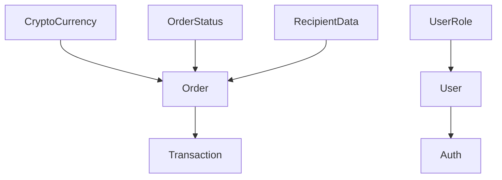

# Урок 3.2: Общие типы в packages/exchange-core

> **🎯 Цель урока**: Изучить структуру и назначение типов в packages/exchange-core, понять как они моделируют бизнес-логику обменника валют

## 📖 Введение

Представьте, что вы создаете **паспортную систему** для страны. У вас должны быть четкие правила:

- Какие данные хранятся в паспорте
- Какие форматы данных допустимы
- Как различные документы связаны между собой

`packages/exchange-core` - это паспортная система для данных обменника валют. Здесь описано **ЧТО** представляют собой все сущности системы.

## 🏗️ Структура типов exchange-core

### 📁 Файловая организация

```
packages/exchange-core/src/types/
├── auth.ts          # 🔐 Типы авторизации
├── contact.ts       # 📞 Контактная информация
├── currency.ts      # 💰 Валюты и курсы
├── fiat.ts         # 💵 Фиатные валюты
├── order.ts        # 📋 Заявки на обмен
├── transaction.ts  # 💳 Транзакции
├── user.ts         # 👤 Пользователи
└── index.ts        # 📦 Общий экспорт
```

## 🔍 Анализ реальных типов

### 1. **Типы валют (currency.ts)**

```typescript
// packages/exchange-core/src/types/currency.ts
import { type CryptoCurrency } from '@repo/constants';

// Re-export для удобства
export type { CryptoCurrency };

export interface CurrencyInfo {
  symbol: CryptoCurrency; // 'BTC' | 'ETH' | 'USDT-TRC20' | 'USDT-ERC20' | 'TRX'
  name: string; // "Bitcoin"
  decimals: number; // 8 (для BTC)
  minAmount: number; // 0.001
  maxAmount: number; // 10
  isActive: boolean; // true/false
}

export interface ExchangeRate {
  currency: CryptoCurrency; // Какая валюта
  usdRate: number; // Курс к доллару: 45000 (для BTC)
  uahRate: number; // Курс к гривне: 1800000
  commission: number; // Комиссия: 0.05 (5%)
  lastUpdated: Date; // Когда обновлялся курс
}
```

**💡 Понимание через аналогию:**

- `CurrencyInfo` = Паспорт валюты (основные характеристики)
- `ExchangeRate` = Курс валют в обменнике (как табло в банке)

### 2. **Типы заявок (order.ts)**

```typescript
// packages/exchange-core/src/types/order.ts
import type { OrderStatus } from '@repo/constants';
import type { RecipientData } from './contact';
import type { CryptoCurrency } from './currency';

// Данные для создания заявки
export interface CreateOrderRequest {
  email: string; // "user@example.com"
  cryptoAmount: number; // 0.5 (количество крипты)
  currency: CryptoCurrency; // "BTC"
  uahAmount: number; // 900000 (сумма в гривнах)
  recipientData?: RecipientData; // Куда отправлять деньги (опционально)
}

// Полная информация о заявке
export interface Order {
  id: string; // "ord_abc123"
  email: string; // Email клиента
  cryptoAmount: number; // Количество крипты
  currency: CryptoCurrency; // Тип валюты
  uahAmount: number; // Сумма в гривнах
  status: OrderStatus; // 'pending' | 'processing' | 'completed'
  depositAddress: string; // Адрес для депозита крипты
  recipientData?: RecipientData; // Данные получателя
  createdAt: Date; // Когда создана
  updatedAt: Date; // Последнее обновление
  processedAt?: Date; // Когда обработана
  txHash?: string; // Хеш транзакции
}
```

**💡 Понимание через аналогию:**

- `CreateOrderRequest` = Заявление на обмен (что клиент заполняет)
- `Order` = Официальный документ обмена (со всеми деталями и статусом)

### 3. **Типы пользователей (user.ts)**

```typescript
// packages/exchange-core/src/types/user.ts
import { UserRole } from '@repo/constants';

// Базовая информация о пользователе
export interface User {
  id: string; // "usr_xyz789"
  email: string; // "admin@exchange.com"
  hashedPassword?: string; // Хешированный пароль (опционально)
  sessionId?: string; // ID сессии
  isVerified: boolean; // Подтвержден ли email
  role?: UserRole; // 'admin' | 'operator' | 'user'
  createdAt: Date; // Дата регистрации
  lastLoginAt?: Date; // Последний вход
}

// Расширенная информация для API
export interface ApiUser {
  id: string;
  name: string; // Отображаемое имя
  email: string;
  role: UserRole;
  createdAt: Date;
  updatedAt: Date;
}

// Данные для создания пользователя
export interface CreateUserRequest {
  email: string;
  password?: string; // Опциональный для OAuth
  sessionId?: string; // Для сессионной авторизации
}

// Данные для входа
export interface LoginRequest {
  email: string;
  password: string;
}
```

### 4. **Контактные данные (contact.ts)**

```typescript
// packages/exchange-core/src/types/contact.ts

export interface RecipientData {
  type: 'card' | 'cash'; // Способ получения денег
  cardNumber?: string; // Номер карты (если тип card)
  cardHolderName?: string; // Имя держателя карты
  bankName?: string; // Название банка
  pickupLocation?: string; // Место получения (если тип cash)
  contactPhone?: string; // Телефон для связи
}

export interface ContactForm {
  name: string; // Имя отправителя
  email: string; // Email
  subject: string; // Тема обращения
  message: string; // Текст сообщения
}
```

## 🔗 Связи между типами

### Схема зависимостей



### Практический пример связей

```typescript
// Пример полной заявки с всеми связанными типами
const exampleOrder: Order = {
  id: 'ord_20240831_001',
  email: 'client@example.com',
  cryptoAmount: 0.05,
  currency: 'BTC', // ← CryptoCurrency из constants
  uahAmount: 90000,
  status: 'processing', // ← OrderStatus из constants
  depositAddress: '1A1zP1eP5QGefi2DMPTfTL5SLmv7DivfNa',
  recipientData: {
    // ← RecipientData
    type: 'card',
    cardNumber: '5168 7422 3456 7890',
    cardHolderName: 'Иван Петров',
    bankName: 'ПриватБанк',
  },
  createdAt: new Date('2024-08-31T10:00:00Z'),
  updatedAt: new Date('2024-08-31T10:30:00Z'),
  processedAt: new Date('2024-08-31T10:30:00Z'),
  txHash: '7c4025a9d4a5d3e8f9c2b1e5a7d8c3f4e6b9a2c5d7e8f1a3b5c6d9e2f4a7b8c1',
};
```

## 🎯 Паттерны проектирования типов

### 1. **Conditional Fields (Условные поля)**

```typescript
export interface RecipientData {
  type: 'card' | 'cash';

  // Поля для карты (только если type === 'card')
  cardNumber?: string;
  cardHolderName?: string;
  bankName?: string;

  // Поля для наличных (только если type === 'cash')
  pickupLocation?: string;

  // Общие поля
  contactPhone?: string;
}

// Использование с type guards
function validateRecipientData(data: RecipientData): boolean {
  if (data.type === 'card') {
    return !!(data.cardNumber && data.cardHolderName);
  }

  if (data.type === 'cash') {
    return !!data.pickupLocation;
  }

  return false;
}
```

### 2. **Request/Response Pairs (Пары запрос/ответ)**

```typescript
// Паттерн: что отправляем → что получаем
export interface CreateOrderRequest {
  email: string;
  cryptoAmount: number;
  currency: CryptoCurrency;
  uahAmount: number;
  recipientData?: RecipientData;
}

export interface CreateOrderResponse {
  order: Order; // Созданная заявка
  estimatedTime: number; // Время обработки в минутах
  depositAddress: string; // Адрес для депозита
  qrCode: string; // QR код для оплаты
}
```

### 3. **Partial Types для обновлений**

```typescript
// Тип для обновления заявки (все поля опциональны)
export type UpdateOrderRequest = Partial<Pick<Order, 'status' | 'txHash' | 'processedAt'>>;

// Использование
const updateData: UpdateOrderRequest = {
  status: 'completed',
  processedAt: new Date(),
  txHash: '0xabc123...',
};
```

## 💻 Практические примеры использования

### Пример 1: Компонент списка заявок

```typescript
// apps/admin-panel/src/components/OrdersList.tsx
import { type Order, type OrderStatus } from '@repo/exchange-core';

interface OrdersListProps {
  orders: Order[];
  onStatusChange: (orderId: string, status: OrderStatus) => void;
}

export function OrdersList({ orders, onStatusChange }: OrdersListProps) {
  return (
    <div className="orders-list">
      {orders.map((order) => (
        <div key={order.id} className="order-card">
          <h3>Заявка {order.id}</h3>
          <p>
            {order.cryptoAmount} {order.currency} → {order.uahAmount} UAH
          </p>
          <p>Статус: {order.status}</p>
          <p>Email: {order.email}</p>

          {order.recipientData?.type === 'card' && (
            <p>Карта: {order.recipientData.cardNumber}</p>
          )}

          <button
            onClick={() => onStatusChange(order.id, 'completed')}
            disabled={order.status === 'completed'}
          >
            Завершить
          </button>
        </div>
      ))}
    </div>
  );
}
```

### Пример 2: tRPC процедура

```typescript
// apps/web/src/server/trpc/routers/exchange.ts
import { type CreateOrderRequest, type Order } from '@repo/exchange-core';
import { createOrderSchema } from '@repo/utils/validation';

export const exchangeRouter = router({
  createOrder: publicProcedure
    .input(createOrderSchema) // Zod схема на основе CreateOrderRequest
    .mutation(async ({ input }): Promise<Order> => {
      // TypeScript знает что input имеет тип CreateOrderRequest
      const order: Order = {
        id: generateOrderId(),
        ...input,
        status: 'pending',
        depositAddress: generateDepositAddress(input.currency),
        createdAt: new Date(),
        updatedAt: new Date(),
      };

      await saveOrderToDatabase(order);

      return order; // TypeScript проверяет соответствие типу Order
    }),
});
```

### Пример 3: React хук для работы с заявками

```typescript
// packages/hooks/src/business/useOrders.ts
import { type Order, type CreateOrderRequest } from '@repo/exchange-core';
import { trpc } from '@/lib/trpc';

export function useOrders() {
  const utils = trpc.useUtils();

  // Получение списка заявок
  const { data: orders, isLoading } = trpc.exchange.getOrders.useQuery();

  // Создание заявки
  const createOrderMutation = trpc.exchange.createOrder.useMutation({
    onSuccess: () => {
      utils.exchange.getOrders.invalidate();
    },
  });

  const createOrder = (data: CreateOrderRequest): Promise<Order> => {
    return createOrderMutation.mutateAsync(data);
  };

  return {
    orders: orders ?? [],
    isLoading,
    createOrder,
    isCreating: createOrderMutation.isPending,
  };
}
```

## ✅ Проверка знаний

### Вопрос 1

Какой тип данных используется для хранения информации о способе получения денег?

**A)** `Order`  
**B)** `RecipientData`  
**C)** `ContactForm`  
**D)** `User`

<details>
<summary>Показать ответ</summary>

**Правильный ответ: B**

`RecipientData` содержит информацию о том, как клиент хочет получить деньги - на карту или наличными, включая все необходимые детали.

</details>

### Вопрос 2

Что содержит тип `CreateOrderRequest`?

**A)** Полную информацию о заявке включая ID и статус  
**B)** Только данные необходимые для создания заявки  
**C)** Только валюту и сумму

<details>
<summary>Показать ответ</summary>

**Правильный ответ: B**

`CreateOrderRequest` содержит только те данные, которые клиент должен предоставить для создания заявки. ID, статус, дата создания и другие служебные поля добавляются сервером.

</details>

### Задание 1: Анализ типа Order

Посмотрите на тип `Order` и ответьте:

1. Какие поля являются обязательными?
2. Какие поля могут отсутствовать?
3. Какие типы импортируются из других модулей?

<details>
<summary>Показать решение</summary>

**Обязательные поля:**

- `id`, `email`, `cryptoAmount`, `currency`, `uahAmount`, `status`, `depositAddress`, `createdAt`, `updatedAt`

**Опциональные поля (с `?`):**

- `recipientData`, `processedAt`, `txHash`

**Импортированные типы:**

- `OrderStatus` из `@repo/constants`
- `RecipientData` из `./contact`
- `CryptoCurrency` из `./currency`

</details>

### Задание 2: Создание нового типа

Создайте тип `SupportTicket` для системы поддержки со следующими полями:

- ID тикета
- Email пользователя
- Тема обращения
- Текст сообщения
- Статус (открыт/в работе/закрыт)
- Дата создания
- Дата последнего ответа (опционально)

<details>
<summary>Показать решение</summary>

```typescript
// packages/constants/src/support.ts
export const SUPPORT_STATUSES = ['open', 'in-progress', 'closed'] as const;
export type SupportStatus = (typeof SUPPORT_STATUSES)[number];

// packages/exchange-core/src/types/support.ts
import type { SupportStatus } from '@repo/constants';

export interface SupportTicket {
  id: string;
  userEmail: string;
  subject: string;
  message: string;
  status: SupportStatus;
  createdAt: Date;
  lastResponseAt?: Date;
}

export interface CreateSupportTicketRequest {
  userEmail: string;
  subject: string;
  message: string;
}
```

</details>

## 📚 Дополнительные материалы

### TypeScript Best Practices

- [Effective TypeScript](https://effectivetypescript.com/) - лучшие практики
- [TypeScript Handbook](https://www.typescriptlang.org/docs/) - официальная документация

### Domain Modeling

- [Domain-Driven Design](https://martinfowler.com/tags/domain%20driven%20design.html) - подходы к моделированию предметной области
- [Type-Driven Development](https://blog.ploeh.dk/2015/08/10/type-driven-development/) - разработка через типы

## 📋 Резюме урока

1. **packages/exchange-core** содержит все бизнес-типы обменника
2. **Файловая организация** логически группирует связанные типы
3. **Связи между типами** моделируют реальные бизнес-отношения
4. **Паттерны проектирования** (Request/Response, Conditional Fields) упрощают использование
5. **Type Safety** обеспечивается через всю архитектуру от API до UI

В следующем уроке изучим как эти типы обеспечивают безопасность между frontend и backend через tRPC.

---

[← Урок 3.1](./lesson-3.1-architecture-types.md) | [Урок 3.3: Type safety между frontend и backend →](./lesson-3.3-type-safety-frontend-backend.md)
