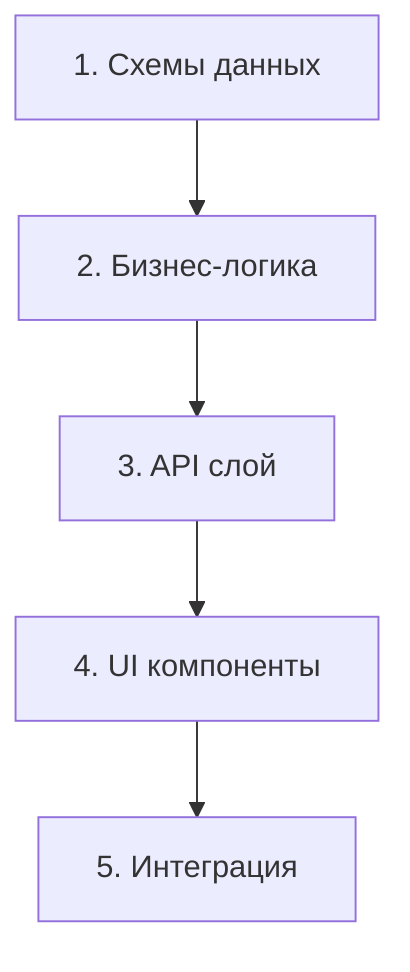
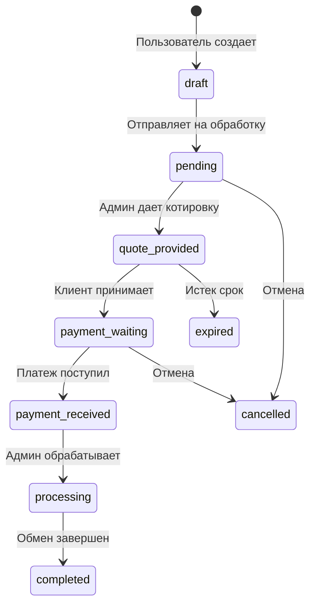
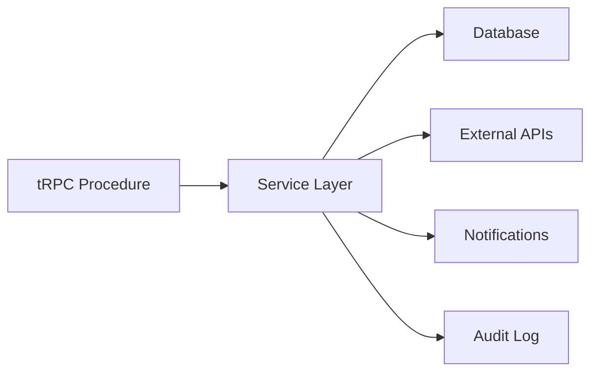
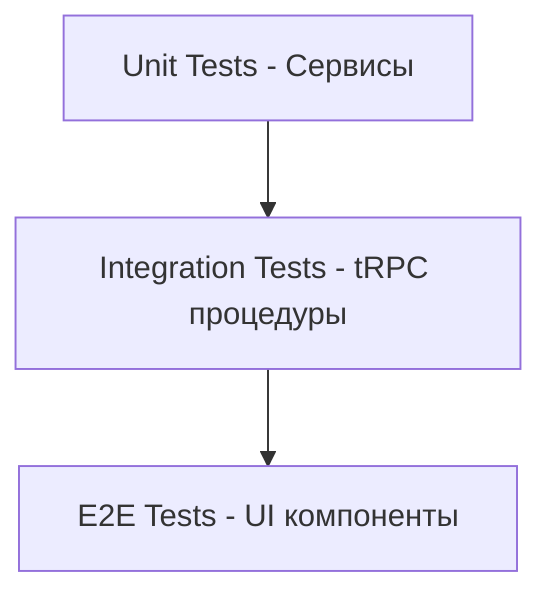

# Урок 4.5: Практика - создание полного API endpoint

> **🎯 Цель урока**: Объединить все знания для создания полнофункционального API endpoint с валидацией, аутентификацией и обработкой ошибок

## 📖 Введение

### Связь с предыдущими уроками

В предыдущих уроках мы изучили отдельные компоненты tRPC:

| Урок    | Что изучили                   | Ключевые концепции                     |
| ------- | ----------------------------- | -------------------------------------- |
| **4.2** | Серверные роутеры и процедуры | `publicProcedure`, `query`, `mutation` |
| **4.3** | Клиентская интеграция         | `useQuery`, `useMutation`, React Query |
| **4.4** | Middleware и аутентификация   | `protectedProcedure`, `requireAuth`    |

**Сегодня** мы объединим все эти знания в **реальном проекте**.

### Что будем создавать: Система заявок на обмен

**Бизнес-задача:** Пользователи могут создавать заявки на обмен криптовалют через веб-интерфейс.

**Пример использования:**

```
Пользователь хочет обменять 0.1 BTC на гривны
↓
Заполняет форму с контактами и реквизитами
↓
Система создает заявку и отправляет на обработку
↓
Админ обрабатывает заявку и меняет статус
↓
Пользователь получает уведомления о статусе
```

### Архитектурный подход

**Принцип "Domain-First":**



**Почему такой порядок?**

- 🎯 **Схемы** определяют "что" мы делаем
- 🧠 **Бизнес-логика** определяет "как" мы это делаем
- 🌐 **API** предоставляет интерфейс для взаимодействия
- 🖥️ **UI** делает это удобным для пользователя

### Структура урока

Урок разбит на **5 этапов** с контрольными точками:

1. **🏗️ Этап 1:** Проектирование схем данных _(15 мин)_
2. **⚙️ Этап 2:** Бизнес-логика и сервисы _(20 мин)_
3. **🌐 Этап 3:** tRPC роутеры и процедуры _(15 мин)_
4. **🖥️ Этап 4:** React компоненты _(20 мин)_
5. **🧪 Этап 5:** Тестирование и отладка _(10 мин)_

> **💡 Совет:** После каждого этапа есть задания для самопроверки. Не переходите к следующему этапу, пока не выполните их!

## 🏗️ Этап 1: Проектирование схем данных _(15 мин)_

### Зачем начинать со схем?

**Аналогия:** Схема данных = чертеж здания. Без четкого плана строительство превращается в хаос.

**В tRPC схемы решают 4 задачи:**

| Задача           | Как решает Zod                 | Пример                                   |
| ---------------- | ------------------------------ | ---------------------------------------- |
| **Валидация**    | Проверяет входные данные       | `z.string().email()`                     |
| **Типизация**    | Генерирует TypeScript типы     | `type User = z.infer<typeof UserSchema>` |
| **Документация** | Схема = живая документация API | Видно какие поля обязательные            |
| **Тестирование** | Легко создавать моки           | `UserSchema.parse(mockData)`             |

### Анализ предметной области

**Что такое "заявка на обмен"?**

Это бизнес-процесс с четкими этапами:



**Ключевые сущности:**

- 📋 **ExchangeRequest** - основная сущность
- 💱 **CurrencyPair** - что на что меняем (BTC/UAH)
- 👤 **ContactInfo** - как связаться с клиентом
- 🏦 **PaymentDetails** - реквизиты для получения средств
- 📈 **StatusHistory** - аудит изменений

### Проектирование схем

**Принцип:** От общего к частному

1. **Enums** - перечисления (статусы, валюты)
2. **Base schemas** - базовые типы данных
3. **Input schemas** - что принимаем от клиента
4. **Output schemas** - что возвращаем клиенту

#### 1. Базовые перечисления (Enums)

```typescript
// packages/exchange-core/src/schemas/exchange-request.ts
import { z } from 'zod';

/**
 * 🎯 Направления обмена
 *
 * Определяет тип операции обмена.
 * Влияет на валидацию реквизитов и бизнес-логику.
 */
export const ExchangeDirection = z.enum([
  'crypto-to-fiat', // BTC → UAH (нужны банковские реквизиты)
  'fiat-to-crypto', // UAH → BTC (нужен криптокошелек)
  'crypto-to-crypto', // BTC → ETH (нужен криптокошелек)
]);

/**
 * 📊 Статусы заявки
 *
 * Отражает жизненный цикл заявки от создания до завершения.
 * Каждый переход контролируется бизнес-правилами.
 */
export const ExchangeStatus = z.enum([
  'draft', // 📝 Черновик (можно редактировать)
  'pending', // ⏳ На рассмотрении (ждет админа)
  'quote_provided', // 💰 Котировка дана (ждет клиента)
  'payment_waiting', // 💳 Ждет платеж (клиент принял котировку)
  'payment_received', // ✅ Платеж получен (готов к обработке)
  'processing', // ⚙️ В обработке (админ выполняет)
  'completed', // 🎉 Завершено (финальный статус)
  'cancelled', // ❌ Отменено (финальный статус)
  'expired', // ⏰ Просрочено (можно восстановить)
]);

/**
 * 💱 Поддерживаемые валюты
 *
 * Список валют для обмена.
 * Разделены на криптовалюты и фиатные для разной логики обработки.
 */
export const CurrencyCode = z.enum([
  // Криптовалюты (требуют адрес кошелька)
  'BTC',
  'ETH',
  'USDT',
  'LTC',
  'BCH',

  // Фиатные валюты (требуют банковские реквизиты)
  'UAH',
  'USD',
  'EUR',
  'PLN',
  'GBP',
]);
```

#### 2. Схема создания заявки

```typescript
/**
 * 📝 Схема для создания новой заявки
 *
 * Включает все необходимые данные от пользователя
 * + кастомную валидацию реквизитов
 */
export const CreateExchangeRequestSchema = z
  .object({
    // === ОСНОВНЫЕ ПАРАМЕТРЫ ОБМЕНА ===
    direction: ExchangeDirection,
    fromCurrency: CurrencyCode,
    toCurrency: CurrencyCode,
    fromAmount: z
      .number()
      .positive('Сумма должна быть положительной')
      .max(1000000, 'Максимальная сумма: 1,000,000'),

    // === КОНТАКТНАЯ ИНФОРМАЦИЯ ===
    contactEmail: z.string().email('Некорректный email').max(255, 'Email слишком длинный'),

    contactTelegram: z
      .string()
      .regex(/^@\w+$/, 'Telegram должен начинаться с @')
      .optional(),

    contactPhone: z
      .string()
      .regex(/^\+\d{10,15}$/, 'Некорректный формат телефона')
      .optional(),

    // === РЕКВИЗИТЫ ДЛЯ ПОЛУЧЕНИЯ СРЕДСТВ ===
    receivingDetails: z.object({
      // Для криптовалют
      walletAddress: z.string().min(20).max(100).optional(),
      network: z.enum(['BTC', 'ETH', 'TRX', 'BSC']).optional(),

      // Для фиатных валют
      bankAccount: z.string().min(10).max(50).optional(),
      cardNumber: z
        .string()
        .regex(/^\d{16}$/)
        .optional(),

      // Общая информация
      fullName: z.string().min(2).max(255).optional(),
      notes: z.string().max(1000).optional(),
    }),

    // === ДОПОЛНИТЕЛЬНЫЕ ОПЦИИ ===
    urgentProcessing: z.boolean().default(false),
    marketRateAccepted: z.boolean().default(false),
  })
  .refine(
    data => {
      // 🔍 КАСТОМНАЯ ВАЛИДАЦИЯ: проверяем соответствие реквизитов направлению

      if (data.direction === 'crypto-to-fiat') {
        // Для получения фиата нужны банковские реквизиты
        return !!(data.receivingDetails.bankAccount || data.receivingDetails.cardNumber);
      }

      if (data.direction === 'fiat-to-crypto' || data.direction === 'crypto-to-crypto') {
        // Для получения крипто нужен кошелек
        return !!(data.receivingDetails.walletAddress && data.receivingDetails.network);
      }

      return true;
    },
    {
      message: 'Укажите корректные реквизиты для получения средств',
      path: ['receivingDetails'], // Ошибка привязывается к полю
    }
  );
```

> **🤔 Вопрос для понимания:** Почему мы используем `.refine()` вместо обычной валидации Zod?
>
> **Ответ:** Потому что валидация зависит от значения другого поля (`direction`). Обычные валидаторы Zod работают с одним полем, а `.refine()` получает весь объект.

#### 3. Остальные схемы

```typescript
/**
 * ✏️ Схема для обновления заявки пользователем
 *
 * Пользователь может изменить только контакты и реквизиты,
 * но не основные параметры обмена (сумму, валюты).
 */
export const UpdateExchangeRequestSchema = z.object({
  id: z.string().uuid('Некорректный ID заявки'),

  // Можно изменить контакты
  contactEmail: z.string().email().optional(),
  contactTelegram: z
    .string()
    .regex(/^@\w+$/)
    .optional(),
  contactPhone: z
    .string()
    .regex(/^\+\d{10,15}$/)
    .optional(),

  // Можно изменить реквизиты
  receivingDetails: z
    .object({
      walletAddress: z.string().optional(),
      network: z.string().optional(),
      bankAccount: z.string().optional(),
      cardNumber: z.string().optional(),
      fullName: z.string().optional(),
      notes: z.string().optional(),
    })
    .optional(),

  // Можно изменить срочность
  urgentProcessing: z.boolean().optional(),
});

/**
 * 👨‍💼 Схема для админских операций
 *
 * Админ может изменять статус и добавлять служебную информацию.
 */
export const AdminUpdateRequestSchema = z.object({
  id: z.string().uuid(),
  status: ExchangeStatus,
  adminNotes: z.string().max(2000).optional(),

  // === КОТИРОВКА ===
  quotedRate: z.number().positive().optional(),
  quotedAmount: z.number().positive().optional(),
  quoteExpiresAt: z.date().optional(),

  // === ПЛАТЕЖНЫЕ ИНСТРУКЦИИ ===
  paymentInstructions: z.string().max(2000).optional(),
  paymentTimeoutMinutes: z.number().int().min(5).max(1440).optional(),

  // === РЕЗУЛЬТАТ ОБМЕНА ===
  finalRate: z.number().positive().optional(),
  finalAmount: z.number().positive().optional(),
  transactionHash: z.string().optional(),
  transactionId: z.string().optional(),
});

/**
 * 🔍 Схема для поиска и фильтрации заявок
 *
 * Поддерживает пагинацию, фильтры, поиск и сортировку.
 */
export const GetRequestsSchema = z.object({
  // Пагинация
  page: z.number().int().min(1).default(1),
  limit: z.number().int().min(1).max(100).default(20),

  // Фильтры
  status: ExchangeStatus.optional(),
  direction: ExchangeDirection.optional(),
  fromCurrency: CurrencyCode.optional(),
  toCurrency: CurrencyCode.optional(),

  // Поиск по тексту
  search: z.string().max(255).optional(),

  // Сортировка
  sortBy: z.enum(['createdAt', 'updatedAt', 'fromAmount', 'status']).default('createdAt'),
  sortOrder: z.enum(['asc', 'desc']).default('desc'),

  // Фильтр по датам
  createdAfter: z.date().optional(),
  createdBefore: z.date().optional(),
});

// === ЭКСПОРТ ТИПОВ ===
export type ExchangeRequestInput = z.infer<typeof CreateExchangeRequestSchema>;
export type ExchangeRequestUpdate = z.infer<typeof UpdateExchangeRequestSchema>;
export type AdminRequestUpdate = z.infer<typeof AdminUpdateRequestSchema>;
export type GetRequestsFilter = z.infer<typeof GetRequestsSchema>;
```

### ✅ Контрольная точка 1

**Проверьте свое понимание:**

1. **Зачем нужна кастомная валидация в `.refine()`?**
   <details>
   <summary>Показать ответ</summary>

   Потому что валидация реквизитов зависит от направления обмена. Для крипто нужен кошелек, для фиата - банковские реквизиты.
   </details>

2. **Почему `UpdateExchangeRequestSchema` не включает `fromAmount`?**
   <details>
   <summary>Показать ответ</summary>

   Изменение суммы требует пересчета котировки и может повлиять на лимиты. Проще создать новую заявку.
   </details>

3. **Что произойдет, если передать невалидные данные в схему?**
   <details>
   <summary>Показать ответ</summary>

   Zod выбросит `ZodError` с детальным описанием ошибок валидации.
   </details>

**Задание:** Создайте файл схем в своем проекте и проверьте валидацию:

```typescript
// Тест валидации
const validData = {
  direction: 'crypto-to-fiat',
  fromCurrency: 'BTC',
  toCurrency: 'UAH',
  fromAmount: 0.1,
  contactEmail: 'test@example.com',
  receivingDetails: {
    bankAccount: '1234567890123456',
    fullName: 'Иван Иванов',
  },
  urgentProcessing: false,
  marketRateAccepted: true,
};

const result = CreateExchangeRequestSchema.parse(validData);
console.log('✅ Валидация прошла:', result);
```

````

---

## ⚙️ Этап 2: Бизнес-логика и сервисы *(20 мин)*

### Архитектура сервисного слоя

**Зачем нужен сервисный слой?**

tRPC процедуры должны быть **тонкими** - только валидация входных данных и вызов бизнес-логики. Вся сложная логика выносится в сервисы.



**Преимущества:**

- 🧪 **Тестируемость** - сервисы легко мокать
- 🔄 **Переиспользование** - один сервис для разных API
- 🎯 **Разделение ответственности** - каждый сервис решает одну задачу
- 🔧 **Легкость рефакторинга** - изменения не затрагивают API

### Структура ExchangeRequestService

```typescript
// src/server/services/exchangeRequestService.ts
import { PrismaClient } from '@prisma/client';
import { TRPCError } from '@trpc/server';
import type {
  ExchangeRequestInput,
  ExchangeRequestUpdate,
  AdminRequestUpdate,
  GetRequestsFilter,
} from '@repo/exchange-core/schemas';

/**
 * 🏢 Сервис для работы с заявками на обмен
 *
 * Инкапсулирует всю бизнес-логику:
 * - Создание и обновление заявок
 * - Проверка лимитов пользователей
 * - Валидация переходов статусов
 * - Интеграция с внешними сервисами
 */
export class ExchangeRequestService {
  constructor(
    private db: PrismaClient,                    // База данных
    private rateService: CurrencyRateService,    // Курсы валют
    private notificationService: NotificationService, // Уведомления
    private auditService: AuditService           // Аудит действий
  ) {}

  /**
   * 📝 Создание новой заявки на обмен
   *
   * Алгоритм:
   * 1. Получить актуальный курс валют
   * 2. Проверить лимиты пользователя (если авторизован)
   * 3. Создать заявку в БД с аудитом
   * 4. Отправить уведомления
   * 5. Если принят рыночный курс - перевести в обработку
   */
  async createRequest(input: ExchangeRequestInput, userId?: string) {
    // === ШАГ 1: ПОЛУЧЕНИЕ КУРСА ===
    const currentRate = await this.rateService.getCurrentRate(
      input.fromCurrency,
      input.toCurrency
    );

    if (!currentRate) {
      throw new TRPCError({
        code: 'NOT_FOUND',
        message: `Курс ${input.fromCurrency}/${input.toCurrency} недоступен`,
      });
    }

    // === ШАГ 2: РАСЧЕТ СУММЫ ===
    const estimatedAmount = input.fromAmount * currentRate.rate;

    // === ШАГ 3: ПРОВЕРКА ЛИМИТОВ ===
    if (userId) {
      await this.checkUserLimits(userId, input.fromAmount, input.fromCurrency);
    }

    // === ШАГ 4: СОЗДАНИЕ В ТРАНЗАКЦИИ ===
    const request = await this.db.$transaction(async (tx) => {
      // Создаем основную запись
      const newRequest = await tx.exchangeRequest.create({
        data: {
          // Основные параметры обмена
          direction: input.direction,
          fromCurrency: input.fromCurrency,
          toCurrency: input.toCurrency,
          fromAmount: input.fromAmount,
          estimatedAmount,
          currentRate: currentRate.rate,

          // Контактная информация
          contactEmail: input.contactEmail,
          contactTelegram: input.contactTelegram,
          contactPhone: input.contactPhone,

          // Реквизиты получения
          receivingDetails: input.receivingDetails,

          // Дополнительные настройки
          urgentProcessing: input.urgentProcessing,
          marketRateAccepted: input.marketRateAccepted,

          // Системные поля
          status: 'draft',
          userId,
          expiresAt: new Date(Date.now() + 24 * 60 * 60 * 1000), // 24 часа
        },
      });

      // Создаем первую запись в истории статусов
      await tx.requestStatusHistory.create({
        data: {
          requestId: newRequest.id,
          status: 'draft',
          notes: 'Заявка создана',
          changedBy: userId || 'system',
        },
      });

      // Логируем в аудит
      await this.auditService.log({
        action: 'exchange-request:created',
        resourceId: newRequest.id,
        userId,
        details: {
          direction: input.direction,
          pair: `${input.fromCurrency}/${input.toCurrency}`,
          amount: input.fromAmount,
          estimatedAmount,
        },
      });

      return newRequest;
    });

    // === ШАГ 5: УВЕДОМЛЕНИЯ ===
    await this.notificationService.sendRequestCreated(request);

    // === ШАГ 6: АВТОМАТИЧЕСКАЯ ОБРАБОТКА ===
    if (input.marketRateAccepted) {
      // Если клиент принял рыночный курс - сразу переводим в обработку
      return this.adminUpdateRequest({
        id: request.id,
        status: 'pending',
        adminNotes: 'Автоматически переведено в обработку (принят рыночный курс)',
      }, 'system');
    }

    return request;
  }

  /**
   * ✏️ Обновление заявки пользователем
   *
   * Пользователь может изменить только определенные поля
   * и только в определенных статусах.
   */
  async updateRequest(input: ExchangeRequestUpdate, userId: string) {
    // === ПРОВЕРКА ПРАВ И СТАТУСА ===
    const existingRequest = await this.db.exchangeRequest.findFirst({
      where: {
        id: input.id,
        userId, // Только владелец может изменять
        status: {
          in: ['draft', 'pending', 'quote_provided'] // Только в этих статусах
        },
      },
    });

    if (!existingRequest) {
      throw new TRPCError({
        code: 'NOT_FOUND',
        message: 'Заявка не найдена или не может быть изменена',
      });
    }

    // === ОБНОВЛЕНИЕ ДАННЫХ ===
    const updatedRequest = await this.db.exchangeRequest.update({
      where: { id: input.id },
      data: {
        // Обновляем только разрешенные поля
        ...(input.contactEmail && { contactEmail: input.contactEmail }),
        ...(input.contactTelegram && { contactTelegram: input.contactTelegram }),
        ...(input.contactPhone && { contactPhone: input.contactPhone }),
        ...(input.receivingDetails && { receivingDetails: input.receivingDetails }),
        ...(input.urgentProcessing !== undefined && { urgentProcessing: input.urgentProcessing }),

        updatedAt: new Date(),
      },
    });

    // === АУДИТ ===
    await this.auditService.log({
      action: 'exchange-request:updated',
      resourceId: input.id,
      userId,
      details: {
        oldData: existingRequest,
        changes: input
      },
    });

    return updatedRequest;
  }

  // ... остальные методы (getMyRequests, getRequestById, adminUpdateRequest)
  // Полный код доступен в репозитории
}
```

### ✅ Контрольная точка 2

**Ключевые принципы сервисного слоя:**

1. **Инкапсуляция бизнес-логики** - вся сложная логика в сервисах
2. **Транзакционность** - критические операции в `$transaction`
3. **Валидация бизнес-правил** - проверка лимитов, статусов
4. **Аудит действий** - логирование всех изменений
5. **Обработка ошибок** - понятные сообщения с контекстом

**Вопросы для самопроверки:**

1. **Зачем использовать транзакции в `createRequest`?**
   <details>
   <summary>Показать ответ</summary>

   Чтобы гарантировать атомарность: либо создается и заявка, и запись в истории, и аудит-лог, либо ничего. Это предотвращает неконсистентное состояние БД.
   </details>

2. **Почему проверка лимитов происходит до создания заявки?**
   <details>
   <summary>Показать ответ</summary>

   Чтобы не создавать заявку, которая заведомо будет отклонена. Это экономит ресурсы и улучшает UX.
   </details>

3. **Что произойдет при попытке недопустимого перехода статуса?**
   <details>
   <summary>Показать ответ</summary>

   Метод `validateStatusTransition` выбросит `TRPCError` с кодом `BAD_REQUEST` и списком разрешенных переходов.
   </details>

**Задание:** Реализуйте метод `getMyRequests` с фильтрацией и пагинацией:

```typescript
  async getMyRequests(filters: GetRequestsFilter, userId: string) {
    const {
      page,
      limit,
      status,
      direction,
      fromCurrency,
      toCurrency,
      search,
      sortBy,
      sortOrder,
      createdAfter,
      createdBefore,
    } = filters;

    // Строим where условия
    const where: any = {
      userId,
    };

    if (status) where.status = status;
    if (direction) where.direction = direction;
    if (fromCurrency) where.fromCurrency = fromCurrency;
    if (toCurrency) where.toCurrency = toCurrency;

    if (search) {
      where.OR = [
        { contactEmail: { contains: search, mode: 'insensitive' } },
        { id: { contains: search } },
        { transactionId: { contains: search } },
      ];
    }

    if (createdAfter || createdBefore) {
      where.createdAt = {};
      if (createdAfter) where.createdAt.gte = createdAfter;
      if (createdBefore) where.createdAt.lte = createdBefore;
    }

    // Выполняем запросы параллельно
    const [requests, total] = await Promise.all([
      this.db.exchangeRequest.findMany({
        where,
        orderBy: { [sortBy]: sortOrder },
        skip: (page - 1) * limit,
        take: limit,
        include: {
          _count: {
            select: { statusHistory: true },
          },
        },
      }),
      this.db.exchangeRequest.count({ where }),
    ]);

    return {
      requests,
      pagination: {
        page,
        limit,
        total,
        pages: Math.ceil(total / limit),
      },
    };
  }

  async getRequestById(requestId: string, userId: string) {
    const request = await this.db.exchangeRequest.findFirst({
      where: {
        id: requestId,
        userId,
      },
      include: {
        statusHistory: {
          orderBy: { createdAt: 'desc' },
        },
      },
    });

    if (!request) {
      throw new TRPCError({
        code: 'NOT_FOUND',
        message: 'Заявка не найдена',
      });
    }

    return request;
  }

  // Административные методы
  async adminUpdateRequest(input: AdminRequestUpdate, adminId: string) {
    const request = await this.db.exchangeRequest.findUnique({
      where: { id: input.id },
    });

    if (!request) {
      throw new TRPCError({
        code: 'NOT_FOUND',
        message: 'Заявка не найдена',
      });
    }

    // Проверяем валидность перехода статуса
    this.validateStatusTransition(request.status as any, input.status);

    // Обновляем в транзакции
    const updatedRequest = await this.db.$transaction(async tx => {
      // Обновляем основную запись
      const updated = await tx.exchangeRequest.update({
        where: { id: input.id },
        data: {
          status: input.status,
          adminNotes: input.adminNotes,
          quotedRate: input.quotedRate,
          quotedAmount: input.quotedAmount,
          quoteExpiresAt: input.quoteExpiresAt,
          paymentInstructions: input.paymentInstructions,
          paymentTimeoutMinutes: input.paymentTimeoutMinutes,
          finalRate: input.finalRate,
          finalAmount: input.finalAmount,
          transactionHash: input.transactionHash,
          transactionId: input.transactionId,
          updatedAt: new Date(),
        },
      });

      // Добавляем запись в историю статусов
      await tx.requestStatusHistory.create({
        data: {
          requestId: input.id,
          status: input.status,
          notes: input.adminNotes,
          changedBy: adminId,
        },
      });

      return updated;
    });

    // Отправляем уведомления клиенту
    await this.notificationService.sendStatusUpdate(updatedRequest);

    // Логируем изменение
    await this.auditService.log({
      action: 'exchange-request:admin-updated',
      resourceId: input.id,
      userId: adminId,
      details: {
        oldStatus: request.status,
        newStatus: input.status,
        changes: input,
      },
    });

    return updatedRequest;
  }

  private async checkUserLimits(userId: string, amount: number, currency: string) {
    // Получаем настройки пользователя
    const user = await this.db.user.findUnique({
      where: { id: userId },
      include: { kyc: true },
    });

    if (!user) {
      throw new TRPCError({
        code: 'NOT_FOUND',
        message: 'Пользователь не найден',
      });
    }

    // Определяем лимиты на основе уровня верификации
    let dailyLimit = 1000; // USD эквивалент

    if (user.kyc?.isVerified) {
      dailyLimit = user.kyc.level === 'premium' ? 100000 : 10000;
    }

    // Получаем сумму сегодняшних заявок
    const todayStart = new Date();
    todayStart.setHours(0, 0, 0, 0);

    const todayAmount = await this.db.exchangeRequest.aggregate({
      where: {
        userId,
        createdAt: { gte: todayStart },
        status: { notIn: ['cancelled', 'expired'] },
      },
      _sum: { fromAmountUsd: true },
    });

    const currentTotal = (todayAmount._sum.fromAmountUsd || 0) + amount;

    if (currentTotal > dailyLimit) {
      throw new TRPCError({
        code: 'FORBIDDEN',
        message: `Превышен дневной лимит: $${dailyLimit}. Текущая сумма: $${currentTotal}`,
      });
    }
  }

  private validateStatusTransition(from: ExchangeStatus, to: ExchangeStatus) {
    const validTransitions: Record<string, string[]> = {
      draft: ['pending', 'cancelled'],
      pending: ['quote-provided', 'cancelled'],
      'quote-provided': ['payment-waiting', 'cancelled', 'expired'],
      'payment-waiting': ['payment-received', 'cancelled', 'expired'],
      'payment-received': ['processing'],
      processing: ['completed', 'cancelled'],
      completed: [], // Финальный статус
      cancelled: [], // Финальный статус
      expired: ['pending'], // Можно восстановить
    };

    if (!validTransitions[from]?.includes(to)) {
      throw new TRPCError({
        code: 'BAD_REQUEST',
        message: `Невозможен переход статуса с "${from}" на "${to}"`,
      });
    }
  }
}
````

---

## 🌐 Этап 3: tRPC роутеры и процедуры _(15 мин)_

### Архитектура API слоя

**Роль tRPC процедур:**

- 🔍 **Валидация входных данных** - через Zod схемы
- 🔐 **Проверка авторизации** - через middleware
- 📞 **Вызов бизнес-логики** - делегирование сервисам
- 📤 **Форматирование ответа** - возврат типизированных данных

**Принцип "тонких контроллеров":**

```typescript
// ❌ Плохо - логика в процедуре
createRequest: publicProcedure
  .input(CreateExchangeRequestSchema)
  .mutation(async ({ input, ctx }) => {
    // 50 строк бизнес-логики...
  });

// ✅ Хорошо - делегирование сервису
createRequest: publicProcedure
  .input(CreateExchangeRequestSchema)
  .mutation(async ({ input, ctx }) => {
    return ctx.exchangeRequestService.createRequest(input, ctx.user?.id);
  });
```

### Структура роутера

```typescript
// src/server/trpc/routers/exchangeRequests.ts
import { z } from 'zod';
import {
  CreateExchangeRequestSchema,
  UpdateExchangeRequestSchema,
  AdminUpdateRequestSchema,
  GetRequestsSchema,
} from '@repo/exchange-core/schemas';
import {
  publicProcedure,
  protectedProcedure,
  adminProcedure,
  requireEmailVerification,
} from '../init';

/**
 * 🌐 Роутер для работы с заявками на обмен
 *
 * Включает процедуры для:
 * - Пользователей (создание, просмотр, обновление)
 * - Администраторов (управление статусами, статистика)
 */
export const exchangeRequestsRouter = t.router({
  // === ПУБЛИЧНЫЕ ПРОЦЕДУРЫ ===

  /**
   * 📝 Создание заявки анонимным пользователем
   *
   * Позволяет создать заявку без регистрации.
   * Требует указать email для связи.
   */
  create: publicProcedure.input(CreateExchangeRequestSchema).mutation(async ({ input, ctx }) => {
    return ctx.exchangeRequestService.createRequest(
      input,
      ctx.user?.id // undefined для анонимных пользователей
    );
  }),

  // === ПРОЦЕДУРЫ ДЛЯ АВТОРИЗОВАННЫХ ПОЛЬЗОВАТЕЛЕЙ ===

  /**
   * 📝 Создание заявки авторизованным пользователем
   *
   * Преимущества:
   * - Email берется из профиля автоматически
   * - Заявка привязывается к аккаунту
   * - Доступна история заявок
   */
  createAuthenticated: protectedProcedure
    .use(requireEmailVerification) // Требуем подтвержденный email
    .input(CreateExchangeRequestSchema.omit({ contactEmail: true }))
    .mutation(async ({ input, ctx }) => {
      return ctx.exchangeRequestService.createRequest(
        {
          ...input,
          contactEmail: ctx.user.email, // Автоматически из профиля
        },
        ctx.user.id
      );
    }),

  /**
   * ✏️ Обновление своей заявки
   *
   * Пользователь может изменить только контакты и реквизиты.
   * Основные параметры обмена изменить нельзя.
   */
  update: protectedProcedure.input(UpdateExchangeRequestSchema).mutation(async ({ input, ctx }) => {
    return ctx.exchangeRequestService.updateRequest(input, ctx.user.id);
  }),

  /**
   * 📋 Получение списка своих заявок
   *
   * Поддерживает фильтрацию, поиск и пагинацию.
   */
  getMy: protectedProcedure.input(GetRequestsSchema).query(async ({ input, ctx }) => {
    return ctx.exchangeRequestService.getMyRequests(input, ctx.user.id);
  }),

  /**
   * 🔍 Получение конкретной заявки по ID
   *
   * Включает историю изменений статуса.
   */
  getById: protectedProcedure
    .input(z.object({ id: z.string().uuid() }))
    .query(async ({ input, ctx }) => {
      return ctx.exchangeRequestService.getRequestById(input.id, ctx.user.id);
    }),

  /**
   * ❌ Отмена заявки пользователем
   *
   * Пользователь может отменить заявку с указанием причины.
   */
  cancel: protectedProcedure
    .input(
      z.object({
        id: z.string().uuid(),
        reason: z.string().max(500).optional(),
      })
    )
    .mutation(async ({ input, ctx }) => {
      return ctx.exchangeRequestService.adminUpdateRequest(
        {
          id: input.id,
          status: 'cancelled',
          adminNotes: `Отменено пользователем. Причина: ${input.reason || 'Не указана'}`,
        },
        ctx.user.id
      );
    }),

  /**
   * ✅ Принятие котировки
   *
   * Переводит заявку в статус ожидания платежа.
   */
  acceptQuote: protectedProcedure
    .input(z.object({ id: z.string().uuid() }))
    .mutation(async ({ input, ctx }) => {
      return ctx.exchangeRequestService.adminUpdateRequest(
        {
          id: input.id,
          status: 'payment_waiting',
        },
        ctx.user.id
      );
    }),

  // === АДМИНИСТРАТИВНЫЕ ПРОЦЕДУРЫ ===

  /**
   * 👨‍💼 Получение всех заявок (админ)
   *
   * Расширенные фильтры для администраторов.
   */
  adminGetAll: adminProcedure
    .input(
      GetRequestsSchema.extend({
        userId: z.string().optional(), // Фильтр по пользователю
      })
    )
    .query(async ({ input, ctx }) => {
      return ctx.exchangeRequestService.adminGetRequests(input);
    }),

  /**
   * 👨‍💼 Обновление заявки администратором
   *
   * Админ может изменять статус и добавлять служебную информацию.
   */
  adminUpdate: adminProcedure.input(AdminUpdateRequestSchema).mutation(async ({ input, ctx }) => {
    return ctx.exchangeRequestService.adminUpdateRequest(input, ctx.user.id);
  }),

  /**
   * 👨‍💼 Массовое обновление статусов
   *
   * Позволяет обновить статус нескольких заявок одновременно.
   */
  adminBulkUpdate: adminProcedure
    .input(
      z.object({
        requestIds: z.array(z.string().uuid()).min(1).max(100),
        status: z.enum(['pending', 'cancelled', 'expired']), // Ограниченный набор
        adminNotes: z.string().max(2000).optional(),
      })
    )
    .mutation(async ({ input, ctx }) => {
      // Обрабатываем каждую заявку отдельно для лучшего контроля ошибок
      const results = await Promise.allSettled(
        input.requestIds.map(id =>
          ctx.exchangeRequestService.adminUpdateRequest(
            {
              id,
              status: input.status,
              adminNotes: input.adminNotes,
            },
            ctx.user.id
          )
        )
      );

      return {
        results: results.map((result, index) => ({
          id: input.requestIds[index],
          success: result.status === 'fulfilled',
          data: result.status === 'fulfilled' ? result.value : null,
          error: result.status === 'rejected' ? result.reason.message : null,
        })),
      };
    }),
});
```

## 🖥️ Клиентская реализация

### React компоненты

```typescript
// src/components/exchange/CreateRequestForm.tsx
'use client';

import { useState } from 'react';
import { useForm } from 'react-hook-form';
import { zodResolver } from '@hookform/resolvers/zod';
import { toast } from '@repo/ui/components/ui/toast';
import { trpc } from '../../lib/trpc-provider';
import { CreateExchangeRequestSchema, type ExchangeRequestInput } from '@repo/exchange-core/schemas';

export function CreateRequestForm() {
  const [isSubmitting, setIsSubmitting] = useState(false);

  // React Hook Form с Zod валидацией
  const form = useForm<ExchangeRequestInput>({
    resolver: zodResolver(CreateExchangeRequestSchema),
    defaultValues: {
      direction: 'crypto-to-fiat',
      fromCurrency: 'BTC',
      toCurrency: 'UAH',
      fromAmount: 0,
      contactEmail: '',
      receivingDetails: {},
      urgentProcessing: false,
      marketRateAccepted: false,
    },
  });

  // tRPC mutations
  const createRequest = trpc.exchangeRequests.create.useMutation({
    onSuccess: (data) => {
      toast({
        title: 'Заявка создана!',
        description: `ID заявки: ${data.id}`,
      });

      form.reset();

      // Перенаправляем на страницу заявки
      router.push(`/requests/${data.id}`);
    },

    onError: (error) => {
      toast({
        title: 'Ошибка создания заявки',
        description: error.message,
        variant: 'destructive',
      });
    },
  });

  // Получение курса в реальном времени
  const { data: currentRate, isLoading: isRateLoading } = trpc.exchange.getCurrencyRate.useQuery(
    {
      from: form.watch('fromCurrency'),
      to: form.watch('toCurrency'),
    },
    {
      enabled: !!form.watch('fromCurrency') && !!form.watch('toCurrency'),
      refetchInterval: 30000, // Обновляем каждые 30 секунд
    }
  );

  // Рассчитываем предварительную сумму
  const estimatedAmount = currentRate && form.watch('fromAmount')
    ? form.watch('fromAmount') * currentRate.rate
    : 0;

  const onSubmit = async (data: ExchangeRequestInput) => {
    setIsSubmitting(true);
    try {
      await createRequest.mutateAsync(data);
    } finally {
      setIsSubmitting(false);
    }
  };

  return (
    <form onSubmit={form.handleSubmit(onSubmit)} className="space-y-6">
      {/* Направление обмена */}
      <div className="grid grid-cols-1 md:grid-cols-3 gap-4">
        <div>
          <label className="block text-sm font-medium mb-2">
            Направление обмена
          </label>
          <select
            {...form.register('direction')}
            className="w-full p-2 border rounded-lg"
          >
            <option value="crypto-to-fiat">Крипто → Фиат</option>
            <option value="fiat-to-crypto">Фиат → Крипто</option>
            <option value="crypto-to-crypto">Крипто → Крипто</option>
          </select>
        </div>

        <div>
          <label className="block text-sm font-medium mb-2">
            Отдаете
          </label>
          <select
            {...form.register('fromCurrency')}
            className="w-full p-2 border rounded-lg"
          >
            <option value="BTC">Bitcoin (BTC)</option>
            <option value="ETH">Ethereum (ETH)</option>
            <option value="USDT">Tether (USDT)</option>
            <option value="UAH">Гривна (UAH)</option>
          </select>
        </div>

        <div>
          <label className="block text-sm font-medium mb-2">
            Получаете
          </label>
          <select
            {...form.register('toCurrency')}
            className="w-full p-2 border rounded-lg"
          >
            <option value="UAH">Гривна (UAH)</option>
            <option value="USD">Доллар (USD)</option>
            <option value="EUR">Евро (EUR)</option>
            <option value="BTC">Bitcoin (BTC)</option>
          </select>
        </div>
      </div>

      {/* Сумма и курс */}
      <div className="grid grid-cols-1 md:grid-cols-2 gap-4">
        <div>
          <label className="block text-sm font-medium mb-2">
            Сумма ({form.watch('fromCurrency')})
          </label>
          <input
            type="number"
            step="0.00001"
            {...form.register('fromAmount', { valueAsNumber: true })}
            className="w-full p-2 border rounded-lg"
            placeholder="0.00"
          />
          {form.formState.errors.fromAmount && (
            <p className="text-red-500 text-sm mt-1">
              {form.formState.errors.fromAmount.message}
            </p>
          )}
        </div>

        <div>
          <label className="block text-sm font-medium mb-2">
            Получите приблизительно
          </label>
          <div className="p-2 bg-gray-50 border rounded-lg">
            {isRateLoading ? (
              <div className="animate-pulse">Загрузка курса...</div>
            ) : (
              <div className="space-y-1">
                <div className="text-lg font-semibold">
                  {estimatedAmount.toFixed(2)} {form.watch('toCurrency')}
                </div>
                <div className="text-sm text-gray-600">
                  Курс: 1 {form.watch('fromCurrency')} = {currentRate?.rate} {form.watch('toCurrency')}
                </div>
              </div>
            )}
          </div>
        </div>
      </div>

      {/* Контактные данные */}
      <div className="space-y-4">
        <h3 className="text-lg font-semibold">Контактные данные</h3>

        <div>
          <label className="block text-sm font-medium mb-2">
            Email *
          </label>
          <input
            type="email"
            {...form.register('contactEmail')}
            className="w-full p-2 border rounded-lg"
            placeholder="your@email.com"
          />
          {form.formState.errors.contactEmail && (
            <p className="text-red-500 text-sm mt-1">
              {form.formState.errors.contactEmail.message}
            </p>
          )}
        </div>

        <div className="grid grid-cols-1 md:grid-cols-2 gap-4">
          <div>
            <label className="block text-sm font-medium mb-2">
              Telegram (опционально)
            </label>
            <input
              type="text"
              {...form.register('contactTelegram')}
              className="w-full p-2 border rounded-lg"
              placeholder="@username"
            />
          </div>

          <div>
            <label className="block text-sm font-medium mb-2">
              Телефон (опционально)
            </label>
            <input
              type="tel"
              {...form.register('contactPhone')}
              className="w-full p-2 border rounded-lg"
              placeholder="+380..."
            />
          </div>
        </div>
      </div>

      {/* Реквизиты получения */}
      <ReceivingDetailsSection
        direction={form.watch('direction')}
        toCurrency={form.watch('toCurrency')}
        form={form}
      />

      {/* Дополнительные опции */}
      <div className="space-y-3">
        <label className="flex items-center space-x-2">
          <input
            type="checkbox"
            {...form.register('urgentProcessing')}
            className="rounded"
          />
          <span className="text-sm">
            Срочная обработка (+2% к курсу)
          </span>
        </label>

        <label className="flex items-center space-x-2">
          <input
            type="checkbox"
            {...form.register('marketRateAccepted')}
            className="rounded"
          />
          <span className="text-sm">
            Принимаю рыночный курс (автоматическая обработка)
          </span>
        </label>
      </div>

      {/* Кнопка отправки */}
      <button
        type="submit"
        disabled={isSubmitting || createRequest.isPending}
        className="w-full py-3 px-4 bg-blue-600 text-white rounded-lg hover:bg-blue-700 disabled:opacity-50 disabled:cursor-not-allowed"
      >
        {isSubmitting ? 'Создание заявки...' : 'Создать заявку'}
      </button>

      {/* Ошибки формы */}
      {Object.keys(form.formState.errors).length > 0 && (
        <div className="p-4 bg-red-50 border border-red-200 rounded-lg">
          <h4 className="font-medium text-red-800 mb-2">Исправьте ошибки:</h4>
          <ul className="text-sm text-red-600 space-y-1">
            {Object.entries(form.formState.errors).map(([field, error]) => (
              <li key={field}>• {error?.message}</li>
            ))}
          </ul>
        </div>
      )}
    </form>
  );
}

// Компонент для реквизитов получения
function ReceivingDetailsSection({ direction, toCurrency, form }) {
  const isCryptoOutput = direction === 'fiat-to-crypto' || direction === 'crypto-to-crypto';
  const isFiatOutput = direction === 'crypto-to-fiat';

  return (
    <div className="space-y-4">
      <h3 className="text-lg font-semibold">Реквизиты для получения</h3>

      {isCryptoOutput && (
        <>
          <div>
            <label className="block text-sm font-medium mb-2">
              Адрес кошелька *
            </label>
            <input
              type="text"
              {...form.register('receivingDetails.walletAddress')}
              className="w-full p-2 border rounded-lg font-mono"
              placeholder="Введите адрес кошелька"
            />
          </div>

          <div>
            <label className="block text-sm font-medium mb-2">
              Сеть *
            </label>
            <select
              {...form.register('receivingDetails.network')}
              className="w-full p-2 border rounded-lg"
            >
              <option value="">Выберите сеть</option>
              {toCurrency === 'BTC' && <option value="BTC">Bitcoin</option>}
              {toCurrency === 'ETH' && <option value="ETH">Ethereum</option>}
              {toCurrency === 'USDT' && (
                <>
                  <option value="TRC20">TRON (TRC20)</option>
                  <option value="ERC20">Ethereum (ERC20)</option>
                  <option value="BEP20">BSC (BEP20)</option>
                </>
              )}
            </select>
          </div>
        </>
      )}

      {isFiatOutput && (
        <>
          <div>
            <label className="block text-sm font-medium mb-2">
              Полное имя получателя *
            </label>
            <input
              type="text"
              {...form.register('receivingDetails.fullName')}
              className="w-full p-2 border rounded-lg"
              placeholder="Иванов Иван Иванович"
            />
          </div>

          <div className="grid grid-cols-1 md:grid-cols-2 gap-4">
            <div>
              <label className="block text-sm font-medium mb-2">
                Номер карты
              </label>
              <input
                type="text"
                {...form.register('receivingDetails.cardNumber')}
                className="w-full p-2 border rounded-lg"
                placeholder="5555 5555 5555 4444"
              />
            </div>

            <div>
              <label className="block text-sm font-medium mb-2">
                Банковский счет
              </label>
              <input
                type="text"
                {...form.register('receivingDetails.bankAccount')}
                className="w-full p-2 border rounded-lg"
                placeholder="IBAN или номер счета"
              />
            </div>
          </div>
        </>
      )}

      <div>
        <label className="block text-sm font-medium mb-2">
          Комментарии
        </label>
        <textarea
          {...form.register('receivingDetails.notes')}
          rows={3}
          className="w-full p-2 border rounded-lg"
          placeholder="Дополнительная информация..."
        />
      </div>
    </div>
  );
}
```

### Страница списка заявок

```typescript
// src/components/exchange/RequestsList.tsx
'use client';

import { useState } from 'react';
import { trpc } from '../../lib/trpc-provider';
import type { GetRequestsFilter } from '@repo/exchange-core/schemas';

export function RequestsList() {
  const [filters, setFilters] = useState<GetRequestsFilter>({
    page: 1,
    limit: 20,
    sortBy: 'createdAt',
    sortOrder: 'desc',
  });

  // Получаем список заявок
  const {
    data: requestsData,
    isLoading,
    error,
    refetch
  } = trpc.exchangeRequests.getMy.useQuery(filters);

  // Инвалидация при изменениях
  const utils = trpc.useUtils();

  const handleStatusFilter = (status: string) => {
    setFilters(prev => ({
      ...prev,
      status: status === 'all' ? undefined : status as any,
      page: 1, // Сбрасываем на первую страницу
    }));
  };

  const handlePageChange = (page: number) => {
    setFilters(prev => ({ ...prev, page }));
  };

  if (isLoading) {
    return <RequestsListSkeleton />;
  }

  if (error) {
    return (
      <div className="text-center py-8">
        <p className="text-red-600 mb-4">Ошибка загрузки заявок</p>
        <button
          onClick={() => refetch()}
          className="px-4 py-2 bg-blue-600 text-white rounded"
        >
          Попробовать снова
        </button>
      </div>
    );
  }

  const { requests, pagination } = requestsData!;

  return (
    <div className="space-y-6">
      {/* Фильтры */}
      <div className="flex flex-wrap gap-2">
        <button
          onClick={() => handleStatusFilter('all')}
          className={`px-3 py-1 rounded ${
            !filters.status ? 'bg-blue-600 text-white' : 'bg-gray-200'
          }`}
        >
          Все
        </button>

        {['pending', 'quote-provided', 'payment-waiting', 'processing', 'completed'].map(status => (
          <button
            key={status}
            onClick={() => handleStatusFilter(status)}
            className={`px-3 py-1 rounded ${
              filters.status === status ? 'bg-blue-600 text-white' : 'bg-gray-200'
            }`}
          >
            {getStatusName(status)}
          </button>
        ))}
      </div>

      {/* Список заявок */}
      <div className="space-y-4">
        {requests.map(request => (
          <RequestCard
            key={request.id}
            request={request}
            onUpdate={() => utils.exchangeRequests.getMy.invalidate()}
          />
        ))}
      </div>

      {/* Пагинация */}
      {pagination.pages > 1 && (
        <Pagination
          current={pagination.page}
          total={pagination.pages}
          onChange={handlePageChange}
        />
      )}

      {requests.length === 0 && (
        <div className="text-center py-8 text-gray-500">
          Заявки не найдены
        </div>
      )}
    </div>
  );
}

function RequestCard({ request, onUpdate }) {
  const [isExpanded, setIsExpanded] = useState(false);

  const cancelRequest = trpc.exchangeRequests.cancel.useMutation({
    onSuccess: () => {
      toast({ title: 'Заявка отменена' });
      onUpdate();
    },
  });

  const acceptQuote = trpc.exchangeRequests.acceptQuote.useMutation({
    onSuccess: () => {
      toast({ title: 'Котировка принята' });
      onUpdate();
    },
  });

  const canCancel = ['draft', 'pending', 'quote-provided'].includes(request.status);
  const canAcceptQuote = request.status === 'quote-provided';

  return (
    <div className="border rounded-lg p-4 hover:shadow-md transition-shadow">
      {/* Заголовок карточки */}
      <div className="flex justify-between items-start mb-3">
        <div>
          <h3 className="font-semibold">
            {request.fromAmount} {request.fromCurrency} → {request.toCurrency}
          </h3>
          <p className="text-sm text-gray-600">
            ID: {request.id.slice(0, 8)}... • {formatDate(request.createdAt)}
          </p>
        </div>

        <div className="flex items-center space-x-2">
          <StatusBadge status={request.status} />
          <button
            onClick={() => setIsExpanded(!isExpanded)}
            className="text-gray-400 hover:text-gray-600"
          >
            {isExpanded ? '▼' : '▶'}
          </button>
        </div>
      </div>

      {/* Краткая информация */}
      <div className="grid grid-cols-2 gap-4 text-sm">
        <div>
          <span className="text-gray-600">Курс:</span> {request.currentRate}
        </div>
        <div>
          <span className="text-gray-600">Сумма:</span> ~{request.estimatedAmount} {request.toCurrency}
        </div>
      </div>

      {/* Развернутая информация */}
      {isExpanded && (
        <div className="mt-4 pt-4 border-t space-y-3">
          <div>
            <h4 className="font-medium mb-2">Детали:</h4>
            <div className="grid grid-cols-1 md:grid-cols-2 gap-2 text-sm">
              <div>Email: {request.contactEmail}</div>
              {request.contactTelegram && (
                <div>Telegram: {request.contactTelegram}</div>
              )}
              <div>Направление: {getDirectionName(request.direction)}</div>
              <div>Срочная обработка: {request.urgentProcessing ? 'Да' : 'Нет'}</div>
            </div>
          </div>

          {request.quotedRate && (
            <div className="p-3 bg-green-50 border border-green-200 rounded">
              <h4 className="font-medium text-green-800 mb-1">Котировка</h4>
              <p>Курс: {request.quotedRate}</p>
              <p>Сумма: {request.quotedAmount} {request.toCurrency}</p>
              {request.quoteExpiresAt && (
                <p className="text-sm">Действует до: {formatDate(request.quoteExpiresAt)}</p>
              )}
            </div>
          )}

          {request.paymentInstructions && (
            <div className="p-3 bg-blue-50 border border-blue-200 rounded">
              <h4 className="font-medium text-blue-800 mb-1">Инструкции по оплате</h4>
              <p className="whitespace-pre-line">{request.paymentInstructions}</p>
            </div>
          )}

          {/* Действия */}
          <div className="flex space-x-2">
            {canAcceptQuote && (
              <button
                onClick={() => acceptQuote.mutate({ id: request.id })}
                disabled={acceptQuote.isPending}
                className="px-4 py-2 bg-green-600 text-white rounded hover:bg-green-700 disabled:opacity-50"
              >
                Принять котировку
              </button>
            )}

            {canCancel && (
              <button
                onClick={() => cancelRequest.mutate({ id: request.id })}
                disabled={cancelRequest.isPending}
                className="px-4 py-2 bg-red-600 text-white rounded hover:bg-red-700 disabled:opacity-50"
              >
                Отменить
              </button>
            )}

            <Link
              href={`/requests/${request.id}`}
              className="px-4 py-2 border border-gray-300 rounded hover:bg-gray-50"
            >
              Подробнее
            </Link>
          </div>
        </div>
      )}
    </div>
  );
}

// Утилиты
function getStatusName(status: string) {
  const names = {
    draft: 'Черновик',
    pending: 'В обработке',
    'quote-provided': 'Котировка',
    'payment-waiting': 'Ожидает оплаты',
    'payment-received': 'Оплата получена',
    processing: 'Обрабатывается',
    completed: 'Завершен',
    cancelled: 'Отменен',
    expired: 'Истек',
  };
  return names[status] || status;
}

function getDirectionName(direction: string) {
  const names = {
    'crypto-to-fiat': 'Крипто → Фиат',
    'fiat-to-crypto': 'Фиат → Крипто',
    'crypto-to-crypto': 'Крипто → Крипто',
  };
  return names[direction] || direction;
}

function StatusBadge({ status }: { status: string }) {
  const colors = {
    draft: 'bg-gray-100 text-gray-800',
    pending: 'bg-yellow-100 text-yellow-800',
    'quote-provided': 'bg-blue-100 text-blue-800',
    'payment-waiting': 'bg-orange-100 text-orange-800',
    'payment-received': 'bg-purple-100 text-purple-800',
    processing: 'bg-indigo-100 text-indigo-800',
    completed: 'bg-green-100 text-green-800',
    cancelled: 'bg-red-100 text-red-800',
    expired: 'bg-gray-100 text-gray-800',
  };

  return (
    <span className={`px-2 py-1 rounded-full text-xs font-medium ${colors[status] || 'bg-gray-100 text-gray-800'}`}>
      {getStatusName(status)}
    </span>
  );
}
```

### ✅ Контрольная точка 4

**Ключевые принципы React компонентов с tRPC:**

1. **Разделение ответственности** - формы, списки, карточки в отдельных компонентах
2. **Типизированные хуки** - `trpc.exchangeRequests.getMy.useQuery()`
3. **Optimistic updates** - через `utils.invalidate()`
4. **Обработка состояний** - loading, error, success
5. **UX паттерны** - скелетоны, тосты, подтверждения

---

## 🧪 Этап 5: Тестирование и отладка _(10 мин)_

### Стратегия тестирования

**Пирамида тестов для tRPC:**



### Тестирование сервисов

```typescript
// src/server/services/__tests__/exchangeRequestService.test.ts
import { ExchangeRequestService } from '../exchangeRequestService';
import { prismaMock } from '../../__mocks__/prisma';

describe('ExchangeRequestService', () => {
  let service: ExchangeRequestService;

  beforeEach(() => {
    service = new ExchangeRequestService(
      prismaMock,
      mockRateService,
      mockNotificationService,
      mockAuditService
    );
  });

  describe('createRequest', () => {
    it('должен создать заявку с корректными данными', async () => {
      // Arrange
      const input = {
        direction: 'crypto-to-fiat',
        fromCurrency: 'BTC',
        toCurrency: 'UAH',
        fromAmount: 0.1,
        contactEmail: 'test@example.com',
        receivingDetails: {
          bankAccount: '1234567890123456',
          fullName: 'Иван Иванов',
        },
        urgentProcessing: false,
        marketRateAccepted: true,
      };

      prismaMock.exchangeRequest.create.mockResolvedValue({
        id: 'test-id',
        ...input,
        status: 'draft',
      });

      // Act
      const result = await service.createRequest(input, 'user-id');

      // Assert
      expect(result.status).toBe('pending'); // Автоматически переведено
      expect(prismaMock.exchangeRequest.create).toHaveBeenCalledWith({
        data: expect.objectContaining({
          direction: input.direction,
          fromAmount: input.fromAmount,
          userId: 'user-id',
        }),
      });
    });

    it('должен выбросить ошибку при превышении лимита', async () => {
      // Arrange
      const input = {
        /* большая сумма */
      };

      prismaMock.user.findUnique.mockResolvedValue({
        id: 'user-id',
        kyc: { isVerified: false },
      });

      prismaMock.exchangeRequest.aggregate.mockResolvedValue({
        _sum: { fromAmountUsd: 999 }, // Почти лимит
      });

      // Act & Assert
      await expect(service.createRequest(input, 'user-id')).rejects.toThrow(
        'Превышен дневной лимит'
      );
    });
  });
});
```

### Тестирование tRPC процедур

```typescript
// src/server/trpc/__tests__/exchangeRequests.test.ts
import { createCallerFactory } from '@trpc/server';
import { appRouter } from '../root';
import { createTRPCMsw } from 'msw-trpc';

const createCaller = createCallerFactory(appRouter);

describe('exchangeRequests router', () => {
  it('create: должен создать заявку для анонимного пользователя', async () => {
    // Arrange
    const caller = createCaller({
      user: null, // Анонимный пользователь
      exchangeRequestService: mockService,
    });

    const input = {
      direction: 'crypto-to-fiat',
      fromCurrency: 'BTC',
      toCurrency: 'UAH',
      fromAmount: 0.1,
      contactEmail: 'test@example.com',
      receivingDetails: {
        bankAccount: '1234567890123456',
        fullName: 'Иван Иванов',
      },
      urgentProcessing: false,
      marketRateAccepted: false,
    };

    // Act
    const result = await caller.exchangeRequests.create(input);

    // Assert
    expect(result.id).toBeDefined();
    expect(result.status).toBe('draft');
    expect(mockService.createRequest).toHaveBeenCalledWith(input, undefined);
  });

  it('getMy: должен требовать авторизацию', async () => {
    // Arrange
    const caller = createCaller({
      user: null, // Анонимный пользователь
    });

    // Act & Assert
    await expect(caller.exchangeRequests.getMy({ page: 1, limit: 20 })).rejects.toThrow(
      'UNAUTHORIZED'
    );
  });
});
```

### E2E тестирование с Playwright

```typescript
// tests/e2e/exchange-requests.spec.ts
import { test, expect } from '@playwright/test';

test.describe('Заявки на обмен', () => {
  test('создание заявки анонимным пользователем', async ({ page }) => {
    // Переходим на страницу создания заявки
    await page.goto('/exchange/create');

    // Заполняем форму
    await page.selectOption('[name="direction"]', 'crypto-to-fiat');
    await page.selectOption('[name="fromCurrency"]', 'BTC');
    await page.selectOption('[name="toCurrency"]', 'UAH');
    await page.fill('[name="fromAmount"]', '0.1');
    await page.fill('[name="contactEmail"]', 'test@example.com');
    await page.fill('[name="receivingDetails.bankAccount"]', '1234567890123456');
    await page.fill('[name="receivingDetails.fullName"]', 'Иван Иванов');

    // Отправляем форму
    await page.click('button[type="submit"]');

    // Проверяем успешное создание
    await expect(page.locator('.toast')).toContainText('Заявка создана');
    await expect(page).toHaveURL(/\/requests\/[a-f0-9-]+/);
  });

  test('просмотр списка заявок авторизованным пользователем', async ({ page }) => {
    // Авторизуемся
    await page.goto('/auth/login');
    await page.fill('[name="email"]', 'user@example.com');
    await page.fill('[name="password"]', 'password');
    await page.click('button[type="submit"]');

    // Переходим к заявкам
    await page.goto('/requests');

    // Проверяем загрузку списка
    await expect(page.locator('[data-testid="requests-list"]')).toBeVisible();

    // Проверяем фильтры
    await page.click('button:has-text("В обработке")');
    await expect(page.locator('.request-card')).toHaveCount(2);

    // Проверяем детали заявки
    await page.click('.request-card:first-child button:has-text("▶")');
    await expect(page.locator('.request-details')).toBeVisible();
  });
});
```

### Отладка и мониторинг

```typescript
// src/server/trpc/middleware/logging.ts
import { middleware } from '../init';

export const loggingMiddleware = middleware(async ({ path, type, next }) => {
  const start = Date.now();

  console.log(`🔄 ${type.toUpperCase()} ${path} - started`);

  try {
    const result = await next();
    const duration = Date.now() - start;

    console.log(`✅ ${type.toUpperCase()} ${path} - completed in ${duration}ms`);

    return result;
  } catch (error) {
    const duration = Date.now() - start;

    console.error(`❌ ${type.toUpperCase()} ${path} - failed in ${duration}ms:`, error);

    throw error;
  }
});

// Использование в процедурах
export const loggedProcedure = publicProcedure.use(loggingMiddleware);
```

---

## ✅ Финальная проверка знаний

### Комплексные вопросы:

1. **Объясните полный путь данных от UI до базы данных**
   <details>
   <summary>Показать ответ</summary>
   1. React форма → Zod валидация на клиенте
   2. tRPC mutation → сериализация и отправка на сервер
   3. tRPC процедура → Zod валидация на сервере
   4. Сервис → бизнес-логика и проверки
   5. Prisma → запрос к базе данных
   6. Ответ возвращается по тому же пути обратно
   </details>

2. **Как обеспечить консистентность данных при параллельных запросах?**
   <details>
   <summary>Показать ответ</summary>
   - Использовать транзакции БД для атомарных операций
   - Добавить optimistic locking (версионирование записей)
   - Применить очереди для критических операций
   - Использовать Redis для распределенных блокировок
   </details>

3. **Какие метрики важно отслеживать в production?**
   <details>
   <summary>Показать ответ</summary>
   - Время ответа API (p95, p99)
   - Количество ошибок по типам
   - Использование ресурсов (CPU, память, БД)
   - Бизнес-метрики (конверсия, объемы)
   </details>

### Практическое задание

**Создайте мини-проект:**

1. **Схемы** для системы комментариев к заявкам
2. **Сервис** с методами CRUD для комментариев
3. **tRPC роутер** с процедурами для комментариев
4. **React компонент** для отображения и добавления комментариев
5. **Тесты** для всех слоев

---

## 📚 Заключение

**Что вы изучили:**

- 🏗️ **Проектирование схем данных** с Zod для типобезопасности
- ⚙️ **Архитектуру сервисного слоя** для инкапсуляции бизнес-логики
- 🌐 **Создание tRPC API** с правильными middleware и процедурами
- 🖥️ **Интеграцию с React** через типизированные хуки
- 🧪 **Стратегии тестирования** для всех слоев приложения

**Ключевые принципы:**

1. **Типобезопасность end-to-end** - от схем до UI
2. **Разделение ответственности** - каждый слой решает свои задачи
3. **Обработка ошибок** - понятные сообщения на всех уровнях
4. **Тестируемость** - изолированные компоненты легко тестировать
5. **Производительность** - оптимизация запросов и кеширование

**Следующие шаги:**

- 📊 **State Management** - Zustand + React Query для сложного состояния
- 🎨 **UI System** - Создание дизайн-системы с Tailwind CSS
- 🌍 **Internationalization** - Многоязычность с next-intl
- 🔐 **Advanced Auth** - OAuth, 2FA, session management
- 📈 **Performance** - Оптимизация и мониторинг

---

[← Урок 4.4](./lesson-4.4-middleware-authentication.md) | [Глава 5: State Management →](../chapter-05-state-management/README.md)
