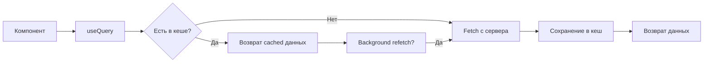

# Урок 5.2: React Query + tRPC для серверного состояния

> **🎯 Цель урока**: Освоить интеграцию React Query и tRPC для эффективного управления серверным состоянием

## 📖 Введение

### Проблема серверного состояния

**Представьте ситуацию:** Ваше приложение показывает курсы валют, которые обновляются каждые 30 секунд. Пользователь переключается между вкладками, теряет интернет, возвращается через час. Что должно произойти?

**Без управления серверным состоянием:**

```typescript
// ❌ Проблемы:
const [rates, setRates] = useState(null);
const [loading, setLoading] = useState(false);
const [error, setError] = useState(null);

useEffect(() => {
  // Каждый компонент делает свой запрос
  // Нет кеширования
  // Нет обработки ошибок
  // Нет автообновления
  fetchRates().then(setRates);
}, []);
```

**С React Query + tRPC:**

```typescript
// ✅ Решение:
const {
  data: rates,
  isLoading,
  error,
} = trpc.exchange.getRates.useQuery(
  undefined, // параметры
  {
    refetchInterval: 30000, // Автообновление
    staleTime: 10000, // Кеширование
    retry: 3, // Повторы при ошибках
    refetchOnWindowFocus: true, // Обновление при возврате
  }
);
```

### Разделение ответственности

| Тип состояния           | Где хранится | Кто управляет | Примеры                      |
| ----------------------- | ------------ | ------------- | ---------------------------- |
| **UI состояние**        | Клиент       | Zustand       | Тема, модальные окна, форма  |
| **Серверное состояние** | Сервер       | React Query   | Курсы валют, заказы, профиль |

**Ключевое различие:**

- 🎨 **UI состояние** - мы полностью контролируем
- 🌐 **Серверное состояние** - может измениться в любой момент

### Почему React Query + tRPC?

| Проблема                  | Решение React Query | Решение tRPC    |
| ------------------------- | ------------------- | --------------- |
| **Дублирование запросов** | Умное кеширование   | -               |
| **Устаревшие данные**     | Автообновление      | -               |
| **Ошибки сети**           | Автоповторы         | -               |
| **Типобезопасность**      | -                   | End-to-end типы |
| **Валидация**             | -                   | Zod схемы       |
| **Оптимизация**           | -                   | Batch запросы   |

---

## 🚀 Этап 1: Основы React Query _(15 мин)_

### Ключевые концепции

**React Query решает 4 основные проблемы:**

1. **🗄️ Кеширование** - данные сохраняются в памяти
2. **🔄 Синхронизация** - автоматическое обновление при изменениях
3. **⚡ Оптимизация** - дедупликация запросов, background updates
4. **🛡️ Надежность** - retry, error handling, offline support

### Жизненный цикл query



### Простой пример

```typescript
// Базовый useQuery
function ExchangeRates() {
  const {
    data,           // Данные с сервера
    isLoading,      // Первая загрузка
    isFetching,     // Любая загрузка (включая background)
    error,          // Ошибка
    refetch         // Ручное обновление
  } = useQuery({
    queryKey: ['exchange-rates'],           // Уникальный ключ
    queryFn: () => fetch('/api/rates'),     // Функция загрузки
    staleTime: 30000,                       // 30 сек - данные свежие
    refetchInterval: 60000,                 // Обновлять каждую минуту
  });

  if (isLoading) return <div>Загрузка...</div>;
  if (error) return <div>Ошибка: {error.message}</div>;

  return (
    <div>
      {data?.map(rate => (
        <div key={rate.pair}>
          {rate.pair}: {rate.value}
        </div>
      ))}
      <button onClick={() => refetch()}>
        Обновить
      </button>
    </div>
  );
}
```

### Состояния query

```typescript
// Понимание состояний
function QueryStates() {
  const query = useQuery({
    queryKey: ['data'],
    queryFn: fetchData,
  });

  // Возможные комбинации состояний:
  if (query.isLoading) {
    // Первая загрузка, данных нет
    return <Spinner />;
  }

  if (query.isError) {
    // Ошибка загрузки
    return <ErrorMessage error={query.error} />;
  }

  if (query.isSuccess) {
    // Данные успешно загружены
    return (
      <div>
        {query.isFetching && <BackgroundSpinner />}
        <DataDisplay data={query.data} />
      </div>
    );
  }
}
```

### ✅ Контрольная точка 1

**Проверьте понимание:**

1. **В чем разница между `isLoading` и `isFetching`?**
   <details>
   <summary>Показать ответ</summary>

   `isLoading` - только первая загрузка без данных. `isFetching` - любая загрузка, включая background обновления.
   </details>

2. **Что произойдет, если два компонента используют одинаковый `queryKey`?**
   <details>
   <summary>Показать ответ</summary>

   React Query сделает только один запрос и поделится результатом между компонентами.
   </details>

**Задание:** Создайте простой компонент с useQuery для загрузки списка пользователей.

---

## 🔧 Этап 2: Настройка с tRPC _(20 мин)_

### Архитектура интеграции

```
┌─────────────────┐    ┌──────────────────┐    ┌─────────────────┐
│   React         │    │   React Query    │    │   tRPC          │
│   Component     │───▶│   + Cache        │───▶│   + Validation  │
│                 │    │   + Sync         │    │   + Types       │
└─────────────────┘    └──────────────────┘    └─────────────────┘
```

### Настройка QueryClient

```typescript
// packages/hooks/src/providers/QueryClient.ts
import { QueryClient } from '@tanstack/react-query';

export function createQueryClient(): QueryClient {
  return new QueryClient({
    defaultOptions: {
      queries: {
        // === КЕШИРОВАНИЕ ===
        staleTime: 5 * 60 * 1000, // 5 мин - данные свежие
        gcTime: 30 * 60 * 1000, // 30 мин - хранить в памяти

        // === ПОВТОРЫ ===
        retry: (failureCount, error: any) => {
          // Не повторяем клиентские ошибки (4xx)
          if (error?.status >= 400 && error?.status < 500) {
            return false;
          }
          // Максимум 3 попытки для серверных ошибок
          return failureCount < 3;
        },

        // === ОБНОВЛЕНИЯ ===
        refetchOnWindowFocus: true, // При возврате на вкладку
        refetchOnReconnect: true, // При восстановлении сети
      },

      mutations: {
        retry: 1, // Одна попытка для mutations
      },
    },
  });
}
```

### Provider компонент

```typescript
// packages/hooks/src/providers/QueryProvider.tsx
'use client';

import { QueryClientProvider } from '@tanstack/react-query';
import { ReactQueryDevtools } from '@tanstack/react-query-devtools';
import { useState } from 'react';
import { createQueryClient } from './QueryClient';

export function QueryProvider({ children }: { children: React.ReactNode }) {
  // Создаем QueryClient один раз за сессию
  const [queryClient] = useState(() => createQueryClient());

  return (
    <QueryClientProvider client={queryClient}>
      {children}

      {/* DevTools только в development */}
      {process.env.NODE_ENV === 'development' && (
        <ReactQueryDevtools initialIsOpen={false} />
      )}
    </QueryClientProvider>
  );
}
```

### Интеграция с tRPC

```typescript
// lib/trpc-client.ts
import { createTRPCReact } from '@trpc/react-query';
import type { AppRouter } from '../server/trpc/root';

// Создаем типизированный tRPC client
export const trpc = createTRPCReact<AppRouter>();

// Провайдер для tRPC
export function TRPCProvider({ children }: { children: React.ReactNode }) {
  const [queryClient] = useState(() => createQueryClient());
  const [trpcClient] = useState(() =>
    trpc.createClient({
      links: [
        httpBatchLink({
          url: '/api/trpc',
          // Добавляем headers для аутентификации
          headers() {
            return {
              authorization: getAuthToken(),
            };
          },
        }),
      ],
    })
  );

  return (
    <trpc.Provider client={trpcClient} queryClient={queryClient}>
      <QueryClientProvider client={queryClient}>
        {children}
      </QueryClientProvider>
    </trpc.Provider>
  );
}
```

### Первый tRPC hook

```typescript
// Использование tRPC с React Query
function ExchangeRates() {
  // tRPC автоматически создает React Query hooks
  const {
    data: rates,
    isLoading,
    error,
    refetch
  } = trpc.exchange.getRates.useQuery(
    undefined, // параметры запроса
    {
      // Опции React Query
      refetchInterval: 30000,  // Обновлять каждые 30 сек
      staleTime: 10000,       // 10 сек - данные свежие
    }
  );

  if (isLoading) return <div>Загрузка курсов...</div>;
  if (error) return <div>Ошибка: {error.message}</div>;

  return (
    <div>
      <h2>Курсы валют</h2>
      {rates?.map(rate => (
        <div key={`${rate.from}-${rate.to}`}>
          {rate.from} → {rate.to}: {rate.value}
        </div>
      ))}
      <button onClick={() => refetch()}>
        Обновить курсы
      </button>
    </div>
  );
}
```

### ✅ Контрольная точка 2

**Проверьте понимание:**

1. **Зачем нужен отдельный QueryClient для каждой сессии?**
   <details>
   <summary>Показать ответ</summary>

   Для изоляции данных между пользователями и предотвращения утечек памяти при SSR.
   </details>

2. **Что делает `httpBatchLink` в tRPC?**
   <details>
   <summary>Показать ответ</summary>

   Объединяет несколько запросов в один HTTP request для оптимизации производительности.
   </details>

---

## 🔑 Этап 3: Query Keys и кеширование _(20 мин)_

### Проблема управления ключами

**Без системы:**

```typescript
// ❌ Проблемы:
useQuery(['rates'], fetchRates);
useQuery(['rates', 'BTC'], fetchBTCRate);
useQuery(['user-rates'], fetchUserRates);

// Как инвалидировать все курсы?
// Как избежать дублирования?
// Как обеспечить консистентность?
```

**С фабрикой ключей:**

```typescript
// ✅ Решение:
const queryKeys = {
  exchange: {
    all: () => ['exchange'] as const,
    rates: () => [...queryKeys.exchange.all(), 'rates'] as const,
    rate: (pair: string) => [...queryKeys.exchange.rates(), pair] as const,
  },
};

// Использование
useQuery(queryKeys.exchange.rates(), fetchRates);
useQuery(queryKeys.exchange.rate('BTC-USD'), fetchBTCRate);

// Инвалидация всех курсов
queryClient.invalidateQueries({ queryKey: queryKeys.exchange.rates() });
```

### Фабрика Query Keys

```typescript
// packages/hooks/src/queries/keys.ts

/**
 * 🔑 Централизованная фабрика Query Keys
 *
 * Принципы:
 * - Иерархическая структура
 * - Типобезопасность
 * - Легкая инвалидация
 */

export const queryKeys = {
  // === ROOT LEVEL ===
  all: () => ['api'] as const,

  // === EXCHANGE ===
  exchange: {
    all: () => [...queryKeys.all(), 'exchange'] as const,
    rates: () => [...queryKeys.exchange.all(), 'rates'] as const,
    rate: (from: string, to: string) => [...queryKeys.exchange.rates(), { from, to }] as const,
    limits: () => [...queryKeys.exchange.all(), 'limits'] as const,
  },

  // === USER ===
  user: {
    all: () => [...queryKeys.all(), 'user'] as const,
    profile: () => [...queryKeys.user.all(), 'profile'] as const,
    orders: (filters?: OrderFilters) => [...queryKeys.user.all(), 'orders', filters] as const,
    stats: () => [...queryKeys.user.all(), 'stats'] as const,
  },

  // === BANKS ===
  banks: {
    all: () => [...queryKeys.all(), 'banks'] as const,
    list: () => [...queryKeys.banks.all(), 'list'] as const,
    details: (bankId: string) => [...queryKeys.banks.all(), 'details', bankId] as const,
  },
} as const;

// Типы для фильтров
interface OrderFilters {
  status?: string[];
  dateFrom?: Date;
  dateTo?: Date;
}
```

### Стратегии кеширования

```typescript
// packages/hooks/src/queries/options.ts

/**
 * 📊 Опции кеширования для разных типов данных
 */

export const CACHE_STRATEGIES = {
  // Курсы валют - часто меняются
  EXCHANGE_RATES: {
    staleTime: 30 * 1000, // 30 сек - свежие
    gcTime: 5 * 60 * 1000, // 5 мин - в памяти
    refetchInterval: 30 * 1000, // Обновлять каждые 30 сек
  },

  // Банки - стабильные данные
  BANKS: {
    staleTime: 60 * 60 * 1000, // 1 час - свежие
    gcTime: 24 * 60 * 60 * 1000, // 24 часа - в памяти
    refetchOnWindowFocus: false, // Не обновлять при фокусе
  },

  // Заказы пользователя - средняя частота
  USER_ORDERS: {
    staleTime: 2 * 60 * 1000, // 2 мин - свежие
    gcTime: 30 * 60 * 1000, // 30 мин - в памяти
    refetchInterval: 60 * 1000, // Обновлять каждую минуту
  },

  // Профиль - редко меняется
  USER_PROFILE: {
    staleTime: 15 * 60 * 1000, // 15 мин - свежие
    gcTime: 2 * 60 * 60 * 1000, // 2 часа - в памяти
    refetchOnWindowFocus: false,
  },
} as const;
```

### Практическое использование

```typescript
// hooks/useExchangeRates.ts
export function useExchangeRates() {
  return trpc.exchange.getRates.useQuery(undefined, {
    queryKey: queryKeys.exchange.rates(),
    ...CACHE_STRATEGIES.EXCHANGE_RATES,

    // Обработка ошибок
    onError: error => {
      console.error('Ошибка загрузки курсов:', error);
      toast.error('Не удалось загрузить курсы валют');
    },
  });
}

// hooks/useUserOrders.ts
export function useUserOrders(filters?: OrderFilters) {
  return trpc.user.getOrders.useQuery(filters, {
    queryKey: queryKeys.user.orders(filters),
    ...CACHE_STRATEGIES.USER_ORDERS,

    // Включаем только для авторизованных пользователей
    enabled: !!useAuth().user,
  });
}
```

### Инвалидация данных

```typescript
// utils/queryUtils.ts
export const queryUtils = {
  // Инвалидация по группам
  invalidateExchange: (queryClient: QueryClient) => {
    return queryClient.invalidateQueries({
      queryKey: queryKeys.exchange.all(),
    });
  },

  invalidateUserData: (queryClient: QueryClient) => {
    return queryClient.invalidateQueries({
      queryKey: queryKeys.user.all(),
    });
  },

  // Prefetch критических данных
  prefetchEssentials: async (queryClient: QueryClient) => {
    await Promise.all([
      queryClient.prefetchQuery({
        queryKey: queryKeys.exchange.rates(),
        queryFn: () => trpc.exchange.getRates.query(),
        ...CACHE_STRATEGIES.EXCHANGE_RATES,
      }),

      queryClient.prefetchQuery({
        queryKey: queryKeys.banks.list(),
        queryFn: () => trpc.banks.getList.query(),
        ...CACHE_STRATEGIES.BANKS,
      }),
    ]);
  },

  // Очистка устаревших данных
  clearStaleData: (queryClient: QueryClient) => {
    queryClient.removeQueries({
      predicate: query => {
        const maxAge = 24 * 60 * 60 * 1000; // 24 часа
        return Date.now() - query.state.dataUpdatedAt > maxAge;
      },
    });
  },
};
```

## ⚙️ Настройка React Query

### Query Client конфигурация

```typescript
// packages/hooks/src/providers/QueryClient.ts
import { QueryClient } from '@tanstack/react-query';
import { BUSINESS_LIMITS, CACHE_TIMES } from '@repo/constants';

/**
 * Централизованная конфигурация React Query
 *
 * Основные принципы:
 * - Агрессивное кеширование для стабильных данных
 * - Консервативное кеширование для динамических данных
 * - Оптимистичные обновления где возможно
 * - Graceful error handling
 */

export function createQueryClient(): QueryClient {
  return new QueryClient({
    defaultOptions: {
      queries: {
        // Стратегия по умолчанию
        staleTime: CACHE_TIMES.DEFAULT_STALE_TIME, // 5 минут
        gcTime: CACHE_TIMES.DEFAULT_GC_TIME, // 30 минут (бывший cacheTime)

        // Поведение при ошибках
        retry: (failureCount, error: any) => {
          // Не повторяем для 4xx ошибок
          if (error?.status >= 400 && error?.status < 500) {
            return false;
          }

          // Максимум 3 попытки для других ошибок
          return failureCount < 3;
        },

        retryDelay: attemptIndex => Math.min(1000 * 2 ** attemptIndex, 30000),

        // Refetch стратегия
        refetchOnWindowFocus: true,
        refetchOnReconnect: true,
        refetchOnMount: true,

        // Network mode для offline experience
        networkMode: 'offlineFirst',
      },

      mutations: {
        // Более агрессивный retry для mutations
        retry: (failureCount, error: any) => {
          // Не повторяем для validation ошибок
          if (error?.status === 400 || error?.status === 422) {
            return false;
          }

          return failureCount < 2;
        },

        retryDelay: 1000,

        // Network mode
        networkMode: 'offlineFirst',
      },
    },
  });
}

// Специфичные опции для разных типов данных
export const QUERY_OPTIONS = {
  // Курсы валют - обновляются часто
  EXCHANGE_RATES: {
    staleTime: CACHE_TIMES.EXCHANGE_RATES_STALE, // 30 секунд
    gcTime: CACHE_TIMES.EXCHANGE_RATES_GC, // 5 минут
    refetchInterval: CACHE_TIMES.EXCHANGE_RATES_REFETCH, // 30 секунд
  },

  // Банки - стабильные данные
  BANKS: {
    staleTime: CACHE_TIMES.BANKS_STALE, // 1 час
    gcTime: CACHE_TIMES.BANKS_GC, // 24 часа
    refetchOnWindowFocus: false,
  },

  // Заказы пользователя - средняя частота обновлений
  USER_ORDERS: {
    staleTime: CACHE_TIMES.USER_ORDERS_STALE, // 2 минуты
    gcTime: CACHE_TIMES.USER_ORDERS_GC, // 1 час
    refetchInterval: CACHE_TIMES.USER_ORDERS_REFETCH, // 1 минута
  },

  // Профиль пользователя - редко изменяется
  USER_PROFILE: {
    staleTime: CACHE_TIMES.USER_PROFILE_STALE, // 15 минут
    gcTime: CACHE_TIMES.USER_PROFILE_GC, // 2 часа
    refetchOnWindowFocus: false,
  },
} as const;
```

### Provider настройка

```typescript
// packages/hooks/src/providers/QueryProvider.tsx
'use client';

import { QueryClientProvider } from '@tanstack/react-query';
import { ReactQueryDevtools } from '@tanstack/react-query-devtools';
import { ReactQueryStreamedHydration } from '@tanstack/react-query-next-experimental';
import { useState } from 'react';

import { createQueryClient } from './QueryClient';

/**
 * Query Provider с SSR поддержкой
 *
 * Особенности:
 * - Создает новый QueryClient для каждой сессии
 * - Поддерживает SSR hydration
 * - Включает DevTools в development
 * - Обрабатывает ошибки gracefully
 */

export function QueryProvider({ children }: { children: React.ReactNode }) {
  // Создаем QueryClient один раз за сессию браузера
  const [queryClient] = useState(() => createQueryClient());

  return (
    <QueryClientProvider client={queryClient}>
      <ReactQueryStreamedHydration>
        {children}
      </ReactQueryStreamedHydration>

      {/* DevTools только в development */}
      {process.env.NODE_ENV === 'development' && (
        <ReactQueryDevtools
          initialIsOpen={false}
          position="bottom-right"
        />
      )}
    </QueryClientProvider>
  );
}

// Обертка для обработки ошибок
export function QueryErrorBoundary({ children }: { children: React.ReactNode }) {
  return (
    <ErrorBoundary
      fallback={
        <div className="query-error-fallback">
          <h2>Что-то пошло не так с загрузкой данных</h2>
          <button onClick={() => window.location.reload()}>
            Обновить страницу
          </button>
        </div>
      }
    >
      {children}
    </ErrorBoundary>
  );
}
```

## 🔑 Query Keys фабрика

### Централизованное управление ключами

```typescript
// packages/hooks/src/queries/keys.ts
/**
 * Централизованная фабрика Query Keys
 *
 * Принципы:
 * - Иерархическая структура ключей
 * - Type-safe генерация
 * - Легкая инвалидация по группам
 * - Консистентность across API
 */

export const queryKeys = {
  // Root level
  all: ['api'] as const,

  // Feature level
  exchange: () => [...queryKeys.all, 'exchange'] as const,
  user: () => [...queryKeys.all, 'user'] as const,
  banks: () => [...queryKeys.all, 'banks'] as const,
  orders: () => [...queryKeys.all, 'orders'] as const,

  // Exchange queries
  exchangeRates: () => [...queryKeys.exchange(), 'rates'] as const,
  exchangeRate: (from: string, to: string) => [...queryKeys.exchangeRates(), { from, to }] as const,
  exchangeLimits: () => [...queryKeys.exchange(), 'limits'] as const,
  exchangeCommissions: () => [...queryKeys.exchange(), 'commissions'] as const,

  // User queries
  userProfile: () => [...queryKeys.user(), 'profile'] as const,
  userOrders: (filters?: UserOrderFilters) => [...queryKeys.user(), 'orders', filters] as const,
  userStats: () => [...queryKeys.user(), 'stats'] as const,
  userNotifications: () => [...queryKeys.user(), 'notifications'] as const,

  // Banks queries
  banksList: () => [...queryKeys.banks(), 'list'] as const,
  bankDetails: (bankId: string) => [...queryKeys.banks(), 'details', bankId] as const,
  bankLimits: (bankId: string) => [...queryKeys.banks(), 'limits', bankId] as const,

  // Orders queries
  ordersList: (filters?: OrderFilters) => [...queryKeys.orders(), 'list', filters] as const,
  orderDetails: (orderId: string) => [...queryKeys.orders(), 'details', orderId] as const,
  orderHistory: (orderId: string) => [...queryKeys.orders(), 'history', orderId] as const,
} as const;

// Type helpers для фильтров
export interface UserOrderFilters {
  status?: OrderStatus[];
  dateFrom?: Date;
  dateTo?: Date;
  limit?: number;
  offset?: number;
}

export interface OrderFilters {
  userId?: string;
  status?: OrderStatus[];
  currency?: string[];
  dateRange?: [Date, Date];
  limit?: number;
  offset?: number;
}

// Utilities для работы с ключами
export const queryUtils = {
  // Инвалидация по паттернам
  invalidateExchange: (queryClient: QueryClient) => {
    return queryClient.invalidateQueries({
      queryKey: queryKeys.exchange(),
    });
  },

  invalidateUserData: (queryClient: QueryClient) => {
    return queryClient.invalidateQueries({
      queryKey: queryKeys.user(),
    });
  },

  invalidateOrders: (queryClient: QueryClient) => {
    return queryClient.invalidateQueries({
      queryKey: queryKeys.orders(),
    });
  },

  // Prefetch популярных данных
  prefetchEssentialData: (queryClient: QueryClient, trpc: any) => {
    return Promise.all([
      queryClient.prefetchQuery({
        queryKey: queryKeys.exchangeRates(),
        queryFn: () => trpc.exchange.getRates.query(),
        ...QUERY_OPTIONS.EXCHANGE_RATES,
      }),

      queryClient.prefetchQuery({
        queryKey: queryKeys.banksList(),
        queryFn: () => trpc.banks.getList.query(),
        ...QUERY_OPTIONS.BANKS,
      }),
    ]);
  },

  // Очистка устаревших данных
  clearStaleData: (queryClient: QueryClient) => {
    queryClient.removeQueries({
      predicate: query => {
        return Date.now() - query.state.dataUpdatedAt > CACHE_TIMES.MAX_STALE_TIME;
      },
    });
  },
} as const;
```

## 📡 Exchange API hooks

### Комплексные hooks для обмена валют

```typescript
// packages/hooks/src/api/exchange.ts
import { useMutation, useQuery, useQueryClient } from '@tanstack/react-query';
import type {
  ExchangeRatesResponse,
  CreateOrderRequest,
  CreateOrderResponse,
  ExchangeLimitsResponse,
  ExchangeCommissionsResponse,
} from '@repo/exchange-core';

import { trpc } from '../lib/trpc';
import { queryKeys, QUERY_OPTIONS } from '../queries';
import { useNotificationStore } from '../state/notification-store';

/**
 * Hook для получения курсов валют
 *
 * Особенности:
 * - Автообновление каждые 30 секунд
 * - Optimistic updates
 * - Error handling с уведомлениями
 * - Fallback на cached данные
 */
export function useExchangeRates() {
  const notifications = useNotificationStore();

  return useQuery({
    queryKey: queryKeys.exchangeRates(),
    queryFn: async (): Promise<ExchangeRatesResponse> => {
      try {
        const data = await trpc.exchange.getRates.query();
        return data;
      } catch (error) {
        notifications.error(
          'Ошибка загрузки курсов',
          'Не удалось обновить курсы валют. Используются последние доступные данные.'
        );
        throw error;
      }
    },
    ...QUERY_OPTIONS.EXCHANGE_RATES,

    // Дополнительные опции
    meta: {
      errorMessage: 'Не удалось загрузить курсы валют',
    },
  });
}

/**
 * Hook для получения лимитов обмена
 */
export function useExchangeLimits() {
  return useQuery({
    queryKey: queryKeys.exchangeLimits(),
    queryFn: (): Promise<ExchangeLimitsResponse> => trpc.exchange.getLimits.query(),

    staleTime: CACHE_TIMES.EXCHANGE_LIMITS_STALE, // 10 минут
    gcTime: CACHE_TIMES.EXCHANGE_LIMITS_GC, // 1 час

    meta: {
      errorMessage: 'Не удалось загрузить лимиты обмена',
    },
  });
}

/**
 * Hook для получения комиссий
 */
export function useExchangeCommissions() {
  return useQuery({
    queryKey: queryKeys.exchangeCommissions(),
    queryFn: (): Promise<ExchangeCommissionsResponse> => trpc.exchange.getCommissions.query(),

    staleTime: CACHE_TIMES.EXCHANGE_COMMISSIONS_STALE, // 15 минут
    gcTime: CACHE_TIMES.EXCHANGE_COMMISSIONS_GC, // 2 часа

    meta: {
      errorMessage: 'Не удалось загрузить информацию о комиссиях',
    },
  });
}

/**
 * Hook для создания заказа на обмен
 *
 * Включает:
 * - Optimistic updates
 * - Автоматическую инвалидацию related queries
 * - Business notifications
 * - Error recovery
 */
export function useCreateOrderMutation() {
  const queryClient = useQueryClient();
  const notifications = useNotificationStore();

  return useMutation({
    mutationFn: async (data: CreateOrderRequest): Promise<CreateOrderResponse> => {
      // Валидация на клиенте перед отправкой
      if (!data.fromCurrency || !data.toAmount || !data.email) {
        throw new Error('Заполните все обязательные поля');
      }

      return trpc.exchange.createOrder.mutate(data);
    },

    // Optimistic update
    onMutate: async newOrder => {
      // Отменяем исходящие queries чтобы не перезаписали optimistic update
      await queryClient.cancelQueries({
        queryKey: queryKeys.userOrders(),
      });

      // Сохраняем предыдущее состояние для rollback
      const previousOrders = queryClient.getQueryData(queryKeys.userOrders());

      // Optimistically обновляем UI
      queryClient.setQueryData(queryKeys.userOrders(), (old: any) => {
        if (!old) return old;

        const optimisticOrder = {
          id: `temp-${Date.now()}`,
          ...newOrder,
          status: 'PENDING' as const,
          createdAt: new Date().toISOString(),
        };

        return {
          ...old,
          data: [optimisticOrder, ...old.data],
        };
      });

      return { previousOrders };
    },

    // Успешное создание
    onSuccess: (data, variables) => {
      // Показываем успешное уведомление
      notifications.orderCreated(data.orderId);

      // Инвалидируем и обновляем связанные queries
      queryClient.invalidateQueries({
        queryKey: queryKeys.userOrders(),
      });

      queryClient.invalidateQueries({
        queryKey: queryKeys.userStats(),
      });

      // Опционально: prefetch деталей заказа
      queryClient.prefetchQuery({
        queryKey: queryKeys.orderDetails(data.orderId),
        queryFn: () => trpc.orders.getDetails.query({ orderId: data.orderId }),
      });
    },

    // Обработка ошибок
    onError: (error, variables, context) => {
      // Rollback optimistic update
      if (context?.previousOrders) {
        queryClient.setQueryData(queryKeys.userOrders(), context.previousOrders);
      }

      // Показываем ошибку с действием для повтора
      notifications.error(
        'Ошибка создания заказа',
        error.message || 'Попробуйте снова через несколько минут',
        {
          action: {
            label: 'Попробовать снова',
            onClick: () => {
              // Можно добавить retry логику
            },
          },
        }
      );
    },

    // Финальный cleanup
    onSettled: () => {
      // Всегда refetch после завершения
      queryClient.invalidateQueries({
        queryKey: queryKeys.userOrders(),
      });
    },
  });
}

/**
 * Hook для расчета курса в реальном времени
 *
 * Используется в форме для live preview
 */
export function useCalculateExchange(
  fromCurrency: string,
  fromAmount: number,
  enabled: boolean = true
) {
  return useQuery({
    queryKey: ['exchange', 'calculate', fromCurrency, fromAmount],
    queryFn: async () => {
      if (!fromCurrency || !fromAmount || fromAmount <= 0) {
        return null;
      }

      return trpc.exchange.calculate.query({
        fromCurrency,
        fromAmount,
        toCurrency: 'UAH',
      });
    },

    enabled: enabled && !!fromCurrency && !!fromAmount && fromAmount > 0,

    // Быстрое обновление для live calculator
    staleTime: 10000, // 10 секунд
    gcTime: 60000, // 1 минута

    // Не показываем ошибки для calculator
    retry: false,

    meta: {
      silent: true, // Не показывать ошибки в UI
    },
  });
}

/**
 * Composed hook для всех exchange данных
 *
 * Удобен для страниц где нужны все данные сразу
 */
export function useExchangeData() {
  const rates = useExchangeRates();
  const limits = useExchangeLimits();
  const commissions = useExchangeCommissions();

  return {
    rates,
    limits,
    commissions,

    // Derived states
    isLoading: rates.isLoading || limits.isLoading || commissions.isLoading,
    isError: rates.isError || limits.isError || commissions.isError,
    isSuccess: rates.isSuccess && limits.isSuccess && commissions.isSuccess,

    // Combined data
    data: {
      rates: rates.data,
      limits: limits.data,
      commissions: commissions.data,
    },

    // Actions
    refetchAll: () => Promise.all([rates.refetch(), limits.refetch(), commissions.refetch()]),
  };
}
```

## 👤 User API hooks

### Пользовательские данные и заказы

```typescript
// packages/hooks/src/api/user.ts
import { useMutation, useQuery, useQueryClient } from '@tanstack/react-query';
import type { UserProfile, UserOrder, UserStats, UpdateProfileRequest } from '@repo/exchange-core';

import { trpc } from '../lib/trpc';
import { queryKeys, QUERY_OPTIONS } from '../queries';
import { useNotificationStore } from '../state/notification-store';

/**
 * Hook для профиля пользователя
 */
export function useUserProfile() {
  return useQuery({
    queryKey: queryKeys.userProfile(),
    queryFn: (): Promise<UserProfile> => trpc.user.getProfile.query(),
    ...QUERY_OPTIONS.USER_PROFILE,
  });
}

/**
 * Hook для заказов пользователя с фильтрацией
 */
export function useUserOrders(filters?: UserOrderFilters) {
  return useQuery({
    queryKey: queryKeys.userOrders(filters),
    queryFn: (): Promise<{ data: UserOrder[]; total: number }> =>
      trpc.user.getOrders.query(filters),
    ...QUERY_OPTIONS.USER_ORDERS,
  });
}

/**
 * Hook для статистики пользователя
 */
export function useUserStats() {
  return useQuery({
    queryKey: queryKeys.userStats(),
    queryFn: (): Promise<UserStats> => trpc.user.getStats.query(),
    staleTime: CACHE_TIMES.USER_STATS_STALE, // 5 минут
    gcTime: CACHE_TIMES.USER_STATS_GC, // 1 час
  });
}

/**
 * Mutation для обновления профиля
 */
export function useUpdateProfileMutation() {
  const queryClient = useQueryClient();
  const notifications = useNotificationStore();

  return useMutation({
    mutationFn: (data: UpdateProfileRequest): Promise<UserProfile> =>
      trpc.user.updateProfile.mutate(data),

    onSuccess: data => {
      // Обновляем cache
      queryClient.setQueryData(queryKeys.userProfile(), data);

      notifications.success('Профиль обновлен', 'Ваши данные успешно сохранены');
    },

    onError: error => {
      notifications.error('Ошибка обновления', error.message || 'Не удалось обновить профиль');
    },
  });
}
```

## 🏦 Banks API hooks

### Банковские данные и интеграции

```typescript
// packages/hooks/src/api/banks.ts
import { useQuery } from '@tanstack/react-query';
import type { Bank, BankLimits } from '@repo/exchange-core';

import { trpc } from '../lib/trpc';
import { queryKeys, QUERY_OPTIONS } from '../queries';

/**
 * Hook для списка банков
 */
export function useBanks() {
  return useQuery({
    queryKey: queryKeys.banksList(),
    queryFn: (): Promise<Bank[]> => trpc.banks.getList.query(),
    ...QUERY_OPTIONS.BANKS,

    // Дополнительная обработка данных
    select: data => {
      // Сортируем банки по популярности
      return data.sort((a, b) => {
        if (a.isPopular && !b.isPopular) return -1;
        if (!a.isPopular && b.isPopular) return 1;
        return a.name.localeCompare(b.name);
      });
    },
  });
}

/**
 * Hook для лимитов конкретного банка
 */
export function useBankLimits(bankId: string) {
  return useQuery({
    queryKey: queryKeys.bankLimits(bankId),
    queryFn: (): Promise<BankLimits> => trpc.banks.getLimits.query({ bankId }),

    enabled: !!bankId,
    staleTime: CACHE_TIMES.BANK_LIMITS_STALE, // 30 минут
    gcTime: CACHE_TIMES.BANK_LIMITS_GC, // 4 часа
  });
}

/**
 * Composed hook для банковских данных
 */
export function useBankData(bankId?: string) {
  const banks = useBanks();
  const limits = useBankLimits(bankId || '');

  const selectedBank = banks.data?.find(bank => bank.id === bankId);

  return {
    banks,
    limits,
    selectedBank,

    isLoading: banks.isLoading || (bankId ? limits.isLoading : false),
    isError: banks.isError || (bankId ? limits.isError : false),
  };
}
```

## 🔄 Optimistic Updates паттерны

### Продвинутые техники для UX

```typescript
// packages/hooks/src/api/optimistic-patterns.ts
import { useQueryClient } from '@tanstack/react-query';
import type { UserOrder, OrderStatus } from '@repo/exchange-core';

import { queryKeys } from '../queries';

/**
 * Optimistic update для статуса заказа
 */
export function useOptimisticOrderStatus() {
  const queryClient = useQueryClient();

  const updateOrderStatus = (orderId: string, newStatus: OrderStatus) => {
    // Обновляем во всех связанных queries
    const queries = [queryKeys.userOrders(), queryKeys.orderDetails(orderId)];

    queries.forEach(queryKey => {
      queryClient.setQueryData(queryKey, (oldData: any) => {
        if (!oldData) return oldData;

        // Для списка заказов
        if (Array.isArray(oldData.data)) {
          return {
            ...oldData,
            data: oldData.data.map((order: UserOrder) =>
              order.id === orderId ? { ...order, status: newStatus } : order
            ),
          };
        }

        // Для деталей заказа
        if (oldData.id === orderId) {
          return { ...oldData, status: newStatus };
        }

        return oldData;
      });
    });
  };

  return { updateOrderStatus };
}

/**
 * Optimistic добавление в список
 */
export function useOptimisticListAdd<T extends { id: string }>() {
  const queryClient = useQueryClient();

  const addToList = (queryKey: any[], newItem: T) => {
    queryClient.setQueryData(queryKey, (oldData: any) => {
      if (!oldData) {
        return { data: [newItem], total: 1 };
      }

      return {
        ...oldData,
        data: [newItem, ...oldData.data],
        total: (oldData.total || 0) + 1,
      };
    });
  };

  const removeFromList = (queryKey: any[], itemId: string) => {
    queryClient.setQueryData(queryKey, (oldData: any) => {
      if (!oldData) return oldData;

      return {
        ...oldData,
        data: oldData.data.filter((item: T) => item.id !== itemId),
        total: Math.max((oldData.total || 0) - 1, 0),
      };
    });
  };

  return { addToList, removeFromList };
}
```

## 🎯 Практическое использование

### Интеграция в компонентах

```typescript
// src/components/exchange/ExchangeRateDisplay.tsx
import { useExchangeRates } from '@repo/hooks';

export function ExchangeRateDisplay() {
  const {
    data: rates,
    isLoading,
    isError,
    error,
    refetch
  } = useExchangeRates();

  if (isLoading) {
    return <ExchangeRateSkeleton />;
  }

  if (isError) {
    return (
      <div className="exchange-rate-error">
        <p>Ошибка загрузки курсов: {error.message}</p>
        <button onClick={() => refetch()}>
          Попробовать снова
        </button>
      </div>
    );
  }

  return (
    <div className="exchange-rates">
      {rates?.map(rate => (
        <div key={`${rate.from}-${rate.to}`} className="rate-item">
          <span className="currency-pair">
            {rate.from} → {rate.to}
          </span>
          <span className="rate-value">
            {rate.rate.toFixed(2)}
          </span>
          <span className="rate-timestamp">
            Обновлено: {new Date(rate.updatedAt).toLocaleTimeString()}
          </span>
        </div>
      ))}
    </div>
  );
}

// src/components/orders/CreateOrderForm.tsx
import { useCreateOrderMutation, useExchangeData } from '@repo/hooks';
import { useExchangeStore } from '@repo/hooks';

export function CreateOrderForm() {
  const formData = useExchangeStore(state => state.formData);
  const updateFormData = useExchangeStore(state => state.updateFormData);

  const { data: exchangeData, isLoading: dataLoading } = useExchangeData();
  const createOrder = useCreateOrderMutation();

  const handleSubmit = async (e: React.FormEvent) => {
    e.preventDefault();

    try {
      const result = await createOrder.mutateAsync({
        fromCurrency: formData.fromCurrency,
        fromAmount: formData.fromAmount,
        toCurrency: formData.toCurrency,
        email: formData.email,
        cardNumber: formData.cardNumber,
      });

      // Переходим к отслеживанию заказа
      router.push(`/orders/${result.orderId}`);
    } catch (error) {
      // Ошибка уже обработана в mutation
    }
  };

  return (
    <form onSubmit={handleSubmit}>
      {/* Form fields */}

      <button
        type="submit"
        disabled={createOrder.isPending || dataLoading}
        className="submit-button"
      >
        {createOrder.isPending ? 'Создание...' : 'Создать заказ'}
      </button>
    </form>
  );
}
```

## ✅ Проверка знаний

### Вопросы для самоконтроля:

1. **В чем разница между UI и Server состоянием?**
   - UI - локальное, Server - удаленное с синхронизацией

2. **Зачем нужны Query Keys?**
   - Идентификация, кеширование, инвалидация данных

3. **Что такое Optimistic Updates?**
   - Мгновенное обновление UI до получения ответа сервера

4. **Когда использовать staleTime vs gcTime?**
   - staleTime - когда данные считаются устаревшими, gcTime - когда удалять из памяти

### Практические задания:

1. **Создайте hook** для поиска заказов с debounce
2. **Реализуйте optimistic update** для избранных банков
3. **Настройте infinite scroll** для истории транзакций
4. **Создайте background sync** для критических данных

## 📚 Дополнительные материалы

### Документация:

- [TanStack Query](https://tanstack.com/query/latest)
- [tRPC Documentation](https://trpc.io/docs)
- [React Query Best Practices](https://tkdodo.eu/blog/practical-react-query)

### Паттерны:

- Query invalidation strategies
- Optimistic updates patterns
- Error boundary integration
- Background synchronization

---

[← Урок 5.1](./lesson-5.1-zustand-global-state.md) | [Урок 5.3 →](./lesson-5.3-optimistic-updates-caching.md)

### ✅ Контрольная точка 3

**Проверьте понимание:**

1. **Зачем нужна иерархическая структура query keys?**
   <details>
   <summary>Показать ответ</summary>

   Для группировки связанных данных и возможности инвалидировать целые группы одной командой.
   </details>

2. **В чем разница между `staleTime` и `gcTime`?**
   <details>
   <summary>Показать ответ</summary>

   `staleTime` - когда данные считаются устаревшими и нужен refetch. `gcTime` - когда удалять данные из памяти.
   </details>

---

## 🔄 Этап 4: Mutations и Optimistic Updates _(25 мин)_

### Понимание Mutations

**Query vs Mutation:**

| Аспект          | Query            | Mutation         |
| --------------- | ---------------- | ---------------- |
| **Цель**        | Получение данных | Изменение данных |
| **Кеширование** | Да               | Нет              |
| **Автозапуск**  | Да               | Только по вызову |
| **Повторы**     | Автоматические   | Ручные           |

### Базовая Mutation

```typescript
// Простая mutation для создания заказа
function CreateOrderForm() {
  const createOrder = trpc.orders.create.useMutation({
    onSuccess: (data) => {
      toast.success(`Заказ ${data.id} создан!`);
      router.push(`/orders/${data.id}`);
    },

    onError: (error) => {
      toast.error(`Ошибка: ${error.message}`);
    },
  });

  const handleSubmit = (formData: OrderData) => {
    createOrder.mutate(formData);
  };

  return (
    <form onSubmit={handleSubmit}>
      {/* Поля формы */}

      <button
        type="submit"
        disabled={createOrder.isPending}
      >
        {createOrder.isPending ? 'Создание...' : 'Создать заказ'}
      </button>
    </form>
  );
}
```

### Optimistic Updates

**Что это такое?**
Optimistic Updates = мгновенное обновление UI до получения ответа сервера.

**Пример: Лайк поста**

```typescript
function LikeButton({ postId, initialLikes }: { postId: string, initialLikes: number }) {
  const queryClient = useQueryClient();

  const likeMutation = useMutation({
    mutationFn: (liked: boolean) =>
      trpc.posts.toggleLike.mutate({ postId, liked }),

    // 1. OPTIMISTIC UPDATE
    onMutate: async (liked: boolean) => {
      // Отменяем исходящие запросы
      await queryClient.cancelQueries({
        queryKey: ['posts', postId]
      });

      // Сохраняем предыдущее состояние для rollback
      const previousPost = queryClient.getQueryData(['posts', postId]);

      // Optimistically обновляем UI
      queryClient.setQueryData(['posts', postId], (old: any) => ({
        ...old,
        likes: liked ? old.likes + 1 : old.likes - 1,
        isLiked: liked,
      }));

      return { previousPost };
    },

    // 2. УСПЕХ - обновляем с реальными данными
    onSuccess: (data) => {
      queryClient.setQueryData(['posts', postId], data);
    },

    // 3. ОШИБКА - откатываем изменения
    onError: (error, variables, context) => {
      if (context?.previousPost) {
        queryClient.setQueryData(['posts', postId], context.previousPost);
      }
      toast.error('Не удалось обновить лайк');
    },

    // 4. ФИНАЛЬНАЯ СИНХРОНИЗАЦИЯ
    onSettled: () => {
      queryClient.invalidateQueries({ queryKey: ['posts', postId] });
    },
  });

  return (
    <button
      onClick={() => likeMutation.mutate(!initialLikes)}
      disabled={likeMutation.isPending}
    >
      ❤️ {initialLikes}
    </button>
  );
}
```

### Комплексная Mutation с инвалидацией

```typescript
// hooks/useCreateOrder.ts
export function useCreateOrder() {
  const queryClient = useQueryClient();
  const router = useRouter();

  return trpc.orders.create.useMutation({
    // 1. OPTIMISTIC UPDATE
    onMutate: async newOrder => {
      // Отменяем исходящие запросы
      await queryClient.cancelQueries({
        queryKey: queryKeys.user.orders(),
      });

      // Сохраняем предыдущее состояние
      const previousOrders = queryClient.getQueryData(queryKeys.user.orders());

      // Добавляем временный заказ в список
      queryClient.setQueryData(queryKeys.user.orders(), (old: any) => {
        if (!old) return old;

        const tempOrder = {
          id: `temp-${Date.now()}`,
          ...newOrder,
          status: 'PENDING',
          createdAt: new Date().toISOString(),
        };

        return {
          ...old,
          data: [tempOrder, ...old.data],
          total: old.total + 1,
        };
      });

      return { previousOrders };
    },

    // 2. УСПЕХ
    onSuccess: (data, variables) => {
      // Уведомление
      toast.success(`Заказ ${data.id} создан!`);

      // Инвалидируем связанные данные
      queryClient.invalidateQueries({
        queryKey: queryKeys.user.orders(),
      });

      queryClient.invalidateQueries({
        queryKey: queryKeys.user.stats(),
      });

      // Prefetch деталей заказа
      queryClient.prefetchQuery({
        queryKey: queryKeys.orders.details(data.id),
        queryFn: () => trpc.orders.getDetails.query({ id: data.id }),
      });

      // Переход на страницу заказа
      router.push(`/orders/${data.id}`);
    },

    // 3. ОШИБКА
    onError: (error, variables, context) => {
      // Rollback optimistic update
      if (context?.previousOrders) {
        queryClient.setQueryData(queryKeys.user.orders(), context.previousOrders);
      }

      // Показываем ошибку с возможностью повтора
      toast.error('Ошибка создания заказа', {
        action: {
          label: 'Повторить',
          onClick: () => {
            // Повторяем mutation
            createOrder.mutate(variables);
          },
        },
      });
    },

    // 4. ФИНАЛЬНАЯ СИНХРОНИЗАЦИЯ
    onSettled: () => {
      // Всегда обновляем данные после завершения
      queryClient.invalidateQueries({
        queryKey: queryKeys.user.orders(),
      });
    },
  });
}
```

### Паттерны для разных сценариев

```typescript
// 1. Добавление в список
export function useOptimisticAdd<T extends { id: string }>() {
  const queryClient = useQueryClient();

  const addToList = (queryKey: any[], newItem: T) => {
    queryClient.setQueryData(queryKey, (old: any) => {
      if (!old) return { data: [newItem], total: 1 };

      return {
        ...old,
        data: [newItem, ...old.data],
        total: old.total + 1,
      };
    });
  };

  return { addToList };
}

// 2. Обновление элемента в списке
export function useOptimisticUpdate<T extends { id: string }>() {
  const queryClient = useQueryClient();

  const updateInList = (queryKey: any[], itemId: string, updates: Partial<T>) => {
    queryClient.setQueryData(queryKey, (old: any) => {
      if (!old) return old;

      return {
        ...old,
        data: old.data.map((item: T) => (item.id === itemId ? { ...item, ...updates } : item)),
      };
    });
  };

  return { updateInList };
}

// 3. Удаление из списка
export function useOptimisticRemove<T extends { id: string }>() {
  const queryClient = useQueryClient();

  const removeFromList = (queryKey: any[], itemId: string) => {
    queryClient.setQueryData(queryKey, (old: any) => {
      if (!old) return old;

      return {
        ...old,
        data: old.data.filter((item: T) => item.id !== itemId),
        total: Math.max(old.total - 1, 0),
      };
    });
  };

  return { removeFromList };
}
```

### ✅ Контрольная точка 4

**Проверьте понимание:**

1. **Когда использовать Optimistic Updates?**
   <details>
   <summary>Показать ответ</summary>

   Для операций с высокой вероятностью успеха (лайки, простые обновления) и когда важна мгновенная обратная связь.
   </details>

2. **Что делает `onMutate` в mutation?**
   <details>
   <summary>Показать ответ</summary>

   Выполняется сразу при вызове mutation, до отправки запроса. Используется для optimistic updates.
   </details>

3. **Зачем нужен `cancelQueries` в optimistic updates?**
   <details>
   <summary>Показать ответ</summary>

   Чтобы предотвратить перезапись optimistic данных результатами background запросов.
   </details>

---

## 🎯 Этап 5: Практическое применение _(15 мин)_

### Комплексный пример: Форма создания заказа

```typescript
// components/CreateOrderForm.tsx
import { useCreateOrder } from '../hooks/useCreateOrder';
import { useExchangeRates } from '../hooks/useExchangeRates';
import { useForm } from 'react-hook-form';

interface OrderFormData {
  fromCurrency: string;
  fromAmount: number;
  toCurrency: string;
  email: string;
  cardNumber: string;
}

export function CreateOrderForm() {
  const form = useForm<OrderFormData>();

  // Загружаем курсы валют
  const {
    data: rates,
    isLoading: ratesLoading,
    error: ratesError
  } = useExchangeRates();

  // Mutation для создания заказа
  const createOrder = useCreateOrder();

  // Вычисляем сумму к получению
  const fromAmount = form.watch('fromAmount');
  const fromCurrency = form.watch('fromCurrency');
  const currentRate = rates?.find(r =>
    r.from === fromCurrency && r.to === 'UAH'
  );
  const estimatedAmount = fromAmount && currentRate
    ? fromAmount * currentRate.rate
    : 0;

  const handleSubmit = (data: OrderFormData) => {
    createOrder.mutate({
      ...data,
      estimatedAmount,
    });
  };

  if (ratesLoading) {
    return <div>Загрузка курсов валют...</div>;
  }

  if (ratesError) {
    return (
      <div className="error">
        <p>Ошибка загрузки курсов: {ratesError.message}</p>
        <button onClick={() => window.location.reload()}>
          Обновить страницу
        </button>
      </div>
    );
  }

  return (
    <form onSubmit={form.handleSubmit(handleSubmit)}>
      {/* Выбор валюты */}
      <div>
        <label>Отдаете:</label>
        <select {...form.register('fromCurrency', { required: true })}>
          <option value="">Выберите валюту</option>
          <option value="BTC">Bitcoin (BTC)</option>
          <option value="ETH">Ethereum (ETH)</option>
          <option value="USDT">Tether (USDT)</option>
        </select>
      </div>

      {/* Сумма */}
      <div>
        <label>Сумма:</label>
        <input
          type="number"
          step="0.00001"
          {...form.register('fromAmount', {
            required: true,
            min: 0.001,
            max: 100
          })}
        />
      </div>

      {/* Предварительный расчет */}
      {estimatedAmount > 0 && (
        <div className="calculation">
          <p>Получите приблизительно: <strong>{estimatedAmount.toFixed(2)} UAH</strong></p>
          <p>Курс: 1 {fromCurrency} = {currentRate?.rate} UAH</p>
        </div>
      )}

      {/* Контактные данные */}
      <div>
        <label>Email:</label>
        <input
          type="email"
          {...form.register('email', { required: true })}
        />
      </div>

      <div>
        <label>Номер карты:</label>
        <input
          type="text"
          placeholder="5555 5555 5555 4444"
          {...form.register('cardNumber', { required: true })}
        />
      </div>

      {/* Кнопка отправки */}
      <button
        type="submit"
        disabled={createOrder.isPending || !form.formState.isValid}
      >
        {createOrder.isPending ? 'Создание заказа...' : 'Создать заказ'}
      </button>

      {/* Ошибки */}
      {createOrder.error && (
        <div className="error">
          {createOrder.error.message}
        </div>
      )}
    </form>
  );
}
```

### Интеграция с Zustand

```typescript
// Комбинирование серверного и клиентского состояния
function ExchangePage() {
  // UI состояние из Zustand
  const {
    theme,
    sidebarOpen,
    activeModal
  } = useUIStore();

  // Серверное состояние из React Query + tRPC
  const {
    data: rates,
    isLoading
  } = useExchangeRates();

  const {
    data: userOrders
  } = useUserOrders();

  return (
    <div className={`exchange-page ${theme}`}>
      {sidebarOpen && <Sidebar />}

      <main>
        <ExchangeRatesWidget rates={rates} loading={isLoading} />
        <CreateOrderForm />
        <UserOrdersList orders={userOrders} />
      </main>

      {activeModal === 'settings' && <SettingsModal />}
    </div>
  );
}
```

### Обработка ошибок

```typescript
// components/ErrorBoundary.tsx
export function QueryErrorBoundary({ children }: { children: React.ReactNode }) {
  return (
    <ErrorBoundary
      fallback={({ error, resetError }) => (
        <div className="error-boundary">
          <h2>Что-то пошло не так</h2>
          <p>{error.message}</p>
          <button onClick={resetError}>
            Попробовать снова
          </button>
        </div>
      )}
    >
      {children}
    </ErrorBoundary>
  );
}

// Глобальная обработка ошибок
function App() {
  return (
    <TRPCProvider>
      <QueryErrorBoundary>
        <Router>
          <Routes />
        </Router>
      </QueryErrorBoundary>
    </TRPCProvider>
  );
}
```

---

## ✅ Финальная проверка знаний

### Комплексные вопросы:

1. **Объясните полный жизненный цикл создания заказа с optimistic updates**
   <details>
   <summary>Показать ответ</summary>
   1. Пользователь отправляет форму
   2. `onMutate` - мгновенно добавляем заказ в UI
   3. Отправляется запрос на сервер
   4. `onSuccess` - обновляем с реальными данными, инвалидируем связанные queries
   5. `onError` - откатываем optimistic changes, показываем ошибку
   6. `onSettled` - финальная синхронизация данных
   </details>

2. **Как обеспечить консистентность данных при параллельных обновлениях?**
   <details>
   <summary>Показать ответ</summary>
   - Использовать `cancelQueries` в `onMutate`
   - Правильно структурировать query keys
   - Применять optimistic locking на сервере
   - Использовать `onSettled` для финальной синхронизации
   </details>

3. **Когда НЕ стоит использовать optimistic updates?**
   <details>
   <summary>Показать ответ</summary>
   - Критические операции (платежи, удаление данных)
   - Операции с низкой вероятностью успеха
   - Сложные бизнес-правила на сервере
   - Когда rollback может запутать пользователя
   </details>

### Практическое задание

**Создайте систему избранных банков:**

1. **Query** для получения списка банков
2. **Mutation** для добавления/удаления из избранного
3. **Optimistic updates** для мгновенной обратной связи
4. **Proper error handling** с rollback
5. **Integration** с уведомлениями

---

## 📚 Заключение

**Что вы изучили:**

- 🚀 **Основы React Query** - queries, mutations, кеширование
- 🔧 **Настройку с tRPC** - типобезопасные API calls
- 🔑 **Query Keys** - централизованное управление ключами
- 🔄 **Optimistic Updates** - мгновенная обратная связь
- 🎯 **Практическое применение** - реальные примеры из production

**Ключевые принципы:**

1. **Разделение ответственности** - UI состояние в Zustand, серверное в React Query
2. **Типобезопасность** - end-to-end типы через tRPC
3. **Производительность** - умное кеширование и оптимизация запросов
4. **UX** - optimistic updates для мгновенной обратной связи
5. **Надежность** - proper error handling и recovery

**Следующие шаги:**

- 🔄 **Infinite Queries** - бесконечная прокрутка и пагинация
- 📱 **Offline Support** - работа без интернета
- 🎯 **Advanced Patterns** - suspense, streaming, prefetching
- 📊 **Performance** - мемоизация, селекторы, оптимизация

**Полезные ресурсы:**

- [TanStack Query Docs](https://tanstack.com/query/latest)
- [tRPC Documentation](https://trpc.io/docs)
- [React Query Best Practices](https://tkdodo.eu/blog/practical-react-query)

---

[← Урок 5.1: Zustand](./lesson-5.1-zustand-global-state.md) | [Урок 5.3: Optimistic Updates →](./lesson-5.3-optimistic-updates-caching.md)
