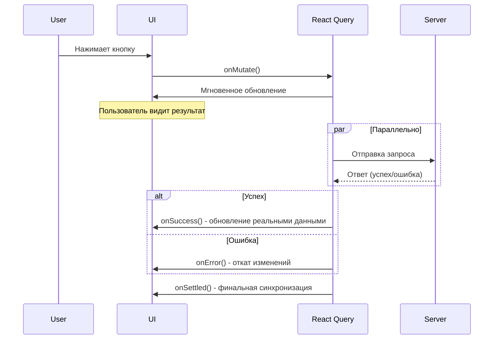

# Урок 5.3: Optimistic Updates и продвинутое кеширование

> **🎯 Цель урока**: Освоить продвинутые техники для создания мгновенно отзывчивого пользовательского интерфейса

## 📖 Введение

### Проблема медленного UX

**Представьте ситуацию:** Вы в Instagram ставите лайк фото. Что происходит?

**❌ Плохой UX (без optimistic updates):**

```
Нажали лайк → Ждете 2 сек → Сердечко загорается
```

**✅ Хороший UX (с optimistic updates):**

```
Нажали лайк → Сердечко загорается мгновенно → Синхронизация в фоне
```

### Что такое Optimistic Updates?

**Optimistic Updates** = предположение, что операция пройдет успешно, и мгновенное обновление UI.

**Принцип работы:**

1. 🚀 **Мгновенно** обновляем UI (как будто операция уже успешна)
2. 📡 **Параллельно** отправляем запрос на сервер
3. ✅ **При успехе** - заменяем временные данные реальными
4. ❌ **При ошибке** - откатываем изменения и показываем ошибку

### Когда использовать?

| ✅ Подходит                | ❌ Не подходит                        |
| -------------------------- | ------------------------------------- |
| Лайки, избранное           | Платежи, переводы денег               |
| Добавление в корзину       | Удаление аккаунта                     |
| Простые обновления профиля | Критические настройки безопасности    |
| Создание комментариев      | Операции с юридическими последствиями |

**Правило:** Используйте для операций с **высокой вероятностью успеха** и **низкими рисками** при ошибке.

---

## 🚀 Этап 1: Основы Optimistic Updates _(15 мин)_

### Сравнение подходов

**Традиционный подход:**

```typescript
// ❌ Медленно: пользователь ждет ответа сервера
function LikeButton({ postId, initialLikes }) {
  const [likes, setLikes] = useState(initialLikes);
  const [isLoading, setIsLoading] = useState(false);

  const handleLike = async () => {
    setIsLoading(true);

    try {
      // Пользователь ждет 2-3 секунды...
      const result = await api.posts.like.mutate({ postId });
      setLikes(result.likes); // Только сейчас обновляем UI
    } catch (error) {
      toast.error('Ошибка');
    } finally {
      setIsLoading(false);
    }
  };

  return (
    <button onClick={handleLike} disabled={isLoading}>
      {isLoading ? '...' : '❤️'} {likes}
    </button>
  );
}
```

**Optimistic подход:**

```typescript
// ✅ Быстро: UI обновляется мгновенно
function LikeButton({ postId, initialLikes }) {
  const queryClient = useQueryClient();

  const likeMutation = useMutation({
    mutationFn: () => api.posts.like.mutate({ postId }),

    // 1. МГНОВЕННОЕ ОБНОВЛЕНИЕ (до отправки запроса)
    onMutate: async () => {
      // Отменяем исходящие запросы
      await queryClient.cancelQueries(['posts', postId]);

      // Сохраняем текущее состояние для отката
      const previousData = queryClient.getQueryData(['posts', postId]);

      // Мгновенно обновляем UI
      queryClient.setQueryData(['posts', postId], (old: any) => ({
        ...old,
        likes: old.likes + 1,
        isLiked: true,
      }));

      return { previousData };
    },

    // 2. ОШИБКА - откатываем изменения
    onError: (error, variables, context) => {
      if (context?.previousData) {
        queryClient.setQueryData(['posts', postId], context.previousData);
      }
      toast.error('Не удалось поставить лайк');
    },

    // 3. ФИНАЛЬНАЯ СИНХРОНИЗАЦИЯ
    onSettled: () => {
      queryClient.invalidateQueries(['posts', postId]);
    },
  });

  return (
    <button onClick={() => likeMutation.mutate()}>
      ❤️ {/* Обновляется мгновенно! */}
    </button>
  );
}
```

### Жизненный цикл Optimistic Update



### Простой пример: Переключение избранного

```typescript
// hooks/useFavoriteToggle.ts
export function useFavoriteToggle(itemId: string) {
  const queryClient = useQueryClient();

  return useMutation({
    mutationFn: (isFavorite: boolean) =>
      api.favorites.toggle.mutate({ itemId, isFavorite }),

    onMutate: async (isFavorite) => {
      // 1. Отменяем исходящие запросы
      await queryClient.cancelQueries(['favorites']);
      await queryClient.cancelQueries(['items', itemId]);

      // 2. Сохраняем текущие данные
      const previousFavorites = queryClient.getQueryData(['favorites']);
      const previousItem = queryClient.getQueryData(['items', itemId]);

      // 3. Мгновенно обновляем UI
      queryClient.setQueryData(['items', itemId], (old: any) => ({
        ...old,
        isFavorite,
      }));

      if (isFavorite) {
        // Добавляем в список избранного
        queryClient.setQueryData(['favorites'], (old: any[]) => [
          ...(old || []),
          { id: itemId, addedAt: new Date() },
        ]);
      } else {
        // Удаляем из списка избранного
        queryClient.setQueryData(['favorites'], (old: any[]) =>
          (old || []).filter(item => item.id !== itemId)
        );
      }

      return { previousFavorites, previousItem };
    },

    onError: (error, variables, context) => {
      // Откатываем все изменения
      if (context?.previousFavorites) {
        queryClient.setQueryData(['favorites'], context.previousFavorites);
      }
      if (context?.previousItem) {
        queryClient.setQueryData(['items', itemId], context.previousItem);
      }
    },

    onSettled: () => {
      // Обновляем данные с сервера
      queryClient.invalidateQueries(['favorites']);
      queryClient.invalidateQueries(['items', itemId]);
    },
  });
}

// Использование в компоненте
function FavoriteButton({ itemId, isFavorite }) {
  const toggleFavorite = useFavoriteToggle(itemId);

  return (
    <button
      onClick={() => toggleFavorite.mutate(!isFavorite)}
      className={isFavorite ? 'text-red-500' : 'text-gray-400'}
    >
      {isFavorite ? '❤️' : '🤍'}
    </button>
  );
}
```

### ✅ Контрольная точка 1

**Проверьте понимание:**

1. **Что происходит в `onMutate`?**
   <details>
   <summary>Показать ответ</summary>

   Выполняется сразу при вызове mutation, до отправки запроса. Здесь делаем optimistic обновление UI.
   </details>

2. **Зачем нужен `cancelQueries`?**
   <details>
   <summary>Показать ответ</summary>

   Чтобы предотвратить перезапись optimistic данных результатами background запросов.
   </details>

3. **Когда НЕ стоит использовать optimistic updates?**
   <details>
   <summary>Показать ответ</summary>

   Для критических операций (платежи, удаление данных) или операций с низкой вероятностью успеха.
   </details>

**Задание:** Создайте optimistic toggle для подписки на уведомления.

---

## 🗄️ Этап 2: Продвинутое кеширование _(20 мин)_

### Стратегии кеширования

**Понимание времени жизни данных:**

| Тип данных            | Частота изменений | staleTime | gcTime  | Пример               |
| --------------------- | ----------------- | --------- | ------- | -------------------- |
| **Статические**       | Редко             | 1 час     | 24 часа | Список стран         |
| **Пользовательские**  | Средне            | 15 мин    | 2 часа  | Профиль пользователя |
| **Динамические**      | Часто             | 30 сек    | 5 мин   | Курсы валют          |
| **Реального времени** | Постоянно         | 0         | 1 мин   | Онлайн статус        |

### Конфигурация для разных типов данных

```typescript
// config/cacheStrategies.ts
export const CACHE_STRATEGIES = {
  // 📊 Курсы валют - часто меняются
  EXCHANGE_RATES: {
    staleTime: 30 * 1000, // 30 сек - считаем свежими
    gcTime: 5 * 60 * 1000, // 5 мин - храним в памяти
    refetchInterval: 30 * 1000, // Обновляем каждые 30 сек
    refetchOnWindowFocus: true, // Обновляем при возврате на вкладку
  },

  // 👤 Профиль пользователя - редко меняется
  USER_PROFILE: {
    staleTime: 15 * 60 * 1000, // 15 мин - считаем свежими
    gcTime: 2 * 60 * 60 * 1000, // 2 часа - храним в памяти
    refetchOnWindowFocus: false, // Не обновляем при фокусе
  },

  // 🏦 Список банков - очень стабильные данные
  BANKS_LIST: {
    staleTime: 60 * 60 * 1000, // 1 час - считаем свежими
    gcTime: 24 * 60 * 60 * 1000, // 24 часа - храним в памяти
    refetchOnWindowFocus: false,
    refetchOnMount: false, // Не обновляем при монтировании
  },

  // 📋 Заказы пользователя - средняя частота
  USER_ORDERS: {
    staleTime: 2 * 60 * 1000, // 2 мин - считаем свежими
    gcTime: 30 * 60 * 1000, // 30 мин - храним в памяти
    refetchInterval: 60 * 1000, // Обновляем каждую минуту
  },
} as const;
```

### Умная инвалидация кеша

```typescript
// utils/cacheUtils.ts
export const cacheUtils = {
  // Инвалидация по паттернам
  invalidateUserData: (queryClient: QueryClient, userId?: string) => {
    const pattern = userId ? ['users', userId] : ['users'];

    return queryClient.invalidateQueries({
      queryKey: pattern,
      // Инвалидируем только если данные старше 1 минуты
      predicate: query => {
        const age = Date.now() - query.state.dataUpdatedAt;
        return age > 60 * 1000;
      },
    });
  },

  // Селективная инвалидация заказов
  invalidateOrdersAfterStatusChange: (
    queryClient: QueryClient,
    orderId: string,
    newStatus: string
  ) => {
    // Инвалидируем список заказов
    queryClient.invalidateQueries(['orders']);

    // Обновляем конкретный заказ
    queryClient.setQueryData(['orders', orderId], (old: any) => ({
      ...old,
      status: newStatus,
      updatedAt: new Date(),
    }));

    // Если заказ завершен - инвалидируем статистику
    if (['completed', 'cancelled'].includes(newStatus)) {
      queryClient.invalidateQueries(['user', 'stats']);
    }
  },

  // Prefetch связанных данных
  prefetchRelatedData: async (queryClient: QueryClient, orderId: string) => {
    // Предзагружаем детали заказа
    await queryClient.prefetchQuery({
      queryKey: ['orders', orderId, 'details'],
      queryFn: () => api.orders.getDetails.query({ orderId }),
      staleTime: 5 * 60 * 1000,
    });

    // Предзагружаем историю статусов
    await queryClient.prefetchQuery({
      queryKey: ['orders', orderId, 'history'],
      queryFn: () => api.orders.getHistory.query({ orderId }),
      staleTime: 10 * 60 * 1000,
    });
  },
};
```

### Условное кеширование

```typescript
// hooks/useConditionalCache.ts
export function useUserOrders(filters?: OrderFilters) {
  const { user } = useAuth();

  return useQuery({
    queryKey: ['orders', 'user', user?.id, filters],
    queryFn: () => api.orders.getUserOrders.query(filters),

    // Кешируем только для авторизованных пользователей
    enabled: !!user,

    // Разные стратегии для разных пользователей
    ...(() => {
      if (user?.role === 'admin') {
        return {
          staleTime: 30 * 1000, // Админы видят свежие данные
          refetchInterval: 30 * 1000,
        };
      }

      return CACHE_STRATEGIES.USER_ORDERS; // Обычные пользователи
    })(),
  });
}

// Кеширование с зависимостями
export function useExchangeCalculation(fromCurrency: string, fromAmount: number) {
  return useQuery({
    queryKey: ['exchange', 'calculate', fromCurrency, fromAmount],
    queryFn: () =>
      api.exchange.calculate.query({
        fromCurrency,
        fromAmount,
        toCurrency: 'UAH',
      }),

    // Включаем только при валидных параметрах
    enabled: !!fromCurrency && fromAmount > 0,

    // Быстрое кеширование для калькулятора
    staleTime: 10 * 1000,
    gcTime: 60 * 1000,

    // Не показываем ошибки (это просто калькулятор)
    retry: false,
    useErrorBoundary: false,
  });
}
```

### Реализация в нашем проекте

#### 1. Хук для создания заявки с оптимистичными обновлениями:

```typescript
// 📁 packages/hooks/src/business/useCreateExchangeOrder.ts
import { useMutation, useQueryClient } from '@tanstack/react-query';
import { api } from '@repo/providers';
import type { CreateExchangeOrderInput, ExchangeOrder } from '@repo/exchange-core';

export function useCreateExchangeOrder() {
  const queryClient = useQueryClient();

  return useMutation({
    mutationFn: async (input: CreateExchangeOrderInput) => {
      return api.exchange.createOrder.mutate(input);
    },

    // ✅ Оптимистичное обновление - выполняется ДО отправки на сервер
    onMutate: async newOrder => {
      // Отменяем текущие запросы для избежания конфликтов
      await queryClient.cancelQueries({ queryKey: ['user', 'orders'] });

      // Сохраняем предыдущие данные для отката
      const previousOrders = queryClient.getQueryData(['user', 'orders']);

      // 🚀 Создаем временную optimistic заявку
      const optimisticOrder: ExchangeOrder = {
        id: `temp-${Date.now()}`, // Временный ID
        email: newOrder.email,
        cryptoAmount: newOrder.cryptoAmount,
        cryptoCurrency: newOrder.cryptoCurrency,
        uahAmount: calculateUahAmount(newOrder.cryptoAmount, newOrder.cryptoCurrency),
        status: 'awaiting_payment', // Оптимистичный статус
        depositAddress: 'Генерируется...', // Временный адрес
        createdAt: new Date(),
        expiresAt: new Date(Date.now() + 30 * 60 * 1000), // +30 минут
        isOptimistic: true, // 🏷️ Помечаем как временную
      };

      // Сразу добавляем в кэш - пользователь видит заявку немедленно!
      queryClient.setQueryData(['user', 'orders'], (old: ExchangeOrder[] = []) => [
        optimisticOrder,
        ...old,
      ]);

      // Возвращаем контекст для отката
      return { previousOrders, optimisticOrder };
    },

    // ✅ Успешное создание - заменяем optimistic данные реальными
    onSuccess: (realOrder, variables, context) => {
      queryClient.setQueryData(['user', 'orders'], (old: ExchangeOrder[] = []) =>
        old.map(order =>
          order.id === context.optimisticOrder.id
            ? { ...realOrder, isOptimistic: false } // Заменяем на реальные данные
            : order
        )
      );

      // Показываем уведомление об успехе
      toast.success('Заявка создана! Проверьте email для подтверждения.');
    },

    // ❌ Ошибка - откатываем optimistic изменения
    onError: (error, variables, context) => {
      // Восстанавливаем предыдущие данные
      if (context?.previousOrders) {
        queryClient.setQueryData(['user', 'orders'], context.previousOrders);
      }

      // Показываем ошибку
      toast.error('Не удалось создать заявку. Попробуйте еще раз.');
    },

    // 🔄 В любом случае - обновляем данные с сервера
    onSettled: () => {
      queryClient.invalidateQueries({ queryKey: ['user', 'orders'] });
    },
  });
}
```

#### 2. Использование в компоненте формы:

```typescript
// 📁 apps/web/src/components/forms/CreateExchangeOrderForm.tsx
import { useCreateExchangeOrder } from '@repo/hooks';
import { createExchangeOrderSchema } from '@repo/utils';

export function CreateExchangeOrderForm() {
  const createOrderMutation = useCreateExchangeOrder();

  const form = useForm({
    resolver: zodResolver(createExchangeOrderSchema),
  });

  const onSubmit = async (data: CreateExchangeOrderInput) => {
    try {
      // ✅ Оптимистичное обновление произойдет автоматически!
      await createOrderMutation.mutateAsync(data);

      // Форма сбрасывается только после успешного создания
      form.reset();
    } catch (error) {
      // Ошибки обрабатываются в хуке
      console.error('Ошибка создания заявки:', error);
    }
  };

  return (
    <Form {...form}>
      <form onSubmit={form.handleSubmit(onSubmit)}>
        <FormField name="email" label="Email">
          <Input {...form.register('email')} />
        </FormField>

        <FormField name="cryptoAmount" label="Количество криптовалюты">
          <Input
            type="number"
            step="0.00000001"
            {...form.register('cryptoAmount', { valueAsNumber: true })}
          />
        </FormField>

        <FormField name="cryptoCurrency" label="Валюта">
          <Select {...form.register('cryptoCurrency')}>
            <SelectItem value="BTC">Bitcoin (BTC)</SelectItem>
            <SelectItem value="ETH">Ethereum (ETH)</SelectItem>
            <SelectItem value="USDT">Tether (USDT)</SelectItem>
          </Select>
        </FormField>

        <Button
          type="submit"
          disabled={createOrderMutation.isPending}
          className="w-full"
        >
          {createOrderMutation.isPending ? (
            <>
              <Loader2 className="mr-2 h-4 w-4 animate-spin" />
              Создание заявки...
            </>
          ) : (
            'Создать заявку'
          )}
        </Button>
      </form>
    </Form>
  );
}
```

#### 3. Отображение списка заявок с optimistic данными:

```typescript
// 📁 apps/web/src/components/exchange/UserOrdersList.tsx
import { useUserOrders } from '@repo/hooks';

export function UserOrdersList() {
  const { data: orders = [], isLoading } = useUserOrders();

  if (isLoading) {
    return <OrdersListSkeleton />;
  }

  return (
    <div className="space-y-4">
      {orders.map((order) => (
        <OrderCard
          key={order.id}
          order={order}
          isOptimistic={order.isOptimistic} // Показываем статус
        />
      ))}
    </div>
  );
}

function OrderCard({ order, isOptimistic }: { order: ExchangeOrder, isOptimistic?: boolean }) {
  return (
    <Card className={cn(
      "p-4 transition-all duration-200",
      isOptimistic && "bg-muted/50 border-dashed" // Визуально отличаем optimistic
    )}>
      <div className="flex items-center justify-between">
        <div>
          <h3 className="font-semibold">
            {order.cryptoAmount} {order.cryptoCurrency}
          </h3>
          <p className="text-sm text-muted-foreground">
            → {order.uahAmount.toLocaleString()} UAH
          </p>
        </div>

        <div className="text-right">
          <OrderStatus
            status={order.status}
            isOptimistic={isOptimistic}
          />
          {isOptimistic && (
            <p className="text-xs text-muted-foreground mt-1">
              Обрабатывается...
            </p>
          )}
        </div>
      </div>

      {order.depositAddress !== 'Генерируется...' && (
        <div className="mt-3 p-2 bg-muted rounded">
          <p className="text-xs text-muted-foreground">Адрес для перевода:</p>
          <code className="text-sm font-mono">{order.depositAddress}</code>
        </div>
      )}
    </Card>
  );
}
```

## 🗄️ Умное кэширование с React Query

### Стратегии кэширования в нашем проекте

#### 1. Различные времена жизни кэша:

```typescript
// 📁 packages/hooks/src/business/useExchangeRates.ts
export function useExchangeRates() {
  return useQuery({
    queryKey: ['exchange', 'rates'],
    queryFn: () => api.exchange.getRates.query(),

    // Курсы валют - кэшируем на 5 минут
    staleTime: 5 * 60 * 1000, // 5 минут
    gcTime: 10 * 60 * 1000, // 10 минут в памяти

    // Обновляем при фокусе окна (важно для курсов!)
    refetchOnWindowFocus: true,
    refetchInterval: 5 * 60 * 1000, // Автообновление каждые 5 минут
  });
}

// 📁 packages/hooks/src/business/useUserProfile.ts
export function useUserProfile() {
  return useQuery({
    queryKey: ['user', 'profile'],
    queryFn: () => api.user.getProfile.query(),

    // Профиль пользователя - кэшируем дольше
    staleTime: 30 * 60 * 1000, // 30 минут
    gcTime: 60 * 60 * 1000, // 1 час в памяти

    // Обновляем только при явном запросе
    refetchOnWindowFocus: false,
  });
}
```

#### 2. Инвалидация связанных кэшей:

```typescript
// 📁 packages/hooks/src/business/useUpdateUserProfile.ts
export function useUpdateUserProfile() {
  const queryClient = useQueryClient();

  return useMutation({
    mutationFn: api.user.updateProfile.mutate,

    onSuccess: updatedProfile => {
      // Обновляем кэш профиля
      queryClient.setQueryData(['user', 'profile'], updatedProfile);

      // Инвалидируем связанные кэши
      queryClient.invalidateQueries({ queryKey: ['user', 'orders'] }); // Заявки могут содержать имя
      queryClient.invalidateQueries({ queryKey: ['user', 'settings'] }); // Настройки связаны с профилем
    },
  });
}
```

#### 3. Фоновое обновление критичных данных:

```typescript
// 📁 packages/hooks/src/business/useOrderStatus.ts
export function useOrderStatus(orderId: string) {
  return useQuery({
    queryKey: ['orders', orderId, 'status'],
    queryFn: () => api.orders.getStatus.query({ orderId }),

    // ⚡ Активное отслеживание статуса заявки
    enabled: !!orderId,
    refetchInterval: (data, query) => {
      // Если заявка завершена - перестаем опрашивать
      if (data?.status === 'completed' || data?.status === 'cancelled') {
        return false;
      }

      // Иначе опрашиваем каждые 30 секунд
      return 30 * 1000;
    },

    // Обновляем при возвращении на вкладку
    refetchOnWindowFocus: true,
  });
}
```

## 📱 Практический пример из проекта

### Сценарий: Создание заявки на обмен BTC → UAH

1. **Пользователь заполняет форму**:
   - Email: `user@example.com`
   - Количество: `0.001 BTC`
   - Получит: `~1,200 UAH` (по текущему курсу)

2. **Нажимает "Создать заявку"**:

   ```typescript
   // ✅ Оптимистичное обновление - заявка появляется в списке СРАЗУ
   const optimisticOrder = {
     id: 'temp-1693847520000',
     status: 'awaiting_payment',
     depositAddress: 'Генерируется...',
     // ... остальные поля
   };
   ```

3. **Фоновый запрос к серверу**:

   ```typescript
   // Параллельно отправляется реальный запрос
   const realOrder = await api.exchange.createOrder.mutate({
     email: 'user@example.com',
     cryptoAmount: 0.001,
     cryptoCurrency: 'BTC',
   });
   ```

4. **Замена optimistic данных реальными**:
   ```typescript
   // Когда сервер отвечает - заменяем временные данные
   const finalOrder = {
     id: 'ord_abc123', // Реальный ID
     status: 'awaiting_payment',
     depositAddress: '1A1zP1eP5QGefi2DMPTfTL5SLmv7DivfNa', // Реальный адрес
     expiresAt: '2023-09-04T15:30:00Z', // Точное время
   };
   ```

### Результат для пользователя:

- **Мгновенная реакция** - заявка появляется сразу
- **Непрерывный UX** - можно продолжать пользоваться интерфейсом
- **Автоматическое обновление** - данные синхронизируются с сервером
- **Откат при ошибке** - если что-то пошло не так, изменения отменяются

## ✅ Проверка знаний

### Вопросы для самоконтроля:

1. **Концептуальные**:
   - Что такое оптимистичные обновления и зачем они нужны?
   - В чем разница между `staleTime` и `gcTime` в React Query?
   - Когда стоит использовать оптимистичные обновления, а когда нет?

2. **Практические**:
   - Как откатить optimistic изменения при ошибке?
   - Какие стратегии кэширования подходят для разных типов данных?
   - Как обновить связанные кэши после изменения данных?

3. **Из проекта**:
   - Найдите в коде проекта примеры оптимистичных обновлений
   - Посмотрите конфигурацию React Query в `packages/providers/`
   - Изучите хуки в `packages/hooks/src/business/`

### 💻 Практическое задание

**Создайте оптимистичное обновление для удаления заявки:**

1. Создайте хук `useDeleteExchangeOrder`
2. Реализуйте оптимистичное удаление из списка
3. Добавьте откат при ошибке
4. Покажите notification при успехе/ошибке

```typescript
// Начальная заготовка:
export function useDeleteExchangeOrder() {
  const queryClient = useQueryClient();

  return useMutation({
    mutationFn: async (orderId: string) => {
      return api.exchange.deleteOrder.mutate({ orderId });
    },

    onMutate: async orderId => {
      // Ваш код оптимистичного удаления
    },

    onError: (error, orderId, context) => {
      // Ваш код отката изменений
    },

    onSuccess: () => {
      // Ваш код при успехе
    },
  });
}
```

## 📚 Дополнительные материалы

### Документация:

- [React Query Optimistic Updates](https://tanstack.com/query/latest/docs/react/guides/optimistic-updates)
- [React Query Caching](https://tanstack.com/query/latest/docs/react/guides/caching)

### В проекте:

- `packages/hooks/src/business/` - бизнес-хуки с оптимистичными обновлениями
- `packages/providers/src/query-client.ts` - конфигурация React Query
- `apps/web/src/components/forms/` - формы с optimistic UX

---

[← Урок 5.2: React Query](./lesson-5.2-react-query-trpc-integration.md) | [Урок 5.4: Практика →](./lesson-5.4-practice-exchange-state.md)

### ✅ Контрольная точка 2

**Проверьте понимание:**

1. **В чем разница между `staleTime` и `gcTime`?**
   <details>
   <summary>Показать ответ</summary>

   `staleTime` - когда данные считаются устаревшими и нужен refetch. `gcTime` - когда удалять данные из памяти.
   </details>

2. **Когда использовать `refetchInterval`?**
   <details>
   <summary>Показать ответ</summary>

   Для данных, которые часто меняются и критичны для пользователя (курсы валют, статусы заказов).
   </details>

3. **Зачем нужна селективная инвалидация?**
   <details>
   <summary>Показать ответ</summary>

   Чтобы обновлять только связанные данные, а не весь кеш, что экономит ресурсы и улучшает производительность.
   </details>

---

## 🔄 Этап 3: Комплексные Optimistic Updates _(25 мин)_

### Создание заказа с множественными обновлениями

```typescript
// hooks/useCreateOrder.ts - Реальный пример из ExchangeGO
export function useCreateOrder() {
  const queryClient = useQueryClient();
  const { user } = useAuth();

  return useMutation({
    mutationFn: async (orderData: CreateOrderInput) => {
      return api.orders.create.mutate(orderData);
    },

    onMutate: async newOrder => {
      // 1. ОТМЕНЯЕМ ИСХОДЯЩИЕ ЗАПРОСЫ
      await queryClient.cancelQueries(['orders']);
      await queryClient.cancelQueries(['user', 'stats']);

      // 2. СОХРАНЯЕМ ТЕКУЩЕЕ СОСТОЯНИЕ
      const previousOrders = queryClient.getQueryData(['orders']);
      const previousStats = queryClient.getQueryData(['user', 'stats']);

      // 3. СОЗДАЕМ OPTIMISTIC ЗАКАЗ
      const optimisticOrder = {
        id: `temp-${Date.now()}`,
        ...newOrder,
        status: 'pending',
        createdAt: new Date().toISOString(),
        user: user ? { id: user.id, email: user.email } : null,
        // Помечаем как временный
        isOptimistic: true,
      };

      // 4. ОБНОВЛЯЕМ СПИСОК ЗАКАЗОВ
      queryClient.setQueryData(['orders'], (old: any) => {
        if (!old) return { data: [optimisticOrder], total: 1 };

        return {
          ...old,
          data: [optimisticOrder, ...old.data],
          total: old.total + 1,
        };
      });

      // 5. ОБНОВЛЯЕМ СТАТИСТИКУ ПОЛЬЗОВАТЕЛЯ
      queryClient.setQueryData(['user', 'stats'], (old: any) => {
        if (!old) return old;

        return {
          ...old,
          totalOrders: old.totalOrders + 1,
          pendingOrders: old.pendingOrders + 1,
        };
      });

      return { previousOrders, previousStats, optimisticOrder };
    },

    onSuccess: (realOrder, variables, context) => {
      // Заменяем optimistic данные реальными
      queryClient.setQueryData(['orders'], (old: any) => {
        if (!old) return old;

        return {
          ...old,
          data: old.data.map((order: any) =>
            order.id === context.optimisticOrder.id ? { ...realOrder, isOptimistic: false } : order
          ),
        };
      });

      // Prefetch деталей заказа
      queryClient.prefetchQuery({
        queryKey: ['orders', realOrder.id],
        queryFn: () => api.orders.getDetails.query({ id: realOrder.id }),
      });

      toast.success(`Заказ ${realOrder.id} создан!`);
    },

    onError: (error, variables, context) => {
      // Откатываем ВСЕ изменения
      if (context?.previousOrders) {
        queryClient.setQueryData(['orders'], context.previousOrders);
      }
      if (context?.previousStats) {
        queryClient.setQueryData(['user', 'stats'], context.previousStats);
      }

      toast.error(`Ошибка создания заказа: ${error.message}`);
    },

    onSettled: () => {
      // Финальная синхронизация
      queryClient.invalidateQueries(['orders']);
      queryClient.invalidateQueries(['user', 'stats']);
    },
  });
}
```

### Компонент с визуальной индикацией optimistic состояния

```typescript
// components/OrderCard.tsx
interface OrderCardProps {
  order: Order;
}

export function OrderCard({ order }: OrderCardProps) {
  const isOptimistic = order.isOptimistic;

  return (
    <Card
      className={cn(
        "transition-all duration-300",
        isOptimistic && [
          "bg-blue-50 border-blue-200 border-dashed",
          "animate-pulse" // Показываем что данные временные
        ]
      )}
    >
      <CardHeader>
        <div className="flex items-center justify-between">
          <CardTitle className="flex items-center gap-2">
            {order.id}
            {isOptimistic && (
              <Badge variant="secondary" className="text-xs">
                Обрабатывается...
              </Badge>
            )}
          </CardTitle>

          <OrderStatus
            status={order.status}
            isOptimistic={isOptimistic}
          />
        </div>
      </CardHeader>

      <CardContent>
        <div className="space-y-2">
          <div className="flex justify-between">
            <span>Сумма:</span>
            <span className="font-mono">
              {order.amount} {order.currency}
            </span>
          </div>

          {isOptimistic ? (
            <div className="text-sm text-muted-foreground">
              ⏳ Подтверждение от сервера...
            </div>
          ) : (
            <div className="text-sm text-muted-foreground">
              Создан: {formatDate(order.createdAt)}
            </div>
          )}
        </div>
      </CardContent>

      {!isOptimistic && (
        <CardFooter>
          <Button variant="outline" size="sm">
            Подробнее
          </Button>
        </CardFooter>
      )}
    </Card>
  );
}

function OrderStatus({ status, isOptimistic }: {
  status: string;
  isOptimistic?: boolean;
}) {
  if (isOptimistic) {
    return (
      <Badge variant="outline" className="animate-pulse">
        <Loader2 className="w-3 h-3 mr-1 animate-spin" />
        Создается...
      </Badge>
    );
  }

  const statusConfig = {
    pending: { label: 'Ожидает', variant: 'secondary' as const },
    processing: { label: 'Обрабатывается', variant: 'default' as const },
    completed: { label: 'Завершен', variant: 'success' as const },
    cancelled: { label: 'Отменен', variant: 'destructive' as const },
  };

  const config = statusConfig[status] || statusConfig.pending;

  return (
    <Badge variant={config.variant}>
      {config.label}
    </Badge>
  );
}
```

### Обновление статуса заказа

```typescript
// hooks/useUpdateOrderStatus.ts
export function useUpdateOrderStatus() {
  const queryClient = useQueryClient();

  return useMutation({
    mutationFn: ({ orderId, status }: { orderId: string; status: string }) =>
      api.orders.updateStatus.mutate({ orderId, status }),

    onMutate: async ({ orderId, status }) => {
      // Отменяем запросы
      await queryClient.cancelQueries(['orders']);
      await queryClient.cancelQueries(['orders', orderId]);

      // Сохраняем состояние
      const previousOrders = queryClient.getQueryData(['orders']);
      const previousOrder = queryClient.getQueryData(['orders', orderId]);

      // Обновляем в списке заказов
      queryClient.setQueryData(['orders'], (old: any) => {
        if (!old) return old;

        return {
          ...old,
          data: old.data.map((order: any) =>
            order.id === orderId ? { ...order, status, updatedAt: new Date().toISOString() } : order
          ),
        };
      });

      // Обновляем детали заказа
      queryClient.setQueryData(['orders', orderId], (old: any) => {
        if (!old) return old;

        return {
          ...old,
          status,
          updatedAt: new Date().toISOString(),
        };
      });

      return { previousOrders, previousOrder };
    },

    onSuccess: (data, { orderId, status }) => {
      // Обновляем реальными данными
      queryClient.setQueryData(['orders', orderId], data);

      // Если статус финальный - обновляем статистику
      if (['completed', 'cancelled'].includes(status)) {
        queryClient.invalidateQueries(['user', 'stats']);
      }

      toast.success(`Статус заказа обновлен: ${status}`);
    },

    onError: (error, { orderId }, context) => {
      // Откатываем изменения
      if (context?.previousOrders) {
        queryClient.setQueryData(['orders'], context.previousOrders);
      }
      if (context?.previousOrder) {
        queryClient.setQueryData(['orders', orderId], context.previousOrder);
      }

      toast.error(`Ошибка обновления статуса: ${error.message}`);
    },

    onSettled: (data, error, { orderId }) => {
      queryClient.invalidateQueries(['orders']);
      queryClient.invalidateQueries(['orders', orderId]);
    },
  });
}
```

---

## ⚠️ Этап 4: Edge Cases и лучшие практики _(15 мин)_

### Race Conditions

**Проблема:** Несколько операций выполняются одновременно и могут конфликтовать.

```typescript
// ❌ Проблема: Race condition
function ProblematicComponent() {
  const updateName = useUpdateName();
  const updateEmail = useUpdateEmail();

  // Если пользователь быстро нажмет обе кнопки,
  // optimistic updates могут перезаписать друг друга
  return (
    <div>
      <button onClick={() => updateName.mutate('New Name')}>
        Обновить имя
      </button>
      <button onClick={() => updateEmail.mutate('new@email.com')}>
        Обновить email
      </button>
    </div>
  );
}

// ✅ Решение: Координация через общий ключ
export function useUpdateProfile() {
  const queryClient = useQueryClient();

  return useMutation({
    mutationFn: (updates: Partial<UserProfile>) =>
      api.user.updateProfile.mutate(updates),

    onMutate: async (updates) => {
      // Используем один ключ для всех обновлений профиля
      await queryClient.cancelQueries(['user', 'profile']);

      const previous = queryClient.getQueryData(['user', 'profile']);

      // Мержим обновления с текущими данными
      queryClient.setQueryData(['user', 'profile'], (old: any) => ({
        ...old,
        ...updates,
        updatedAt: new Date().toISOString(),
      }));

      return { previous };
    },

    // ... остальная логика
  });
}
```

### Обработка конфликтов версий

```typescript
// Optimistic updates с версионированием
export function useVersionedUpdate() {
  const queryClient = useQueryClient();

  return useMutation({
    mutationFn: ({ id, data, version }: { id: string; data: any; version: number }) =>
      api.items.update.mutate({ id, data, version }),

    onMutate: async ({ id, data, version }) => {
      await queryClient.cancelQueries(['items', id]);

      const previous = queryClient.getQueryData(['items', id]);

      // Проверяем версию перед optimistic update
      if (previous && previous.version > version) {
        throw new Error('Данные устарели, обновите страницу');
      }

      queryClient.setQueryData(['items', id], (old: any) => ({
        ...old,
        ...data,
        version: version + 1, // Увеличиваем версию
        updatedAt: new Date().toISOString(),
      }));

      return { previous };
    },

    onError: (error, variables, context) => {
      if (error.message.includes('version conflict')) {
        // Конфликт версий - принудительно обновляем данные
        queryClient.invalidateQueries(['items', variables.id]);
        toast.error('Данные были изменены другим пользователем. Обновляем...');
      } else {
        // Обычная ошибка - откатываем
        if (context?.previous) {
          queryClient.setQueryData(['items', variables.id], context.previous);
        }
      }
    },
  });
}
```

### Лучшие практики

```typescript
// 1. Debounced optimistic updates для частых операций
export function useDebouncedOptimisticUpdate() {
  const queryClient = useQueryClient();
  const [pendingUpdates, setPendingUpdates] = useState<any[]>([]);

  const debouncedUpdate = useMemo(
    () =>
      debounce((updates: any[]) => {
        // Применяем все накопленные обновления разом
        updates.forEach(update => {
          queryClient.setQueryData(update.queryKey, update.data);
        });
        setPendingUpdates([]);
      }, 300),
    [queryClient]
  );

  const addOptimisticUpdate = (queryKey: any[], data: any) => {
    const update = { queryKey, data };
    setPendingUpdates(prev => [...prev, update]);
    debouncedUpdate([...pendingUpdates, update]);
  };

  return { addOptimisticUpdate, pendingUpdates };
}

// 2. Conditional optimistic updates
export function useConditionalOptimistic(condition: boolean) {
  const queryClient = useQueryClient();

  return useMutation({
    mutationFn: api.someAction.mutate,

    onMutate: async variables => {
      // Optimistic update только при выполнении условия
      if (!condition) {
        return null; // Пропускаем optimistic update
      }

      // Обычная логика optimistic update
      await queryClient.cancelQueries(['data']);
      const previous = queryClient.getQueryData(['data']);

      queryClient.setQueryData(['data'], (old: any) => ({
        ...old,
        ...variables,
      }));

      return { previous };
    },

    onError: (error, variables, context) => {
      // Откатываем только если был optimistic update
      if (context?.previous) {
        queryClient.setQueryData(['data'], context.previous);
      }
    },
  });
}

// 3. Batch optimistic updates
export function useBatchOptimistic() {
  const queryClient = useQueryClient();

  return useMutation({
    mutationFn: (items: any[]) => api.batchUpdate.mutate(items),

    onMutate: async items => {
      const rollbacks: Array<() => void> = [];

      // Применяем optimistic updates для каждого элемента
      for (const item of items) {
        await queryClient.cancelQueries(['items', item.id]);

        const previous = queryClient.getQueryData(['items', item.id]);

        queryClient.setQueryData(['items', item.id], (old: any) => ({
          ...old,
          ...item,
        }));

        // Сохраняем функцию отката
        rollbacks.push(() => {
          if (previous) {
            queryClient.setQueryData(['items', item.id], previous);
          }
        });
      }

      return { rollbacks };
    },

    onError: (error, variables, context) => {
      // Откатываем все изменения
      context?.rollbacks.forEach(rollback => rollback());
    },
  });
}
```

### ✅ Контрольная точка 4

**Проверьте понимание:**

1. **Что такое race condition в контексте optimistic updates?**
   <details>
   <summary>Показать ответ</summary>

   Когда несколько optimistic операций выполняются одновременно и могут перезаписать изменения друг друга.
   </details>

2. **Как обрабатывать конфликты версий?**
   <details>
   <summary>Показать ответ</summary>

   Проверять версию данных перед optimistic update и принудительно обновлять при конфликте.
   </details>

3. **Когда использовать debounced optimistic updates?**
   <details>
   <summary>Показать ответ</summary>

   Для частых операций (например, автосохранение при печати), чтобы не создавать слишком много промежуточных состояний.
   </details>

---

## ✅ Финальная проверка знаний

### Комплексные вопросы:

1. **Спроектируйте optimistic update для системы комментариев с вложенностью**
   <details>
   <summary>Показать подход</summary>
   - Добавлять новый комментарий в нужное место дерева
   - Обновлять счетчики комментариев у родительских элементов
   - Обрабатывать откат для всей цепочки изменений
   - Учитывать сортировку и пагинацию
   </details>

2. **Как обеспечить консистентность при offline/online переходах?**
   <details>
   <summary>Показать подход</summary>
   - Сохранять pending операции в localStorage
   - Воспроизводить их при восстановлении соединения
   - Обрабатывать конфликты с серверными данными
   - Показывать статус синхронизации пользователю
   </details>

3. **Оптимизируйте производительность для списка из 1000+ элементов**
   <details>
   <summary>Показать подход</summary>
   - Виртуализация списка
   - Batch updates для множественных изменений
   - Селективная инвалидация только видимых элементов
   - Debounced updates для частых операций
   </details>

### Практическое задание

**Создайте систему "корзины покупок" с optimistic updates:**

1. **Добавление товара** - мгновенное появление в корзине
2. **Изменение количества** - debounced обновление
3. **Удаление товара** - с возможностью отмены (undo)
4. **Синхронизация** - с обработкой конфликтов
5. **Offline support** - сохранение изменений локально

```typescript
// Начальная структура:
interface CartItem {
  id: string;
  productId: string;
  quantity: number;
  price: number;
  isOptimistic?: boolean;
}

export function useCartOperations() {
  // Ваша реализация
}
```

---

## 📚 Заключение

**Что вы изучили:**

- 🚀 **Optimistic Updates** - мгновенная обратная связь для пользователя
- 🗄️ **Продвинутое кеширование** - стратегии для разных типов данных
- 🔄 **Комплексные сценарии** - множественные обновления и координация
- ⚠️ **Edge Cases** - race conditions, конфликты версий, batch операции
- 🎯 **Лучшие практики** - когда использовать и как оптимизировать

**Ключевые принципы:**

1. **UX First** - пользователь не должен ждать сервер для простых операций
2. **Безопасность** - всегда предусматривайте откат при ошибках
3. **Производительность** - используйте правильные стратегии кеширования
4. **Надежность** - обрабатывайте edge cases и конфликты
5. **Мониторинг** - отслеживайте успешность optimistic операций

**Следующие шаги:**

- 🔄 **Real-time Updates** - WebSocket интеграция с React Query
- 📱 **Offline-First** - Progressive Web Apps с локальным кешем
- 🎯 **Advanced Patterns** - Suspense, Streaming, Server Components
- 📊 **Monitoring** - метрики производительности и UX

**Полезные ресурсы:**

- [React Query Optimistic Updates](https://tanstack.com/query/latest/docs/react/guides/optimistic-updates)
- [Caching Best Practices](https://web.dev/cache-api-quick-guide/)
- [UX Patterns for Loading States](https://uxdesign.cc/loading-states-that-work-6b0cd7d48d2a)

---

[← Урок 5.2: React Query + tRPC](./lesson-5.2-react-query-trpc-integration.md) | [Урок 5.4: Практика →](./lesson-5.4-practice-exchange-state.md)
