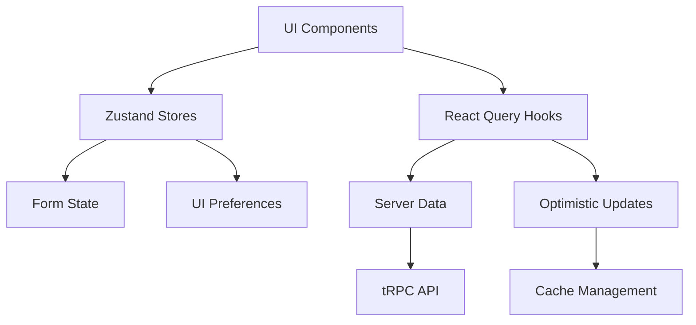

# Урок 5.4: Практика - комплексная система обмена валют

> **🎯 Цель урока**: Создать полнофункциональную систему управления состоянием для обмена валют, интегрируя все изученные техники

## 📖 Введение

### Что мы создаем

В этом уроке мы построим **полноценную систему обмена валют**, объединив все изученные техники:

- 🎨 **Zustand** - UI состояние формы и пользовательских настроек
- 🌐 **React Query + tRPC** - серверные данные и синхронизация
- ⚡ **Optimistic Updates** - мгновенный отклик интерфейса
- 🗄️ **Умное кеширование** - производительность и offline support
- 🛡️ **Error Recovery** - надежность и восстановление после ошибок

### Архитектура системы



**Принцип разделения ответственности:**

| Слой               | Ответственность                        | Технология         |
| ------------------ | -------------------------------------- | ------------------ |
| **UI Layer**       | Отображение и взаимодействие           | React Components   |
| **Client State**   | Форма, настройки, UI состояние         | Zustand            |
| **Server State**   | API данные, кеширование, синхронизация | React Query + tRPC |
| **Business Logic** | Валидация, расчеты, правила            | Custom Hooks       |

### Что мы построим

**Функциональность:**

- 📝 Многошаговая форма создания заявки
- 💱 Калькулятор обмена в реальном времени
- 📋 Список заявок с live обновлениями
- 🔔 Система уведомлений
- 📊 Статистика и аналитика
- 🌐 Offline support

---

## 🏗️ Этап 1: Архитектура состояния _(15 мин)_

### Проектирование stores

**Принцип разделения:**

```typescript
// Структура состояния приложения
interface AppState {
  // UI состояние (Zustand)
  ui: {
    theme: 'light' | 'dark';
    sidebarOpen: boolean;
    activeModal: string | null;
    notifications: Notification[];
  };

  // Состояние формы обмена (Zustand)
  exchangeForm: {
    step: number;
    fromCurrency: string;
    toCurrency: string;
    amount: number;
    contactInfo: ContactInfo;
    paymentDetails: PaymentDetails;
  };

  // Серверное состояние (React Query)
  server: {
    exchangeRates: ExchangeRate[];
    userOrders: Order[];
    banks: Bank[];
    userProfile: UserProfile;
  };
}
```

### Zustand stores для клиентского состояния

```typescript
// stores/exchangeFormStore.ts
import { create } from 'zustand';
import { devtools, persist } from 'zustand/middleware';

interface ExchangeFormState {
  // === СОСТОЯНИЕ ФОРМЫ ===
  currentStep: number;
  formData: {
    fromCurrency: string;
    toCurrency: string;
    fromAmount: number;
    toAmount: number;
    contactEmail: string;
    contactPhone?: string;
    paymentMethod: 'card' | 'bank';
    cardNumber?: string;
    bankAccount?: string;
  };

  // === ВЫЧИСЛЯЕМЫЕ ЗНАЧЕНИЯ ===
  isFormValid: boolean;
  canProceedToNextStep: boolean;

  // === ДЕЙСТВИЯ ===
  updateField: <K extends keyof ExchangeFormState['formData']>(
    field: K,
    value: ExchangeFormState['formData'][K]
  ) => void;

  nextStep: () => void;
  previousStep: () => void;
  goToStep: (step: number) => void;
  resetForm: () => void;

  // === ВАЛИДАЦИЯ ===
  validateStep: (step: number) => boolean;
  getStepErrors: (step: number) => string[];
}

export const useExchangeFormStore = create<ExchangeFormState>()(
  devtools(
    persist(
      (set, get) => ({
        // Начальное состояние
        currentStep: 1,
        formData: {
          fromCurrency: 'BTC',
          toCurrency: 'UAH',
          fromAmount: 0,
          toAmount: 0,
          contactEmail: '',
          paymentMethod: 'card',
        },

        // Вычисляемые значения
        get isFormValid() {
          const { formData, currentStep } = get();
          return get().validateStep(currentStep);
        },

        get canProceedToNextStep() {
          const { currentStep } = get();
          return get().validateStep(currentStep) && currentStep < 4;
        },

        // Действия
        updateField: (field, value) => {
          set(state => ({
            formData: {
              ...state.formData,
              [field]: value,
            },
          }));
        },

        nextStep: () => {
          set(state => {
            if (state.canProceedToNextStep) {
              return { currentStep: state.currentStep + 1 };
            }
            return state;
          });
        },

        previousStep: () => {
          set(state => ({
            currentStep: Math.max(1, state.currentStep - 1),
          }));
        },

        goToStep: step => {
          set({ currentStep: Math.max(1, Math.min(4, step)) });
        },

        resetForm: () => {
          set({
            currentStep: 1,
            formData: {
              fromCurrency: 'BTC',
              toCurrency: 'UAH',
              fromAmount: 0,
              toAmount: 0,
              contactEmail: '',
              paymentMethod: 'card',
            },
          });
        },

        // Валидация
        validateStep: step => {
          const { formData } = get();

          switch (step) {
            case 1: // Выбор валют и суммы
              return !!(formData.fromCurrency && formData.toCurrency && formData.fromAmount > 0);

            case 2: // Контактная информация
              return !!(formData.contactEmail && /\S+@\S+\.\S+/.test(formData.contactEmail));

            case 3: // Платежные данные
              if (formData.paymentMethod === 'card') {
                return !!(formData.cardNumber && formData.cardNumber.length >= 16);
              }
              return !!formData.bankAccount;

            case 4: // Подтверждение
              return get().validateStep(1) && get().validateStep(2) && get().validateStep(3);

            default:
              return false;
          }
        },

        getStepErrors: step => {
          const errors: string[] = [];
          const { formData } = get();

          switch (step) {
            case 1:
              if (!formData.fromCurrency) errors.push('Выберите валюту для обмена');
              if (!formData.toCurrency) errors.push('Выберите валюту получения');
              if (formData.fromAmount <= 0) errors.push('Введите корректную сумму');
              break;

            case 2:
              if (!formData.contactEmail) errors.push('Введите email');
              if (formData.contactEmail && !/\S+@\S+\.\S+/.test(formData.contactEmail)) {
                errors.push('Введите корректный email');
              }
              break;

            case 3:
              if (formData.paymentMethod === 'card' && !formData.cardNumber) {
                errors.push('Введите номер карты');
              }
              if (formData.paymentMethod === 'bank' && !formData.bankAccount) {
                errors.push('Введите номер счета');
              }
              break;
          }

          return errors;
        },
      }),
      {
        name: 'exchange-form-storage',
        // Сохраняем только данные формы, не UI состояние
        partialize: state => ({
          formData: state.formData,
          currentStep: state.currentStep,
        }),
      }
    ),
    { name: 'ExchangeFormStore' }
  )
);
```

### UI Store для глобального состояния

```typescript
// stores/uiStore.ts
import { create } from 'zustand';
import { devtools } from 'zustand/middleware';

interface Notification {
  id: string;
  type: 'success' | 'error' | 'warning' | 'info';
  title: string;
  message: string;
  duration?: number;
}

interface UIState {
  // === ГЛОБАЛЬНОЕ UI СОСТОЯНИЕ ===
  theme: 'light' | 'dark';
  sidebarOpen: boolean;
  activeModal: string | null;
  isLoading: boolean;

  // === УВЕДОМЛЕНИЯ ===
  notifications: Notification[];

  // === ДЕЙСТВИЯ ===
  setTheme: (theme: 'light' | 'dark') => void;
  toggleTheme: () => void;
  toggleSidebar: () => void;
  setSidebarOpen: (open: boolean) => void;
  openModal: (modalId: string) => void;
  closeModal: () => void;
  setLoading: (loading: boolean) => void;

  // === УВЕДОМЛЕНИЯ ===
  addNotification: (notification: Omit<Notification, 'id'>) => void;
  removeNotification: (id: string) => void;
  clearNotifications: () => void;
}

export const useUIStore = create<UIState>()(
  devtools(
    (set, get) => ({
      // Начальное состояние
      theme: 'light',
      sidebarOpen: false,
      activeModal: null,
      isLoading: false,
      notifications: [],

      // Действия
      setTheme: theme => {
        set({ theme });
        // Применяем тему к документу
        document.documentElement.setAttribute('data-theme', theme);
        localStorage.setItem('theme', theme);
      },

      toggleTheme: () => {
        const { theme } = get();
        get().setTheme(theme === 'light' ? 'dark' : 'light');
      },

      toggleSidebar: () => {
        set(state => ({ sidebarOpen: !state.sidebarOpen }));
      },

      setSidebarOpen: open => {
        set({ sidebarOpen: open });
      },

      openModal: modalId => {
        set({ activeModal: modalId });
      },

      closeModal: () => {
        set({ activeModal: null });
      },

      setLoading: loading => {
        set({ isLoading: loading });
      },

      // Уведомления
      addNotification: notification => {
        const id = `notification-${Date.now()}-${Math.random()}`;
        const newNotification = { ...notification, id };

        set(state => ({
          notifications: [...state.notifications, newNotification],
        }));

        // Автоудаление через заданное время
        if (notification.duration !== 0) {
          setTimeout(() => {
            get().removeNotification(id);
          }, notification.duration || 5000);
        }
      },

      removeNotification: id => {
        set(state => ({
          notifications: state.notifications.filter(n => n.id !== id),
        }));
      },

      clearNotifications: () => {
        set({ notifications: [] });
      },
    }),
    { name: 'UIStore' }
  )
);
```

### ✅ Контрольная точка 1

**Проверьте понимание:**

1. **Зачем разделять UI состояние и состояние формы?**
   <details>
   <summary>Показать ответ</summary>

   Для лучшей организации кода, переиспользования и независимого тестирования разных частей состояния.
   </details>

2. **Почему используется `persist` middleware только для формы?**
   <details>
   <summary>Показать ответ</summary>

   Чтобы сохранить прогресс заполнения формы при перезагрузке страницы, но не сохранять временное UI состояние.
   </details>

**Задание:** Добавьте валидацию для минимальной суммы обмена в `validateStep`.

---

## 🌐 Этап 2: Интеграция с серверным состоянием _(20 мин)_

### React Query hooks для API

```typescript
// hooks/useExchangeData.ts
import { useQuery, useMutation, useQueryClient } from '@tanstack/react-query';
import { trpc } from '../lib/trpc';

// Курсы валют с автообновлением
export function useExchangeRates() {
  return useQuery({
    queryKey: ['exchange', 'rates'],
    queryFn: () => trpc.exchange.getRates.query(),

    // Обновляем каждые 30 секунд
    refetchInterval: 30 * 1000,
    staleTime: 10 * 1000,

    // Важные данные - показываем ошибки
    retry: 3,
    retryDelay: attemptIndex => Math.min(1000 * 2 ** attemptIndex, 30000),
  });
}

// Калькулятор обмена в реальном времени
export function useExchangeCalculation(
  fromCurrency: string,
  fromAmount: number,
  toCurrency: string
) {
  return useQuery({
    queryKey: ['exchange', 'calculate', fromCurrency, fromAmount, toCurrency],
    queryFn: async () => {
      if (!fromCurrency || !toCurrency || fromAmount <= 0) {
        return null;
      }

      return trpc.exchange.calculate.query({
        fromCurrency,
        fromAmount,
        toCurrency,
      });
    },

    // Быстрое обновление для калькулятора
    enabled: !!(fromCurrency && toCurrency && fromAmount > 0),
    staleTime: 5 * 1000,
    refetchInterval: 15 * 1000,

    // Не показываем ошибки калькулятора
    retry: false,
    useErrorBoundary: false,
  });
}

// Создание заказа с optimistic updates
export function useCreateOrder() {
  const queryClient = useQueryClient();
  const { addNotification } = useUIStore();

  return useMutation({
    mutationFn: (orderData: CreateOrderInput) => trpc.orders.create.mutate(orderData),

    // Optimistic update
    onMutate: async newOrder => {
      await queryClient.cancelQueries(['orders', 'user']);

      const previousOrders = queryClient.getQueryData(['orders', 'user']);

      // Создаем optimistic заказ
      const optimisticOrder = {
        id: `temp-${Date.now()}`,
        ...newOrder,
        status: 'pending',
        createdAt: new Date().toISOString(),
        isOptimistic: true,
      };

      // Добавляем в список
      queryClient.setQueryData(['orders', 'user'], (old: any) => {
        if (!old) return { data: [optimisticOrder], total: 1 };

        return {
          ...old,
          data: [optimisticOrder, ...old.data],
          total: old.total + 1,
        };
      });

      return { previousOrders, optimisticOrder };
    },

    onSuccess: (realOrder, variables, context) => {
      // Заменяем optimistic данные реальными
      queryClient.setQueryData(['orders', 'user'], (old: any) => {
        if (!old) return old;

        return {
          ...old,
          data: old.data.map((order: any) =>
            order.id === context.optimisticOrder.id ? { ...realOrder, isOptimistic: false } : order
          ),
        };
      });

      addNotification({
        type: 'success',
        title: 'Заказ создан!',
        message: `Заказ ${realOrder.id} успешно создан`,
      });
    },

    onError: (error, variables, context) => {
      // Откатываем optimistic update
      if (context?.previousOrders) {
        queryClient.setQueryData(['orders', 'user'], context.previousOrders);
      }

      addNotification({
        type: 'error',
        title: 'Ошибка создания заказа',
        message: error.message || 'Попробуйте еще раз',
      });
    },

    onSettled: () => {
      queryClient.invalidateQueries(['orders', 'user']);
    },
  });
}
```

### Интеграция Zustand с React Query

```typescript
// hooks/useExchangeIntegration.ts
import { useEffect } from 'react';
import { useExchangeFormStore } from '../stores/exchangeFormStore';
import { useExchangeCalculation } from './useExchangeData';

/**
 * Интеграция состояния формы с серверными данными
 */
export function useExchangeIntegration() {
  const { formData, updateField } = useExchangeFormStore();

  // Автоматический расчет при изменении суммы или валют
  const { data: calculation, isLoading: isCalculating } = useExchangeCalculation(
    formData.fromCurrency,
    formData.fromAmount,
    formData.toCurrency
  );

  // Обновляем toAmount при получении расчета
  useEffect(() => {
    if (calculation?.toAmount && calculation.toAmount !== formData.toAmount) {
      updateField('toAmount', calculation.toAmount);
    }
  }, [calculation?.toAmount, formData.toAmount, updateField]);

  return {
    calculation,
    isCalculating,
    rate: calculation?.rate,
    commission: calculation?.commission,
  };
}

// Синхронизация с localStorage
export function useFormPersistence() {
  const { formData, updateField } = useExchangeFormStore();

  // Загружаем сохраненные данные при инициализации
  useEffect(() => {
    const savedData = localStorage.getItem('exchange-form-draft');
    if (savedData) {
      try {
        const parsed = JSON.parse(savedData);
        Object.entries(parsed).forEach(([key, value]) => {
          updateField(key as any, value);
        });
      } catch (error) {
        console.error('Failed to load saved form data:', error);
      }
    }
  }, [updateField]);

  // Сохраняем изменения с debounce
  useEffect(() => {
    const timeoutId = setTimeout(() => {
      localStorage.setItem('exchange-form-draft', JSON.stringify(formData));
    }, 1000);

    return () => clearTimeout(timeoutId);
  }, [formData]);
}
```

## 🚀 Optimistic Updates паттерны

### Базовый паттерн для списков

```typescript
// packages/hooks/src/api/optimistic-list.ts
import { useMutation, useQueryClient } from '@tanstack/react-query';
import type { UserOrder, CreateOrderRequest } from '@repo/exchange-core';

import { queryKeys } from '../queries';
import { trpc } from '../lib/trpc';

/**
 * Optimistic паттерн для добавления заказа
 *
 * Этапы:
 * 1. Мгновенно добавляем в UI
 * 2. Отправляем на сервер
 * 3. При успехе - обновляем с реальными данными
 * 4. При ошибке - откатываем изменения
 */

export function useOptimisticCreateOrder() {
  const queryClient = useQueryClient();

  return useMutation({
    mutationFn: async (orderData: CreateOrderRequest) => {
      // Симуляция медленного API для демонстрации
      await new Promise(resolve => setTimeout(resolve, 2000));
      return trpc.orders.create.mutate(orderData);
    },

    // Optimistic update
    onMutate: async newOrderData => {
      // 1. Отменяем все исходящие queries для предотвращения race conditions
      await queryClient.cancelQueries({
        queryKey: queryKeys.userOrders(),
      });

      // 2. Сохраняем предыдущее состояние для rollback
      const previousOrders = queryClient.getQueryData(queryKeys.userOrders());

      // 3. Создаем временный optimistic объект
      const optimisticOrder: UserOrder = {
        id: `temp-${Date.now()}`, // Временный ID
        ...newOrderData,
        status: 'PENDING',
        createdAt: new Date().toISOString(),
        updatedAt: new Date().toISOString(),
        // Отмечаем как optimistic для UI индикации
        _optimistic: true,
      };

      // 4. Мгновенно обновляем UI
      queryClient.setQueryData(queryKeys.userOrders(), (old: any) => {
        if (!old) {
          return {
            data: [optimisticOrder],
            total: 1,
            hasMore: false,
          };
        }

        return {
          ...old,
          data: [optimisticOrder, ...old.data],
          total: old.total + 1,
        };
      });

      // 5. Возвращаем context для rollback
      return {
        previousOrders,
        optimisticOrder,
        timestamp: Date.now(),
      };
    },

    // Успешное выполнение
    onSuccess: (realOrderData, variables, context) => {
      // Заменяем optimistic данные на реальные
      queryClient.setQueryData(queryKeys.userOrders(), (old: any) => {
        if (!old) return old;

        return {
          ...old,
          data: old.data.map((order: UserOrder & { _optimistic?: boolean }) =>
            order._optimistic && order.id === context?.optimisticOrder.id
              ? { ...realOrderData, _optimistic: false }
              : order
          ),
        };
      });

      // Prefetch связанных данных
      queryClient.prefetchQuery({
        queryKey: queryKeys.orderDetails(realOrderData.id),
        queryFn: () => trpc.orders.getDetails.query({ id: realOrderData.id }),
      });
    },

    // Обработка ошибок с rollback
    onError: (error, variables, context) => {
      // Откатываем к предыдущему состоянию
      if (context?.previousOrders) {
        queryClient.setQueryData(queryKeys.userOrders(), context.previousOrders);
      }

      // Дополнительно можем показать toast с ошибкой
      console.error('Optimistic update failed:', error);
    },

    // Финальная очистка
    onSettled: (data, error, variables, context) => {
      // Всегда инвалидируем queries для получения актуальных данных
      queryClient.invalidateQueries({
        queryKey: queryKeys.userOrders(),
      });

      // Можем логировать метрики производительности
      if (context?.timestamp) {
        const duration = Date.now() - context.timestamp;
        console.log(`Optimistic update completed in ${duration}ms`);
      }
    },
  });
}
```

### Optimistic Updates для статусов

```typescript
// packages/hooks/src/api/optimistic-status.ts
import { useMutation, useQueryClient } from '@tanstack/react-query';
import type { OrderStatus, UserOrder } from '@repo/exchange-core';

import { queryKeys } from '../queries';
import { trpc } from '../lib/trpc';

/**
 * Optimistic обновление статуса заказа
 *
 * Применяется к:
 * - Списку заказов пользователя
 * - Деталям конкретного заказа
 * - Статистике пользователя
 */

export function useOptimisticOrderStatus() {
  const queryClient = useQueryClient();

  return useMutation({
    mutationFn: async ({ orderId, status }: { orderId: string; status: OrderStatus }) => {
      return trpc.orders.updateStatus.mutate({ orderId, status });
    },

    onMutate: async ({ orderId, status }) => {
      // Отменяем исходящие queries
      await Promise.all([
        queryClient.cancelQueries({ queryKey: queryKeys.userOrders() }),
        queryClient.cancelQueries({ queryKey: queryKeys.orderDetails(orderId) }),
        queryClient.cancelQueries({ queryKey: queryKeys.userStats() }),
      ]);

      // Сохраняем предыдущие состояния
      const previousUserOrders = queryClient.getQueryData(queryKeys.userOrders());
      const previousOrderDetails = queryClient.getQueryData(queryKeys.orderDetails(orderId));
      const previousUserStats = queryClient.getQueryData(queryKeys.userStats());

      // Создаем updater function для статуса
      const updateOrderStatus = (order: UserOrder) => ({
        ...order,
        status,
        updatedAt: new Date().toISOString(),
        _optimisticUpdate: true, // Флаг для UI индикации
      });

      // 1. Обновляем список заказов
      queryClient.setQueryData(queryKeys.userOrders(), (old: any) => {
        if (!old) return old;

        return {
          ...old,
          data: old.data.map((order: UserOrder) =>
            order.id === orderId ? updateOrderStatus(order) : order
          ),
        };
      });

      // 2. Обновляем детали заказа
      queryClient.setQueryData(queryKeys.orderDetails(orderId), (old: any) => {
        if (!old) return old;
        return updateOrderStatus(old);
      });

      // 3. Обновляем статистику (если необходимо)
      queryClient.setQueryData(queryKeys.userStats(), (old: any) => {
        if (!old) return old;

        // Пример: пересчитываем количество заказов по статусам
        const statusCounts = { ...old.statusCounts };

        // Находим предыдущий статус заказа
        const orderDetails = previousOrderDetails as UserOrder;
        if (orderDetails) {
          statusCounts[orderDetails.status] = Math.max(0, statusCounts[orderDetails.status] - 1);
          statusCounts[status] = (statusCounts[status] || 0) + 1;
        }

        return {
          ...old,
          statusCounts,
          _optimisticUpdate: true,
        };
      });

      return {
        previousUserOrders,
        previousOrderDetails,
        previousUserStats,
        orderId,
        status,
      };
    },

    onSuccess: (data, variables, context) => {
      // Заменяем optimistic данные на реальные
      const { orderId } = variables;

      // Обновляем с реальными данными с сервера
      queryClient.setQueryData(queryKeys.orderDetails(orderId), data);

      // Мягко инвалидируем списки для получения актуальных данных
      queryClient.invalidateQueries({
        queryKey: queryKeys.userOrders(),
        refetchType: 'none', // Не рефетчим, если данные свежие
      });
    },

    onError: (error, variables, context) => {
      // Откатываем все изменения
      if (context) {
        const { orderId, previousUserOrders, previousOrderDetails, previousUserStats } = context;

        if (previousUserOrders) {
          queryClient.setQueryData(queryKeys.userOrders(), previousUserOrders);
        }

        if (previousOrderDetails) {
          queryClient.setQueryData(queryKeys.orderDetails(orderId), previousOrderDetails);
        }

        if (previousUserStats) {
          queryClient.setQueryData(queryKeys.userStats(), previousUserStats);
        }
      }
    },

    onSettled: () => {
      // Инвалидируем все связанные queries
      queryClient.invalidateQueries({
        queryKey: queryKeys.userOrders(),
      });
      queryClient.invalidateQueries({
        queryKey: queryKeys.userStats(),
      });
    },
  });
}
```

### Массовые Optimistic Updates

```typescript
// packages/hooks/src/api/optimistic-bulk.ts
import { useMutation, useQueryClient } from '@tanstack/react-query';

/**
 * Optimistic обновления для массовых операций
 *
 * Примеры:
 * - Массовое удаление заказов
 * - Групповое изменение статусов
 * - Batch операции
 */

export function useOptimisticBulkDelete() {
  const queryClient = useQueryClient();

  return useMutation({
    mutationFn: async (orderIds: string[]) => {
      return trpc.orders.bulkDelete.mutate({ orderIds });
    },

    onMutate: async orderIds => {
      await queryClient.cancelQueries({ queryKey: queryKeys.userOrders() });

      const previousOrders = queryClient.getQueryData(queryKeys.userOrders());

      // Optimistically удаляем заказы
      queryClient.setQueryData(queryKeys.userOrders(), (old: any) => {
        if (!old) return old;

        const remainingOrders = old.data.filter((order: UserOrder) => !orderIds.includes(order.id));

        return {
          ...old,
          data: remainingOrders,
          total: old.total - orderIds.length,
        };
      });

      return { previousOrders, orderIds };
    },

    onError: (error, variables, context) => {
      if (context?.previousOrders) {
        queryClient.setQueryData(queryKeys.userOrders(), context.previousOrders);
      }
    },

    onSettled: () => {
      queryClient.invalidateQueries({ queryKey: queryKeys.userOrders() });
    },
  });
}
```

## 💾 Продвинутые стратегии кеширования

### Иерархическое кеширование

```typescript
// packages/hooks/src/caching/hierarchical-cache.ts
import { QueryClient } from '@tanstack/react-query';

/**
 * Иерархическая система кеширования
 *
 * Структура:
 * - Level 1: Критические данные (курсы валют) - 30сек
 * - Level 2: Пользовательские данные - 5мин
 * - Level 3: Справочники (банки) - 1час
 * - Level 4: Статические данные - 24часа
 */

export const CACHE_LEVELS = {
  CRITICAL: {
    staleTime: 30 * 1000,           // 30 секунд
    gcTime: 5 * 60 * 1000,          // 5 минут
    refetchInterval: 30 * 1000,      // Каждые 30 секунд
  },

  USER_DATA: {
    staleTime: 5 * 60 * 1000,       // 5 минут
    gcTime: 30 * 60 * 1000,         // 30 минут
    refetchInterval: 2 * 60 * 1000,  // Каждые 2 минуты
  },

  REFERENCE: {
    staleTime: 60 * 60 * 1000,      // 1 час
    gcTime: 24 * 60 * 60 * 1000,    // 24 часа
    refetchInterval: false,          // Не автообновляем
  },

  STATIC: {
    staleTime: 24 * 60 * 60 * 1000, // 24 часа
    gcTime: 7 * 24 * 60 * 60 * 1000, // 7 дней
    refetchInterval: false,
  },
} as const;

/**
 * Адаптивный cache manager
 */
export class AdaptiveCacheManager {
  private queryClient: QueryClient;
  private networkQuality: 'slow' | 'fast' | 'offline' = 'fast';

  constructor(queryClient: QueryClient) {
    this.queryClient = queryClient;
    this.setupNetworkDetection();
  }

  // Определение качества сети
  private setupNetworkDetection() {
    if (typeof navigator !== 'undefined' && 'connection' in navigator) {
      const connection = (navigator as any).connection;

      const updateNetworkQuality = () => {
        if (connection.effectiveType === '4g') {
          this.networkQuality = 'fast';
        } else if (connection.effectiveType === '3g') {
          this.networkQuality = 'slow';
        } else {
          this.networkQuality = 'slow';
        }
      };

      connection.addEventListener('change', updateNetworkQuality);
      updateNetworkQuality();
    }

    // Отслеживание offline статуса
    window.addEventListener('online', () => {
      this.networkQuality = 'fast';
      this.invalidateStaleQueries();
    });

    window.addEventListener('offline', () => {
      this.networkQuality = 'offline';
    });
  }

  // Получение опций кеширования с учетом сети
  getCacheOptions(level: keyof typeof CACHE_LEVELS) {
    const baseOptions = CACHE_LEVELS[level];

    if (this.networkQuality === 'slow') {
      return {
        ...baseOptions,
        staleTime: baseOptions.staleTime * 2, // Увеличиваем staleTime
        refetchInterval: baseOptions.refetchInterval ?
          (baseOptions.refetchInterval as number) * 2 : false,
      };
    }

    if (this.networkQuality === 'offline') {
      return {
        ...baseOptions,
        staleTime: Infinity, // Никогда не считаем устаревшими
        refetchInterval: false,
      };
    }

    return baseOptions;
  }

  // Инвалидация устаревших данных при восстановлении сети
  private invalidateStaleQueries() {
    this.queryClient.invalidateQueries({
      predicate: (query) => {
        return query.state.dataUpdatedAt < Date.now() - 60 * 1000; // Старше 1 минуты
      },
    });
  }

  // Умная предзагрузка
  async smartPrefetch() {
    const essentialQueries = [
      { queryKey: queryKeys.exchangeRates(), level: 'CRITICAL' as const },
      { queryKey: queryKeys.banksList(), level: 'REFERENCE' as const },
    ];

    const prefetchPromises = essentialQueries.map(({ queryKey, level }) => {
      const options = this.getCacheOptions(level);

      return this.queryClient.prefetchQuery({
        queryKey,
        queryFn: () => this.getQueryFn(queryKey),
        ...options,
      });
    });

    await Promise.allSettled(prefetchPromises);
  }

  private getQueryFn(queryKey: any[]) {
    // Маппинг query keys к функциям
    const [, domain, ...params] = queryKey;

    switch (domain) {
      case 'exchange':
        return trpc.exchange.getRates.query();
      case 'banks':
        return trpc.banks.getList.query();
      default:
        throw new Error(`Unknown query domain: ${domain}`);
    }
  }
}

// Использование в приложении
// app/providers/QueryProvider.tsx
export function QueryProvider({ children }: { children: React.ReactNode }) {
  const [queryClient] = useState(() => {
    const client = createQueryClient();
    const cacheManager = new AdaptiveCacheManager(client);

    // Глобально доступный cache manager
    (window as any).__cacheManager = cacheManager;

    return client;
  });

  return (
    <QueryClientProvider client={queryClient}>
      {children}
    </QueryClientProvider>
  );
}
```

### Стратегии инвалидации кеша

```typescript
// packages/hooks/src/caching/invalidation-strategies.ts
import { QueryClient } from '@tanstack/react-query';
import { queryKeys } from '../queries';

/**
 * Стратегии инвалидации кеша
 */

export class CacheInvalidationManager {
  constructor(private queryClient: QueryClient) {}

  // Умная инвалидация при создании заказа
  async onOrderCreated(orderData: any) {
    // 1. Инвалидируем список заказов пользователя
    await this.queryClient.invalidateQueries({
      queryKey: queryKeys.userOrders(),
    });

    // 2. Инвалидируем статистику пользователя
    await this.queryClient.invalidateQueries({
      queryKey: queryKeys.userStats(),
    });

    // 3. Если заказ влияет на курсы, инвалидируем их
    if (this.shouldInvalidateRates(orderData)) {
      await this.queryClient.invalidateQueries({
        queryKey: queryKeys.exchangeRates(),
      });
    }

    // 4. Prefetch деталей созданного заказа
    this.queryClient.prefetchQuery({
      queryKey: queryKeys.orderDetails(orderData.id),
      queryFn: () => trpc.orders.getDetails.query({ id: orderData.id }),
    });
  }

  // Cascade инвалидация при изменении профиля
  async onProfileUpdated(profileData: any) {
    // Инвалидируем все пользовательские данные
    await this.queryClient.invalidateQueries({
      predicate: query => {
        const [domain] = query.queryKey;
        return domain === 'user';
      },
    });

    // Если изменились лимиты, инвалидируем связанные данные
    if (profileData.limitsChanged) {
      await this.queryClient.invalidateQueries({
        queryKey: queryKeys.exchangeLimits(),
      });
    }
  }

  // Time-based инвалидация
  setupTimeBasedInvalidation() {
    // Каждые 5 минут проверяем устаревшие данные
    setInterval(
      () => {
        this.invalidateStaleData();
      },
      5 * 60 * 1000
    );

    // Каждый час очищаем редко используемые данные
    setInterval(
      () => {
        this.garbageCollectUnusedData();
      },
      60 * 60 * 1000
    );
  }

  private invalidateStaleData() {
    const fiveMinutesAgo = Date.now() - 5 * 60 * 1000;

    this.queryClient.invalidateQueries({
      predicate: query => {
        // Инвалидируем критические данные старше 5 минут
        const isCritical = query.queryKey.includes('rates') || query.queryKey.includes('limits');

        return isCritical && query.state.dataUpdatedAt < fiveMinutesAgo;
      },
    });
  }

  private garbageCollectUnusedData() {
    const oneHourAgo = Date.now() - 60 * 60 * 1000;

    this.queryClient.removeQueries({
      predicate: query => {
        // Удаляем неиспользуемые данные старше часа
        return query.state.dataUpdatedAt < oneHourAgo && query.getObserversCount() === 0;
      },
    });
  }

  private shouldInvalidateRates(orderData: any): boolean {
    // Большие заказы могут влиять на курсы
    return orderData.amount > 10000 || orderData.isLargeOrder;
  }
}
```

### Background Sync

```typescript
// packages/hooks/src/caching/background-sync.ts
import { QueryClient } from '@tanstack/react-query';

/**
 * Background синхронизация для offline experience
 */

export class BackgroundSyncManager {
  private syncQueue: Array<{
    id: string;
    action: () => Promise<any>;
    priority: 'high' | 'medium' | 'low';
    timestamp: number;
  }> = [];

  private isOnline = navigator.onLine;
  private syncInterval: NodeJS.Timeout | null = null;

  constructor(private queryClient: QueryClient) {
    this.setupEventListeners();
    this.startBackgroundSync();
  }

  private setupEventListeners() {
    window.addEventListener('online', () => {
      this.isOnline = true;
      this.processSyncQueue();
    });

    window.addEventListener('offline', () => {
      this.isOnline = false;
    });

    // Sync при возвращении в таб
    document.addEventListener('visibilitychange', () => {
      if (!document.hidden && this.isOnline) {
        this.syncCriticalData();
      }
    });
  }

  // Добавление операции в очередь синхронизации
  queueSync(
    id: string,
    action: () => Promise<any>,
    priority: 'high' | 'medium' | 'low' = 'medium'
  ) {
    this.syncQueue.push({
      id,
      action,
      priority,
      timestamp: Date.now(),
    });

    // Если онлайн и высокий приоритет - выполняем сразу
    if (this.isOnline && priority === 'high') {
      this.processSyncQueue();
    }
  }

  // Обработка очереди синхронизации
  private async processSyncQueue() {
    if (!this.isOnline || this.syncQueue.length === 0) return;

    // Сортируем по приоритету
    this.syncQueue.sort((a, b) => {
      const priorityOrder = { high: 3, medium: 2, low: 1 };
      return priorityOrder[b.priority] - priorityOrder[a.priority];
    });

    const batch = this.syncQueue.splice(0, 5); // Обрабатываем по 5 за раз

    const results = await Promise.allSettled(batch.map(item => item.action()));

    // Логируем результаты
    results.forEach((result, index) => {
      if (result.status === 'rejected') {
        console.error(`Sync failed for ${batch[index].id}:`, result.reason);

        // Возвращаем обратно в очередь с пониженным приоритетом
        this.syncQueue.push({
          ...batch[index],
          priority: 'low',
          timestamp: Date.now(),
        });
      }
    });

    // Если есть еще элементы, продолжаем
    if (this.syncQueue.length > 0) {
      setTimeout(() => this.processSyncQueue(), 1000);
    }
  }

  // Синхронизация критически важных данных
  private async syncCriticalData() {
    const criticalQueries = [queryKeys.exchangeRates(), queryKeys.userOrders()];

    await Promise.allSettled(
      criticalQueries.map(queryKey => this.queryClient.invalidateQueries({ queryKey }))
    );
  }

  // Запуск фоновой синхронизации
  private startBackgroundSync() {
    this.syncInterval = setInterval(() => {
      if (this.isOnline) {
        this.processSyncQueue();
      }
    }, 30 * 1000); // Каждые 30 секунд
  }

  // Остановка синхронизации
  destroy() {
    if (this.syncInterval) {
      clearInterval(this.syncInterval);
    }
  }
}
```

## 🎯 Практические примеры использования

### Компонент с Optimistic Updates

```typescript
// src/components/orders/OrderStatusButton.tsx
import { useOptimisticOrderStatus } from '@repo/hooks';
import type { OrderStatus, UserOrder } from '@repo/exchange-core';

interface OrderStatusButtonProps {
  order: UserOrder;
  newStatus: OrderStatus;
  children: React.ReactNode;
}

export function OrderStatusButton({ order, newStatus, children }: OrderStatusButtonProps) {
  const updateStatus = useOptimisticOrderStatus();

  const handleClick = () => {
    updateStatus.mutate({
      orderId: order.id,
      status: newStatus,
    });
  };

  const isOptimistic = (order as any)._optimisticUpdate;

  return (
    <button
      onClick={handleClick}
      disabled={updateStatus.isPending}
      className={`
        status-button
        ${isOptimistic ? 'optimistic' : ''}
        ${updateStatus.isPending ? 'loading' : ''}
      `}
    >
      {updateStatus.isPending ? (
        <div className="loading-spinner" />
      ) : (
        children
      )}

      {/* Индикатор optimistic состояния */}
      {isOptimistic && (
        <div className="optimistic-indicator" title="Обновление...">
          ⏳
        </div>
      )}
    </button>
  );
}

// src/components/orders/OrdersList.tsx
import { useUserOrders, useOptimisticCreateOrder } from '@repo/hooks';

export function OrdersList() {
  const { data: ordersData, isLoading } = useUserOrders();
  const createOrder = useOptimisticCreateOrder();

  if (isLoading) {
    return <OrdersListSkeleton />;
  }

  return (
    <div className="orders-list">
      {ordersData?.data.map(order => {
        const isOptimistic = (order as any)._optimistic;

        return (
          <div
            key={order.id}
            className={`order-item ${isOptimistic ? 'optimistic' : ''}`}
          >
            <div className="order-header">
              <span className="order-id">
                {isOptimistic ? 'Создается...' : order.id}
              </span>

              {isOptimistic && (
                <div className="optimistic-badge">
                  Обрабатывается
                </div>
              )}
            </div>

            <div className="order-details">
              <span>{order.fromAmount} {order.fromCurrency}</span>
              <span>→</span>
              <span>{order.toAmount} UAH</span>
            </div>

            <OrderStatusButton
              order={order}
              newStatus="CONFIRMED"
            >
              Подтвердить
            </OrderStatusButton>
          </div>
        );
      })}
    </div>
  );
}
```

### Индикаторы состояния кеша

```typescript
// src/components/ui/CacheStatus.tsx
import { useQuery } from '@tanstack/react-query';
import { queryKeys } from '@repo/hooks';

export function CacheStatus() {
  const { dataUpdatedAt, isFetching, isStale } = useQuery({
    queryKey: queryKeys.exchangeRates(),
    enabled: false, // Не выполняем запрос, только отслеживаем состояние
  });

  const formatLastUpdate = (timestamp?: number) => {
    if (!timestamp) return 'Никогда';

    const diff = Date.now() - timestamp;
    const minutes = Math.floor(diff / 60000);

    if (minutes === 0) return 'Только что';
    if (minutes === 1) return '1 минуту назад';
    return `${minutes} минут назад`;
  };

  return (
    <div className="cache-status">
      <div className={`status-indicator ${isStale ? 'stale' : 'fresh'}`}>
        {isFetching ? '🔄' : isStale ? '⚠️' : '✅'}
      </div>

      <span className="last-update">
        Обновлено: {formatLastUpdate(dataUpdatedAt)}
      </span>

      {isFetching && (
        <span className="fetching-indicator">
          Обновление...
        </span>
      )}
    </div>
  );
}
```

## ✅ Проверка знаний

### Вопросы для самоконтроля:

1. **Что такое Optimistic Updates и когда их применять?**
   - Мгновенное обновление UI до ответа сервера для улучшения UX

2. **Как правильно откатывать Optimistic Updates при ошибке?**
   - Сохранять предыдущее состояние в onMutate и восстанавливать в onError

3. **Чем отличается staleTime от gcTime?**
   - staleTime - когда считать данные устаревшими, gcTime - когда удалить из памяти

4. **Какие стратегии кеширования подходят для разных типов данных?**
   - Критические данные - короткий cache, справочники - длинный cache

### Практические задания:

1. **Реализуйте optimistic update** для добавления в избранное
2. **Создайте систему background sync** для offline режима
3. **Настройте adaptive caching** в зависимости от скорости интернета
4. **Добавьте metrics** для отслеживания производительности кеша

## 📚 Дополнительные материалы

### Углубленное изучение:

- [Optimistic Updates Guide](https://tanstack.com/query/latest/docs/react/guides/optimistic-updates)
- [Caching Strategies](https://tanstack.com/query/latest/docs/react/guides/caching)
- [Background Fetching](https://tanstack.com/query/latest/docs/react/guides/background-fetching-indicators)

### Паттерны и практики:

- Race condition prevention
- Error recovery strategies
- Performance monitoring
- Cache invalidation patterns

---

[← Урок 5.2](./lesson-5.2-react-query-trpc-integration.md) | [Урок 5.4 →](./lesson-5.4-practice-exchange-state.md)

### ✅ Контрольная точка 2

**Проверьте понимание:**

1. **Зачем нужна интеграция Zustand с React Query?**
   <details>
   <summary>Показать ответ</summary>

   Для автоматического обновления формы при получении данных с сервера (например, расчет суммы обмена).
   </details>

2. **Что такое optimistic order в `useCreateOrder`?**
   <details>
   <summary>Показать ответ</summary>

   Временный заказ, который мгновенно показывается в UI до получения реального ответа от сервера.
   </details>

---

## 🎨 Этап 3: Компоненты и UI интеграция _(25 мин)_

### Многошаговая форма обмена

```typescript
// components/ExchangeForm/ExchangeForm.tsx
import React from 'react';
import { useExchangeFormStore } from '../../stores/exchangeFormStore';
import { useExchangeIntegration } from '../../hooks/useExchangeIntegration';
import { useCreateOrder } from '../../hooks/useExchangeData';

import { StepIndicator } from './StepIndicator';
import { CurrencyStep } from './steps/CurrencyStep';
import { ContactStep } from './steps/ContactStep';
import { PaymentStep } from './steps/PaymentStep';
import { ConfirmationStep } from './steps/ConfirmationStep';

export function ExchangeForm() {
  const {
    currentStep,
    formData,
    isFormValid,
    canProceedToNextStep,
    nextStep,
    previousStep,
    resetForm,
    getStepErrors,
  } = useExchangeFormStore();

  const { calculation, isCalculating } = useExchangeIntegration();
  const createOrder = useCreateOrder();

  const handleSubmit = async () => {
    if (currentStep === 4 && isFormValid) {
      try {
        await createOrder.mutateAsync({
          fromCurrency: formData.fromCurrency,
          toCurrency: formData.toCurrency,
          fromAmount: formData.fromAmount,
          contactEmail: formData.contactEmail,
          contactPhone: formData.contactPhone,
          paymentMethod: formData.paymentMethod,
          cardNumber: formData.cardNumber,
          bankAccount: formData.bankAccount,
        });

        // Сбрасываем форму после успешного создания
        resetForm();
      } catch (error) {
        // Ошибка обрабатывается в хуке
      }
    } else {
      nextStep();
    }
  };

  const renderCurrentStep = () => {
    switch (currentStep) {
      case 1:
        return (
          <CurrencyStep
            formData={formData}
            calculation={calculation}
            isCalculating={isCalculating}
          />
        );
      case 2:
        return <ContactStep formData={formData} />;
      case 3:
        return <PaymentStep formData={formData} />;
      case 4:
        return (
          <ConfirmationStep
            formData={formData}
            calculation={calculation}
          />
        );
      default:
        return null;
    }
  };

  const stepErrors = getStepErrors(currentStep);

  return (
    <div className="exchange-form">
      <div className="form-header">
        <h2>Создание заявки на обмен</h2>
        <StepIndicator currentStep={currentStep} totalSteps={4} />
      </div>

      <div className="form-content">
        {renderCurrentStep()}

        {/* Ошибки валидации */}
        {stepErrors.length > 0 && (
          <div className="validation-errors">
            <h4>Исправьте ошибки:</h4>
            <ul>
              {stepErrors.map((error, index) => (
                <li key={index}>{error}</li>
              ))}
            </ul>
          </div>
        )}
      </div>

      <div className="form-actions">
        {currentStep > 1 && (
          <button
            type="button"
            onClick={previousStep}
            className="btn btn-secondary"
          >
            Назад
          </button>
        )}

        <button
          type="button"
          onClick={handleSubmit}
          disabled={!canProceedToNextStep || createOrder.isPending}
          className="btn btn-primary"
        >
          {createOrder.isPending ? (
            'Создание заказа...'
          ) : currentStep === 4 ? (
            'Создать заказ'
          ) : (
            'Далее'
          )}
        </button>
      </div>
    </div>
  );
}
```

### Шаг выбора валют с калькулятором

```typescript
// components/ExchangeForm/steps/CurrencyStep.tsx
import React from 'react';
import { useExchangeFormStore } from '../../../stores/exchangeFormStore';
import { useExchangeRates } from '../../../hooks/useExchangeData';

interface CurrencyStepProps {
  formData: any;
  calculation: any;
  isCalculating: boolean;
}

export function CurrencyStep({ formData, calculation, isCalculating }: CurrencyStepProps) {
  const { updateField } = useExchangeFormStore();
  const { data: rates, isLoading: ratesLoading } = useExchangeRates();

  const availableCurrencies = [
    { code: 'BTC', name: 'Bitcoin', icon: '₿' },
    { code: 'ETH', name: 'Ethereum', icon: 'Ξ' },
    { code: 'USDT', name: 'Tether', icon: '₮' },
    { code: 'UAH', name: 'Гривна', icon: '₴' },
  ];

  return (
    <div className="currency-step">
      <h3>Выберите валюты и сумму</h3>

      <div className="currency-selection">
        {/* Валюта отдачи */}
        <div className="currency-group">
          <label>Отдаете</label>
          <select
            value={formData.fromCurrency}
            onChange={(e) => updateField('fromCurrency', e.target.value)}
            className="currency-select"
          >
            {availableCurrencies.map((currency) => (
              <option key={currency.code} value={currency.code}>
                {currency.icon} {currency.name} ({currency.code})
              </option>
            ))}
          </select>

          <input
            type="number"
            value={formData.fromAmount || ''}
            onChange={(e) => updateField('fromAmount', parseFloat(e.target.value) || 0)}
            placeholder="0.00"
            className="amount-input"
            step="0.00000001"
            min="0"
          />
        </div>

        {/* Стрелка обмена */}
        <div className="exchange-arrow">
          <button
            type="button"
            onClick={() => {
              // Меняем валюты местами
              updateField('fromCurrency', formData.toCurrency);
              updateField('toCurrency', formData.fromCurrency);
            }}
            className="swap-button"
            title="Поменять валюты местами"
          >
            ⇄
          </button>
        </div>

        {/* Валюта получения */}
        <div className="currency-group">
          <label>Получаете</label>
          <select
            value={formData.toCurrency}
            onChange={(e) => updateField('toCurrency', e.target.value)}
            className="currency-select"
          >
            {availableCurrencies.map((currency) => (
              <option key={currency.code} value={currency.code}>
                {currency.icon} {currency.name} ({currency.code})
              </option>
            ))}
          </select>

          <div className="calculated-amount">
            {isCalculating ? (
              <div className="calculating">
                <span className="spinner" />
                Расчет...
              </div>
            ) : calculation ? (
              <div className="amount-result">
                <span className="amount">{calculation.toAmount.toFixed(2)}</span>
                <span className="currency">{formData.toCurrency}</span>
              </div>
            ) : (
              <span className="placeholder">0.00</span>
            )}
          </div>
        </div>
      </div>

      {/* Информация о курсе */}
      {calculation && !isCalculating && (
        <div className="exchange-info">
          <div className="rate-info">
            <span>Курс: 1 {formData.fromCurrency} = {calculation.rate} {formData.toCurrency}</span>
          </div>

          {calculation.commission > 0 && (
            <div className="commission-info">
              <span>Комиссия: {calculation.commission}%</span>
            </div>
          )}

          <div className="total-info">
            <span>К получению: <strong>{calculation.toAmount.toFixed(2)} {formData.toCurrency}</strong></span>
          </div>
        </div>
      )}

      {/* Статус курсов */}
      {ratesLoading && (
        <div className="rates-status loading">
          Загрузка актуальных курсов...
        </div>
      )}

      {rates && (
        <div className="rates-status updated">
          Курсы обновлены: {new Date(rates.updatedAt).toLocaleTimeString()}
        </div>
      )}
    </div>
  );
}
```

### Список заказов с optimistic updates

```typescript
// components/OrdersList/OrdersList.tsx
import React from 'react';
import { useQuery } from '@tanstack/react-query';
import { trpc } from '../../lib/trpc';
import { OrderCard } from './OrderCard';
import { OrdersFilter } from './OrdersFilter';

export function OrdersList() {
  const [filters, setFilters] = React.useState({
    status: 'all',
    sortBy: 'createdAt',
    sortOrder: 'desc' as const,
  });

  const {
    data: ordersData,
    isLoading,
    error,
    refetch,
  } = useQuery({
    queryKey: ['orders', 'user', filters],
    queryFn: () => trpc.orders.getUserOrders.query(filters),
    refetchInterval: 30 * 1000, // Обновляем каждые 30 секунд
  });

  if (isLoading) {
    return <OrdersListSkeleton />;
  }

  if (error) {
    return (
      <div className="orders-error">
        <h3>Ошибка загрузки заказов</h3>
        <p>{error.message}</p>
        <button onClick={() => refetch()} className="btn btn-primary">
          Попробовать снова
        </button>
      </div>
    );
  }

  const orders = ordersData?.data || [];

  return (
    <div className="orders-list">
      <div className="orders-header">
        <h2>Мои заказы</h2>
        <OrdersFilter
          filters={filters}
          onFiltersChange={setFilters}
        />
      </div>

      <div className="orders-content">
        {orders.length === 0 ? (
          <div className="empty-state">
            <h3>У вас пока нет заказов</h3>
            <p>Создайте первый заказ на обмен валют</p>
          </div>
        ) : (
          <div className="orders-grid">
            {orders.map((order) => (
              <OrderCard
                key={order.id}
                order={order}
                isOptimistic={order.isOptimistic}
              />
            ))}
          </div>
        )}
      </div>

      {ordersData?.hasMore && (
        <div className="load-more">
          <button className="btn btn-secondary">
            Загрузить еще
          </button>
        </div>
      )}
    </div>
  );
}

// components/OrdersList/OrderCard.tsx
interface OrderCardProps {
  order: any;
  isOptimistic?: boolean;
}

export function OrderCard({ order, isOptimistic }: OrderCardProps) {
  const getStatusColor = (status: string) => {
    const colors = {
      pending: 'orange',
      processing: 'blue',
      completed: 'green',
      cancelled: 'red',
    };
    return colors[status] || 'gray';
  };

  return (
    <div className={`order-card ${isOptimistic ? 'optimistic' : ''}`}>
      <div className="order-header">
        <div className="order-id">
          {isOptimistic ? (
            <span className="temp-id">Создается...</span>
          ) : (
            <span>#{order.id}</span>
          )}
        </div>

        <div className={`order-status status-${getStatusColor(order.status)}`}>
          {isOptimistic && <span className="spinner" />}
          {order.status}
        </div>
      </div>

      <div className="order-details">
        <div className="exchange-info">
          <span className="from">
            {order.fromAmount} {order.fromCurrency}
          </span>
          <span className="arrow">→</span>
          <span className="to">
            {order.toAmount} {order.toCurrency}
          </span>
        </div>

        <div className="order-meta">
          <span className="created">
            {new Date(order.createdAt).toLocaleDateString()}
          </span>

          {order.rate && (
            <span className="rate">
              Курс: {order.rate}
            </span>
          )}
        </div>
      </div>

      {!isOptimistic && (
        <div className="order-actions">
          <button className="btn btn-sm btn-outline">
            Подробнее
          </button>

          {order.status === 'pending' && (
            <button className="btn btn-sm btn-danger">
              Отменить
            </button>
          )}
        </div>
      )}

      {isOptimistic && (
        <div className="optimistic-indicator">
          <span>Обрабатывается...</span>
        </div>
      )}
    </div>
  );
}
```

### Система уведомлений

```typescript
// components/Notifications/NotificationSystem.tsx
import React from 'react';
import { useUIStore } from '../../stores/uiStore';
import { NotificationToast } from './NotificationToast';

export function NotificationSystem() {
  const { notifications } = useUIStore();

  return (
    <div className="notification-system">
      {notifications.map((notification) => (
        <NotificationToast
          key={notification.id}
          notification={notification}
        />
      ))}
    </div>
  );
}

// components/Notifications/NotificationToast.tsx
interface NotificationToastProps {
  notification: {
    id: string;
    type: 'success' | 'error' | 'warning' | 'info';
    title: string;
    message: string;
  };
}

export function NotificationToast({ notification }: NotificationToastProps) {
  const { removeNotification } = useUIStore();

  const getIcon = (type: string) => {
    const icons = {
      success: '✅',
      error: '❌',
      warning: '⚠️',
      info: 'ℹ️',
    };
    return icons[type] || 'ℹ️';
  };

  return (
    <div className={`notification-toast toast-${notification.type}`}>
      <div className="toast-icon">
        {getIcon(notification.type)}
      </div>

      <div className="toast-content">
        <div className="toast-title">{notification.title}</div>
        <div className="toast-message">{notification.message}</div>
      </div>

      <button
        className="toast-close"
        onClick={() => removeNotification(notification.id)}
      >
        ×
      </button>
    </div>
  );
}
```

---

## 🔧 Этап 4: Продвинутые техники _(15 мин)_

### Offline Support

```typescript
// hooks/useOfflineSupport.ts
import { useEffect, useState } from 'react';
import { useQueryClient } from '@tanstack/react-query';
import { useUIStore } from '../stores/uiStore';

export function useOfflineSupport() {
  const [isOnline, setIsOnline] = useState(navigator.onLine);
  const queryClient = useQueryClient();
  const { addNotification } = useUIStore();

  useEffect(() => {
    const handleOnline = () => {
      setIsOnline(true);

      // Уведомляем пользователя
      addNotification({
        type: 'success',
        title: 'Соединение восстановлено',
        message: 'Синхронизируем данные...',
        duration: 3000,
      });

      // Обновляем критические данные
      queryClient.invalidateQueries(['exchange', 'rates']);
      queryClient.invalidateQueries(['orders', 'user']);
    };

    const handleOffline = () => {
      setIsOnline(false);

      addNotification({
        type: 'warning',
        title: 'Нет соединения',
        message: 'Работаем в автономном режиме',
        duration: 0, // Не скрываем автоматически
      });
    };

    window.addEventListener('online', handleOnline);
    window.addEventListener('offline', handleOffline);

    return () => {
      window.removeEventListener('online', handleOnline);
      window.removeEventListener('offline', handleOffline);
    };
  }, [queryClient, addNotification]);

  return { isOnline };
}
```

### Performance Monitoring

```typescript
// hooks/usePerformanceMonitoring.ts
import { useEffect } from 'react';
import { useQueryClient } from '@tanstack/react-query';

export function usePerformanceMonitoring() {
  const queryClient = useQueryClient();

  useEffect(() => {
    // Мониторинг производительности queries
    const unsubscribe = queryClient.getQueryCache().subscribe(event => {
      if (event.type === 'updated') {
        const { query } = event;
        const duration = Date.now() - (query.state.fetchMeta?.startTime || 0);

        // Логируем медленные запросы
        if (duration > 3000) {
          console.warn(`Slow query detected:`, {
            queryKey: query.queryKey,
            duration,
            status: query.state.status,
          });
        }

        // Отправляем метрики в аналитику
        if (typeof window !== 'undefined' && window.gtag) {
          window.gtag('event', 'query_performance', {
            query_key: query.queryKey.join('_'),
            duration,
            status: query.state.status,
          });
        }
      }
    });

    return unsubscribe;
  }, [queryClient]);
}
```

### Error Recovery

```typescript
// components/ErrorBoundary/QueryErrorBoundary.tsx
import React from 'react';
import { QueryErrorResetBoundary } from '@tanstack/react-query';
import { ErrorBoundary } from 'react-error-boundary';

function ErrorFallback({ error, resetErrorBoundary }: any) {
  return (
    <div className="error-fallback">
      <h2>Что-то пошло не так</h2>
      <p>{error.message}</p>
      <button onClick={resetErrorBoundary} className="btn btn-primary">
        Попробовать снова
      </button>
    </div>
  );
}

export function QueryErrorBoundary({ children }: { children: React.ReactNode }) {
  return (
    <QueryErrorResetBoundary>
      {({ reset }) => (
        <ErrorBoundary
          FallbackComponent={ErrorFallback}
          onReset={reset}
        >
          {children}
        </ErrorBoundary>
      )}
    </QueryErrorResetBoundary>
  );
}
```

---

## ✅ Финальная проверка знаний

### Комплексные вопросы:

1. **Объясните архитектуру состояния в созданной системе**
   <details>
   <summary>Показать ответ</summary>
   - **Zustand**: UI состояние (тема, модалы) и состояние формы (шаги, данные)
   - **React Query**: серверное состояние (API данные, кеширование)
   - **Интеграция**: автоматическое обновление формы при получении расчетов
   - **Optimistic Updates**: мгновенное отображение изменений
   </details>

2. **Как обеспечивается синхронизация между клиентским и серверным состоянием?**
   <details>
   <summary>Показать ответ</summary>
   - Хуки интеграции (`useExchangeIntegration`)
   - Автоматическое обновление формы при изменении расчетов
   - Optimistic updates с rollback при ошибках
   - Инвалидация связанных queries
   </details>

3. **Какие техники используются для улучшения UX?**
   <details>
   <summary>Показать ответ</summary>
   - Optimistic updates для мгновенного отклика
   - Автосохранение прогресса формы
   - Offline support с уведомлениями
   - Индикаторы загрузки и состояния
   - Система уведомлений
   </details>

### Практическое задание

**Расширьте систему:**

1. **Добавьте избранные валютные пары** с сохранением в localStorage
2. **Реализуйте историю курсов** с графиком изменений
3. **Создайте систему шаблонов** для быстрого создания заказов
4. **Добавьте push-уведомления** о изменении статуса заказов
5. **Реализуйте экспорт данных** в CSV/PDF

---

## 📚 Заключение

**Что мы создали:**

- 🏗️ **Архитектуру состояния** с четким разделением ответственности
- 🎨 **Многошаговую форму** с валидацией и автосохранением
- 🌐 **Интеграцию с API** через tRPC и React Query
- ⚡ **Optimistic Updates** для мгновенного отклика
- 🔔 **Систему уведомлений** для обратной связи
- 📱 **Offline Support** для работы без интернета

**Ключевые принципы:**

1. **Разделение ответственности** - каждый store решает свои задачи
2. **Интеграция слоев** - автоматическая синхронизация состояний
3. **UX First** - пользователь не ждет сервер для простых операций
4. **Надежность** - обработка ошибок и восстановление
5. **Производительность** - умное кеширование и оптимизация

**Следующие шаги:**

- 🔄 **Real-time Updates** - WebSocket для live обновлений
- 📊 **Analytics** - отслеживание пользовательского поведения
- 🎯 **A/B Testing** - тестирование разных вариантов UI
- 🔐 **Security** - защита от CSRF и XSS атак
- 📱 **Mobile** - адаптация под мобильные устройства

Вы создали **production-ready систему** управления состоянием, которая может масштабироваться и развиваться вместе с бизнес-требованиями!

---

[← Урок 5.3: Optimistic Updates](./lesson-5.3-optimistic-updates-caching.md) | [Глава 6: UI System →](../chapter-06-ui-system/README.md)
