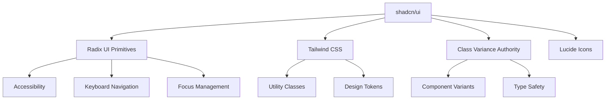

# Урок 6.1: shadcn/ui - современная компонентная библиотека

> **🎯 Цель урока**: Освоить современный подход к созданию UI компонентов с полным контролем над кодом и дизайном

## 📖 Введение

### Эволюция UI библиотек

**Представьте строительство дома:**

| Подход                      | Аналогия                | Примеры                 | Плюсы                     | Минусы                                         |
| --------------------------- | ----------------------- | ----------------------- | ------------------------- | ---------------------------------------------- |
| **Традиционные библиотеки** | Готовые модульные дома  | Material-UI, Ant Design | Быстро, много компонентов | Все выглядят одинаково, сложно кастомизировать |
| **Utility-first**           | Кирпичики и инструменты | Tailwind CSS            | Полный контроль           | Много работы, нет готовых компонентов          |
| **shadcn/ui**               | Качественные заготовки  | shadcn/ui               | Контроль + скорость       | Нужно понимать архитектуру                     |

### Что такое shadcn/ui?

**shadcn/ui** - это не библиотека в традиционном смысле. Это **коллекция копируемых компонентов**, построенных на:

- 🎨 **Tailwind CSS** - для стилизации
- 🧩 **Radix UI** - для accessibility и поведения
- 📦 **Class Variance Authority** - для вариантов компонентов
- 🔧 **TypeScript** - для типобезопасности

**Философия:** "Не устанавливай библиотеку, копируй код в свой проект"

### Почему это важно для ExchangeGO?

В криптовалютном обменнике критически важны:

- 🎯 **Уникальный дизайн** - выделиться среди конкурентов
- ⚡ **Производительность** - быстрая загрузка для трейдеров
- 🔧 **Кастомизация** - адаптация под бизнес-требования
- 📱 **Accessibility** - доступность для всех пользователей

---

## 🚀 Этап 1: Понимание проблем традиционных библиотек _(10 мин)_

### Сравнение подходов

**Традиционные UI библиотеки (Material-UI, Ant Design):**

```bash
# Устанавливаем огромную библиотеку
npm install @mui/material @emotion/react @emotion/styled
# Bundle size: ~1.2MB
```

```typescript
// ❌ Проблемы традиционного подхода
import { Button, TextField, Card, ThemeProvider } from '@mui/material';

function ExchangeForm() {
  return (
    <Card>
      {/* ❌ Выглядит как все Material-UI приложения */}
      <TextField
        label="Email"
        variant="outlined"
        // Сложно изменить дизайн без переопределения темы
      />

      {/* ❌ Хаки для кастомизации */}
      <Button
        variant="contained"
        sx={{
          backgroundColor: '#ff6b35', // Кастомный цвет
          '&:hover': { backgroundColor: '#e55a2b' },
          // Много CSS-in-JS кода для простой кастомизации
        }}
      >
        Создать заявку
      </Button>
    </Card>
  );
}
```

**shadcn/ui подход:**

```bash
# Копируем только нужные компоненты
npx shadcn-ui@latest add button input card
# Bundle size: ~50KB (только используемые компоненты)
```

```typescript
// ✅ Преимущества shadcn/ui
import { Button } from '@/components/ui/button';
import { Input } from '@/components/ui/input';
import { Card } from '@/components/ui/card';

function ExchangeForm() {
  return (
    <Card>
      {/* ✅ Полный контроль над стилями */}
      <Input
        placeholder="Email"
        className="border-orange-200 focus:border-orange-500"
      />

      {/* ✅ Легко кастомизировать через Tailwind */}
      <Button
        variant="default"
        className="bg-gradient-to-r from-orange-500 to-red-500 hover:from-orange-600 hover:to-red-600"
      >
        Создать заявку
      </Button>
    </Card>
  );
}
```

### Проблемы традиционных библиотек

| Проблема             | Описание                       | Пример                                   |
| -------------------- | ------------------------------ | ---------------------------------------- |
| **Vendor Lock-in**   | Привязка к стилю библиотеки    | Все Material-UI сайты выглядят одинаково |
| **Bundle Size**      | Много неиспользуемого кода     | 1MB+ для простой формы                   |
| **Кастомизация**     | Сложные темы и переопределения | `sx` props, CSS-in-JS хаки               |
| **Breaking Changes** | Обновления ломают дизайн       | v4 → v5 Material-UI                      |
| **Performance**      | Runtime стили                  | CSS-in-JS влияет на производительность   |

### ✅ Контрольная точка 1

**Проверьте понимание:**

1. **В чем главное отличие shadcn/ui от Material-UI?**
   <details>
   <summary>Показать ответ</summary>

   shadcn/ui копирует компоненты в ваш проект, давая полный контроль. Material-UI - внешняя зависимость с ограниченной кастомизацией.
   </details>

2. **Почему bundle size меньше у shadcn/ui?**
   <details>
   <summary>Показать ответ</summary>

   Вы копируете только нужные компоненты, а не всю библиотеку целиком.
   </details>

**Задание:** Сравните размер bundle'а простой формы в Material-UI и shadcn/ui.

---

## 🏗️ Этап 2: Архитектура shadcn/ui _(15 мин)_

### Экосистема компонентов



### Структура в нашем проекте

```
packages/ui/
├── src/
│   ├── components/
│   │   ├── ui/                 # shadcn/ui базовые компоненты
│   │   │   ├── button.tsx      # Кнопки с вариантами
│   │   │   ├── input.tsx       # Поля ввода
│   │   │   ├── card.tsx        # Карточки
│   │   │   ├── form.tsx        # Формы с валидацией
│   │   │   └── select.tsx      # Выпадающие списки
│   │   │
│   │   └── exchange/           # Бизнес-компоненты
│   │       ├── currency-selector.tsx
│   │       ├── order-card.tsx
│   │       └── rate-display.tsx
│   │
│   ├── lib/
│   │   └── utils.ts           # Утилиты (cn функция)
│   │
│   └── styles/
│       └── globals.css        # CSS переменные и базовые стили
│
├── components.json            # Конфигурация shadcn/ui
└── tailwind.config.js        # Настройки Tailwind
```

### Ключевые зависимости

```json
// package.json
{
  "dependencies": {
    "@radix-ui/react-slot": "^1.0.2", // Композиция компонентов
    "@radix-ui/react-select": "^2.0.0", // Accessibility для select
    "@radix-ui/react-dialog": "^1.0.5", // Модальные окна
    "class-variance-authority": "^0.7.0", // Варианты компонентов
    "clsx": "^2.0.0", // Условные CSS классы
    "tailwind-merge": "^2.0.0", // Объединение Tailwind классов
    "lucide-react": "^0.294.0" // Иконки
  }
}
```

### Конфигурация shadcn/ui

```json
// components.json
{
  "$schema": "https://ui.shadcn.com/schema.json",
  "style": "new-york", // Стиль компонентов
  "rsc": true, // React Server Components
  "tsx": true, // TypeScript
  "tailwind": {
    "config": "tailwind.config.js",
    "css": "src/styles/globals.css",
    "baseColor": "zinc", // Базовая цветовая схема
    "cssVariables": true // CSS переменные для тем
  },
  "aliases": {
    "components": "@/components", // Алиасы для импортов
    "utils": "@/lib/utils"
  }
}
```

### CSS переменные для тем

```css
/* globals.css */
@layer base {
  :root {
    /* Цветовая схема для светлой темы */
    --background: 0 0% 100%; /* Белый фон */
    --foreground: 240 10% 3.9%; /* Темный текст */
    --primary: 240 5.9% 10%; /* Основной цвет */
    --primary-foreground: 0 0% 98%; /* Текст на основном цвете */
    --secondary: 240 4.8% 95.9%; /* Вторичный цвет */
    --muted: 240 4.8% 95.9%; /* Приглушенные элементы */
    --border: 240 5.9% 90%; /* Границы */
    --input: 240 5.9% 90%; /* Поля ввода */
    --ring: 240 5.9% 10%; /* Focus ring */

    /* Семантические цвета */
    --destructive: 0 84.2% 60.2%; /* Красный для ошибок */
    --success: 142 76% 36%; /* Зеленый для успеха */
    --warning: 38 92% 50%; /* Желтый для предупреждений */
  }

  .dark {
    /* Цветовая схема для темной темы */
    --background: 240 10% 3.9%; /* Темный фон */
    --foreground: 0 0% 98%; /* Светлый текст */
    --primary: 0 0% 98%; /* Светлый основной цвет */
    --primary-foreground: 240 5.9% 10%; /* Темный текст на основном */
    /* ... остальные переменные */
  }
}
```

### Утилита для объединения классов

```typescript
// lib/utils.ts
import { type ClassValue, clsx } from 'clsx';
import { twMerge } from 'tailwind-merge';

/**
 * Объединяет CSS классы с поддержкой Tailwind CSS
 *
 * Решает проблемы:
 * - Конфликты Tailwind классов (последний выигрывает)
 * - Условные классы
 * - Объединение массивов классов
 */
export function cn(...inputs: ClassValue[]) {
  return twMerge(clsx(inputs));
}

// Примеры использования:
// cn('px-2 py-1', 'px-4') // → 'py-1 px-4' (px-4 перезаписывает px-2)
// cn('text-red-500', condition && 'text-green-500') // → условные классы
// cn(['px-2', 'py-1'], { 'bg-red-500': isError }) // → массивы и объекты
```

### ✅ Контрольная точка 2

**Проверьте понимание:**

1. **Что такое Radix UI и зачем он нужен?**
   <details>
   <summary>Показать ответ</summary>

   Radix UI предоставляет accessibility, keyboard navigation и поведение компонентов. shadcn/ui добавляет к этому стили.
   </details>

2. **Зачем нужна функция `cn()`?**
   <details>
   <summary>Показать ответ</summary>

   Для правильного объединения Tailwind классов, решения конфликтов и поддержки условных классов.
   </details>

---

## 🎨 Этап 3: Создание и кастомизация компонентов _(20 мин)_

### Анатомия shadcn/ui компонента

**Базовый компонент Button:**

```typescript
// components/ui/button.tsx
import * as React from 'react';
import { Slot } from '@radix-ui/react-slot';
import { cva, type VariantProps } from 'class-variance-authority';
import { cn } from '@/lib/utils';

// 1. ОПРЕДЕЛЕНИЕ ВАРИАНТОВ с помощью CVA
const buttonVariants = cva(
  // Базовые стили для всех кнопок
  'inline-flex items-center justify-center whitespace-nowrap rounded-md text-sm font-medium ring-offset-background transition-colors focus-visible:outline-none focus-visible:ring-2 focus-visible:ring-ring focus-visible:ring-offset-2 disabled:pointer-events-none disabled:opacity-50',
  {
    variants: {
      variant: {
        default: 'bg-primary text-primary-foreground hover:bg-primary/90',
        destructive: 'bg-destructive text-destructive-foreground hover:bg-destructive/90',
        outline: 'border border-input bg-background hover:bg-accent hover:text-accent-foreground',
        secondary: 'bg-secondary text-secondary-foreground hover:bg-secondary/80',
        ghost: 'hover:bg-accent hover:text-accent-foreground',
        link: 'text-primary underline-offset-4 hover:underline',
      },
      size: {
        default: 'h-10 px-4 py-2',
        sm: 'h-9 rounded-md px-3',
        lg: 'h-11 rounded-md px-8',
        icon: 'h-10 w-10',
      },
    },
    defaultVariants: {
      variant: 'default',
      size: 'default',
    },
  }
);

// 2. ТИПИЗАЦИЯ PROPS
export interface ButtonProps
  extends React.ButtonHTMLAttributes<HTMLButtonElement>,
    VariantProps<typeof buttonVariants> {
  asChild?: boolean; // Позволяет использовать как wrapper
}

// 3. РЕАЛИЗАЦИЯ КОМПОНЕНТА
const Button = React.forwardRef<HTMLButtonElement, ButtonProps>(
  ({ className, variant, size, asChild = false, ...props }, ref) => {
    const Comp = asChild ? Slot : 'button';
    return (
      <Comp
        className={cn(buttonVariants({ variant, size, className }))}
        ref={ref}
        {...props}
      />
    );
  }
);
Button.displayName = 'Button';

export { Button, buttonVariants };
```

### Кастомизация для ExchangeGO

**Добавляем варианты для криптобиржи:**

```typescript
// Расширяем buttonVariants
const buttonVariants = cva(
  'inline-flex items-center justify-center whitespace-nowrap rounded-md text-sm font-medium ring-offset-background transition-colors focus-visible:outline-none focus-visible:ring-2 focus-visible:ring-ring focus-visible:ring-offset-2 disabled:pointer-events-none disabled:opacity-50',
  {
    variants: {
      variant: {
        // Стандартные варианты
        default: 'bg-primary text-primary-foreground hover:bg-primary/90',
        destructive: 'bg-destructive text-destructive-foreground hover:bg-destructive/90',
        outline: 'border border-input bg-background hover:bg-accent hover:text-accent-foreground',

        // 🚀 КАСТОМНЫЕ ВАРИАНТЫ ДЛЯ КРИПТОБИРЖИ
        crypto:
          'bg-gradient-to-r from-orange-500 to-yellow-500 text-white shadow-lg hover:from-orange-600 hover:to-yellow-600 transform hover:scale-105 transition-all duration-200',

        success: 'bg-green-500 text-white shadow hover:bg-green-600',

        warning: 'bg-amber-500 text-white shadow hover:bg-amber-600',

        // Для покупки криптовалют
        buy: 'bg-green-500 text-white hover:bg-green-600 shadow-lg',

        // Для продажи криптовалют
        sell: 'bg-red-500 text-white hover:bg-red-600 shadow-lg',
      },
      size: {
        default: 'h-10 px-4 py-2',
        sm: 'h-9 rounded-md px-3',
        lg: 'h-11 rounded-md px-8',
        icon: 'h-10 w-10',

        // 💰 КАСТОМНЫЕ РАЗМЕРЫ
        xl: 'h-14 rounded-lg px-12 text-lg font-semibold', // Для главных CTA
        trading: 'h-8 px-2 text-xs', // Для торговых кнопок
      },
    },
    defaultVariants: {
      variant: 'default',
      size: 'default',
    },
  }
);
```

### Использование в компонентах биржи

```typescript
// components/exchange/ExchangeActions.tsx
import { Button } from '@/components/ui/button';
import { ArrowUpDown, TrendingUp, TrendingDown } from 'lucide-react';

export function ExchangeActions() {
  return (
    <div className="flex gap-4">
      {/* Главная кнопка обмена */}
      <Button
        variant="crypto"
        size="xl"
        className="flex-1"
      >
        <ArrowUpDown className="mr-2 h-5 w-5" />
        Начать обмен
      </Button>

      {/* Кнопки покупки/продажи */}
      <div className="flex gap-2">
        <Button variant="buy" size="lg">
          <TrendingUp className="mr-2 h-4 w-4" />
          Купить
        </Button>

        <Button variant="sell" size="lg">
          <TrendingDown className="mr-2 h-4 w-4" />
          Продать
        </Button>
      </div>
    </div>
  );
}
```

### Компонент Input с валидацией

```typescript
// components/ui/input.tsx
import * as React from 'react';
import { cn } from '@/lib/utils';

export interface InputProps
  extends React.InputHTMLAttributes<HTMLInputElement> {
  error?: string;           // Сообщение об ошибке
  success?: boolean;        // Состояние успеха
  icon?: React.ReactNode;   // Иконка слева
  suffix?: React.ReactNode; // Элемент справа (например, валюта)
}

const Input = React.forwardRef<HTMLInputElement, InputProps>(
  ({ className, type, error, success, icon, suffix, ...props }, ref) => {
    return (
      <div className="relative">
        {/* Иконка слева */}
        {icon && (
          <div className="absolute left-3 top-1/2 transform -translate-y-1/2 text-muted-foreground">
            {icon}
          </div>
        )}

        {/* Поле ввода */}
        <input
          type={type}
          className={cn(
            // Базовые стили
            'flex h-10 w-full rounded-md border border-input bg-background px-3 py-2 text-sm ring-offset-background file:border-0 file:bg-transparent file:text-sm file:font-medium placeholder:text-muted-foreground focus-visible:outline-none focus-visible:ring-2 focus-visible:ring-ring focus-visible:ring-offset-2 disabled:cursor-not-allowed disabled:opacity-50',

            // Отступы для иконки
            icon && 'pl-10',
            suffix && 'pr-12',

            // Состояния
            error && 'border-destructive focus-visible:ring-destructive',
            success && 'border-green-500 focus-visible:ring-green-500',

            className
          )}
          ref={ref}
          {...props}
        />

        {/* Суффикс справа */}
        {suffix && (
          <div className="absolute right-3 top-1/2 transform -translate-y-1/2 text-sm text-muted-foreground">
            {suffix}
          </div>
        )}

        {/* Сообщение об ошибке */}
        {error && (
          <p className="mt-1 text-sm text-destructive">{error}</p>
        )}
      </div>
    );
  }
);
Input.displayName = 'Input';

export { Input };
```

### Использование Input в формах

```typescript
// components/exchange/AmountInput.tsx
import { Input } from '@/components/ui/input';
import { DollarSign, Bitcoin } from 'lucide-react';

export function AmountInput({ currency, value, onChange, error }) {
  const getCurrencyIcon = (currency: string) => {
    switch (currency) {
      case 'USD': return <DollarSign className="h-4 w-4" />;
      case 'BTC': return <Bitcoin className="h-4 w-4" />;
      default: return null;
    }
  };

  return (
    <Input
      type="number"
      placeholder="0.00"
      value={value}
      onChange={onChange}
      error={error}
      icon={getCurrencyIcon(currency)}
      suffix={currency}
      className="text-lg font-mono"
    />
  );
}
```

## 🛠️ Установка и настройка в нашем проекте

### 1. Инициализация shadcn/ui (уже настроено):

```bash
# В нашем проекте уже выполнено:
npx shadcn-ui@latest init
```

### 2. Конфигурация (`packages/ui/components.json`):

```json
{
  "style": "new-york",           // Стиль компонентов (clean, minimal)
  "rsc": true,                   // React Server Components support
  "tsx": true,                   # TypeScript support
  "tailwind": {
    "config": "tailwind.config.js",
    "css": "src/styles/globals.css",
    "baseColor": "zinc",         // Базовая цветовая схема
    "cssVariables": true         // CSS переменные для тем
  },
  "aliases": {
    "components": "@/components",  // Алиасы для импортов
    "utils": "@/lib/utils"
  }
}
```

### 3. Базовые стили (`packages/ui/src/styles/globals.css`):

```css
/* Базовые CSS переменные для светлой темы */
:root {
  --background: 0 0% 100%; /* Фон приложения */
  --foreground: 240 10% 3.9%; /* Основной текст */
  --card: 0 0% 100%; /* Фон карточек */
  --card-foreground: 240 10% 3.9%; /* Текст в карточках */
  --popover: 0 0% 100%; /* Фон выпадающих меню */
  --popover-foreground: 240 10% 3.9%;
  --primary: 240 5.9% 10%; /* Основной цвет (кнопки) */
  --primary-foreground: 0 0% 98%; /* Текст на основном цвете */
  --secondary: 240 4.8% 95.9%; /* Вторичный цвет */
  --secondary-foreground: 240 5.9% 10%;
  --muted: 240 4.8% 95.9%; /* Приглушенные элементы */
  --muted-foreground: 240 3.8% 46.1%;
  --accent: 240 4.8% 95.9%; /* Акцентный цвет */
  --accent-foreground: 240 5.9% 10%;
  --destructive: 0 84.2% 60.2%; /* Опасные действия (красный) */
  --destructive-foreground: 0 0% 98%;
  --border: 240 5.9% 90%; /* Границы элементов */
  --input: 240 5.9% 90%; /* Поля ввода */
  --ring: 240 5.9% 10%; /* Focus ring */
}

/* Тёмная тема */
.dark {
  --background: 240 10% 3.9%;
  --foreground: 0 0% 98%;
  --card: 240 10% 3.9%;
  --card-foreground: 0 0% 98%;
  /* ... остальные переменные для тёмной темы */
}
```

## 🎨 Компоненты в нашем проекте

### 1. Базовый компонент Button:

```typescript
// 📁 packages/ui/src/components/ui/button.tsx
import * as React from "react";
import { Slot } from "@radix-ui/react-slot";
import { cva, type VariantProps } from "class-variance-authority";
import { cn } from "../../lib/utils";

// ✅ Variants определяют разные стили кнопки
const buttonVariants = cva(
  // Базовые стили для всех кнопок
  "inline-flex items-center justify-center whitespace-nowrap rounded-md text-sm font-medium transition-colors focus-visible:outline-none focus-visible:ring-1 focus-visible:ring-ring disabled:pointer-events-none disabled:opacity-50",
  {
    variants: {
      variant: {
        default: "bg-primary text-primary-foreground shadow hover:bg-primary/90",
        destructive: "bg-destructive text-destructive-foreground shadow-sm hover:bg-destructive/90",
        outline: "border border-input bg-background shadow-sm hover:bg-accent hover:text-accent-foreground",
        secondary: "bg-secondary text-secondary-foreground shadow-sm hover:bg-secondary/80",
        ghost: "hover:bg-accent hover:text-accent-foreground",
        link: "text-primary underline-offset-4 hover:underline",
      },
      size: {
        default: "h-9 px-4 py-2",
        sm: "h-8 rounded-md px-3 text-xs",
        lg: "h-10 rounded-md px-8",
        icon: "h-9 w-9",
      },
    },
    defaultVariants: {
      variant: "default",
      size: "default",
    },
  }
);

export interface ButtonProps
  extends React.ButtonHTMLAttributes<HTMLButtonElement>,
    VariantProps<typeof buttonVariants> {
  asChild?: boolean; // Позволяет использовать как wrapper
}

const Button = React.forwardRef<HTMLButtonElement, ButtonProps>(
  ({ className, variant, size, asChild = false, ...props }, ref) => {
    const Comp = asChild ? Slot : "button";
    return (
      <Comp
        className={cn(buttonVariants({ variant, size, className }))}
        ref={ref}
        {...props}
      />
    );
  }
);
Button.displayName = "Button";

export { Button, buttonVariants };
```

### 2. Использование в формах обменника:

```typescript
// 📁 apps/web/src/components/forms/CreateExchangeOrderForm.tsx
import { Button } from "@repo/ui";
import { Loader2, ArrowRight } from "lucide-react";

export function CreateExchangeOrderForm() {
  const [isLoading, setIsLoading] = useState(false);

  return (
    <form onSubmit={handleSubmit}>
      {/* Остальные поля формы */}

      <div className="flex gap-2">
        {/* ✅ Кнопка отмены - outline стиль */}
        <Button
          type="button"
          variant="outline"
          onClick={onCancel}
          disabled={isLoading}
        >
          Отмена
        </Button>

        {/* ✅ Основная кнопка с loading состоянием */}
        <Button
          type="submit"
          disabled={isLoading}
          className="flex-1"
        >
          {isLoading ? (
            <>
              <Loader2 className="mr-2 h-4 w-4 animate-spin" />
              Создание заявки...
            </>
          ) : (
            <>
              Создать заявку
              <ArrowRight className="ml-2 h-4 w-4" />
            </>
          )}
        </Button>
      </div>
    </form>
  );
}
```

### 3. Компонент Input с валидацией:

```typescript
// 📁 packages/ui/src/components/ui/input.tsx
import * as React from "react";
import { cn } from "../../lib/utils";

export interface InputProps
  extends React.InputHTMLAttributes<HTMLInputElement> {
  error?: string; // Добавили проп для ошибок
}

const Input = React.forwardRef<HTMLInputElement, InputProps>(
  ({ className, type, error, ...props }, ref) => {
    return (
      <div className="space-y-1">
        <input
          type={type}
          className={cn(
            // Базовые стили
            "flex h-9 w-full rounded-md border border-input bg-transparent px-3 py-1 text-sm shadow-sm transition-colors",
            "file:border-0 file:bg-transparent file:text-sm file:font-medium",
            "placeholder:text-muted-foreground",
            "focus-visible:outline-none focus-visible:ring-1 focus-visible:ring-ring",
            "disabled:cursor-not-allowed disabled:opacity-50",
            // Состояние ошибки
            error && "border-destructive focus-visible:ring-destructive",
            className
          )}
          ref={ref}
          {...props}
        />
        {/* Отображение ошибки */}
        {error && (
          <p className="text-sm text-destructive">{error}</p>
        )}
      </div>
    );
  }
);
Input.displayName = "Input";

export { Input };
```

### 4. Форма с валидацией:

```typescript
// 📁 apps/web/src/components/forms/ExchangeAmountInput.tsx
import { Input, Label } from "@repo/ui";
import { useFormField } from "react-hook-form";

export function ExchangeAmountInput() {
  const {
    field,
    fieldState: { error }
  } = useFormField();

  return (
    <div className="space-y-2">
      <Label htmlFor="cryptoAmount">
        Количество криптовалюты
      </Label>

      <Input
        id="cryptoAmount"
        type="number"
        step="0.00000001"
        placeholder="0.001"
        error={error?.message}
        {...field}
      />

      <p className="text-xs text-muted-foreground">
        Минимальная сумма: 0.0001 BTC
      </p>
    </div>
  );
}
```

## 🎯 Кастомизация компонентов

### 1. Создание кастомного варианта кнопки для обменника:

```typescript
// 📁 packages/ui/src/components/ui/button.tsx (добавляем вариант)
const buttonVariants = cva(
  'inline-flex items-center justify-center whitespace-nowrap rounded-md text-sm font-medium transition-colors focus-visible:outline-none focus-visible:ring-1 focus-visible:ring-ring disabled:pointer-events-none disabled:opacity-50',
  {
    variants: {
      variant: {
        default: 'bg-primary text-primary-foreground shadow hover:bg-primary/90',
        // ... остальные варианты

        // ✅ Кастомный вариант для криптовалютных операций
        crypto:
          'bg-gradient-to-r from-orange-500 to-yellow-500 text-white shadow-lg hover:from-orange-600 hover:to-yellow-600 transform hover:scale-105 transition-all duration-200',

        // ✅ Успешные операции
        success: 'bg-green-500 text-white shadow hover:bg-green-600',

        // ✅ Предупреждения
        warning: 'bg-amber-500 text-white shadow hover:bg-amber-600',
      },
      // ... размеры
    },
  }
);
```

### 2. Использование кастомных вариантов:

```typescript
// 📁 apps/web/src/components/exchange/CreateOrderButton.tsx
export function CreateOrderButton({ onCreateOrder }: CreateOrderButtonProps) {
  return (
    <Button
      variant="crypto"
      size="lg"
      onClick={onCreateOrder}
      className="w-full text-lg font-semibold"
    >
      🚀 Начать обмен
    </Button>
  );
}

export function ConfirmOrderButton({ onConfirm }: ConfirmOrderButtonProps) {
  return (
    <Button
      variant="success"
      onClick={onConfirm}
    >
      ✅ Подтвердить заявку
    </Button>
  );
}
```

## 📱 Пример из реального проекта

### Карточка валюты в селекторе:

```typescript
// 📁 packages/ui/src/components/exchange/CurrencyCard.tsx
import { Card, CardContent, Button } from "../ui";
import { cn } from "../../lib/utils";

interface CurrencyCardProps {
  currency: {
    code: string;
    name: string;
    icon: string;
    rate: number;
  };
  isSelected?: boolean;
  onSelect: () => void;
}

export function CurrencyCard({ currency, isSelected, onSelect }: CurrencyCardProps) {
  return (
    <Card
      className={cn(
        "cursor-pointer transition-all duration-200 hover:shadow-md",
        isSelected && "ring-2 ring-primary shadow-lg"
      )}
      onClick={onSelect}
    >
      <CardContent className="p-4">
        <div className="flex items-center space-x-3">
          {/* Иконка валюты */}
          <div className="flex-shrink-0">
            
          </div>

          {/* Информация о валюте */}
          <div className="flex-1 min-w-0">
            <h3 className="font-semibold text-sm">{currency.code}</h3>
            <p className="text-xs text-muted-foreground truncate">
              {currency.name}
            </p>
          </div>

          {/* Курс */}
          <div className="text-right">
            <p className="text-sm font-medium">
              ${currency.rate.toLocaleString()}
            </p>
            <p className="text-xs text-green-600">
              +2.5%
            </p>
          </div>
        </div>

        {/* Кнопка выбора */}
        {isSelected && (
          <Button
            variant="ghost"
            size="sm"
            className="w-full mt-3"
          >
            Выбрано ✓
          </Button>
        )}
      </CardContent>
    </Card>
  );
}
```

## ✅ Проверка знаний

### Вопросы для самоконтроля:

1. **Концептуальные**:
   - В чем отличие shadcn/ui от традиционных UI библиотек?
   - Какие преимущества дает подход "copy & paste components"?
   - Что такое CSS переменные и как они работают с темами?

2. **Практические**:
   - Как добавить новый вариант существующего компонента?
   - Как создать компонент с поддержкой состояния ошибки?
   - Как использовать компонент в качестве wrapper (asChild)?

3. **Из проекта**:
   - Найдите в `packages/ui/src/components/ui/` примеры shadcn/ui компонентов
   - Посмотрите конфигурацию в `packages/ui/components.json`
   - Изучите CSS переменные в `packages/ui/src/styles/globals.css`

### 💻 Практическое задание

**Создайте компонент StatusBadge для отображения статуса заявки:**

```typescript
// Требования:
// 1. Разные цвета для разных статусов
// 2. Иконки для каждого статуса
// 3. Анимация для статуса "в обработке"
// 4. Поддержка размеров (sm, md, lg)

interface StatusBadgeProps {
  status: 'awaiting_payment' | 'processing' | 'completed' | 'cancelled';
  size?: 'sm' | 'md' | 'lg';
  showIcon?: boolean;
}

export function StatusBadge({ status, size = 'md', showIcon = true }: StatusBadgeProps) {
  // Ваш код здесь
}
```

## 📚 Дополнительные материалы

### Документация:

- [shadcn/ui Official Docs](https://ui.shadcn.com)
- [Radix UI Primitives](https://www.radix-ui.com/primitives)
- [Class Variance Authority](https://cva.style/docs)

### В проекте:

- `packages/ui/src/components/ui/` - базовые shadcn/ui компоненты
- `packages/ui/src/components/` - кастомные компоненты проекта
- `packages/ui/src/lib/utils.ts` - утилиты для работы с CSS классами

---

[← Глава 6: UI система](./README.md) | [Урок 6.2: Tailwind CSS →](./lesson-6.2-tailwind-design-tokens.md)

### ✅ Контрольная точка 3

**Проверьте понимание:**

1. **Что такое Class Variance Authority (CVA)?**
   <details>
   <summary>Показать ответ</summary>

   Библиотека для создания типобезопасных вариантов компонентов с автоматической генерацией CSS классов.
   </details>

2. **Зачем нужен `asChild` prop в Button?**
   <details>
   <summary>Показать ответ</summary>

   Позволяет использовать Button как wrapper для других элементов (например, Link), сохраняя стили но меняя HTML тег.
   </details>

**Задание:** Создайте вариант кнопки для экстренных действий (emergency) с красным фоном и пульсирующей анимацией.

---

## 🚀 Этап 4: Продвинутые техники и композиция _(15 мин)_

### Композиция компонентов с Slot

```typescript
// Использование asChild для композиции
import { Button } from '@/components/ui/button';
import Link from 'next/link';

function NavigationButton() {
  return (
    // Button рендерится как Link, но сохраняет стили кнопки
    <Button asChild variant="outline">
      <Link href="/exchange">
        Перейти к обмену
      </Link>
    </Button>
  );
}

// Результат: <a class="button-styles" href="/exchange">Перейти к обмену</a>
```

### Создание составных компонентов

```typescript
// components/ui/card.tsx - Составной компонент
import * as React from 'react';
import { cn } from '@/lib/utils';

const Card = React.forwardRef<
  HTMLDivElement,
  React.HTMLAttributes<HTMLDivElement>
>(({ className, ...props }, ref) => (
  <div
    ref={ref}
    className={cn(
      'rounded-lg border bg-card text-card-foreground shadow-sm',
      className
    )}
    {...props}
  />
));
Card.displayName = 'Card';

const CardHeader = React.forwardRef<
  HTMLDivElement,
  React.HTMLAttributes<HTMLDivElement>
>(({ className, ...props }, ref) => (
  <div
    ref={ref}
    className={cn('flex flex-col space-y-1.5 p-6', className)}
    {...props}
  />
));
CardHeader.displayName = 'CardHeader';

const CardTitle = React.forwardRef<
  HTMLParagraphElement,
  React.HTMLAttributes<HTMLHeadingElement>
>(({ className, ...props }, ref) => (
  <h3
    ref={ref}
    className={cn(
      'text-2xl font-semibold leading-none tracking-tight',
      className
    )}
    {...props}
  />
));
CardTitle.displayName = 'CardTitle';

const CardContent = React.forwardRef<
  HTMLDivElement,
  React.HTMLAttributes<HTMLDivElement>
>(({ className, ...props }, ref) => (
  <div ref={ref} className={cn('p-6 pt-0', className)} {...props} />
));
CardContent.displayName = 'CardContent';

export { Card, CardHeader, CardTitle, CardContent };
```

### Использование составных компонентов

```typescript
// components/exchange/CurrencyCard.tsx
import { Card, CardHeader, CardTitle, CardContent } from '@/components/ui/card';
import { Button } from '@/components/ui/button';
import { TrendingUp, TrendingDown } from 'lucide-react';

interface CurrencyCardProps {
  currency: {
    code: string;
    name: string;
    price: number;
    change24h: number;
    icon: string;
  };
  onSelect: () => void;
}

export function CurrencyCard({ currency, onSelect }: CurrencyCardProps) {
  const isPositive = currency.change24h > 0;

  return (
    <Card className="cursor-pointer transition-all hover:shadow-lg hover:scale-105">
      <CardHeader className="pb-2">
        <div className="flex items-center justify-between">
          <div className="flex items-center space-x-2">
            
            <div>
              <CardTitle className="text-lg">{currency.code}</CardTitle>
              <p className="text-sm text-muted-foreground">{currency.name}</p>
            </div>
          </div>

          <div className={`flex items-center space-x-1 ${
            isPositive ? 'text-green-600' : 'text-red-600'
          }`}>
            {isPositive ? (
              <TrendingUp className="h-4 w-4" />
            ) : (
              <TrendingDown className="h-4 w-4" />
            )}
            <span className="text-sm font-medium">
              {isPositive ? '+' : ''}{currency.change24h.toFixed(2)}%
            </span>
          </div>
        </div>
      </CardHeader>

      <CardContent>
        <div className="flex items-center justify-between">
          <div>
            <p className="text-2xl font-bold">
              ${currency.price.toLocaleString()}
            </p>
          </div>

          <Button
            onClick={onSelect}
            variant="outline"
            size="sm"
          >
            Выбрать
          </Button>
        </div>
      </CardContent>
    </Card>
  );
}
```

### Темизация и CSS переменные

```typescript
// hooks/useTheme.ts - Управление темами
import { useEffect, useState } from 'react';

type Theme = 'light' | 'dark' | 'system';

export function useTheme() {
  const [theme, setTheme] = useState<Theme>('system');

  useEffect(() => {
    const root = window.document.documentElement;

    // Удаляем предыдущие классы тем
    root.classList.remove('light', 'dark');

    if (theme === 'system') {
      const systemTheme = window.matchMedia('(prefers-color-scheme: dark)').matches
        ? 'dark'
        : 'light';

      root.classList.add(systemTheme);
      return;
    }

    root.classList.add(theme);
  }, [theme]);

  return {
    theme,
    setTheme,
    // Утилиты для компонентов
    isDark: theme === 'dark' || (theme === 'system' &&
      window.matchMedia('(prefers-color-scheme: dark)').matches),
  };
}

// components/ThemeToggle.tsx
import { Button } from '@/components/ui/button';
import { Moon, Sun, Monitor } from 'lucide-react';
import { useTheme } from '@/hooks/useTheme';

export function ThemeToggle() {
  const { theme, setTheme } = useTheme();

  const themes = [
    { value: 'light', icon: Sun, label: 'Светлая' },
    { value: 'dark', icon: Moon, label: 'Темная' },
    { value: 'system', icon: Monitor, label: 'Системная' },
  ] as const;

  return (
    <div className="flex rounded-md border">
      {themes.map(({ value, icon: Icon, label }) => (
        <Button
          key={value}
          variant={theme === value ? 'default' : 'ghost'}
          size="sm"
          onClick={() => setTheme(value)}
          className="rounded-none first:rounded-l-md last:rounded-r-md"
        >
          <Icon className="h-4 w-4" />
          <span className="sr-only">{label}</span>
        </Button>
      ))}
    </div>
  );
}
```

### Анимации и переходы

```typescript
// components/ui/animated-button.tsx
import { Button, ButtonProps } from './button';
import { cn } from '@/lib/utils';

interface AnimatedButtonProps extends ButtonProps {
  animation?: 'pulse' | 'bounce' | 'shake' | 'glow';
  loading?: boolean;
}

export function AnimatedButton({
  animation,
  loading,
  className,
  children,
  ...props
}: AnimatedButtonProps) {
  const animationClasses = {
    pulse: 'animate-pulse',
    bounce: 'animate-bounce',
    shake: 'animate-shake', // Кастомная анимация
    glow: 'animate-glow',   // Кастомная анимация
  };

  return (
    <Button
      className={cn(
        animation && animationClasses[animation],
        loading && 'animate-pulse cursor-not-allowed',
        className
      )}
      disabled={loading || props.disabled}
      {...props}
    >
      {loading ? (
        <div className="flex items-center space-x-2">
          <div className="w-4 h-4 border-2 border-current border-t-transparent rounded-full animate-spin" />
          <span>Загрузка...</span>
        </div>
      ) : (
        children
      )}
    </Button>
  );
}

// Кастомные анимации в globals.css
/*
@keyframes shake {
  0%, 100% { transform: translateX(0); }
  25% { transform: translateX(-5px); }
  75% { transform: translateX(5px); }
}

@keyframes glow {
  0%, 100% { box-shadow: 0 0 5px currentColor; }
  50% { box-shadow: 0 0 20px currentColor; }
}

.animate-shake {
  animation: shake 0.5s ease-in-out;
}

.animate-glow {
  animation: glow 2s ease-in-out infinite;
}
*/
```

---

## ✅ Финальная проверка знаний

### Комплексные вопросы:

1. **Объясните архитектуру shadcn/ui компонента от CVA до рендера**
   <details>
   <summary>Показать ответ</summary>
   1. CVA определяет варианты и генерирует CSS классы
   2. TypeScript интерфейс обеспечивает типобезопасность
   3. forwardRef передает ref для композиции
   4. cn() объединяет классы с учетом Tailwind конфликтов
   5. Radix UI (если используется) добавляет поведение и accessibility
   </details>

2. **Как обеспечить консистентность дизайна в большой команде?**
   <details>
   <summary>Показать ответ</summary>
   - Централизованные CSS переменные для цветов
   - Строгая типизация вариантов компонентов
   - Design tokens в Tailwind конфигурации
   - Storybook для документации компонентов
   - Линтинг правила для использования компонентов
   </details>

3. **Когда создавать новый компонент, а когда расширять существующий?**
   <details>
   <summary>Показать ответ</summary>

   **Расширять существующий:**
   - Добавление новых вариантов (variant, size)
   - Дополнительные props без изменения структуры
   - Улучшение accessibility

   **Создавать новый:**
   - Кардинально другая структура HTML
   - Специфичная бизнес-логика
   - Композиция из нескольких базовых компонентов
   </details>

### Практическое задание

**Создайте компонент StatusBadge для отображения статуса заказов:**

```typescript
// Требования:
interface StatusBadgeProps {
  status: 'pending' | 'processing' | 'completed' | 'cancelled' | 'expired';
  size?: 'sm' | 'md' | 'lg';
  showIcon?: boolean;
  animated?: boolean;
}

// Функциональность:
// 1. Разные цвета для каждого статуса
// 2. Иконки из lucide-react
// 3. Анимация пульсации для 'processing'
// 4. Поддержка размеров через CVA
// 5. Accessibility (aria-label, role)

export function StatusBadge(props: StatusBadgeProps) {
  // Ваша реализация
}
```

**Дополнительные задачи:**

1. Добавьте поддержку кастомных цветов через CSS переменные
2. Создайте Storybook историю для компонента
3. Добавьте unit тесты с Jest и Testing Library
4. Реализуйте темную тему для компонента

---

## 📚 Заключение

**Что вы изучили:**

- 🏗️ **Архитектуру shadcn/ui** - от CVA до композиции компонентов
- 🎨 **Кастомизацию компонентов** - варианты, темы, анимации
- 🔧 **Практические техники** - составные компоненты, типизация, accessibility
- 🚀 **Продвинутые паттерны** - композиция, темизация, анимации
- 💼 **Реальные примеры** - компоненты для криптовалютной биржи

**Ключевые принципы:**

1. **Контроль над кодом** - компоненты в вашем проекте, не в node_modules
2. **Композиция над наследованием** - используйте Slot и asChild
3. **Типобезопасность** - CVA + TypeScript для надежности
4. **Accessibility First** - Radix UI обеспечивает доступность
5. **Производительность** - только нужные компоненты в bundle

**Следующие шаги:**

- 🎨 **Design Tokens** - централизованная система дизайна
- 📱 **Responsive Design** - адаптивность и мобильные компоненты
- 🧪 **Testing** - тестирование компонентов и accessibility
- 📚 **Storybook** - документация и изолированная разработка
- 🔄 **Animation System** - продвинутые анимации и переходы

**Полезные ресурсы:**

- [shadcn/ui Documentation](https://ui.shadcn.com)
- [Radix UI Primitives](https://www.radix-ui.com/primitives)
- [Class Variance Authority](https://cva.style/docs)
- [Tailwind CSS](https://tailwindcss.com/docs)

Вы освоили **современный подход** к созданию UI компонентов с полным контролем над кодом и дизайном!

---

[← Глава 6: UI System](./README.md) | [Урок 6.2: Tailwind CSS и Design Tokens →](./lesson-6.2-tailwind-design-tokens.md)
