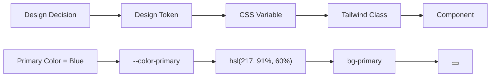

# Урок 6.2: Tailwind CSS и Design Tokens

> **🎯 Цель урока**: Освоить utility-first подход к CSS и создать масштабируемую систему дизайна с Design Tokens

## 📖 Введение

### Эволюция CSS подходов

**Представьте разработку как строительство города:**

| Подход            | Аналогия              | Плюсы                     | Минусы               |
| ----------------- | --------------------- | ------------------------- | -------------------- |
| **Inline CSS**    | Каждый дом уникален   | Полный контроль           | Хаос, дублирование   |
| **CSS Classes**   | Типовые проекты домов | Переиспользование         | Сложность именования |
| **CSS-in-JS**     | Программируемые дома  | Динамичность              | Runtime overhead     |
| **Utility-First** | Стандартные блоки     | Скорость, консистентность | Кривая обучения      |

### Что такое Utility-First CSS?

**Utility-First** = набор маленьких, односложных CSS классов для конкретных стилей.

```html
<!-- Традиционный подход -->
<button class="btn btn-primary btn-large">Создать заказ</button>

<!-- Utility-First подход -->
<button class="bg-blue-500 text-white px-6 py-3 rounded-lg hover:bg-blue-600 transition-colors">
  Создать заказ
</button>
```

### Что такое Design Tokens?

**Design Tokens** = именованные значения для дизайн-решений (цвета, шрифты, отступы).

```css
/* Без Design Tokens */
.button {
  background: #3b82f6;
}
.link {
  color: #3b82f6;
}
.border {
  border-color: #3b82f6;
}

/* С Design Tokens */
:root {
  --color-primary: #3b82f6;
}
.button {
  background: var(--color-primary);
}
.link {
  color: var(--color-primary);
}
.border {
  border-color: var(--color-primary);
}
```

### Почему это важно для ExchangeGO?

В криптовалютной бирже критически важны:

- 🎯 **Консистентность** - пользователи должны доверять интерфейсу
- ⚡ **Скорость разработки** - быстрый выход на рынок
- 🔧 **Масштабируемость** - легко добавлять новые функции
- 🌍 **Темизация** - поддержка светлой/темной темы

---

## 🚀 Этап 1: Понимание Utility-First подхода _(15 мин)_

### Сравнение подходов

**Традиционный CSS (Component-First):**

```css
/* ❌ Проблемы традиционного подхода */
.btn-primary {
  background-color: #3b82f6; /* Хардкод цвета */
  color: white;
  padding: 12px 24px; /* Хардкод отступов */
  border-radius: 6px; /* Хардкод радиуса */
  font-size: 14px; /* Хардкод размера */
  font-weight: 500;
  border: none;
  cursor: pointer;
  transition: background-color 0.2s;
}

.btn-secondary {
  background-color: #6b7280; /* Другой хардкод */
  color: white;
  padding: 12px 24px; /* Дублирование */
  border-radius: 6px; /* Дублирование */
  font-size: 14px; /* Дублирование */
  /* ... остальные дублирующиеся стили */
}

.card {
  background-color: white;
  border-radius: 6px; /* Тот же радиус, но дублируется */
  padding: 24px; /* Другой отступ */
  box-shadow: 0 1px 3px rgba(0, 0, 0, 0.1);
}
```

**Utility-First CSS (Tailwind):**

```html
<!-- ✅ Преимущества utility-first -->
<!-- Основная кнопка -->
<button
  class="bg-blue-500 text-white px-6 py-3 rounded-md text-sm font-medium border-0 cursor-pointer transition-colors hover:bg-blue-600"
>
  Основная кнопка
</button>

<!-- Вторичная кнопка -->
<button
  class="bg-gray-500 text-white px-6 py-3 rounded-md text-sm font-medium border-0 cursor-pointer transition-colors hover:bg-gray-600"
>
  Вторичная кнопка
</button>

<!-- Карточка -->
<div class="bg-white rounded-md p-6 shadow-sm">Содержимое карточки</div>
```

### Преимущества Utility-First

| Аспект                | Традиционный CSS                | Utility-First           |
| --------------------- | ------------------------------- | ----------------------- |
| **Размер CSS**        | Растет с каждым компонентом     | Стабильный размер       |
| **Именование**        | Сложно придумывать имена        | Нет проблемы именования |
| **Переиспользование** | Через CSS классы                | Через HTML классы       |
| **Кастомизация**      | Переопределение CSS             | Изменение классов       |
| **Удаление кода**     | Сложно найти неиспользуемый CSS | Очевидно из HTML        |

### Мышление в Utility-First

**Процесс создания компонента:**

```html
<!-- 1. Начинаем с базовой структуры -->
<button>Кнопка</button>

<!-- 2. Добавляем базовые стили -->
<button class="px-4 py-2 rounded">Кнопка</button>

<!-- 3. Добавляем цвета -->
<button class="px-4 py-2 rounded bg-blue-500 text-white">Кнопка</button>

<!-- 4. Добавляем интерактивность -->
<button class="px-4 py-2 rounded bg-blue-500 text-white hover:bg-blue-600 transition-colors">
  Кнопка
</button>

<!-- 5. Добавляем состояния -->
<button
  class="px-4 py-2 rounded bg-blue-500 text-white hover:bg-blue-600 focus:ring-2 focus:ring-blue-300 disabled:opacity-50 transition-colors"
>
  Кнопка
</button>
```

### Практический пример: Форма входа

```html
<!-- Форма входа с Tailwind CSS -->
<div class="max-w-md mx-auto bg-white rounded-lg shadow-md p-6">
  <!-- Заголовок -->
  <h2 class="text-2xl font-bold text-gray-900 mb-6 text-center">Вход в ExchangeGO</h2>

  <!-- Форма -->
  <form class="space-y-4">
    <!-- Поле email -->
    <div>
      <label class="block text-sm font-medium text-gray-700 mb-1"> Email </label>
      <input
        type="email"
        class="w-full px-3 py-2 border border-gray-300 rounded-md focus:outline-none focus:ring-2 focus:ring-blue-500 focus:border-blue-500"
        placeholder="your@email.com"
      />
    </div>

    <!-- Поле пароля -->
    <div>
      <label class="block text-sm font-medium text-gray-700 mb-1"> Пароль </label>
      <input
        type="password"
        class="w-full px-3 py-2 border border-gray-300 rounded-md focus:outline-none focus:ring-2 focus:ring-blue-500 focus:border-blue-500"
        placeholder="••••••••"
      />
    </div>

    <!-- Кнопка входа -->
    <button
      type="submit"
      class="w-full bg-blue-500 text-white py-2 px-4 rounded-md hover:bg-blue-600 focus:outline-none focus:ring-2 focus:ring-blue-500 focus:ring-offset-2 transition-colors font-medium"
    >
      Войти
    </button>
  </form>
</div>
```

### ✅ Контрольная точка 1

**Проверьте понимание:**

1. **В чем главное отличие utility-first от component-first CSS?**
   <details>
   <summary>Показать ответ</summary>

   Utility-first использует маленькие односложные классы в HTML, component-first создает большие CSS классы для компонентов.
   </details>

2. **Почему размер CSS файла стабилизируется в Tailwind?**
   <details>
   <summary>Показать ответ</summary>

   Потому что вы переиспользуете существующие утилитарные классы, а не создаете новые CSS правила для каждого компонента.
   </details>

**Задание:** Создайте карточку товара используя только Tailwind классы.

---

## 🎨 Этап 2: Design Tokens и цветовая система _(20 мин)_

### Что такое Design Tokens?

**Design Tokens** = именованные значения для дизайн-решений, которые обеспечивают консистентность.



### Архитектура Design Tokens в ExchangeGO

```
packages/tailwind-preset/
├── globals.css              # CSS переменные (Design Tokens)
├── tailwind.config.js       # Конфигурация Tailwind
└── preset.js               # Экспорт пресета

packages/design-tokens/
├── colors.js               # Цветовая палитра
├── typography.js           # Типографика
├── spacing.js              # Отступы и размеры
└── index.js               # Экспорт всех токенов
```

### Семантическая цветовая система

```css
/* packages/tailwind-preset/globals.css */
:root {
  /* === SEMANTIC COLORS === */
  /* Цвета по назначению, а не по внешнему виду */

  --background: 0 0% 100%; /* Основной фон приложения */
  --foreground: 240 10% 3.9%; /* Основной текст */
  --muted: 240 4.8% 95.9%; /* Приглушенные элементы */
  --muted-foreground: 240 3.8% 46.1%; /* Вторичный текст */

  /* === BRAND COLORS === */
  --primary: 217 91% 60%; /* Основной цвет бренда */
  --primary-foreground: 0 0% 98%; /* Текст на основном цвете */
  --secondary: 240 4.8% 95.9%; /* Вторичные элементы */
  --secondary-foreground: 240 5.9% 10%; /* Текст на вторичном */

  /* === FEEDBACK COLORS === */
  --success: 142 76% 36%; /* Успешные операции */
  --success-foreground: 0 0% 98%;
  --warning: 38 92% 50%; /* Предупреждения */
  --warning-foreground: 0 0% 98%;
  --destructive: 0 84.2% 60.2%; /* Ошибки, удаление */
  --destructive-foreground: 0 0% 98%;

  /* === UI COLORS === */
  --border: 240 5.9% 90%; /* Границы элементов */
  --input: 240 5.9% 90%; /* Поля ввода */
  --ring: 240 5.9% 10%; /* Focus кольца */
  --card: 0 0% 100%; /* Фон карточек */
  --card-foreground: 240 10% 3.9%; /* Текст в карточках */

  /* === CRYPTO-SPECIFIC === */
  --crypto-bitcoin: 30 100% 50%; /* #FF8C00 - Bitcoin оранжевый */
  --crypto-ethereum: 240 100% 50%; /* #0000FF - Ethereum синий */
  --crypto-tether: 142 100% 25%; /* #008000 - Tether зеленый */
  --crypto-gold: 45 100% 50%; /* #FFD700 - Золотой для VIP */
}

/* === DARK THEME === */
.dark {
  --background: 240 10% 3.9%; /* Темный фон */
  --foreground: 0 0% 98%; /* Светлый текст */
  --muted: 240 3.7% 15.9%; /* Приглушенные элементы */
  --muted-foreground: 240 5% 64.9%; /* Вторичный текст */

  --primary: 217 91% 60%; /* Основной цвет остается */
  --primary-foreground: 240 5.9% 10%; /* Темный текст на ярком фоне */

  --card: 240 10% 3.9%; /* Темные карточки */
  --card-foreground: 0 0% 98%; /* Светлый текст */

  --border: 240 3.7% 15.9%; /* Темные границы */
  --input: 240 3.7% 15.9%; /* Темные поля ввода */

  /* Крипто-цвета остаются теми же */
  --crypto-bitcoin: 30 100% 50%;
  --crypto-ethereum: 240 100% 50%;
  --crypto-tether: 142 100% 25%;
  --crypto-gold: 45 100% 50%;
}
```

### Использование семантических цветов

```html
<!-- ✅ Семантические цвета - понятно назначение -->
<button class="bg-primary text-primary-foreground">Основное действие</button>

<button class="bg-success text-success-foreground">Подтвердить операцию</button>

<button class="bg-destructive text-destructive-foreground">Удалить заказ</button>

<div class="bg-card text-card-foreground border border-border">Карточка с контентом</div>

<!-- ❌ Избегайте хардкода цветов -->
<button class="bg-blue-500 text-white">Непонятно назначение</button>
```

### Кастомные цвета для криптобиржи

```css
/* Расширяем Tailwind конфигурацию */
module.exports = {
  theme: {
    extend: {
      colors: {
        // Семантические цвета из CSS переменных
        background: 'hsl(var(--background))',
        foreground: 'hsl(var(--foreground))',
        primary: {
          DEFAULT: 'hsl(var(--primary))',
          foreground: 'hsl(var(--primary-foreground))',
        },

        // Крипто-специфичные цвета
        crypto: {
          bitcoin: 'hsl(var(--crypto-bitcoin))',
          ethereum: 'hsl(var(--crypto-ethereum))',
          tether: 'hsl(var(--crypto-tether))',
          gold: 'hsl(var(--crypto-gold))',
        },
      },
    },
  },
};
```

### Использование крипто-цветов

```html
<!-- Кнопки для разных криптовалют -->
<button class="bg-crypto-bitcoin text-white hover:bg-crypto-bitcoin/90">Купить Bitcoin</button>

<button class="bg-crypto-ethereum text-white hover:bg-crypto-ethereum/90">Купить Ethereum</button>

<!-- Индикаторы валют -->
<div class="flex items-center space-x-2">
  <div class="w-3 h-3 rounded-full bg-crypto-bitcoin"></div>
  <span>Bitcoin</span>
</div>

<!-- VIP статус -->
<span class="bg-crypto-gold text-black px-2 py-1 rounded text-xs font-bold"> VIP </span>
```

## 🎨 Design Tokens в нашем проекте

### 1. Цветовая система (`packages/tailwind-preset/globals.css`):

```css
/* ✅ Централизованные CSS переменные (Design Tokens) */
:root {
  /* === SEMANTIC COLORS === */
  /* Семантические цвета понятны по назначению */
  --background: 0 0% 100%; /* Основной фон */
  --foreground: 240 10% 3.9%; /* Основной текст */
  --card: 0 0% 100%; /* Фон карточек */
  --card-foreground: 240 10% 3.9%; /* Текст в карточках */
  --popover: 0 0% 100%; /* Выпадающие меню */
  --popover-foreground: 240 10% 3.9%; /* Текст в меню */

  /* === BRAND COLORS === */
  /* Основные цвета бренда */
  --primary: 240 5.9% 10%; /* Основной цвет (кнопки, ссылки) */
  --primary-foreground: 0 0% 98%; /* Текст на основном цвете */
  --secondary: 240 4.8% 95.9%; /* Вторичные элементы */
  --secondary-foreground: 240 5.9% 10%; /* Текст на вторичном цвете */

  /* === FEEDBACK COLORS === */
  /* Цвета для обратной связи */
  --destructive: 0 84.2% 60.2%; /* Ошибки, удаление */
  --destructive-foreground: 0 0% 98%; /* Текст на красном фоне */
  --success: 142 76% 36%; /* Успешные операции */
  --success-foreground: 0 0% 98%; /* Текст на зеленом фоне */
  --warning: 38 92% 50%; /* Предупреждения */
  --warning-foreground: 0 0% 98%; /* Текст на желтом фоне */

  /* === UI COLORS === */
  /* Цвета элементов интерфейса */
  --muted: 240 4.8% 95.9%; /* Приглушенные элементы */
  --muted-foreground: 240 3.8% 46.1%; /* Вторичный текст */
  --accent: 240 4.8% 95.9%; /* Акценты, hover состояния */
  --accent-foreground: 240 5.9% 10%; /* Текст на акцентах */
  --border: 240 5.9% 90%; /* Границы элементов */
  --input: 240 5.9% 90%; /* Поля ввода */
  --ring: 240 5.9% 10%; /* Focus кольца */

  /* === CRYPTO-SPECIFIC COLORS === */
  /* Специфичные цвета для крипто-проекта */
  --crypto-bitcoin: 30 100% 50%; /* Оранжевый Bitcoin */
  --crypto-ethereum: 240 100% 50%; /* Синий Ethereum */
  --crypto-tether: 142 100% 25%; /* Зеленый Tether */
  --crypto-gold: 45 100% 50%; /* Золотой для VIP */
}

/* === DARK THEME === */
.dark {
  --background: 240 10% 3.9%;
  --foreground: 0 0% 98%;
  --card: 240 10% 3.9%;
  --card-foreground: 0 0% 98%;
  /* ... остальные переменные для темной темы */

  /* Крипто-цвета остаются теми же */
  --crypto-bitcoin: 30 100% 50%;
  --crypto-ethereum: 240 100% 50%;
  --crypto-tether: 142 100% 25%;
  --crypto-gold: 45 100% 50%;
}
```

### 2. Типографическая система (`packages/design-tokens/src/typography.ts`):

```typescript
// ✅ Типографические токены
export const typography = {
  // Семейства шрифтов
  fontFamily: {
    sans: ['Geist', 'Inter', 'system-ui', 'sans-serif'],
    mono: ['Geist Mono', 'Monaco', 'monospace'],
  },

  // Размеры шрифтов (с рациональной прогрессией)
  fontSize: {
    xs: ['0.75rem', { lineHeight: '1rem' }], // 12px
    sm: ['0.875rem', { lineHeight: '1.25rem' }], // 14px
    base: ['1rem', { lineHeight: '1.5rem' }], // 16px (базовый)
    lg: ['1.125rem', { lineHeight: '1.75rem' }], // 18px
    xl: ['1.25rem', { lineHeight: '1.75rem' }], // 20px
    '2xl': ['1.5rem', { lineHeight: '2rem' }], // 24px
    '3xl': ['1.875rem', { lineHeight: '2.25rem' }], // 30px
    '4xl': ['2.25rem', { lineHeight: '2.5rem' }], // 36px
  },

  // Толщины шрифтов
  fontWeight: {
    normal: '400', // Обычный текст
    medium: '500', // Акценты, labels
    semibold: '600', // Заголовки форм
    bold: '700', // Основные заголовки
  },

  // Межстрочные расстояния
  lineHeight: {
    tight: '1.25', // Заголовки
    normal: '1.5', // Основной текст
    relaxed: '1.75', // Длинные тексты
  },
} as const;
```

### 3. Система отступов (`packages/design-tokens/src/spacing.ts`):

```typescript
// ✅ Система отступов (8px grid)
export const spacing = {
  // Базовая единица: 0.25rem = 4px
  0: '0px',
  px: '1px',
  0.5: '0.125rem', // 2px
  1: '0.25rem', // 4px
  2: '0.5rem', // 8px  ← Базовая единица
  3: '0.75rem', // 12px
  4: '1rem', // 16px ← Часто используемая
  5: '1.25rem', // 20px
  6: '1.5rem', // 24px ← Часто используемая
  8: '2rem', // 32px ← Крупные отступы
  10: '2.5rem', // 40px
  12: '3rem', // 48px
  16: '4rem', // 64px
  20: '5rem', // 80px
  24: '6rem', // 96px
} as const;

// Семантические отступы для компонентов
export const componentSpacing = {
  // Внутренние отступы компонентов
  button: {
    sm: '0.5rem 0.75rem', // py-2 px-3
    md: '0.75rem 1rem', // py-3 px-4
    lg: '1rem 1.5rem', // py-4 px-6
  },

  card: {
    sm: '1rem', // p-4
    md: '1.5rem', // p-6
    lg: '2rem', // p-8
  },

  form: {
    fieldGap: '1rem', // Между полями формы
    sectionGap: '2rem', // Между секциями
  },
} as const;
```

## 🛠️ Использование Tailwind CSS

### 1. Компонент кнопки с Design Tokens:

```typescript
// 📁 packages/ui/src/components/ui/button.tsx
import { cva } from 'class-variance-authority';

const buttonVariants = cva(
  // ✅ Базовые стили используют Design Tokens
  [
    'inline-flex items-center justify-center whitespace-nowrap',
    'rounded-md', // border-radius из токенов
    'text-sm font-medium', // typography токены
    'transition-colors duration-200', // анимации
    'focus-visible:outline-none focus-visible:ring-1 focus-visible:ring-ring',
    'disabled:pointer-events-none disabled:opacity-50',
  ],
  {
    variants: {
      variant: {
        // ✅ Все цвета из CSS переменных (Design Tokens)
        default: [
          'bg-primary text-primary-foreground', // Основной цвет
          'shadow hover:bg-primary/90', // Hover состояние
        ],
        secondary: ['bg-secondary text-secondary-foreground', 'shadow-sm hover:bg-secondary/80'],
        destructive: [
          'bg-destructive text-destructive-foreground',
          'shadow-sm hover:bg-destructive/90',
        ],
        success: ['bg-success text-success-foreground', 'shadow-sm hover:bg-success/90'],
        outline: [
          'border border-input bg-background',
          'shadow-sm hover:bg-accent hover:text-accent-foreground',
        ],
        ghost: 'hover:bg-accent hover:text-accent-foreground',
        link: 'text-primary underline-offset-4 hover:underline',

        // ✅ Кастомные варианты для крипто-проекта
        bitcoin: [
          'bg-orange-500 text-white shadow-lg',
          'hover:bg-orange-600 transform hover:scale-105',
          'transition-all duration-200',
        ],
        ethereum: [
          'bg-blue-500 text-white shadow-lg',
          'hover:bg-blue-600 transform hover:scale-105',
        ],
      },
      size: {
        // ✅ Размеры из spacing токенов
        sm: 'h-8 rounded-md px-3 text-xs', // spacing.2, spacing.3
        default: 'h-9 px-4 py-2', // spacing.4, spacing.2
        lg: 'h-10 rounded-md px-8', // spacing.8
        icon: 'h-9 w-9', // квадратные кнопки
      },
    },
    defaultVariants: {
      variant: 'default',
      size: 'default',
    },
  }
);
```

### 2. Форма обмена валют с Tailwind:

```typescript
// 📁 apps/web/src/components/forms/CreateExchangeOrderForm.tsx
export function CreateExchangeOrderForm() {
  return (
    <Card className="w-full max-w-md mx-auto">
      <CardHeader className="pb-4">
        <CardTitle className="text-2xl font-bold text-center">
          Создать заявку на обмен
        </CardTitle>
        <CardDescription className="text-center text-muted-foreground">
          Обменяйте криптовалюту на гривны быстро и безопасно
        </CardDescription>
      </CardHeader>

      <CardContent className="space-y-6">
        {/* ✅ Используем систему отступов: space-y-6 = 24px между элементами */}

        {/* Поле email */}
        <div className="space-y-2">
          <Label htmlFor="email" className="text-sm font-medium">
            Email для уведомлений
          </Label>
          <Input
            id="email"
            type="email"
            placeholder="your@email.com"
            className={cn(
              // ✅ Стили из Design Tokens
              "h-10 px-3 text-sm", // spacing и typography токены
              "border-input bg-background", // цвета из токенов
              "focus:border-primary focus:ring-1 focus:ring-primary", // focus состояния
              error && "border-destructive focus:border-destructive" // ошибки
            )}
          />
        </div>

        {/* Выбор валюты */}
        <div className="grid grid-cols-3 gap-2">
          {CRYPTO_CURRENCIES.map((crypto) => (
            <Button
              key={crypto.code}
              variant={selectedCrypto === crypto.code ? 'default' : 'outline'}
              size="sm"
              className={cn(
                "flex flex-col items-center p-3 h-auto",
                // ✅ Кастомные состояния с Design Tokens
                selectedCrypto === crypto.code && [
                  "bg-primary text-primary-foreground",
                  "shadow-md ring-1 ring-primary"
                ]
              )}
              onClick={() => setSelectedCrypto(crypto.code)}
            >
              <crypto.icon className="w-6 h-6 mb-1" />
              <span className="text-xs font-medium">{crypto.code}</span>
            </Button>
          ))}
        </div>

        {/* Поле количества */}
        <div className="space-y-2">
          <Label htmlFor="amount" className="text-sm font-medium">
            Количество {selectedCrypto}
          </Label>
          <div className="relative">
            <Input
              id="amount"
              type="number"
              step="0.00000001"
              placeholder="0.001"
              className="pr-16" // Место для суффикса
            />
            <div className="absolute right-3 top-1/2 -translate-y-1/2">
              <span className="text-sm text-muted-foreground font-medium">
                {selectedCrypto}
              </span>
            </div>
          </div>
        </div>

        {/* Информация о курсе */}
        <div className="rounded-lg bg-muted p-4 space-y-2">
          <div className="flex justify-between text-sm">
            <span className="text-muted-foreground">Курс:</span>
            <span className="font-medium">1 {selectedCrypto} = {rate.toLocaleString()} UAH</span>
          </div>
          <div className="flex justify-between text-sm">
            <span className="text-muted-foreground">Получите:</span>
            <span className="font-semibold text-lg">{totalUah.toLocaleString()} UAH</span>
          </div>
          <div className="flex justify-between text-xs text-muted-foreground">
            <span>Комиссия:</span>
            <span>0% (без скрытых платежей)</span>
          </div>
        </div>

        {/* Кнопка создания */}
        <Button
          type="submit"
          variant="default"
          size="lg"
          className="w-full text-base font-semibold"
          disabled={isLoading}
        >
          {isLoading ? (
            <>
              <Loader2 className="mr-2 h-4 w-4 animate-spin" />
              Создание заявки...
            </>
          ) : (
            <>
              Создать заявку
              <ArrowRight className="ml-2 h-4 w-4" />
            </>
          )}
        </Button>
      </CardContent>
    </Card>
  );
}
```

## 🎨 Темизация и кастомизация

### 1. Динамическое переключение тем:

```typescript
// 📁 packages/hooks/src/ui/useTheme.ts
import { useEffect, useState } from 'react';

export function useTheme() {
  const [theme, setTheme] = useState<'light' | 'dark'>('light');

  // Применение темы к документу
  useEffect(() => {
    const root = window.document.documentElement;

    root.classList.remove('light', 'dark');
    root.classList.add(theme);

    // Сохранение в localStorage
    localStorage.setItem('theme', theme);
  }, [theme]);

  // Загрузка темы при инициализации
  useEffect(() => {
    const savedTheme = localStorage.getItem('theme') as 'light' | 'dark' | null;
    if (savedTheme) {
      setTheme(savedTheme);
    } else {
      // Определение системной темы
      const systemTheme = window.matchMedia('(prefers-color-scheme: dark)').matches
        ? 'dark'
        : 'light';
      setTheme(systemTheme);
    }
  }, []);

  const toggleTheme = () => {
    setTheme(prev => (prev === 'light' ? 'dark' : 'light'));
  };

  return { theme, setTheme, toggleTheme };
}
```

### 2. Переключатель темы:

```typescript
// 📁 packages/ui/src/components/ui/theme-toggle.tsx
import { Moon, Sun } from "lucide-react";
import { Button } from "./button";
import { useTheme } from "@repo/hooks";

export function ThemeToggle() {
  const { theme, toggleTheme } = useTheme();

  return (
    <Button
      variant="ghost"
      size="icon"
      onClick={toggleTheme}
      className="relative"
    >
      {/* ✅ Условная отрисовка иконок с анимацией */}
      <Sun className={cn(
        "h-4 w-4 transition-all duration-200",
        theme === 'dark' && "rotate-90 scale-0"
      )} />
      <Moon className={cn(
        "absolute h-4 w-4 transition-all duration-200",
        theme === 'light' && "-rotate-90 scale-0"
      )} />
      <span className="sr-only">Переключить тему</span>
    </Button>
  );
}
```

## 📱 Responsive Design с Tailwind

### Система breakpoints в нашем проекте:

```typescript
// 📁 packages/tailwind-preset/tailwind.config.js
module.exports = {
  theme: {
    screens: {
      xs: '475px', // Крупные телефоны
      sm: '640px', // Планшеты портрет
      md: '768px', // Планшеты альбом
      lg: '1024px', // Ноутбуки
      xl: '1280px', // Десктопы
      '2xl': '1536px', // Крупные мониторы
    },
  },
};
```

### Адаптивный layout:

```typescript
// 📁 apps/web/src/components/layouts/MainLayout.tsx
export function MainLayout({ children }: MainLayoutProps) {
  return (
    <div className="min-h-screen bg-background">
      {/* ✅ Адаптивная навигация */}
      <header className={cn(
        "sticky top-0 z-50 border-b border-border",
        "bg-background/95 backdrop-blur supports-[backdrop-filter]:bg-background/60"
      )}>
        <div className="container mx-auto px-4 sm:px-6 lg:px-8">
          <nav className="flex h-14 sm:h-16 items-center justify-between">
            {/* Логотип */}
            <div className="flex items-center space-x-2">
              <Logo className="h-6 w-6 sm:h-8 sm:w-8" />
              <span className="hidden sm:block font-bold text-lg">
                ExchangeGO
              </span>
            </div>

            {/* Меню на десктопе */}
            <nav className="hidden md:flex items-center space-x-8">
              <NavLink href="/exchange">Обмен</NavLink>
              <NavLink href="/rates">Курсы</NavLink>
              <NavLink href="/support">Поддержка</NavLink>
            </nav>

            {/* Действия */}
            <div className="flex items-center space-x-2 sm:space-x-4">
              <ThemeToggle />
              <LanguageToggle />

              {/* Мобильное меню */}
              <div className="md:hidden">
                <MobileMenuButton />
              </div>

              {/* Кнопки на десктопе */}
              <div className="hidden sm:flex items-center space-x-2">
                <Button variant="ghost" size="sm">
                  Войти
                </Button>
                <Button size="sm">
                  Регистрация
                </Button>
              </div>
            </div>
          </nav>
        </div>
      </header>

      {/* ✅ Адаптивный основной контент */}
      <main className={cn(
        "container mx-auto",
        "px-4 sm:px-6 lg:px-8",      // Отступы по сторонам
        "py-6 sm:py-8 lg:py-12"      // Отступы сверху/снизу
      )}>
        {children}
      </main>

      {/* Подвал */}
      <footer className="border-t border-border mt-auto">
        <div className={cn(
          "container mx-auto px-4 sm:px-6 lg:px-8",
          "py-8 sm:py-12"
        )}>
          {/* Содержимое подвала */}
        </div>
      </footer>
    </div>
  );
}
```

## ✅ Проверка знаний

### Вопросы для самоконтроля:

1. **Концептуальные**:
   - В чем преимущества utility-first подхода над traditional CSS?
   - Что такое Design Tokens и зачем они нужны?
   - Как CSS переменные помогают в поддержке тем?

2. **Практические**:
   - Как создать адаптивный компонент с разными стилями для разных экранов?
   - Как добавить новый цвет в систему Design Tokens?
   - Как использовать семантические цвета вместо хардкода?

3. **Из проекта**:
   - Найдите в `packages/tailwind-preset/globals.css` определения цветов
   - Посмотрите конфигурацию в `packages/tailwind-preset/tailwind.config.js`
   - Изучите использование Tailwind классов в компонентах UI

### 💻 Практическое задание

**Создайте адаптивную карточку валютного курса:**

```typescript
// Требования:
// 1. Разный layout для мобильных и десктопных устройств
// 2. Использование Design Tokens для всех цветов и отступов
// 3. Поддержка светлой и темной темы
// 4. Hover эффекты и анимации
// 5. Состояние loading с skeleton

interface CurrencyRateCardProps {
  currency: {
    code: string;
    name: string;
    rate: number;
    change24h: number;
    icon: string;
  };
  isLoading?: boolean;
  onClick?: () => void;
}

export function CurrencyRateCard({ currency, isLoading, onClick }: CurrencyRateCardProps) {
  // Ваш код здесь
  // Используйте только Tailwind классы и Design Tokens
}
```

## 📚 Дополнительные материалы

### Документация:

- [Tailwind CSS Documentation](https://tailwindcss.com/docs)
- [Design Tokens Specification](https://design-tokens.github.io/community-group/format/)
- [CSS Custom Properties](https://developer.mozilla.org/en-US/docs/Web/CSS/--*)

### В проекте:

- `packages/tailwind-preset/` - конфигурация Tailwind и CSS переменные
- `packages/design-tokens/` - типографические и spacing токены
- `packages/ui/src/styles/` - стили компонентов

---

[← Урок 6.1: shadcn/ui](./lesson-6.1-shadcn-ui-library.md) | [Урок 6.3: Централизованная система →](./lesson-6.3-centralized-components.md)

### ✅ Контрольная точка 2

**Проверьте понимание:**

1. **В чем разница между `bg-blue-500` и `bg-primary`?**
   <details>
   <summary>Показать ответ</summary>

   `bg-blue-500` - хардкод цвета, `bg-primary` - семантический цвет из Design Tokens, который можно изменить глобально.
   </details>

2. **Зачем использовать HSL формат в CSS переменных?**
   <details>
   <summary>Показать ответ</summary>

   HSL позволяет легко создавать вариации цвета (светлее/темнее) и работает с Tailwind модификаторами типа `/90`.
   </details>

**Задание:** Добавьте новый семантический цвет `info` для информационных сообщений.

---

## 📝 Этап 3: Типографика и Spacing система _(15 мин)_

### Типографическая система

```javascript
// packages/design-tokens/typography.js
module.exports = {
  fontFamily: {
    // Системные шрифты для лучшей производительности
    sans: [
      'Inter',
      'system-ui',
      '-apple-system',
      'BlinkMacSystemFont',
      'Segoe UI',
      'Roboto',
      'sans-serif',
    ],

    // Моноширинный для кода и чисел
    mono: ['JetBrains Mono', 'Monaco', 'Consolas', 'Liberation Mono', 'Courier New', 'monospace'],
  },

  // Модульная шкала размеров (1.25 ratio)
  fontSize: {
    xs: ['0.75rem', { lineHeight: '1rem' }], // 12px
    sm: ['0.875rem', { lineHeight: '1.25rem' }], // 14px
    base: ['1rem', { lineHeight: '1.5rem' }], // 16px - базовый
    lg: ['1.125rem', { lineHeight: '1.75rem' }], // 18px
    xl: ['1.25rem', { lineHeight: '1.75rem' }], // 20px
    '2xl': ['1.5rem', { lineHeight: '2rem' }], // 24px
    '3xl': ['1.875rem', { lineHeight: '2.25rem' }], // 30px
    '4xl': ['2.25rem', { lineHeight: '2.5rem' }], // 36px
    '5xl': ['3rem', { lineHeight: '1' }], // 48px
  },

  fontWeight: {
    normal: '400', // Обычный текст
    medium: '500', // Акценты, метки
    semibold: '600', // Подзаголовки
    bold: '700', // Заголовки
    extrabold: '800', // Крупные заголовки
  },

  // Семантические размеры для компонентов
  semantic: {
    // Заголовки
    h1: 'text-4xl font-bold',
    h2: 'text-3xl font-bold',
    h3: 'text-2xl font-semibold',
    h4: 'text-xl font-semibold',
    h5: 'text-lg font-medium',
    h6: 'text-base font-medium',

    // Текст
    body: 'text-base font-normal',
    small: 'text-sm font-normal',
    caption: 'text-xs font-normal',

    // Специальные
    code: 'font-mono text-sm',
    price: 'font-mono text-lg font-semibold',
  },
};
```

### Система отступов (8px Grid)

```javascript
// packages/design-tokens/spacing.js
module.exports = {
  // Базовая единица: 0.25rem = 4px
  spacing: {
    0: '0px',
    px: '1px',
    0.5: '0.125rem', // 2px
    1: '0.25rem', // 4px
    1.5: '0.375rem', // 6px
    2: '0.5rem', // 8px  ← Базовая единица
    2.5: '0.625rem', // 10px
    3: '0.75rem', // 12px
    3.5: '0.875rem', // 14px
    4: '1rem', // 16px ← Часто используемая
    5: '1.25rem', // 20px
    6: '1.5rem', // 24px ← Часто используемая
    7: '1.75rem', // 28px
    8: '2rem', // 32px ← Крупные отступы
    9: '2.25rem', // 36px
    10: '2.5rem', // 40px
    11: '2.75rem', // 44px
    12: '3rem', // 48px
    14: '3.5rem', // 56px
    16: '4rem', // 64px
    20: '5rem', // 80px
    24: '6rem', // 96px
    28: '7rem', // 112px
    32: '8rem', // 128px
  },

  // Семантические отступы для компонентов
  component: {
    // Внутренние отступы
    button: {
      sm: 'px-3 py-1.5', // 12px 6px
      md: 'px-4 py-2', // 16px 8px
      lg: 'px-6 py-3', // 24px 12px
      xl: 'px-8 py-4', // 32px 16px
    },

    card: {
      sm: 'p-4', // 16px
      md: 'p-6', // 24px
      lg: 'p-8', // 32px
    },

    // Внешние отступы
    section: 'py-12 md:py-16 lg:py-20', // Секции страницы
    container: 'px-4 sm:px-6 lg:px-8', // Контейнеры
  },
};
```

### Использование типографики и отступов

```html
<!-- Типографическая иерархия -->
<article class="max-w-4xl mx-auto px-4 py-12">
  <!-- Заголовок статьи -->
  <h1 class="text-4xl font-bold text-foreground mb-4">Как торговать криптовалютами</h1>

  <!-- Подзаголовок -->
  <p class="text-xl text-muted-foreground mb-8">Полное руководство для начинающих трейдеров</p>

  <!-- Основной контент -->
  <div class="prose prose-lg max-w-none">
    <h2 class="text-3xl font-bold text-foreground mt-12 mb-6">Основы торговли</h2>

    <p class="text-base text-foreground leading-relaxed mb-6">
      Торговля криптовалютами требует понимания рынка и управления рисками.
    </p>

    <!-- Код блок -->
    <pre class="bg-muted p-4 rounded-lg font-mono text-sm overflow-x-auto">
      <code>const order = { type: 'buy', amount: 0.1, currency: 'BTC' };</code>
    </pre>

    <!-- Цена -->
    <div class="bg-card border border-border rounded-lg p-6 my-8">
      <div class="text-sm text-muted-foreground mb-2">Текущая цена Bitcoin</div>
      <div class="font-mono text-3xl font-bold text-crypto-bitcoin">$43,250.00</div>
      <div class="text-sm text-success mt-1">+2.5% за 24ч</div>
    </div>
  </div>
</article>
```

---

## 📱 Этап 4: Адаптивный дизайн и компоненты _(20 мин)_

### Система breakpoints

```javascript
// tailwind.config.js
module.exports = {
  theme: {
    screens: {
      xs: '475px', // Крупные телефоны
      sm: '640px', // Планшеты портрет
      md: '768px', // Планшеты альбом
      lg: '1024px', // Ноутбуки
      xl: '1280px', // Десктопы
      '2xl': '1536px', // Крупные мониторы
    },
  },
};
```

### Адаптивная сетка и компоненты

```html
<!-- Адаптивная карточка валютного курса -->
<div class="grid grid-cols-1 sm:grid-cols-2 lg:grid-cols-3 xl:grid-cols-4 gap-4 sm:gap-6">
  <!-- Карточка Bitcoin -->
  <div class="bg-card border border-border rounded-lg p-4 sm:p-6 hover:shadow-lg transition-shadow">
    <!-- Заголовок -->
    <div class="flex items-center justify-between mb-4">
      <div class="flex items-center space-x-3">
        <!-- Иконка адаптивного размера -->
        <div
          class="w-8 h-8 sm:w-10 sm:h-10 bg-crypto-bitcoin rounded-full flex items-center justify-center"
        >
          <span class="text-white font-bold text-sm sm:text-base">₿</span>
        </div>

        <div>
          <h3 class="font-semibold text-sm sm:text-base text-card-foreground">Bitcoin</h3>
          <p class="text-xs sm:text-sm text-muted-foreground">BTC</p>
        </div>
      </div>

      <!-- Изменение за 24ч -->
      <div class="text-right">
        <div class="text-xs sm:text-sm text-success font-medium">+2.5%</div>
      </div>
    </div>

    <!-- Цена -->
    <div class="mb-4">
      <div class="font-mono text-lg sm:text-xl lg:text-2xl font-bold text-card-foreground">
        $43,250
      </div>
      <div class="text-xs sm:text-sm text-muted-foreground">≈ 1,598,250 UAH</div>
    </div>

    <!-- Кнопки действий -->
    <div class="flex space-x-2">
      <button
        class="flex-1 bg-success text-success-foreground px-3 py-2 rounded text-xs sm:text-sm font-medium hover:bg-success/90 transition-colors"
      >
        Купить
      </button>
      <button
        class="flex-1 bg-destructive text-destructive-foreground px-3 py-2 rounded text-xs sm:text-sm font-medium hover:bg-destructive/90 transition-colors"
      >
        Продать
      </button>
    </div>
  </div>
</div>
```

### Адаптивная навигация

```html
<!-- Главная навигация -->
<header class="sticky top-0 z-50 bg-background/95 backdrop-blur border-b border-border">
  <div class="container mx-auto px-4 sm:px-6 lg:px-8">
    <nav class="flex items-center justify-between h-14 sm:h-16">
      <!-- Логотип -->
      <div class="flex items-center space-x-2">
        <div class="w-8 h-8 bg-primary rounded-lg flex items-center justify-center">
          <span class="text-primary-foreground font-bold text-sm">E</span>
        </div>
        <span class="font-bold text-lg text-foreground hidden sm:block"> ExchangeGO </span>
      </div>

      <!-- Десктопное меню -->
      <div class="hidden md:flex items-center space-x-8">
        <a href="/exchange" class="text-foreground hover:text-primary transition-colors"> Обмен </a>
        <a href="/rates" class="text-foreground hover:text-primary transition-colors"> Курсы </a>
        <a href="/orders" class="text-foreground hover:text-primary transition-colors">
          Мои заказы
        </a>
        <a href="/support" class="text-foreground hover:text-primary transition-colors">
          Поддержка
        </a>
      </div>

      <!-- Действия -->
      <div class="flex items-center space-x-2 sm:space-x-4">
        <!-- Переключатель темы -->
        <button class="p-2 hover:bg-accent rounded-md transition-colors">
          <svg class="w-4 h-4 sm:w-5 sm:h-5" fill="currentColor" viewBox="0 0 20 20">
            <!-- Иконка темы -->
          </svg>
        </button>

        <!-- Кнопки авторизации (скрыты на мобильных) -->
        <div class="hidden sm:flex items-center space-x-2">
          <button
            class="px-3 py-1.5 text-sm font-medium text-foreground hover:text-primary transition-colors"
          >
            Войти
          </button>
          <button
            class="px-4 py-1.5 bg-primary text-primary-foreground rounded-md text-sm font-medium hover:bg-primary/90 transition-colors"
          >
            Регистрация
          </button>
        </div>

        <!-- Мобильное меню -->
        <button class="md:hidden p-2 hover:bg-accent rounded-md transition-colors">
          <svg class="w-5 h-5" fill="none" stroke="currentColor" viewBox="0 0 24 24">
            <path
              stroke-linecap="round"
              stroke-linejoin="round"
              stroke-width="2"
              d="M4 6h16M4 12h16M4 18h16"
            ></path>
          </svg>
        </button>
      </div>
    </nav>
  </div>
</header>
```

### Адаптивная форма создания заказа

```html
<!-- Форма создания заказа -->
<div class="max-w-md sm:max-w-lg lg:max-w-2xl mx-auto">
  <div class="bg-card border border-border rounded-lg p-4 sm:p-6 lg:p-8">
    <!-- Заголовок -->
    <div class="text-center mb-6 sm:mb-8">
      <h2 class="text-xl sm:text-2xl lg:text-3xl font-bold text-card-foreground mb-2">
        Создать заказ
      </h2>
      <p class="text-sm sm:text-base text-muted-foreground">Обменяйте криптовалюту на гривны</p>
    </div>

    <!-- Форма -->
    <form class="space-y-4 sm:space-y-6">
      <!-- Выбор валют (адаптивная сетка) -->
      <div class="grid grid-cols-1 lg:grid-cols-2 gap-4 lg:gap-6">
        <!-- Отдаете -->
        <div class="space-y-3">
          <label class="block text-sm font-medium text-card-foreground"> Отдаете </label>

          <!-- Выбор валюты -->
          <select
            class="w-full px-3 py-2 bg-background border border-input rounded-md text-sm focus:outline-none focus:ring-2 focus:ring-primary focus:border-primary"
          >
            <option>Bitcoin (BTC)</option>
            <option>Ethereum (ETH)</option>
            <option>Tether (USDT)</option>
          </select>

          <!-- Поле суммы -->
          <div class="relative">
            <input
              type="number"
              placeholder="0.001"
              class="w-full px-3 py-2 pr-12 bg-background border border-input rounded-md text-sm focus:outline-none focus:ring-2 focus:ring-primary focus:border-primary font-mono"
            />
            <div
              class="absolute right-3 top-1/2 -translate-y-1/2 text-sm text-muted-foreground font-medium"
            >
              BTC
            </div>
          </div>
        </div>

        <!-- Получаете -->
        <div class="space-y-3">
          <label class="block text-sm font-medium text-card-foreground"> Получаете </label>

          <!-- Фиксированная валюта -->
          <div
            class="w-full px-3 py-2 bg-muted border border-input rounded-md text-sm text-muted-foreground"
          >
            Украинская гривна (UAH)
          </div>

          <!-- Расчетная сумма -->
          <div class="relative">
            <div
              class="w-full px-3 py-2 bg-muted border border-input rounded-md text-sm font-mono text-card-foreground"
            >
              1,598,250.00
            </div>
            <div
              class="absolute right-3 top-1/2 -translate-y-1/2 text-sm text-muted-foreground font-medium"
            >
              UAH
            </div>
          </div>
        </div>
      </div>

      <!-- Информация о курсе -->
      <div class="bg-muted rounded-lg p-4 space-y-2">
        <div class="flex justify-between text-sm">
          <span class="text-muted-foreground">Курс:</span>
          <span class="font-medium font-mono">1 BTC = 1,598,250 UAH</span>
        </div>
        <div class="flex justify-between text-sm">
          <span class="text-muted-foreground">Комиссия:</span>
          <span class="font-medium text-success">0% (без скрытых платежей)</span>
        </div>
      </div>

      <!-- Контактные данные -->
      <div class="space-y-4">
        <h3 class="text-base font-semibold text-card-foreground">Контактные данные</h3>

        <div class="grid grid-cols-1 sm:grid-cols-2 gap-4">
          <div>
            <label class="block text-sm font-medium text-card-foreground mb-1"> Email * </label>
            <input
              type="email"
              placeholder="your@email.com"
              class="w-full px-3 py-2 bg-background border border-input rounded-md text-sm focus:outline-none focus:ring-2 focus:ring-primary focus:border-primary"
            />
          </div>

          <div>
            <label class="block text-sm font-medium text-card-foreground mb-1"> Телефон </label>
            <input
              type="tel"
              placeholder="+380..."
              class="w-full px-3 py-2 bg-background border border-input rounded-md text-sm focus:outline-none focus:ring-2 focus:ring-primary focus:border-primary"
            />
          </div>
        </div>
      </div>

      <!-- Кнопка создания -->
      <button
        type="submit"
        class="w-full bg-primary text-primary-foreground py-3 px-4 rounded-md font-medium hover:bg-primary/90 focus:outline-none focus:ring-2 focus:ring-primary focus:ring-offset-2 transition-colors"
      >
        Создать заказ
      </button>
    </form>
  </div>
</div>
```

---

## ✅ Финальная проверка знаний

### Комплексные вопросы:

1. **Объясните путь от Design Token до готового компонента**
   <details>
   <summary>Показать ответ</summary>
   1. Design Decision (синий цвет для основных действий)
   2. Design Token (--color-primary: 217 91% 60%)
   3. Tailwind Config (primary: 'hsl(var(--color-primary))')
   4. Utility Class (bg-primary)
   5. Component (Button с bg-primary)
   </details>

2. **Как обеспечить консистентность дизайна в команде из 10 разработчиков?**
   <details>
   <summary>Показать ответ</summary>
   - Централизованные Design Tokens в CSS переменных
   - Семантические цвета вместо хардкода
   - Документированная система отступов и типографики
   - Линтинг правила для Tailwind классов
   - Storybook с примерами использования
   </details>

3. **Когда использовать utility classes, а когда создавать компоненты?**
   <details>
   <summary>Показать ответ</summary>

   **Utility classes:**
   - Простые стили (отступы, цвета, размеры)
   - Уникальные элементы
   - Быстрое прототипирование

   **Компоненты:**
   - Сложная логика и состояние
   - Переиспользуемые элементы
   - Бизнес-специфичная функциональность
   </details>

### Практическое задание

**Создайте адаптивную систему карточек для торговой панели:**

```html
<!-- Требования:
1. Сетка: 1 колонка на мобильных, 2 на планшетах, 3 на десктопах
2. Используйте только Design Tokens для цветов
3. Адаптивные размеры текста и отступов
4. Hover эффекты и анимации
5. Поддержка темной темы
6. Accessibility (focus states, semantic HTML)
-->

<div class="trading-panel">
  <!-- Ваша реализация -->
</div>
```

**Дополнительные задачи:**

1. Добавьте новые Design Tokens для статусов заказов
2. Создайте адаптивную типографическую шкалу
3. Реализуйте систему spacing для мобильных устройств
4. Добавьте анимации переходов между темами

---

## 📚 Заключение

**Что вы изучили:**

- 🚀 **Utility-First подход** - мышление маленькими переиспользуемыми классами
- 🎨 **Design Tokens** - централизованная система дизайна с CSS переменными
- 📝 **Типографика и Spacing** - консистентные размеры и отступы
- 📱 **Адаптивный дизайн** - responsive компоненты с Tailwind
- 🌙 **Темизация** - поддержка светлой и темной темы

**Ключевые принципы:**

1. **Семантичность** - используйте `bg-primary` вместо `bg-blue-500`
2. **Консистентность** - все значения из Design Tokens
3. **Масштабируемость** - система растет без увеличения CSS
4. **Производительность** - минимальный runtime overhead
5. **Доступность** - focus states и семантический HTML

**Следующие шаги:**

- 🧩 **Компонентная система** - создание переиспользуемых компонентов
- 🎭 **Анимации** - продвинутые переходы и микроинтеракции
- 📚 **Документация** - Storybook и дизайн-система
- 🧪 **Тестирование** - visual regression и accessibility тесты
- 🚀 **Оптимизация** - PurgeCSS и производительность

**Полезные ресурсы:**

- [Tailwind CSS Documentation](https://tailwindcss.com/docs)
- [Design Tokens W3C Specification](https://design-tokens.github.io/community-group/format/)
- [Tailwind UI Components](https://tailwindui.com/components)
- [Headless UI](https://headlessui.com/) - для accessibility

Вы освоили **современный подход** к CSS с полным контролем над дизайном и максимальной производительностью!

---

[← Урок 6.1: shadcn/ui](./lesson-6.1-shadcn-ui-library.md) | [Урок 6.3: Централизованная система →](./lesson-6.3-centralized-components.md)
