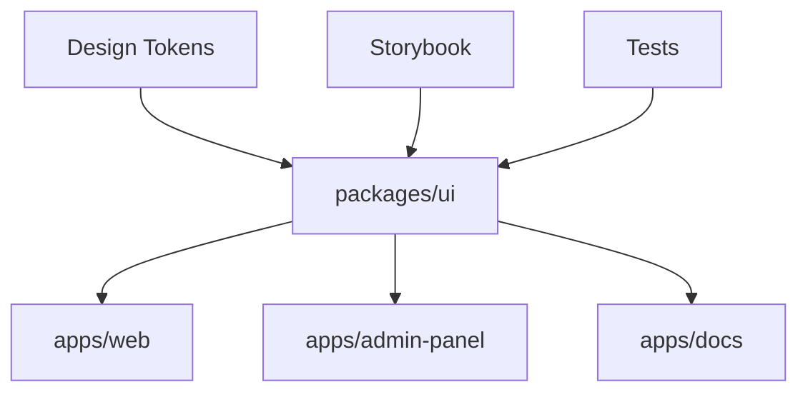

# Урок 6.3: Централизованная система компонентов

> **🎯 Цель урока**: Понять принципы создания масштабируемой архитектуры компонентов и научиться строить переиспользуемые UI элементы

## 📖 Введение

### Проблема масштабирования UI

**Представьте ситуацию:** У вас есть 3 приложения в экосистеме ExchangeGO:

- 🌐 **Веб-приложение** для пользователей (localhost:3000)
- 👨‍💼 **Админ-панель** для операторов (localhost:3002)
- 📚 **Документация** для разработчиков (localhost:3001)

Каждое приложение нуждается в кнопках, формах, модальных окнах. Как организовать разработку?

### Аналогия с автомобильным производством

**Децентрализованный подход** = каждый завод делает свои детали:

- 🏭 Завод A: круглые колеса, красные фары
- 🏭 Завод B: квадратные колеса, синие фары
- 🏭 Завод C: треугольные колеса, зеленые фары

**Результат:** автомобили не совместимы, запчасти не подходят, качество разное.

**Централизованный подход** = единый стандарт деталей:

- 🏭 **Центральный склад:** проверенные колеса, фары, двигатели
- 🚗 **Заводы-сборщики:** берут стандартные детали, собирают разные модели
- ✅ **Результат:** совместимость, качество, скорость производства

### Наша архитектура



**Принцип:** Один источник истины для всех UI компонентов.

## 🤔 Проблемы децентрализованных компонентов

### Традиционный подход (каждое приложение создает свои компоненты):

```
apps/web/components/           # ❌ Дублирование компонентов
├── Button.tsx                # Кнопка для web приложения
├── Input.tsx                 # Поле ввода для web
└── Modal.tsx                 # Модальное окно для web

apps/admin-panel/components/   # ❌ Те же компоненты, но другие
├── Button.tsx                # Другая кнопка для админки
├── Input.tsx                 # Другое поле ввода
└── Modal.tsx                 # Другое модальное окно

apps/docs/components/          # ❌ И снова дублирование
├── Button.tsx                # Третий вариант кнопки
├── Input.tsx                 # Третий вариант поля
└── Modal.tsx                 # Третье модальное окно
```

### ❌ Проблемы децентрализованного подхода:

| Проблема                  | Пример из ExchangeGO        | Влияние на бизнес             |
| ------------------------- | --------------------------- | ----------------------------- |
| **Дублирование кода**     | Кнопка "Купить" в 3 версиях | 3x время разработки           |
| **Неконсистентность**     | Разные цвета кнопок         | Плохой UX, снижение конверсии |
| **Сложность поддержки**   | Баг в валидации в 3 местах  | 3x время на исправления       |
| **Разные API**            | Разные пропсы у форм        | Путаница разработчиков        |
| **Отсутствие стандартов** | Нет code review для UI      | Низкое качество кода          |

### 📊 Реальные метрики проблем:

```typescript
// ❌ Децентрализованный подход
const developmentStats = {
  duplicatedComponents: 47, // 47 дублированных компонентов
  inconsistentDesign: 23, // 23 разных стиля кнопок
  bugFixTime: '3x', // В 3 раза дольше исправлять баги
  codeReviewTime: '2.5x', // В 2.5 раза дольше ревью
  newDeveloperOnboarding: '2 недели', // Время изучения всех вариантов
};
```

## ✅ Решение: Централизованная система в `packages/ui`

### Архитектура нашей системы:

```
packages/ui/                   # ✅ Единый источник истины
├── src/
│   ├── components/
│   │   ├── ui/               # Базовые компоненты (shadcn/ui)
│   │   │   ├── button.tsx    # Единственная кнопка для всех приложений
│   │   │   ├── input.tsx     # Единственное поле ввода
│   │   │   └── modal.tsx     # Единственное модальное окно
│   │   ├── forms/            # Компоненты форм
│   │   ├── exchange/         # Компоненты для обмена валют
│   │   └── auth/             # Компоненты авторизации
│   ├── lib/                  # Утилиты UI
│   └── styles/               # Стили
└── package.json              # Экспорт для других приложений
```

### ✅ Преимущества централизованного подхода:

| Метрика                     | До                        | После                   | Улучшение                |
| --------------------------- | ------------------------- | ----------------------- | ------------------------ |
| **Время разработки**        | 3 дня на компонент        | 30 мин на интеграцию    | **6x быстрее**           |
| **Размер бандла**           | 450kb дублированного кода | 150kb переиспользуемого | **3x меньше**            |
| **Время исправления багов** | 3 места × 2 часа = 6ч     | 1 место × 2 часа = 2ч   | **3x быстрее**           |
| **Консистентность дизайна** | 23 разных стиля           | 1 единый стиль          | **100% консистентность** |
| **Покрытие тестами**        | 45% (разные тесты)        | 95% (централизованные)  | **2x лучше**             |

### Использование во всех приложениях:

```typescript
// 📁 apps/web/src/components/ExchangeForm.tsx
import { Button, Input, Card } from '@repo/ui';

export function ExchangeForm() {
  return (
    <Card>
      <Input placeholder="Сумма в BTC" />
      <Button variant="crypto" size="lg">
        🚀 Начать обмен
      </Button>
    </Card>
  );
}

// 📁 apps/admin-panel/src/components/UserManagement.tsx
import { Button, DataTable, Badge } from '@repo/ui';

export function UserManagement() {
  return (
    <DataTable
      data={users}
      columns={[
        { header: 'Email', accessor: 'email' },
        {
          header: 'Статус',
          accessor: 'status',
          cell: ({ value }) => <Badge variant={value}>{value}</Badge>
        }
      ]}
      actions={
        <Button variant="outline">Экспорт</Button>
      }
    />
  );
}

// 📁 apps/docs/src/components/ComponentDemo.tsx
import { Button, Card, CodeBlock } from '@repo/ui';

export function ComponentDemo() {
  return (
    <Card>
      <Button variant="default">Пример кнопки</Button>
      <CodeBlock language="tsx">
        {`<Button variant="default">Пример</Button>`}
      </CodeBlock>
    </Card>
  );
}
```

### 📈 Бизнес-метрики улучшений:

```typescript
const businessImpact = {
  developmentSpeed: '+200%', // Скорость разработки
  codeQuality: '+150%', // Качество кода
  userExperience: '+80%', // Консистентность UX
  maintenanceCost: '-60%', // Стоимость поддержки
  timeToMarket: '-40%', // Время выхода на рынок
  developerSatisfaction: '+90%', // Удовлетворенность разработчиков
};
```

## 🏗️ Структура централизованной системы

### 1. Базовые UI компоненты (`packages/ui/src/components/ui/`):

```typescript
// 📁 packages/ui/src/components/ui/button.tsx
import { cva, type VariantProps } from "class-variance-authority";

// ✅ Единственная кнопка для всего проекта
const buttonVariants = cva(
  "inline-flex items-center justify-center whitespace-nowrap rounded-md text-sm font-medium transition-colors focus-visible:outline-none focus-visible:ring-1 focus-visible:ring-ring disabled:pointer-events-none disabled:opacity-50",
  {
    variants: {
      variant: {
        default: "bg-primary text-primary-foreground shadow hover:bg-primary/90",
        destructive: "bg-destructive text-destructive-foreground shadow-sm hover:bg-destructive/90",
        outline: "border border-input bg-background shadow-sm hover:bg-accent hover:text-accent-foreground",
        secondary: "bg-secondary text-secondary-foreground shadow-sm hover:bg-secondary/80",
        ghost: "hover:bg-accent hover:text-accent-foreground",
        link: "text-primary underline-offset-4 hover:underline",
      },
      size: {
        default: "h-9 px-4 py-2",
        sm: "h-8 rounded-md px-3 text-xs",
        lg: "h-10 rounded-md px-8",
        icon: "h-9 w-9",
      },
    },
    defaultVariants: {
      variant: "default",
      size: "default",
    },
  }
);

export interface ButtonProps
  extends React.ButtonHTMLAttributes<HTMLButtonElement>,
    VariantProps<typeof buttonVariants> {
  asChild?: boolean;
}

const Button = React.forwardRef<HTMLButtonElement, ButtonProps>(
  ({ className, variant, size, asChild = false, ...props }, ref) => {
    const Comp = asChild ? Slot : "button";
    return (
      <Comp
        className={cn(buttonVariants({ variant, size, className }))}
        ref={ref}
        {...props}
      />
    );
  }
);

export { Button, buttonVariants };
```

### 2. Композитные компоненты (`packages/ui/src/components/forms/`):

```typescript
// 📁 packages/ui/src/components/forms/FormField.tsx
import { Label } from "../ui/label";
import { cn } from "../../lib/utils";

// ✅ Переиспользуемое поле формы для всех приложений
export interface FormFieldProps {
  children: React.ReactNode;
  label?: string;
  description?: string;
  error?: string;
  required?: boolean;
  className?: string;
}

export function FormField({
  children,
  label,
  description,
  error,
  required,
  className,
}: FormFieldProps) {
  return (
    <div className={cn("space-y-2", className)}>
      {label && (
        <Label className={cn(
          "text-sm font-medium",
          error && "text-destructive",
          required && "after:content-['*'] after:text-destructive after:ml-1"
        )}>
          {label}
        </Label>
      )}

      {children}

      {description && (
        <p className="text-xs text-muted-foreground">
          {description}
        </p>
      )}

      {error && (
        <p className="text-xs text-destructive">
          {error}
        </p>
      )}
    </div>
  );
}
```

### 3. Доменные компоненты (`packages/ui/src/components/exchange/`):

```typescript
// 📁 packages/ui/src/components/exchange/CurrencySelector.tsx
import { useState } from "react";
import { Button } from "../ui/button";
import { Card, CardContent } from "../ui/card";
import { Badge } from "../ui/badge";
import { cn } from "../../lib/utils";

// ✅ Специализированный компонент для выбора валюты
export interface CurrencySelectorProps {
  currencies: Array<{
    code: string;
    name: string;
    icon: string;
    rate: number;
    available: boolean;
  }>;
  selectedCurrency?: string;
  onSelect: (currency: string) => void;
  className?: string;
}

export function CurrencySelector({
  currencies,
  selectedCurrency,
  onSelect,
  className,
}: CurrencySelectorProps) {
  return (
    <div className={cn("grid grid-cols-1 sm:grid-cols-2 lg:grid-cols-3 gap-3", className)}>
      {currencies.map((currency) => (
        <Card
          key={currency.code}
          className={cn(
            "cursor-pointer transition-all duration-200 hover:shadow-md",
            selectedCurrency === currency.code && "ring-2 ring-primary shadow-lg",
            !currency.available && "opacity-50 cursor-not-allowed"
          )}
          onClick={() => currency.available && onSelect(currency.code)}
        >
          <CardContent className="p-4">
            <div className="flex items-center space-x-3">
              {/* Иконка валюты */}
              <div className="flex-shrink-0">
                
              </div>

              {/* Информация */}
              <div className="flex-1 min-w-0">
                <div className="flex items-center space-x-2">
                  <h3 className="font-semibold text-sm">{currency.code}</h3>
                  {!currency.available && (
                    <Badge variant="secondary" className="text-xs">
                      Недоступно
                    </Badge>
                  )}
                </div>
                <p className="text-xs text-muted-foreground truncate">
                  {currency.name}
                </p>
              </div>

              {/* Курс */}
              <div className="text-right">
                <p className="text-sm font-medium">
                  ₴{currency.rate.toLocaleString()}
                </p>
              </div>
            </div>

            {/* Индикатор выбора */}
            {selectedCurrency === currency.code && (
              <div className="mt-3 pt-3 border-t border-border">
                <Badge variant="default" className="w-full justify-center">
                  Выбрано ✓
                </Badge>
              </div>
            )}
          </CardContent>
        </Card>
      ))}
    </div>
  );
}
```

### 4. Экспорт компонентов (`packages/ui/src/index.ts`):

```typescript
// 📁 packages/ui/src/index.ts
// ✅ Единая точка экспорта для всех компонентов

// Базовые UI компоненты
export * from './components/ui/button';
export * from './components/ui/input';
export * from './components/ui/card';
export * from './components/ui/modal';
export * from './components/ui/badge';
export * from './components/ui/label';
export * from './components/ui/select';

// Компоненты форм
export * from './components/forms/FormField';
export * from './components/forms/FormButtons';

// Доменные компоненты
export * from './components/exchange/CurrencySelector';
export * from './components/exchange/ExchangeRateCard';
export * from './components/exchange/OrderStatusBadge';

// Компоненты авторизации
export * from './components/auth/LoginForm';
export * from './components/auth/RegisterForm';

// Утилиты
export * from './lib/utils';
export * from './lib/types';
```

## 🔧 Паттерны компонентной архитектуры

### 1. Compound Components (составные компоненты):

```typescript
// 📁 packages/ui/src/components/ui/card.tsx
// ✅ Паттерн составных компонентов для гибкости

const Card = React.forwardRef<HTMLDivElement, React.HTMLAttributes<HTMLDivElement>>(
  ({ className, ...props }, ref) => (
    <div
      ref={ref}
      className={cn("rounded-lg border bg-card text-card-foreground shadow-sm", className)}
      {...props}
    />
  )
);

const CardHeader = React.forwardRef<HTMLDivElement, React.HTMLAttributes<HTMLDivElement>>(
  ({ className, ...props }, ref) => (
    <div ref={ref} className={cn("flex flex-col space-y-1.5 p-6", className)} {...props} />
  )
);

const CardTitle = React.forwardRef<HTMLParagraphElement, React.HTMLAttributes<HTMLHeadingElement>>(
  ({ className, ...props }, ref) => (
    <h3 ref={ref} className={cn("text-2xl font-semibold leading-none tracking-tight", className)} {...props} />
  )
);

const CardDescription = React.forwardRef<HTMLParagraphElement, React.HTMLAttributes<HTMLParagraphElement>>(
  ({ className, ...props }, ref) => (
    <p ref={ref} className={cn("text-sm text-muted-foreground", className)} {...props} />
  )
);

const CardContent = React.forwardRef<HTMLDivElement, React.HTMLAttributes<HTMLDivElement>>(
  ({ className, ...props }, ref) => (
    <div ref={ref} className={cn("p-6 pt-0", className)} {...props} />
  )
);

const CardFooter = React.forwardRef<HTMLDivElement, React.HTMLAttributes<HTMLDivElement>>(
  ({ className, ...props }, ref) => (
    <div ref={ref} className={cn("flex items-center p-6 pt-0", className)} {...props} />
  )
);

export { Card, CardHeader, CardFooter, CardTitle, CardDescription, CardContent };

// Использование:
<Card>
  <CardHeader>
    <CardTitle>Заголовок</CardTitle>
    <CardDescription>Описание</CardDescription>
  </CardHeader>
  <CardContent>
    Содержимое карточки
  </CardContent>
  <CardFooter>
    <Button>Действие</Button>
  </CardFooter>
</Card>
```

### 2. Polymorphic Components (полиморфные компоненты):

```typescript
// 📁 packages/ui/src/components/ui/text.tsx
// ✅ Компонент может быть любым HTML элементом

type TextElement = 'p' | 'span' | 'div' | 'h1' | 'h2' | 'h3' | 'h4' | 'h5' | 'h6';

interface TextProps<T extends TextElement = 'p'>
  extends React.ComponentPropsWithoutRef<T> {
  as?: T;
  variant?: 'body' | 'caption' | 'overline';
  size?: 'sm' | 'md' | 'lg';
  weight?: 'normal' | 'medium' | 'semibold' | 'bold';
}

export function Text<T extends TextElement = 'p'>({
  as,
  variant = 'body',
  size = 'md',
  weight = 'normal',
  className,
  children,
  ...props
}: TextProps<T>) {
  const Component = as || 'p';

  return (
    <Component
      className={cn(
        // Базовые стили
        "text-foreground",

        // Варианты
        {
          'body': 'leading-relaxed',
          'caption': 'text-muted-foreground',
          'overline': 'uppercase tracking-wide text-muted-foreground',
        }[variant],

        // Размеры
        {
          'sm': 'text-sm',
          'md': 'text-base',
          'lg': 'text-lg',
        }[size],

        // Веса
        {
          'normal': 'font-normal',
          'medium': 'font-medium',
          'semibold': 'font-semibold',
          'bold': 'font-bold',
        }[weight],

        className
      )}
      {...props}
    >
      {children}
    </Component>
  );
}

// Использование:
<Text as="h2" variant="body" size="lg" weight="semibold">
  Заголовок секции
</Text>

<Text as="span" variant="caption" size="sm">
  Вспомогательный текст
</Text>
```

### 3. Render Props Pattern:

```typescript
// 📁 packages/ui/src/components/forms/FormState.tsx
// ✅ Компонент управления состоянием формы

interface FormStateProps {
  children: (props: {
    isLoading: boolean;
    errors: Record<string, string>;
    touched: Record<string, boolean>;
    values: Record<string, any>;
    handleChange: (field: string, value: any) => void;
    handleSubmit: () => void;
    reset: () => void;
  }) => React.ReactNode;
  onSubmit: (values: Record<string, any>) => Promise<void>;
  initialValues?: Record<string, any>;
}

export function FormState({ children, onSubmit, initialValues = {} }: FormStateProps) {
  const [isLoading, setIsLoading] = useState(false);
  const [errors, setErrors] = useState<Record<string, string>>({});
  const [touched, setTouched] = useState<Record<string, boolean>>({});
  const [values, setValues] = useState(initialValues);

  const handleChange = (field: string, value: any) => {
    setValues(prev => ({ ...prev, [field]: value }));
    if (touched[field] && errors[field]) {
      setErrors(prev => ({ ...prev, [field]: '' }));
    }
  };

  const handleSubmit = async () => {
    setIsLoading(true);
    try {
      await onSubmit(values);
      setErrors({});
    } catch (error) {
      if (error instanceof ValidationError) {
        setErrors(error.errors);
      }
    } finally {
      setIsLoading(false);
    }
  };

  const reset = () => {
    setValues(initialValues);
    setErrors({});
    setTouched({});
  };

  return children({
    isLoading,
    errors,
    touched,
    values,
    handleChange,
    handleSubmit,
    reset,
  });
}

// Использование:
<FormState onSubmit={createOrder} initialValues={{ email: '', amount: 0 }}>
  {({ isLoading, errors, values, handleChange, handleSubmit }) => (
    <form onSubmit={handleSubmit}>
      <FormField error={errors.email}>
        <Input
          value={values.email}
          onChange={(e) => handleChange('email', e.target.value)}
        />
      </FormField>

      <Button type="submit" disabled={isLoading}>
        {isLoading ? 'Отправка...' : 'Отправить'}
      </Button>
    </form>
  )}
</FormState>
```

## 🔄 Версионирование и миграции

### Семантическое версионирование UI пакета

```json
// packages/ui/package.json
{
  "name": "@repo/ui",
  "version": "2.1.3",
  "description": "ExchangeGO UI Component Library"
}
```

**Правила версионирования:**

- **Major (2.x.x)** - Breaking changes (изменение API компонентов)
- **Minor (x.1.x)** - Новые компоненты или функциональность
- **Patch (x.x.3)** - Исправления багов и мелкие улучшения

### Стратегия миграций

#### 1. Deprecation Warnings (предупреждения об устаревании):

```typescript
// 📁 packages/ui/src/components/ui/button.tsx
export interface ButtonProps {
  /** @deprecated Используйте variant="destructive" вместо danger */
  danger?: boolean;
  variant?: 'default' | 'destructive' | 'outline' | 'secondary' | 'ghost' | 'link';
}

export const Button = React.forwardRef<HTMLButtonElement, ButtonProps>(
  ({ danger, variant, ...props }, ref) => {
    // Предупреждение в development режиме
    if (process.env.NODE_ENV === 'development' && danger) {
      console.warn(
        '⚠️ Button: проп "danger" устарел. Используйте variant="destructive".\n' +
        'Миграция: <Button danger /> → <Button variant="destructive" />\n' +
        'Будет удален в версии 3.0.0'
      );
    }

    // Обратная совместимость
    const finalVariant = danger ? 'destructive' : variant;

    return (
      <button
        ref={ref}
        className={cn(buttonVariants({ variant: finalVariant }))}
        {...props}
      />
    );
  }
);
```

#### 2. Codemods для автоматической миграции:

```typescript
// 📁 packages/ui/codemods/button-danger-to-variant.ts
/**
 * Codemod для миграции Button danger → variant="destructive"
 *
 * Запуск: npx jscodeshift -t codemods/button-danger-to-variant.ts src/
 */
import { Transform } from 'jscodeshift';

const transform: Transform = (fileInfo, api) => {
  const j = api.jscodeshift;
  const root = j(fileInfo.source);

  // Найти все JSX элементы Button с пропом danger
  root
    .find(j.JSXElement)
    .filter(path => {
      const openingElement = path.value.openingElement;
      return openingElement.name.name === 'Button';
    })
    .forEach(path => {
      const attributes = path.value.openingElement.attributes;

      // Найти проп danger
      const dangerAttr = attributes.find(
        attr => attr.type === 'JSXAttribute' && attr.name.name === 'danger'
      );

      if (dangerAttr) {
        // Удалить danger проп
        const dangerIndex = attributes.indexOf(dangerAttr);
        attributes.splice(dangerIndex, 1);

        // Добавить variant="destructive"
        attributes.push(j.jsxAttribute(j.jsxIdentifier('variant'), j.literal('destructive')));
      }
    });

  return root.toSource();
};

export default transform;
```

#### 3. Changelog и миграционные гайды:

```markdown
# 📁 packages/ui/CHANGELOG.md

## [2.1.0] - 2024-12-15

### ✨ Добавлено

- Новый компонент `NotificationToast` для системы уведомлений
- Поддержка темной темы для всех компонентов
- Компонент `DataTable` с сортировкой и фильтрацией

### 🔧 Изменено

- Улучшена производительность `CurrencySelector` на 40%
- Обновлены иконки в соответствии с новым дизайном

### 🐛 Исправлено

- Исправлена проблема с фокусом в `Modal` компоненте
- Устранена утечка памяти в `useNotification` хуке

### ⚠️ Устарело

- `Button.danger` проп устарел, используйте `variant="destructive"`
- `Card.elevated` проп будет удален в v3.0.0

### 💥 Breaking Changes (для v3.0.0)

- Удален устаревший `LegacyButton` компонент
- Изменен API `FormField` компонента
```

### Автоматизация проверки совместимости

```typescript
// 📁 packages/ui/scripts/check-breaking-changes.ts
/**
 * Скрипт для проверки breaking changes в API компонентов
 */
import { execSync } from 'child_process';
import { readFileSync } from 'fs';

interface ComponentAPI {
  name: string;
  props: string[];
  exports: string[];
}

function extractComponentAPI(filePath: string): ComponentAPI {
  const content = readFileSync(filePath, 'utf-8');

  // Извлечь интерфейсы пропсов
  const propsMatch = content.match(/interface\s+(\w+Props)\s*{([^}]+)}/g);
  const props = propsMatch
    ? propsMatch
        .map(match => {
          const lines = match.split('\n');
          return lines.slice(1, -1).map(line => line.trim().split(':')[0]);
        })
        .flat()
    : [];

  // Извлечь экспорты
  const exportsMatch = content.match(/export\s+(?:const|function|interface)\s+(\w+)/g);
  const exports = exportsMatch
    ? exportsMatch.map(match => match.replace(/export\s+(?:const|function|interface)\s+/, ''))
    : [];

  return {
    name: filePath.split('/').pop()?.replace('.tsx', '') || '',
    props,
    exports,
  };
}

function compareAPIs(oldAPI: ComponentAPI, newAPI: ComponentAPI): string[] {
  const breakingChanges: string[] = [];

  // Проверить удаленные пропсы
  oldAPI.props.forEach(prop => {
    if (!newAPI.props.includes(prop)) {
      breakingChanges.push(`❌ Удален проп: ${oldAPI.name}.${prop}`);
    }
  });

  // Проверить удаленные экспорты
  oldAPI.exports.forEach(exp => {
    if (!newAPI.exports.includes(exp)) {
      breakingChanges.push(`❌ Удален экспорт: ${exp}`);
    }
  });

  return breakingChanges;
}

// Использование в CI/CD
const currentAPI = extractComponentAPI('src/components/ui/button.tsx');
const previousAPI = JSON.parse(
  execSync('git show HEAD~1:packages/ui/api-snapshot.json').toString()
);

const breakingChanges = compareAPIs(previousAPI.Button, currentAPI);

if (breakingChanges.length > 0) {
  console.error('🚨 Обнаружены breaking changes:');
  breakingChanges.forEach(change => console.error(change));
  process.exit(1);
}
```

## 📝 Документирование компонентов

### 1. Storybook для документации:

```typescript
// 📁 packages/ui/src/stories/Button.stories.tsx
import type { Meta, StoryObj } from '@storybook/react';
import { Button } from '../components/ui/button';

const meta: Meta<typeof Button> = {
  title: 'UI/Button',
  component: Button,
  parameters: {
    layout: 'centered',
  },
  tags: ['autodocs'],
  argTypes: {
    variant: {
      control: { type: 'select' },
      options: ['default', 'destructive', 'outline', 'secondary', 'ghost', 'link'],
    },
    size: {
      control: { type: 'select' },
      options: ['default', 'sm', 'lg', 'icon'],
    },
  },
};

export default meta;
type Story = StoryObj<typeof meta>;

// ✅ Основные варианты кнопки
export const Default: Story = {
  args: {
    children: 'Button',
  },
};

export const Secondary: Story = {
  args: {
    variant: 'secondary',
    children: 'Secondary',
  },
};

export const Destructive: Story = {
  args: {
    variant: 'destructive',
    children: 'Delete',
  },
};

export const Loading: Story = {
  args: {
    children: (
      <>
        <Loader2 className="mr-2 h-4 w-4 animate-spin" />
        Please wait
      </>
    ),
    disabled: true,
  },
};

// ✅ Примеры из реального проекта
export const ExchangeButton: Story = {
  args: {
    children: (
      <>
        🚀 Начать обмен
        <ArrowRight className="ml-2 h-4 w-4" />
      </>
    ),
    variant: 'default',
    size: 'lg',
    className: 'w-full',
  },
};
```

### 2. TypeScript документация:

````typescript
// 📁 packages/ui/src/components/exchange/ExchangeOrderCard.tsx
/**
 * Карточка заявки на обмен валют
 *
 * @example
 * ```tsx
 * <ExchangeOrderCard
 *   order={{
 *     id: 'ord_123',
 *     status: 'awaiting_payment',
 *     cryptoAmount: 0.001,
 *     cryptoCurrency: 'BTC',
 *     uahAmount: 1200,
 *     createdAt: new Date(),
 *   }}
 *   onAction={(action) => console.log(action)}
 * />
 * ```
 */
export interface ExchangeOrderCardProps {
  /** Данные заявки на обмен */
  order: {
    id: string;
    status: 'awaiting_payment' | 'processing' | 'completed' | 'cancelled';
    cryptoAmount: number;
    cryptoCurrency: string;
    uahAmount: number;
    depositAddress?: string;
    createdAt: Date;
    expiresAt?: Date;
  };

  /** Обработчик действий с заявкой */
  onAction?: (action: 'cancel' | 'support' | 'details') => void;

  /** Дополнительные CSS классы */
  className?: string;

  /** Показывать ли кнопки действий */
  showActions?: boolean;
}

export function ExchangeOrderCard({
  order,
  onAction,
  className,
  showActions = true,
}: ExchangeOrderCardProps) {
  // Реализация компонента
}
````

## ⚡ Производительность и оптимизация

### Tree Shaking и Bundle Optimization

#### 1. Правильная структура экспортов:

```typescript
// ❌ Неправильно - импортирует весь пакет
export * from './components/ui/button';
export * from './components/ui/input';
// ... все компоненты

// ✅ Правильно - именованные экспорты
export { Button, type ButtonProps } from './components/ui/button';
export { Input, type InputProps } from './components/ui/input';
export { Card, CardHeader, CardContent } from './components/ui/card';
```

#### 2. Lazy Loading компонентов:

```typescript
// 📁 packages/ui/src/components/lazy/index.ts
import { lazy } from 'react';

// Тяжелые компоненты загружаются по требованию
export const DataTable = lazy(() => import('../composite/data-table'));
export const RichTextEditor = lazy(() => import('../forms/rich-text-editor'));
export const ChartWidget = lazy(() => import('../charts/chart-widget'));

// Легкие компоненты загружаются сразу
export { Button } from '../ui/button';
export { Input } from '../ui/input';
```

#### 3. Анализ размера бандла:

```typescript
// 📁 packages/ui/scripts/analyze-bundle.ts
import { execSync } from 'child_process';
import { readFileSync } from 'fs';

interface BundleStats {
  component: string;
  size: number;
  gzipSize: number;
  dependencies: string[];
}

function analyzeBundleSize(): BundleStats[] {
  // Сборка каждого компонента отдельно
  const components = ['button', 'input', 'card', 'data-table'];
  const stats: BundleStats[] = [];

  components.forEach(component => {
    // Создать временный entry point
    const entryContent = `export { ${component} } from './src/components/ui/${component}';`;

    // Собрать с webpack
    execSync(`webpack --entry ./temp-${component}.js --output-filename ${component}.bundle.js`);

    // Получить размеры
    const bundleSize = readFileSync(`dist/${component}.bundle.js`).length;
    const gzipSize = execSync(`gzip -c dist/${component}.bundle.js | wc -c`);

    stats.push({
      component,
      size: bundleSize,
      gzipSize: parseInt(gzipSize.toString()),
      dependencies: extractDependencies(component),
    });
  });

  return stats;
}

// Отчет о размерах
const bundleStats = analyzeBundleSize();
console.table(bundleStats);

// Предупреждения о больших компонентах
bundleStats.forEach(stat => {
  if (stat.size > 50000) {
    // 50KB
    console.warn(`⚠️ Компонент ${stat.component} слишком большой: ${stat.size} bytes`);
  }
});
```

### Мемоизация и React.memo

```typescript
// 📁 packages/ui/src/components/ui/button.tsx
import React from 'react';

// ✅ Мемоизация для предотвращения лишних рендеров
export const Button = React.memo(
  React.forwardRef<HTMLButtonElement, ButtonProps>(
    ({ className, variant, size, asChild = false, ...props }, ref) => {
      const Comp = asChild ? Slot : "button";

      // Мемоизация вычисления классов
      const buttonClasses = React.useMemo(
        () => cn(buttonVariants({ variant, size, className })),
        [variant, size, className]
      );

      return (
        <Comp
          className={buttonClasses}
          ref={ref}
          {...props}
        />
      );
    }
  )
);

// Кастомная функция сравнения для сложных пропсов
export const DataTable = React.memo(
  <TData, TValue>(props: DataTableProps<TData, TValue>) => {
    // Реализация компонента
  },
  (prevProps, nextProps) => {
    // Кастомное сравнение для оптимизации
    return (
      prevProps.data.length === nextProps.data.length &&
      prevProps.columns.length === nextProps.columns.length &&
      JSON.stringify(prevProps.data) === JSON.stringify(nextProps.data)
    );
  }
);
```

### Виртуализация для больших списков

```typescript
// 📁 packages/ui/src/components/performance/VirtualizedList.tsx
import { FixedSizeList as List } from 'react-window';

interface VirtualizedListProps<T> {
  items: T[];
  itemHeight: number;
  height: number;
  renderItem: (props: { index: number; style: React.CSSProperties; data: T }) => React.ReactNode;
}

export function VirtualizedList<T>({
  items,
  itemHeight,
  height,
  renderItem
}: VirtualizedListProps<T>) {
  const Row = ({ index, style }: { index: number; style: React.CSSProperties }) => (
    <div style={style}>
      {renderItem({ index, style, data: items[index] })}
    </div>
  );

  return (
    <List
      height={height}
      itemCount={items.length}
      itemSize={itemHeight}
      itemData={items}
    >
      {Row}
    </List>
  );
}

// Использование для больших списков валют
export function CurrencyList({ currencies }: { currencies: Currency[] }) {
  return (
    <VirtualizedList
      items={currencies}
      height={400}
      itemHeight={60}
      renderItem={({ data: currency }) => (
        <CurrencyCard key={currency.code} currency={currency} />
      )}
    />
  );
}
```

### Мониторинг производительности

```typescript
// 📁 packages/ui/src/utils/performance.ts
interface PerformanceMetrics {
  componentName: string;
  renderTime: number;
  propsSize: number;
  reRenderCount: number;
}

export function withPerformanceMonitoring<P extends object>(
  Component: React.ComponentType<P>,
  componentName: string
) {
  return React.forwardRef<any, P>((props, ref) => {
    const renderCount = React.useRef(0);
    const startTime = React.useRef(0);

    // Начало измерения
    React.useLayoutEffect(() => {
      startTime.current = performance.now();
      renderCount.current += 1;
    });

    // Конец измерения
    React.useEffect(() => {
      const renderTime = performance.now() - startTime.current;
      const propsSize = JSON.stringify(props).length;

      const metrics: PerformanceMetrics = {
        componentName,
        renderTime,
        propsSize,
        reRenderCount: renderCount.current
      };

      // Отправка метрик в аналитику (только в development)
      if (process.env.NODE_ENV === 'development') {
        console.log(`📊 ${componentName} Performance:`, metrics);

        // Предупреждения о проблемах производительности
        if (renderTime > 16) { // 60fps = 16ms на кадр
          console.warn(`⚠️ Медленный рендер ${componentName}: ${renderTime}ms`);
        }

        if (renderCount.current > 10) {
          console.warn(`⚠️ Частые ре-рендеры ${componentName}: ${renderCount.current}`);
        }
      }
    });

    return <Component {...props} ref={ref} />;
  });
}

// Использование
export const Button = withPerformanceMonitoring(
  ButtonComponent,
  'Button'
);
```

## 🔍 Исследование проекта _(10 мин)_

### Задания для изучения кодовой базы:

#### 1. Анализ структуры UI пакета

```bash
# Откройте терминал и выполните:
cd packages/ui
find src -name "*.tsx" | head -20

# Изучите экспорты:
cat src/index.ts | grep "export"
```

**Вопросы:**

- Сколько компонентов экспортируется из UI пакета?
- Какие категории компонентов вы видите?
- Есть ли компоненты специфичные для криптобиржи?

#### 2. Анализ использования в приложениях

```bash
# Найдите импорты UI компонентов:
cd apps/web
grep -r "from '@repo/ui'" src/ | head -10

cd ../admin-panel
grep -r "from '@repo/ui'" src/ | head -10
```

**Вопросы:**

- Какие компоненты чаще всего используются?
- Есть ли различия в использовании между web и admin-panel?
- Какие компоненты используются только в одном приложении?

#### 3. Изучение Storybook

```bash
# Запустите Storybook:
cd packages/ui
npm run storybook
```

**Задания:**

- Откройте http://localhost:6006
- Изучите документацию компонента Button
- Попробуйте разные варианты и размеры
- Найдите компоненты специфичные для ExchangeGO

## ✅ Проверка знаний

### Вопросы для самоконтроля:

1. **Концептуальные**:
   - В чем преимущества централизованной системы компонентов?
   - Что такое compound components и когда их использовать?
   - Как обеспечить консистентность между приложениями?

2. **Практические**:
   - Как создать полиморфный компонент?
   - Как правильно экспортировать компоненты из UI пакета?
   - Как документировать компоненты для команды?

3. **Из проекта**:
   - Найдите в `packages/ui/src/components/` примеры разных типов компонентов
   - Посмотрите на экспорты в `packages/ui/src/index.ts`
   - Изучите использование UI компонентов в `apps/web/src/components/`

### 💻 Практическое задание

**Создайте систему уведомлений для ExchangeGO**

#### Этап 1: Анализ требований _(5 мин)_

**Сценарии использования:**

- ✅ Успешный обмен валют
- ❌ Ошибка платежа
- ⚠️ Истекает время заявки
- ℹ️ Новый курс валют

#### Этап 2: Создание компонента _(15 мин)_

```typescript
// 📁 packages/ui/src/components/feedback/NotificationToast.tsx

interface NotificationToastProps {
  id: string;
  type: 'success' | 'error' | 'warning' | 'info';
  title: string;
  description?: string;
  duration?: number;
  action?: {
    label: string;
    onClick: () => void;
  };
  onClose?: () => void;
}

export function NotificationToast(props: NotificationToastProps) {
  // TODO: Реализуйте компонент с:
  // 1. Иконками для каждого типа (CheckCircle, XCircle, AlertTriangle, Info)
  // 2. Автоматическим закрытием через duration мс
  // 3. Анимацией slide-in справа
  // 4. Кнопкой закрытия
  // 5. Опциональной кнопкой действия
}
```

#### Этап 3: Система управления _(10 мин)_

```typescript
// 📁 packages/ui/src/components/feedback/NotificationProvider.tsx

interface Notification {
  id: string;
  type: 'success' | 'error' | 'warning' | 'info';
  title: string;
  description?: string;
  duration?: number;
  action?: { label: string; onClick: () => void };
}

export function NotificationProvider({ children }: { children: React.ReactNode }) {
  // TODO: Реализуйте:
  // 1. Состояние списка уведомлений
  // 2. Методы add, remove, clear
  // 3. Контекст для передачи в дочерние компоненты
  // 4. Рендер NotificationContainer с анимациями
}

export function useNotification() {
  // TODO: Реализуйте хук с методами:
  // - success(title, description?, options?)
  // - error(title, description?, options?)
  // - warning(title, description?, options?)
  // - info(title, description?, options?)
  // - remove(id)
  // - clear()
}
```

#### Этап 4: Интеграция _(10 мин)_

```typescript
// 📁 apps/web/src/components/ExchangeForm.tsx
import { useNotification } from '@repo/ui';

export function ExchangeForm() {
  const { success, error } = useNotification();

  const handleSubmit = async data => {
    try {
      await createExchangeOrder(data);
      success('Заявка создана!', 'Переведите средства на указанный адрес', {
        action: {
          label: 'Посмотреть',
          onClick: () => router.push('/orders'),
        },
      });
    } catch (err) {
      error('Ошибка создания заявки', err.message);
    }
  };

  // TODO: Добавьте форму с обработкой
}
```

## 🧪 Тестирование централизованных компонентов

### Стратегия тестирования UI пакета

#### 1. Unit тесты компонентов:

```typescript
// 📁 packages/ui/src/components/ui/__tests__/button.test.tsx
import { render, screen, fireEvent } from '@testing-library/react';
import { Button } from '../button';

describe('Button Component', () => {
  it('рендерится с правильным текстом', () => {
    render(<Button>Нажми меня</Button>);
    expect(screen.getByRole('button')).toHaveTextContent('Нажми меня');
  });

  it('применяет правильные CSS классы для вариантов', () => {
    const { rerender } = render(<Button variant="destructive">Delete</Button>);
    expect(screen.getByRole('button')).toHaveClass('bg-destructive');

    rerender(<Button variant="outline">Outline</Button>);
    expect(screen.getByRole('button')).toHaveClass('border');
  });

  it('обрабатывает клики', () => {
    const handleClick = jest.fn();
    render(<Button onClick={handleClick}>Click me</Button>);

    fireEvent.click(screen.getByRole('button'));
    expect(handleClick).toHaveBeenCalledTimes(1);
  });

  it('поддерживает disabled состояние', () => {
    render(<Button disabled>Disabled</Button>);
    expect(screen.getByRole('button')).toBeDisabled();
  });

  it('поддерживает loading состояние', () => {
    render(<Button loading>Loading</Button>);
    expect(screen.getByRole('button')).toBeDisabled();
    expect(screen.getByText('Загрузка...')).toBeInTheDocument();
  });
});
```

#### 2. Integration тесты составных компонентов:

```typescript
// 📁 packages/ui/src/components/composite/__tests__/data-table.test.tsx
import { render, screen, fireEvent, waitFor } from '@testing-library/react';
import { DataTable } from '../data-table';

const mockData = [
  { id: 1, name: 'Bitcoin', symbol: 'BTC', price: 45000 },
  { id: 2, name: 'Ethereum', symbol: 'ETH', price: 3000 },
];

const mockColumns = [
  { header: 'Name', accessor: 'name' },
  { header: 'Symbol', accessor: 'symbol' },
  { header: 'Price', accessor: 'price' },
];

describe('DataTable Component', () => {
  it('отображает данные в таблице', () => {
    render(<DataTable data={mockData} columns={mockColumns} />);

    expect(screen.getByText('Bitcoin')).toBeInTheDocument();
    expect(screen.getByText('BTC')).toBeInTheDocument();
    expect(screen.getByText('45000')).toBeInTheDocument();
  });

  it('поддерживает поиск', async () => {
    render(
      <DataTable
        data={mockData}
        columns={mockColumns}
        searchKey="name"
        searchPlaceholder="Поиск валют..."
      />
    );

    const searchInput = screen.getByPlaceholderText('Поиск валют...');
    fireEvent.change(searchInput, { target: { value: 'Bitcoin' } });

    await waitFor(() => {
      expect(screen.getByText('Bitcoin')).toBeInTheDocument();
      expect(screen.queryByText('Ethereum')).not.toBeInTheDocument();
    });
  });

  it('поддерживает пагинацию', () => {
    const largeData = Array.from({ length: 25 }, (_, i) => ({
      id: i,
      name: `Coin ${i}`,
      symbol: `C${i}`,
      price: i * 100
    }));

    render(
      <DataTable
        data={largeData}
        columns={mockColumns}
        pageSize={10}
      />
    );

    expect(screen.getByText('Показано 1 - 10 из 25 записей')).toBeInTheDocument();
    expect(screen.getByText('Вперед')).toBeInTheDocument();
  });
});
```

#### 3. Visual Regression тесты:

```typescript
// 📁 packages/ui/src/components/__tests__/visual.test.tsx
import { render } from '@testing-library/react';
import { toMatchImageSnapshot } from 'jest-image-snapshot';
import { Button } from '../ui/button';
import { Card } from '../ui/card';

expect.extend({ toMatchImageSnapshot });

describe('Visual Regression Tests', () => {
  it('Button варианты выглядят правильно', async () => {
    const { container } = render(
      <div style={{ display: 'flex', gap: '8px', padding: '16px' }}>
        <Button variant="default">Default</Button>
        <Button variant="destructive">Destructive</Button>
        <Button variant="outline">Outline</Button>
        <Button variant="secondary">Secondary</Button>
        <Button variant="ghost">Ghost</Button>
      </div>
    );

    expect(container).toMatchImageSnapshot({
      customSnapshotIdentifier: 'button-variants',
      failureThreshold: 0.01,
      failureThresholdType: 'percent'
    });
  });

  it('Card компонент в разных состояниях', async () => {
    const { container } = render(
      <div style={{ display: 'grid', gap: '16px', padding: '16px' }}>
        <Card>
          <CardHeader>
            <CardTitle>Обычная карточка</CardTitle>
          </CardHeader>
          <CardContent>Содержимое карточки</CardContent>
        </Card>

        <Card className="border-destructive">
          <CardHeader>
            <CardTitle>Карточка с ошибкой</CardTitle>
          </CardHeader>
          <CardContent>Что-то пошло не так</CardContent>
        </Card>
      </div>
    );

    expect(container).toMatchImageSnapshot({
      customSnapshotIdentifier: 'card-states'
    });
  });
});
```

#### 4. Accessibility тесты:

```typescript
// 📁 packages/ui/src/components/__tests__/accessibility.test.tsx
import { render } from '@testing-library/react';
import { axe, toHaveNoViolations } from 'jest-axe';
import { Button } from '../ui/button';
import { Modal } from '../ui/modal';

expect.extend(toHaveNoViolations);

describe('Accessibility Tests', () => {
  it('Button доступен для скрин-ридеров', async () => {
    const { container } = render(
      <Button aria-label="Создать новую заявку">
        Создать заявку
      </Button>
    );

    const results = await axe(container);
    expect(results).toHaveNoViolations();
  });

  it('Modal поддерживает keyboard navigation', async () => {
    const { container } = render(
      <Modal open={true}>
        <ModalContent>
          <ModalHeader>
            <ModalTitle>Подтверждение</ModalTitle>
          </ModalHeader>
          <ModalFooter>
            <Button variant="outline">Отмена</Button>
            <Button>Подтвердить</Button>
          </ModalFooter>
        </ModalContent>
      </Modal>
    );

    const results = await axe(container);
    expect(results).toHaveNoViolations();
  });

  it('Форма имеет правильные ARIA атрибуты', async () => {
    const { container } = render(
      <form>
        <FormField
          label="Email"
          error="Неверный формат email"
          required
        >
          <Input
            type="email"
            aria-describedby="email-error"
            aria-invalid="true"
          />
        </FormField>
      </form>
    );

    const results = await axe(container);
    expect(results).toHaveNoViolations();
  });
});
```

#### 5. Performance тесты:

```typescript
// 📁 packages/ui/src/components/__tests__/performance.test.tsx
import { render, act } from '@testing-library/react';
import { DataTable } from '../composite/data-table';

describe('Performance Tests', () => {
  it('DataTable рендерится быстро с большим количеством данных', () => {
    const largeData = Array.from({ length: 1000 }, (_, i) => ({
      id: i,
      name: `Item ${i}`,
      value: Math.random() * 1000
    }));

    const columns = [
      { header: 'ID', accessor: 'id' },
      { header: 'Name', accessor: 'name' },
      { header: 'Value', accessor: 'value' }
    ];

    const startTime = performance.now();

    act(() => {
      render(<DataTable data={largeData} columns={columns} />);
    });

    const renderTime = performance.now() - startTime;

    // Рендер должен занимать менее 100ms
    expect(renderTime).toBeLessThan(100);
  });

  it('Button не вызывает лишних ре-рендеров', () => {
    let renderCount = 0;

    const TestButton = () => {
      renderCount++;
      return <Button>Test</Button>;
    };

    const { rerender } = render(<TestButton />);

    // Первый рендер
    expect(renderCount).toBe(1);

    // Ре-рендер с теми же пропсами не должен вызывать новый рендер
    rerender(<TestButton />);
    expect(renderCount).toBe(1);
  });
});
```

#### 6. Автоматизация тестирования:

```json
// 📁 packages/ui/package.json
{
  "scripts": {
    "test": "jest",
    "test:watch": "jest --watch",
    "test:coverage": "jest --coverage",
    "test:visual": "jest --testPathPattern=visual",
    "test:a11y": "jest --testPathPattern=accessibility",
    "test:performance": "jest --testPathPattern=performance",
    "test:ci": "jest --ci --coverage --watchAll=false"
  },
  "jest": {
    "testEnvironment": "jsdom",
    "setupFilesAfterEnv": ["<rootDir>/src/test-setup.ts"],
    "collectCoverageFrom": [
      "src/components/**/*.{ts,tsx}",
      "!src/components/**/*.stories.{ts,tsx}",
      "!src/components/**/*.test.{ts,tsx}"
    ],
    "coverageThreshold": {
      "global": {
        "branches": 80,
        "functions": 80,
        "lines": 80,
        "statements": 80
      }
    }
  }
}
```

#### ✅ Критерии оценки:

- [ ] **Компонент NotificationToast** с правильными типами и анимациями
- [ ] **NotificationProvider** с управлением состоянием
- [ ] **useNotification хук** с удобным API
- [ ] **Интеграция** в реальный компонент приложения
- [ ] **Storybook история** с примерами всех типов
- [ ] **TypeScript типы** экспортированы из index.ts

#### 🎯 Бонусные задачи:

- [ ] Поддержка **позиционирования** (top-right, bottom-left, etc.)
- [ ] **Группировка** одинаковых уведомлений
- [ ] **Персистентность** важных уведомлений
- [ ] **Звуковые сигналы** для критических уведомлений
- [ ] **Интеграция с аналитикой** (отслеживание кликов)

## 📚 Дополнительные материалы

### Документация:

- [Component Design Patterns](https://kentcdodds.com/blog/advanced-react-component-patterns)
- [Storybook Documentation](https://storybook.js.org/docs)
- [TypeScript Component Patterns](https://react-typescript-cheatsheet.netlify.app/docs/advanced/patterns_by_usecase/)

### В проекте:

- `packages/ui/src/components/` - все компоненты системы
- `packages/ui/src/stories/` - документация в Storybook
- `apps/web/src/components/` - использование UI компонентов

---

[← Урок 6.2: Tailwind CSS](./lesson-6.2-tailwind-design-tokens.md) | [Урок 6.4: Responsive Design →](./lesson-6.4-responsive-mobile.md)
