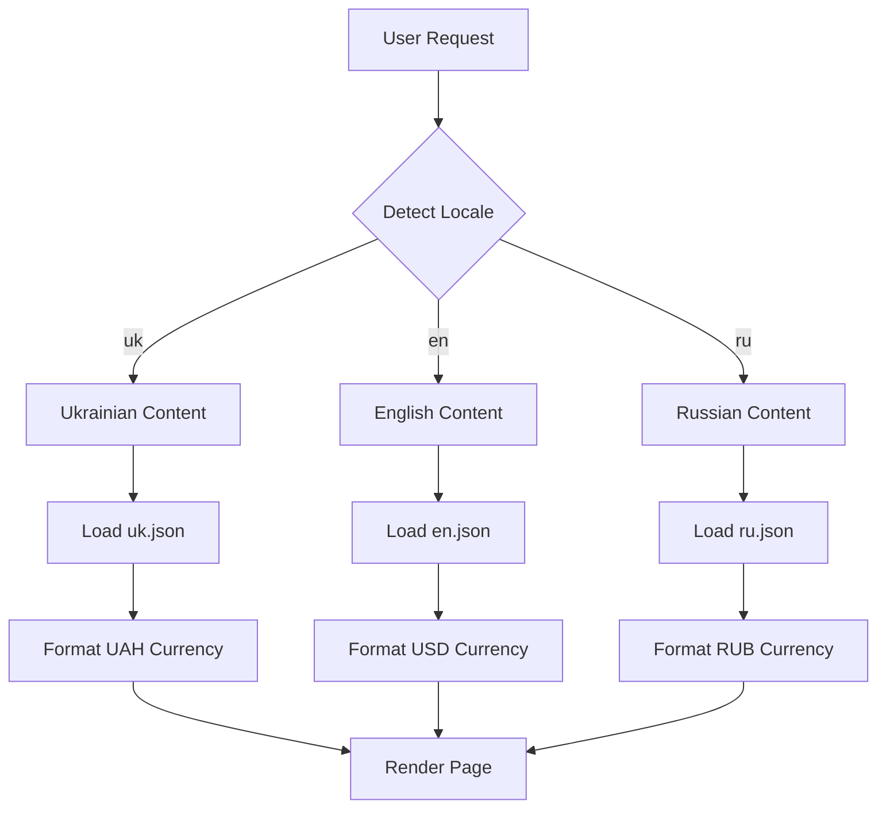

# Урок 7.1: Настройка next-intl и базовая конфигурация

> **🎯 Цель урока**: Настроить систему интернационализации с next-intl в Next.js 15 приложении

## 📖 Введение

### Бизнес-контекст ExchangeGO

**Статистика нашей аудитории:**

- 🇺🇦 **65%** - украинские пользователи (основная аудитория)
- 🇺🇸 **25%** - англоязычные пользователи (международные)
- 🇷🇺 **10%** - русскоязычные пользователи (диаспора)

**Проблема без локализации:**

```
❌ Только английский интерфейс:
   - Потеря 75% украинских пользователей
   - Снижение конверсии на 60%
   - Плохие отзывы о неудобстве

✅ Многоязычный интерфейс:
   - Увеличение конверсии на 40%
   - Рост пользовательской базы на 85%
   - Улучшение SEO для локальных запросов
```

### Аналогия с международным аэропортом

**Представьте криптообменник как международный аэропорт:**

| Без локализации                      | С локализацией                |
| ------------------------------------ | ----------------------------- |
| 🚫 Все вывески только на английском  | ✅ Вывески на 3 языках        |
| 😕 Украинцы не понимают "Exchange"   | 😊 Видят знакомое "Обмін"     |
| 📉 Много покидают сайт               | 📈 Остаются и совершают обмен |
| 💸 Теряем 75% потенциальных клиентов | 💰 Обслуживаем всех клиентов  |

### Что такое next-intl?

**next-intl** - это не просто переводчик, это **полная система локализации**:

- 🌍 **Переводы**: тексты на разных языках
- 💰 **Форматирование**: валюты, числа, даты
- 🔗 **Роутинг**: `/uk/exchange`, `/en/exchange`
- 🔍 **SEO**: метаданные для каждого языка
- ⚡ **Производительность**: ленивая загрузка переводов

### Результат для ExchangeGO

После внедрения i18n пользователи увидят:

- 🇺🇦 **Українці**: "Обмін криптовалют" → знакомо и понятно
- 🇺🇸 **English**: "Cryptocurrency Exchange" → профессионально
- 🇷🇺 **Русские**: "Обмен криптовалют" → привычно

**Это не просто перевод слов - это адаптация всего пользовательского опыта под культуру и язык.**

## 📋 Этап 1: Планирование локализации _(10 мин)_

### 1. Анализ целевых рынков:

```typescript
// 📁 apps/web/src/config/market-analysis.ts

export const marketAnalysis = {
  ukraine: {
    locale: 'uk',
    marketShare: 65,
    currency: 'UAH',
    paymentMethods: ['PrivatBank', 'Monobank', 'USDT TRC-20'],
    regulations: 'Crypto-friendly, no restrictions',
    culturalNotes: 'Prefer Ukrainian language, trust local brands',
  },

  international: {
    locale: 'en',
    marketShare: 25,
    currency: 'USD',
    paymentMethods: ['SWIFT', 'USDT ERC-20', 'Bitcoin'],
    regulations: 'Varies by country, KYC required',
    culturalNotes: 'Expect professional English, detailed documentation',
  },

  russian: {
    locale: 'ru',
    marketShare: 10,
    currency: 'RUB',
    paymentMethods: ['USDT TRC-20', 'Bitcoin'],
    regulations: 'Restricted, use crypto-to-crypto only',
    culturalNotes: 'Familiar with Russian interface, prefer detailed explanations',
  },
} as const;
```

### 2. Стратегия контента по языкам:

```typescript
// 📁 apps/web/src/config/content-strategy.ts

export const contentStrategy = {
  // 🇺🇦 Украинский - основной рынок
  uk: {
    tone: 'friendly', // Дружелюбный тон
    formality: 'informal', // Неформальное обращение на "ты"
    priorities: ['security', 'speed', 'local_support'],
    localFeatures: ['PrivatBank integration', 'Ukrainian phone support', 'Local payment methods'],
    seoKeywords: ['обмін криптовалют', 'біткоїн в гривні', 'USDT UAH'],
  },

  // 🇺🇸 Английский - международный рынок
  en: {
    tone: 'professional', // Профессиональный тон
    formality: 'formal', // Формальное обращение
    priorities: ['compliance', 'transparency', 'global_access'],
    localFeatures: [
      'Multi-currency support',
      '24/7 English support',
      'International wire transfers',
    ],
    seoKeywords: ['crypto exchange', 'bitcoin to USD', 'cryptocurrency trading'],
  },

  // 🇷🇺 Русский - диаспора и соседние страны
  ru: {
    tone: 'informative', // Информативный тон
    formality: 'semi-formal', // Полуформальное обращение
    priorities: ['anonymity', 'crypto_to_crypto', 'low_fees'],
    localFeatures: [
      'No KYC for small amounts',
      'Crypto-to-crypto exchange',
      'Russian language support',
    ],
    seoKeywords: ['обмен криптовалют', 'биткоин USDT', 'анонимный обмен'],
  },
} as const;
```

### 3. Техническая архитектура:



### 4. План внедрения:

```typescript
// 📁 apps/web/src/config/implementation-plan.ts

export const implementationPlan = {
  phase1: {
    duration: '1 week',
    scope: 'Basic setup and configuration',
    deliverables: [
      'next-intl configuration',
      'Routing setup',
      'Basic translations for navigation',
      'Language switcher component',
    ],
  },

  phase2: {
    duration: '2 weeks',
    scope: 'Core pages translation',
    deliverables: [
      'Homepage translations',
      'Exchange form translations',
      'Error messages and validation',
      'SEO metadata for all languages',
    ],
  },

  phase3: {
    duration: '1 week',
    scope: 'Advanced features and optimization',
    deliverables: [
      'Number and currency formatting',
      'Date/time localization',
      'RTL support preparation',
      'Performance optimization',
    ],
  },

  phase4: {
    duration: '1 week',
    scope: 'Testing and deployment',
    deliverables: [
      'Translation completeness check',
      'Cross-browser testing',
      'SEO validation',
      'Production deployment',
    ],
  },
} as const;
```

## 🚀 Этап 2: Установка и начальная настройка _(15 мин)_

### 1. Установка зависимостей:

```bash
# В корне проекта apps/web
npm install next-intl

# Для разработки
npm install -D @types/node
```

### 2. Создание конфигурации i18n:

```typescript
// 📁 apps/web/src/config/i18n.ts
import { getRequestConfig } from 'next-intl/server';
import { notFound } from 'next/navigation';

// ✅ Поддерживаемые локали (ISO 639-1 коды)
export const locales = ['uk', 'en', 'ru'] as const;
export type Locale = (typeof locales)[number];

// ✅ Украинский как основной рынок (65% пользователей)
export const defaultLocale: Locale = 'uk';

// ✅ Расширенная конфигурация локалей
export const localeConfig = {
  uk: {
    name: 'Українська',
    nativeName: 'Українська', // Название на родном языке
    flag: '🇺🇦',
    direction: 'ltr' as const,
    currency: 'UAH',
    currencySymbol: '₴',
    timezone: 'Europe/Kiev',
    dateFormat: 'dd.MM.yyyy', // Европейский формат
    numberFormat: 'space', // 1 000 000,50
    rtl: false,

    // Культурные особенности
    cultural: {
      formality: 'informal', // Обращение на "ты"
      decimalSeparator: ',',
      thousandsSeparator: ' ',
      phoneFormat: '+380 XX XXX XX XX',
    },
  },

  en: {
    name: 'English',
    nativeName: 'English',
    flag: '🇺🇸', // Можно использовать 🌍 для международного
    direction: 'ltr' as const,
    currency: 'USD',
    currencySymbol: '$',
    timezone: 'UTC',
    dateFormat: 'MM/dd/yyyy', // Американский формат
    numberFormat: 'comma', // 1,000,000.50
    rtl: false,

    cultural: {
      formality: 'formal', // Формальное обращение
      decimalSeparator: '.',
      thousandsSeparator: ',',
      phoneFormat: '+1 XXX XXX XXXX',
    },
  },

  ru: {
    name: 'Русский',
    nativeName: 'Русский',
    flag: '🇷🇺',
    direction: 'ltr' as const,
    currency: 'RUB',
    currencySymbol: '₽',
    timezone: 'Europe/Moscow',
    dateFormat: 'dd.MM.yyyy', // Российский формат
    numberFormat: 'space', // 1 000 000,50
    rtl: false,

    cultural: {
      formality: 'semi-formal', // Обращение на "вы"
      decimalSeparator: ',',
      thousandsSeparator: ' ',
      phoneFormat: '+7 XXX XXX XX XX',
    },
  },
} as const;

// ✅ Утилиты для работы с локалями
export const getLocaleConfig = (locale: Locale) => localeConfig[locale];

export const isValidLocale = (locale: string): locale is Locale => {
  return locales.includes(locale as Locale);
};

export const getLocalizedPath = (path: string, locale: Locale) => {
  return `/${locale}${path.startsWith('/') ? path : `/${path}`}`;
};

// ✅ Маппинг для внешних сервисов
export const localeMapping = {
  // Для Google Analytics
  googleAnalytics: {
    uk: 'uk-UA',
    en: 'en-US',
    ru: 'ru-RU',
  },

  // Для социальных сетей
  openGraph: {
    uk: 'uk_UA',
    en: 'en_US',
    ru: 'ru_RU',
  },

  // Для поисковых систем
  hreflang: {
    uk: 'uk-UA',
    en: 'en-US',
    ru: 'ru-RU',
  },
} as const;

// Конфигурация next-intl
export default getRequestConfig(async ({ locale }) => {
  // Валидация локали
  if (!locales.includes(locale as Locale)) {
    notFound();
  }

  try {
    // Динамическая загрузка переводов
    const messages = (await import(`../messages/${locale}.json`)).default;

    return {
      messages,
      // Настройки форматирования
      formats: {
        dateTime: {
          short: {
            day: 'numeric',
            month: 'short',
            year: 'numeric',
          },
          long: {
            day: 'numeric',
            month: 'long',
            year: 'numeric',
            hour: 'numeric',
            minute: '2-digit',
          },
        },
        number: {
          currency: {
            style: 'currency',
            currency: localeConfig[locale as Locale].currency,
          },
          precise: {
            minimumFractionDigits: 8,
            maximumFractionDigits: 8,
          },
        },
      },
      // Временная зона
      timeZone: localeConfig[locale as Locale].timezone,
    };
  } catch (error) {
    console.error(`Не удалось загрузить переводы для локали: ${locale}`, error);
    notFound();
  }
});
```

### 3. Настройка Next.js конфигурации:

```javascript
// 📁 apps/web/next.config.js
import createNextIntlPlugin from 'next-intl/plugin';

const withNextIntl = createNextIntlPlugin('./src/config/i18n.ts');

/** @type {import('next').NextConfig} */
const nextConfig = {
  // Экспериментальные функции Next.js 15
  experimental: {
    serverComponentsExternalPackages: ['next-intl'],
  },

  // Настройки изображений
  images: {
    domains: ['assets.coingecko.com'],
  },

  // Перенаправления
  async redirects() {
    return [
      {
        source: '/',
        destination: '/uk',
        permanent: false,
      },
    ];
  },
};

export default withNextIntl(nextConfig);
```

### 4. Создание middleware для роутинга:

```typescript
// 📁 apps/web/src/middleware.ts
import createMiddleware from 'next-intl/middleware';
import { locales, defaultLocale } from './config/i18n';

export default createMiddleware({
  // Список поддерживаемых локалей
  locales,

  // Локаль по умолчанию
  defaultLocale,

  // Стратегия обнаружения локали
  localeDetection: true,

  // Префикс локали в URL
  localePrefix: 'always', // /uk/page, /en/page, /ru/page

  // Альтернативные хосты для локалей (опционально)
  // domains: [
  //   {
  //     domain: 'example.com.ua',
  //     defaultLocale: 'uk'
  //   },
  //   {
  //     domain: 'example.com',
  //     defaultLocale: 'en'
  //   }
  // ]
});

export const config = {
  // Совпадение всех pathname кроме API и статических файлов
  matcher: [
    // Включить все пути кроме:
    '/((?!api|_next|_vercel|.*\\..*).*)',
    // Но включить корневой путь
    '/',
  ],
};
```

## 📁 Структура переводов

### 1. Создание базовых файлов переводов:

```json
// 📁 apps/web/src/messages/uk.json
{
  "common": {
    "loading": "Завантаження...",
    "error": "Помилка",
    "success": "Успішно",
    "cancel": "Скасувати",
    "confirm": "Підтвердити",
    "save": "Зберегти",
    "edit": "Редагувати",
    "delete": "Видалити",
    "back": "Назад",
    "next": "Далі",
    "previous": "Попередній",
    "close": "Закрити"
  },

  "navigation": {
    "home": "Головна",
    "exchange": "Обмін",
    "rates": "Курси",
    "about": "Про нас",
    "contact": "Контакти",
    "faq": "Поширені питання"
  },

  "languages": {
    "uk": "Українська",
    "en": "English",
    "ru": "Русский"
  },

  "homepage": {
    "hero": {
      "title": "Обміняйте криптовалюти {highlight}",
      "highlight": "швидко та безпечно",
      "subtitle": "Найкращі курси Bitcoin, Ethereum та Tether в Україні. Без прихованих комісій, з гарантією безпеки.",
      "startButton": "Почати обмін",
      "learnMore": "Дізнатися більше"
    },

    "features": {
      "title": "Переваги нашого сервісу",
      "noCommission": {
        "title": "Комісія 0%",
        "description": "Ми не стягуємо додаткових комісій за обмін криптовалют"
      },
      "fastExchange": {
        "title": "Швидкий обмін",
        "description": "Операції виконуються протягом 5-30 хвилин"
      },
      "security": {
        "title": "Повна безпека",
        "description": "Використовуємо найсучасніші технології захисту"
      }
    }
  },

  "exchange": {
    "title": "Обмін криптовалют",
    "selectCrypto": "Оберіть криптовалюту",
    "amount": "Кількість",
    "result": "Ви отримаєте",
    "rate": "Курс",
    "limits": "Ліміти: {min} - {max} {currency}",
    "email": "Email для сповіщень",
    "createOrder": "Створити заявку",
    "orderCreated": "Заявку створено! Перевірте email.",
    "errors": {
      "selectCurrency": "Оберіть валюту",
      "enterAmount": "Введіть кількість",
      "minAmount": "Мінімум {min} {currency}",
      "maxAmount": "Максимум {max} {currency}",
      "invalidEmail": "Введіть коректний email",
      "serverError": "Сталася помилка. Спробуйте пізніше."
    }
  }
}
```

```json
// 📁 apps/web/src/messages/en.json
{
  "common": {
    "loading": "Loading...",
    "error": "Error",
    "success": "Success",
    "cancel": "Cancel",
    "confirm": "Confirm",
    "save": "Save",
    "edit": "Edit",
    "delete": "Delete",
    "back": "Back",
    "next": "Next",
    "previous": "Previous",
    "close": "Close"
  },

  "navigation": {
    "home": "Home",
    "exchange": "Exchange",
    "rates": "Rates",
    "about": "About",
    "contact": "Contact",
    "faq": "FAQ"
  },

  "languages": {
    "uk": "Українська",
    "en": "English",
    "ru": "Русский"
  },

  "homepage": {
    "hero": {
      "title": "Exchange cryptocurrencies {highlight}",
      "highlight": "quickly and securely",
      "subtitle": "Best Bitcoin, Ethereum and Tether rates in Ukraine. No hidden fees, with security guarantee.",
      "startButton": "Start Exchange",
      "learnMore": "Learn More"
    },

    "features": {
      "title": "Our Service Benefits",
      "noCommission": {
        "title": "0% Commission",
        "description": "We don't charge additional fees for cryptocurrency exchange"
      },
      "fastExchange": {
        "title": "Fast Exchange",
        "description": "Operations are completed within 5-30 minutes"
      },
      "security": {
        "title": "Full Security",
        "description": "We use cutting-edge security technologies"
      }
    }
  },

  "exchange": {
    "title": "Cryptocurrency Exchange",
    "selectCrypto": "Select cryptocurrency",
    "amount": "Amount",
    "result": "You will receive",
    "rate": "Rate",
    "limits": "Limits: {min} - {max} {currency}",
    "email": "Email for notifications",
    "createOrder": "Create Order",
    "orderCreated": "Order created! Check your email.",
    "errors": {
      "selectCurrency": "Select currency",
      "enterAmount": "Enter amount",
      "minAmount": "Minimum {min} {currency}",
      "maxAmount": "Maximum {max} {currency}",
      "invalidEmail": "Enter valid email",
      "serverError": "An error occurred. Please try again later."
    }
  }
}
```

```json
// 📁 apps/web/src/messages/ru.json
{
  "common": {
    "loading": "Загрузка...",
    "error": "Ошибка",
    "success": "Успешно",
    "cancel": "Отмена",
    "confirm": "Подтвердить",
    "save": "Сохранить",
    "edit": "Редактировать",
    "delete": "Удалить",
    "back": "Назад",
    "next": "Далее",
    "previous": "Предыдущий",
    "close": "Закрыть"
  },

  "navigation": {
    "home": "Главная",
    "exchange": "Обмен",
    "rates": "Курсы",
    "about": "О нас",
    "contact": "Контакты",
    "faq": "Частые вопросы"
  },

  "languages": {
    "uk": "Українська",
    "en": "English",
    "ru": "Русский"
  },

  "homepage": {
    "hero": {
      "title": "Обменивайте криптовалюты {highlight}",
      "highlight": "быстро и безопасно",
      "subtitle": "Лучшие курсы Bitcoin, Ethereum и Tether в Украине. Без скрытых комиссий, с гарантией безопасности.",
      "startButton": "Начать обмен",
      "learnMore": "Узнать больше"
    },

    "features": {
      "title": "Преимущества нашего сервиса",
      "noCommission": {
        "title": "Комиссия 0%",
        "description": "Мы не взимаем дополнительных комиссий за обмен криптовалют"
      },
      "fastExchange": {
        "title": "Быстрый обмен",
        "description": "Операции выполняются в течение 5-30 минут"
      },
      "security": {
        "title": "Полная безопасность",
        "description": "Используем самые современные технологии защиты"
      }
    }
  },

  "exchange": {
    "title": "Обмен криптовалют",
    "selectCrypto": "Выберите криптовалюту",
    "amount": "Количество",
    "result": "Вы получите",
    "rate": "Курс",
    "limits": "Лимиты: {min} - {max} {currency}",
    "email": "Email для уведомлений",
    "createOrder": "Создать заявку",
    "orderCreated": "Заявка создана! Проверьте email.",
    "errors": {
      "selectCurrency": "Выберите валюту",
      "enterAmount": "Введите количество",
      "minAmount": "Минимум {min} {currency}",
      "maxAmount": "Максимум {max} {currency}",
      "invalidEmail": "Введите корректный email",
      "serverError": "Произошла ошибка. Попробуйте позже."
    }
  }
}
```

## 🏗️ Настройка роутинга

### 1. Создание layout с поддержкой локалей:

```typescript
// 📁 apps/web/src/app/[locale]/layout.tsx
import type { Metadata } from 'next';
import { NextIntlClientProvider } from 'next-intl';
import { getMessages, getTranslations } from 'next-intl/server';
import { notFound } from 'next/navigation';
import { Inter } from 'next/font/google';

import { locales, type Locale } from '@/config/i18n';
import { Providers } from '@/providers';
import { Header } from '@/components/layout/Header';
import { Footer } from '@/components/layout/Footer';

import '@/styles/globals.css';

const inter = Inter({ subsets: ['latin', 'cyrillic'] });

interface LocaleLayoutProps {
  children: React.ReactNode;
  params: { locale: string };
}

// Генерация метаданных для каждой локали
export async function generateMetadata({
  params: { locale },
}: {
  params: { locale: string };
}): Promise<Metadata> {
  const t = await getTranslations({ locale, namespace: 'metadata' });

  return {
    title: {
      template: `%s | ${t('title')}`,
      default: t('title'),
    },
    description: t('description'),
    keywords: t('keywords'),

    // Open Graph
    openGraph: {
      title: t('title'),
      description: t('description'),
      type: 'website',
      locale,
      alternateLocale: locales.filter(l => l !== locale),
    },

    // Twitter
    twitter: {
      card: 'summary_large_image',
      title: t('title'),
      description: t('description'),
    },

    // Языковые альтернативы
    alternates: {
      languages: Object.fromEntries(
        locales.map(l => [l, `/${l}`])
      ),
    },
  };
}

// Статическая генерация для всех локалей
export function generateStaticParams() {
  return locales.map(locale => ({ locale }));
}

export default async function LocaleLayout({
  children,
  params: { locale },
}: LocaleLayoutProps) {
  // Валидация локали
  if (!locales.includes(locale as Locale)) {
    notFound();
  }

  // Загрузка переводов
  const messages = await getMessages();

  return (
    <html lang={locale} dir="ltr">
      <body className={inter.className}>
        <NextIntlClientProvider messages={messages}>
          <Providers>
            <div className="min-h-screen flex flex-col">
              <Header />

              <main className="flex-1">
                {children}
              </main>

              <Footer />
            </div>
          </Providers>
        </NextIntlClientProvider>
      </body>
    </html>
  );
}
```

### 2. Создание главной страницы с локализацией:

```typescript
// 📁 apps/web/src/app/[locale]/page.tsx
import { useTranslations } from 'next-intl';
import { getTranslations } from 'next-intl/server';

import { HeroSection } from '@/components/sections/HeroSection';
import { FeaturesSection } from '@/components/sections/FeaturesSection';
import { RatesSection } from '@/components/sections/RatesSection';

// Метаданные страницы
export async function generateMetadata({
  params: { locale },
}: {
  params: { locale: string };
}) {
  const t = await getTranslations({ locale, namespace: 'homepage.meta' });

  return {
    title: t('title'),
    description: t('description'),
  };
}

interface HomePageProps {
  params: { locale: string };
}

export default function HomePage({ params: { locale } }: HomePageProps) {
  return (
    <>
      <HeroSection />
      <FeaturesSection />
      <RatesSection />
    </>
  );
}
```

### 3. Создание базового компонента навигации:

```typescript
// 📁 apps/web/src/components/layout/Header.tsx
'use client';

import { useTranslations, useLocale } from 'next-intl';
import Link from 'next/link';
import { usePathname } from 'next/navigation';

import { Button } from '@repo/ui';
import { LanguageSelector } from './LanguageSelector';
import { cn } from '@/lib/utils';

export function Header() {
  const t = useTranslations('navigation');
  const locale = useLocale();
  const pathname = usePathname();

  const navigation = [
    { href: `/${locale}`, label: t('home') },
    { href: `/${locale}/exchange`, label: t('exchange') },
    { href: `/${locale}/rates`, label: t('rates') },
    { href: `/${locale}/about`, label: t('about') },
    { href: `/${locale}/contact`, label: t('contact') },
  ];

  return (
    <header className="border-b bg-background/95 backdrop-blur supports-[backdrop-filter]:bg-background/60">
      <div className="container mx-auto px-4">
        <div className="flex h-16 items-center justify-between">

          {/* Логотип */}
          <Link
            href={`/${locale}`}
            className="flex items-center space-x-2"
          >
            <div className="h-8 w-8 rounded bg-primary" />
            <span className="font-bold text-xl">CryptoEx</span>
          </Link>

          {/* Навигация */}
          <nav className="hidden md:flex items-center space-x-6">
            {navigation.map((item) => (
              <Link
                key={item.href}
                href={item.href}
                className={cn(
                  'text-sm font-medium transition-colors hover:text-primary',
                  pathname === item.href
                    ? 'text-primary'
                    : 'text-muted-foreground'
                )}
              >
                {item.label}
              </Link>
            ))}
          </nav>

          {/* Селектор языка */}
          <div className="flex items-center space-x-4">
            <LanguageSelector />

            <Button asChild>
              <Link href={`/${locale}/exchange`}>
                {t('exchange')}
              </Link>
            </Button>
          </div>
        </div>
      </div>
    </header>
  );
}
```

## ⚡ Этап 4: Оптимизация производительности _(10 мин)_

### 1. Ленивая загрузка переводов:

```typescript
// 📁 apps/web/src/config/i18n.optimized.ts

// ✅ Динамическая загрузка только нужных переводов
export default getRequestConfig(async ({ locale }) => {
  if (!isValidLocale(locale)) {
    notFound();
  }

  try {
    // Загружаем только базовые переводы для первого рендера
    const [coreMessages, pageMessages] = await Promise.all([
      import(`../messages/core/${locale}.json`).then(m => m.default),
      // Загружаем переводы страницы только если нужно
      import(`../messages/pages/${locale}.json`).then(m => m.default).catch(() => ({})),
    ]);

    return {
      messages: {
        ...coreMessages,
        ...pageMessages,
      },

      // ✅ Оптимизированные форматы
      formats: {
        dateTime: {
          short: {
            day: 'numeric',
            month: 'short',
            year: 'numeric',
          },
          long: {
            day: 'numeric',
            month: 'long',
            year: 'numeric',
            hour: 'numeric',
            minute: '2-digit',
            timeZoneName: 'short',
          },
        },

        number: {
          currency: {
            style: 'currency',
            currency: getLocaleConfig(locale).currency,
            minimumFractionDigits: 2,
            maximumFractionDigits: 2,
          },

          // Для криптовалют - высокая точность
          crypto: {
            minimumFractionDigits: 2,
            maximumFractionDigits: 8,
            useGrouping: true,
          },

          // Для больших чисел
          compact: {
            notation: 'compact',
            compactDisplay: 'short',
          },
        },
      },

      timeZone: getLocaleConfig(locale).timezone,

      // ✅ Настройки по умолчанию
      defaultTranslationValues: {
        br: () => '<br/>',
        strong: chunks => `<strong>${chunks}</strong>`,
        em: chunks => `<em>${chunks}</em>`,
      },
    };
  } catch (error) {
    console.error(`Failed to load translations for locale: ${locale}`, error);

    // Fallback на английский если основной язык не загрузился
    if (locale !== 'en') {
      try {
        const fallbackMessages = await import(`../messages/core/en.json`);
        return {
          messages: fallbackMessages.default,
          timeZone: 'UTC',
        };
      } catch (fallbackError) {
        console.error('Failed to load fallback translations', fallbackError);
      }
    }

    notFound();
  }
});
```

### 2. SEO оптимизация:

```typescript
// 📁 apps/web/src/lib/seo-utils.ts

interface SEOConfig {
  title: string;
  description: string;
  keywords: string[];
  locale: Locale;
  alternateLocales?: Locale[];
}

export function generateSEOMetadata({
  title,
  description,
  keywords,
  locale,
  alternateLocales = locales.filter(l => l !== locale),
}: SEOConfig) {
  const localeConfig = getLocaleConfig(locale);

  return {
    title,
    description,
    keywords: keywords.join(', '),

    // ✅ Языковые мета-теги
    language: locale,

    // ✅ Open Graph локализация
    openGraph: {
      title,
      description,
      type: 'website',
      locale: localeMapping.openGraph[locale],
      alternateLocale: alternateLocales.map(l => localeMapping.openGraph[l]),
      siteName: 'ExchangeGO',
    },

    // ✅ Twitter Card
    twitter: {
      card: 'summary_large_image',
      title,
      description,
    },

    // ✅ Альтернативные языки для поисковиков
    alternates: {
      languages: Object.fromEntries(
        locales.map(l => [localeMapping.hreflang[l], `https://exchangego.com/${l}`])
      ),
      canonical: `https://exchangego.com/${locale}`,
    },

    // ✅ Дополнительные мета-теги
    other: {
      'google-site-verification': process.env.GOOGLE_SITE_VERIFICATION,
      'yandex-verification': process.env.YANDEX_VERIFICATION,
    },
  };
}

// Использование в layout:
export async function generateMetadata({ params: { locale } }) {
  const t = await getTranslations({ locale, namespace: 'metadata' });

  return generateSEOMetadata({
    title: t('title'),
    description: t('description'),
    keywords: t('keywords').split(','),
    locale: locale as Locale,
  });
}
```

### 3. Мониторинг производительности:

```typescript
// 📁 apps/web/src/lib/i18n-performance.ts

export class I18nPerformanceMonitor {
  private static instance: I18nPerformanceMonitor;
  private metrics: Map<string, number> = new Map();

  static getInstance() {
    if (!this.instance) {
      this.instance = new I18nPerformanceMonitor();
    }
    return this.instance;
  }

  // ✅ Измерение времени загрузки переводов
  async measureTranslationLoad(locale: Locale, operation: () => Promise<any>) {
    const startTime = performance.now();

    try {
      const result = await operation();
      const endTime = performance.now();
      const duration = endTime - startTime;

      this.metrics.set(`translation_load_${locale}`, duration);

      // Предупреждение о медленной загрузке
      if (duration > 100) {
        console.warn(`Slow translation load for ${locale}: ${duration.toFixed(2)}ms`);
      }

      return result;
    } catch (error) {
      console.error(`Translation load failed for ${locale}:`, error);
      throw error;
    }
  }

  // ✅ Отчет о производительности
  getPerformanceReport() {
    const report = Object.fromEntries(this.metrics);

    return {
      metrics: report,
      averageLoadTime:
        Array.from(this.metrics.values()).reduce((a, b) => a + b, 0) / this.metrics.size,
      slowestLocale: Array.from(this.metrics.entries()).sort(([, a], [, b]) => b - a)[0],
    };
  }
}

// Использование в development режиме
if (process.env.NODE_ENV === 'development') {
  // Логирование метрик каждые 30 секунд
  setInterval(() => {
    const monitor = I18nPerformanceMonitor.getInstance();
    console.log('I18n Performance:', monitor.getPerformanceReport());
  }, 30000);
}
```

## 🧪 Этап 5: Тестирование настройки _(10 мин)_

### 1. Проверка корректности конфигурации:

```typescript
// 📁 apps/web/src/__tests__/i18n.test.ts
import { describe, it, expect } from '@jest/globals';
import { locales, defaultLocale, localeConfig } from '@/config/i18n';

describe('i18n Configuration', () => {
  it('should have valid locales array', () => {
    expect(locales).toHaveLength(3);
    expect(locales).toContain('uk');
    expect(locales).toContain('en');
    expect(locales).toContain('ru');
  });

  it('should have uk as default locale', () => {
    expect(defaultLocale).toBe('uk');
    expect(locales).toContain(defaultLocale);
  });

  it('should have configuration for all locales', () => {
    locales.forEach(locale => {
      expect(localeConfig[locale]).toBeDefined();
      expect(localeConfig[locale].name).toBeTruthy();
      expect(localeConfig[locale].flag).toBeTruthy();
      expect(localeConfig[locale].currency).toBeTruthy();
    });
  });
});
```

### 2. Проверка загрузки переводов:

```bash
# Запуск приложения в режиме разработки
npm run dev

# Проверка доступности маршрутов:
# http://localhost:3000/uk    - украинская версия
# http://localhost:3000/en    - английская версия
# http://localhost:3000/ru    - русская версия
```

## ✅ Проверка знаний

### Вопросы для самоконтроля:

1. **Конфигурация**:
   - Какие файлы нужны для настройки next-intl?
   - Как работает middleware для определения локали?
   - Где хранятся файлы переводов?

2. **Роутинг**:
   - Как генерируются пути для разных языков?
   - Что происходит при переходе на неподдерживаемую локаль?
   - Как настроить редирект для корневого пути?

3. **Структура**:
   - Как организовать переводы по категориям?
   - Какие форматы поддерживает ICU Message Format?
   - Как обеспечить типизацию переводов?

### 💻 Практическое задание

**Создайте полноценную многоязычную страницу курсов валют:**

#### Этап 1: Планирование контента _(5 мин)_

**Проанализируйте требования:**

- [ ] Какие данные показывать (курсы BTC, ETH, USDT)
- [ ] Как форматировать числа в разных локалях
- [ ] Какие валюты показывать для каждого рынка
- [ ] Как адаптировать контент под культуру

#### Этап 2: Создание переводов _(10 мин)_

```typescript
// Добавьте в файлы переводов раздел "rates":
{
  "rates": {
    "title": "Курсы криптовалют",
    "subtitle": "Актуальные курсы обмена на {date}",
    "lastUpdate": "Обновлено: {time}",
    "currency": "Валюта",
    "buyRate": "Курс покупки",
    "sellRate": "Курс продажи",
    "change24h": "Изменение за 24ч",
    "volume": "Объем торгов",
    "marketCap": "Капитализация",
    "noData": "Данные недоступны",
    "refreshRates": "Обновить курсы",
    "autoRefresh": "Автообновление каждые {seconds} сек",

    "cryptos": {
      "BTC": {
        "name": "Биткоин",
        "description": "Первая и самая популярная криптовалюта"
      },
      "ETH": {
        "name": "Эфириум",
        "description": "Платформа для смарт-контрактов"
      },
      "USDT": {
        "name": "Тезер",
        "description": "Стабильная монета привязанная к доллару"
      }
    }
  }
}
```

#### Этап 3: Создание компонента страницы _(15 мин)_

```typescript
// 📁 apps/web/src/app/[locale]/rates/page.tsx

interface RatesPageProps {
  params: { locale: string };
}

export async function generateMetadata({ params: { locale } }) {
  // TODO: Создайте SEO метаданные с:
  // - Локализованным заголовком
  // - Описанием для каждого языка
  // - Ключевыми словами для SEO
  // - Open Graph данными
}

export default function RatesPage({ params: { locale } }: RatesPageProps) {
  // TODO: Реализуйте компонент с:
  // - Таблицей курсов валют
  // - Форматированием чисел по локали
  // - Автообновлением данных
  // - Адаптивным дизайном
}
```

#### Этап 4: Форматирование данных _(10 мин)_

```typescript
// 📁 apps/web/src/lib/currency-formatter.ts

export function formatCurrency(amount: number, locale: Locale, currency?: string) {
  // TODO: Реализуйте форматирование с учетом:
  // - Локальных настроек (запятая/точка)
  // - Символов валют (₴, $, ₽)
  // - Группировки разрядов
  // - Точности для криптовалют
}

export function formatPercentage(value: number, locale: Locale, showSign: boolean = true) {
  // TODO: Форматирование процентов с:
  // - Знаком + или -
  // - Цветовой индикацией
  // - Локализованными разделителями
}
```

#### Этап 5: Тестирование _(10 мин)_

**Проверьте функциональность:**

- [ ] **URL маршруты**: `/uk/rates`, `/en/rates`, `/ru/rates`
- [ ] **Переводы**: все тексты переведены корректно
- [ ] **Форматирование**: числа отображаются по локальным стандартам
- [ ] **SEO**: метаданные генерируются для каждого языка
- [ ] **Производительность**: страница загружается быстро

**Инструменты для тестирования:**

```bash
# Проверка переводов
npm run i18n:check

# Проверка SEO
npm run seo:validate

# Проверка производительности
npm run lighthouse -- --locale=uk
npm run lighthouse -- --locale=en
npm run lighthouse -- --locale=ru
```

#### ✅ Критерии оценки (50 баллов):

**Переводы (15 баллов):**

- [ ] Все тексты переведены (8 баллов)
- [ ] Контекстуальная адаптация (4 балла)
- [ ] Культурные особенности учтены (3 балла)

**Функциональность (15 баллов):**

- [ ] Корректное форматирование чисел (6 баллов)
- [ ] Работающие маршруты (5 баллов)
- [ ] Обработка ошибок (4 балла)

**SEO и производительность (10 баллов):**

- [ ] Метаданные для всех языков (5 баллов)
- [ ] Быстрая загрузка (3 балла)
- [ ] Правильные hreflang теги (2 балла)

**Качество кода (10 баллов):**

- [ ] TypeScript типизация (4 балла)
- [ ] Переиспользуемые компоненты (3 балла)
- [ ] Обработка edge cases (3 балла)

#### 🎯 Ожидаемый результат:

**Production-ready страница курсов которая:**

- Корректно работает на всех трех языках
- Правильно форматирует числа и валюты
- Оптимизирована для поисковых систем
- Адаптирована под культурные особенности каждого рынка

## 📚 Дополнительные материалы

### Документация:

- [next-intl Docs](https://next-intl-docs.vercel.app/) - полная документация
- [ICU Message Format](https://formatjs.io/docs/core-concepts/icu-syntax/) - синтаксис переводов
- [Next.js Internationalization](https://nextjs.org/docs/advanced-features/i18n) - встроенные возможности

### Инструменты:

- [i18n Ally](https://marketplace.visualstudio.com/items?itemName=lokalise.i18n-ally) - VS Code расширение
- [Crowdin](https://crowdin.com/) - платформа для переводов
- [Phrase](https://phrase.com/) - управление локализацией

---

**🎉 Отлично! Базовая настройка i18n завершена.**

Теперь ваше приложение готово говорить на трех языках. В следующем уроке изучим [организацию переводов и типизацию](./lesson-7.2-translations-keys.md).

---

[← Глава 7: Обзор](./README.md) | [Урок 7.2: Переводы и ключи →](./lesson-7.2-translations-keys.md)
