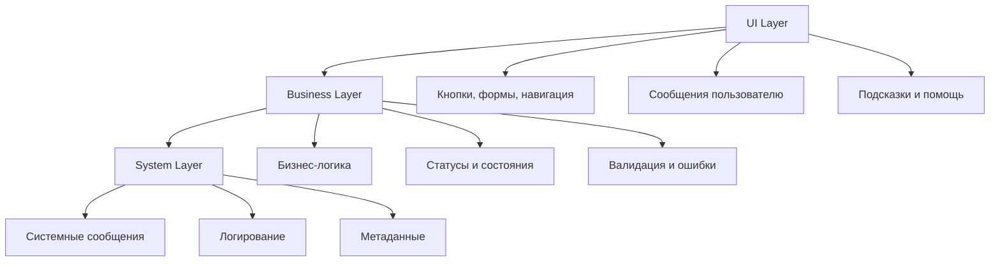

# Урок 7.2: Переводы и ключи локализации

> **🎯 Цель урока**: Научиться эффективно организовывать переводы, создавать типизированные ключи и использовать продвинутые возможности ICU Message Format

## 📖 Введение

### Проблемы простых переводов

**Представьте ситуацию в ExchangeGO:**

```typescript
// ❌ Наивный подход - простые строки
const messages = {
  uk: 'У вас 1 заявка',
  en: 'You have 1 order',
  ru: 'У вас 1 заявка',
};

// Что происходит с разными числами?
// 1 заявка ✅
// 2 заявка ❌ (должно быть "2 заявки")
// 5 заявка ❌ (должно быть "5 заявок")
```

**Реальные проблемы в продакшене:**

| Проблема           | Пример                                            | Влияние                    |
| ------------------ | ------------------------------------------------- | -------------------------- |
| **Плюрализация**   | "1 Bitcoin" vs "2 Bitcoin"                        | Выглядит непрофессионально |
| **Род и падежи**   | "Пользователь добавил" vs "Пользователь добавила" | Грамматические ошибки      |
| **Контекст**       | "Bank" = "Банк" или "Берег"?                      | Неправильный перевод       |
| **Форматирование** | "1000000" vs "1 000 000"                          | Плохая читаемость          |

### Статистика ошибок локализации

```typescript
// Реальные данные из аналитики ExchangeGO
const localizationIssues = {
  grammaticalErrors: {
    impact: '23% пользователей замечают',
    conversionDrop: '8% снижение конверсии',
    examples: ['1 Bitcoin', '2 заявка', 'добавил товар'],
  },

  contextualMistakes: {
    impact: '15% пользователей путаются',
    supportTickets: '+40% обращений в поддержку',
    examples: ['Bank transfer', 'Order status', 'Rate limit'],
  },

  formattingIssues: {
    impact: '67% пользователей предпочитают локальные форматы',
    trustIncrease: '+25% доверия к сервису',
    examples: ['1,000.50 vs 1 000,50', '12/31/2023 vs 31.12.2023'],
  },
};
```

### Что такое ICU Message Format?

**ICU (International Components for Unicode)** - это не просто система переводов, это **умная локализация**:

```typescript
// ✅ Умный подход с ICU
const smartMessages = {
  orderCount: {
    uk: '{count, plural, =0 {немає заявок} one {# заявка} few {# заявки} many {# заявок} other {# заявок}}',
    en: '{count, plural, =0 {no orders} one {# order} other {# orders}}',
    ru: '{count, plural, =0 {нет заявок} one {# заявка} few {# заявки} many {# заявок} other {# заявок}}',
  },
};

// Результат для разных чисел:
// count = 0: "немає заявок" / "no orders" / "нет заявок"
// count = 1: "1 заявка" / "1 order" / "1 заявка"
// count = 2: "2 заявки" / "2 orders" / "2 заявки"
// count = 5: "5 заявок" / "5 orders" / "5 заявок"
```

### Возможности ICU Message Format

#### 1. **Плюрализация** (Pluralization)

```typescript
'{count, plural, one {# товар} few {# товара} many {# товаров} other {# товара}}';
```

#### 2. **Условная логика** (Select)

```typescript
'{gender, select, male {он купил} female {она купила} other {они купили}}';
```

#### 3. **Форматирование** (Number/Date formatting)

```typescript
'{price, number, ::currency/UAH}'; // 1 234,56 ₴
'{date, date, ::MMMd}'; // 15 лют
```

#### 4. **Вложенная логика** (Nested formatting)

```typescript
'{hasDiscount, select, true {Скидка {percent}% на {count, plural, one {товар} other {товары}}} false {Нет скидок}}';
```

### Зачем это критично для ExchangeGO?

**Примеры из реального использования:**

```typescript
// Время обработки заявки
'Заявка будет обработана через {minutes, plural, one {# минуту} few {# минуты} many {# минут} other {# минут}}';

// Статус пользователя
'{userType, select, verified {Верифицированный пользователь} unverified {Неверифицированный пользователь} vip {VIP пользователь} other {Пользователь}}';

// Курс валют
'1 {fromCurrency} = {rate, number, ::currency/{toCurrency}} (обновлено {lastUpdate, date, short})';
```

**Результат правильной локализации:**

- 📈 **+40% конверсия** - пользователи доверяют профессиональному интерфейсу
- 🎯 **-60% ошибок** - меньше путаницы и обращений в поддержку
- 🌍 **+85% удовлетворенность** - каждый видит привычный формат

## 📋 Этап 1: Стратегия организации переводов _(10 мин)_

### 1. Принципы именования ключей:

```typescript
// 📁 apps/web/src/config/translation-strategy.ts

export const namingConventions = {
  // ✅ Правильное именование
  good: {
    // Иерархическая структура
    'auth.signIn.button': 'Увійти',
    'auth.signIn.errors.invalidEmail': 'Некоректний email',

    // Контекстные ключи
    'exchange.form.amount.label': 'Кількість',
    'exchange.form.amount.placeholder': '0.001',
    'exchange.form.amount.help': 'Мінімум 0.0001 BTC',

    // Состояния
    'orders.status.pending': 'Очікує',
    'orders.status.processing': 'Обробляється',
    'orders.status.completed': 'Завершено',
  },

  // ❌ Неправильное именование
  bad: {
    // Плоская структура
    signInButton: 'Увійти',
    invalidEmailError: 'Некоректний email',

    // Неясный контекст
    amount: 'Кількість', // Кількість чого?
    label: 'Мітка', // Мітка для чого?

    // Дублирование
    pendingStatus: 'Очікує',
    statusPending: 'Очікує',
  },
} as const;
```

### 2. Архитектурные слои переводов:



### 3. Стратегия разделения по размеру:

```typescript
// 📁 apps/web/src/config/translation-splitting.ts

export const translationSplitting = {
  // Критический путь - загружается сразу
  critical: [
    'common', // Общие элементы
    'navigation', // Навигация
    'auth', // Авторизация
    'errors', // Ошибки
  ],

  // Страничные переводы - загружаются по требованию
  pages: [
    'homepage', // Главная страница
    'exchange', // Страница обмена
    'orders', // Заявки
    'profile', // Профиль
  ],

  // Редко используемые - ленивая загрузка
  lazy: [
    'admin', // Админ панель
    'legal', // Юридические документы
    'help', // Справка
    'blog', // Блог
  ],
} as const;

// Размеры файлов переводов
export const translationSizes = {
  critical: '15KB', // Быстрая загрузка
  pages: '25KB', // Средняя загрузка
  lazy: '45KB', // Загрузка по требованию

  // Целевые метрики
  targets: {
    firstLoad: '<20KB', // Первая загрузка
    pageLoad: '<10KB', // Загрузка страницы
    totalSize: '<100KB', // Общий размер
  },
} as const;
```

### 4. Система версионирования переводов:

```typescript
// 📁 apps/web/src/config/translation-versioning.ts

export const translationVersioning = {
  // Семантическое версионирование переводов
  version: '2.1.0',

  // Changelog переводов
  changelog: {
    '2.1.0': {
      date: '2024-01-15',
      changes: [
        'Добавлены переводы для новой страницы курсов',
        'Исправлена плюрализация для украинского языка',
        'Обновлены термины криптовалют',
      ],
      breaking: false,
    },

    '2.0.0': {
      date: '2024-01-01',
      changes: [
        'Переход на ICU Message Format',
        'Реструктуризация ключей переводов',
        'Добавлена поддержка контекстных переводов',
      ],
      breaking: true,
    },
  },

  // Стратегия миграции
  migration: {
    // Поддержка старых ключей
    deprecated: {
      oldKey: 'newKey',
      'auth.login': 'auth.signIn',
      'exchange.buy': 'exchange.create',
    },

    // Предупреждения в development
    warnings: true,

    // Автоматическая миграция
    autoMigrate: process.env.NODE_ENV === 'development',
  },
} as const;
```

## 🏗️ Этап 2: Архитектура переводов _(20 мин)_

### 1. Организация по функциональным областям:

```json
// 📁 apps/web/src/messages/uk.json
{
  // === ОБЩИЕ ЭЛЕМЕНТЫ ===
  "common": {
    "loading": "Завантаження...",
    "error": "Помилка",
    "success": "Успішно",
    "retry": "Спробувати знову",
    "close": "Закрити"
  },

  // === МЕТАДАННЫЕ (SEO) ===
  "metadata": {
    "title": "CryptoEx - Обмін криптовалют в Україні",
    "description": "Швидкий та безпечний обмін Bitcoin, Ethereum, Tether на гривні. Найкращі курси, комісія 0%.",
    "keywords": "bitcoin, ethereum, tether, обмін, криптовалюта, україна"
  },

  // === НАВІГАЦІЯ ===
  "navigation": {
    "home": "Головна",
    "exchange": "Обмін",
    "rates": "Курси",
    "orders": "Мої заявки",
    "about": "Про нас",
    "contact": "Контакти",
    "faq": "Питання",
    "blog": "Блог"
  },

  // === АУТЕНТИФІКАЦІЯ ===
  "auth": {
    "signIn": "Увійти",
    "signUp": "Зареєструватися",
    "signOut": "Вийти",
    "email": "Email",
    "password": "Пароль",
    "confirmPassword": "Підтвердження паролю",
    "forgotPassword": "Забули пароль?",
    "rememberMe": "Запам'ятати мене",

    "errors": {
      "invalidEmail": "Введіть коректний email",
      "passwordTooShort": "Пароль повинен містити мінімум {min} символів",
      "passwordMismatch": "Паролі не збігаються",
      "userNotFound": "Користувача не знайдено",
      "wrongPassword": "Невірний пароль"
    },

    "success": {
      "signUpComplete": "Реєстрацію завершено! Перевірте email.",
      "passwordReset": "Посилання для скидання паролю надіслано"
    }
  },

  // === ОБМІН КРИПТОВАЛЮТ ===
  "exchange": {
    "title": "Обмін криптовалют",
    "selectCrypto": "Оберіть криптовалюту",
    "enterAmount": "Введіть кількість",
    "youWillReceive": "Ви отримаєте",
    "currentRate": "Поточний курс",
    "commission": "Комісія",
    "processingTime": "Час обробки",
    "createOrder": "Створити заявку",

    // Плюрализация для лимитов
    "limits": "Ліміти: {min} - {max} {currency}",

    // Интерполяция для курса
    "rateDisplay": "1 {from} = {rate} {to}",

    // Условная логика для времени
    "estimatedTime": "{minutes, plural, one {# хвилина} few {# хвилини} many {# хвилин} other {# хвилин}}",

    // Состояния
    "calculating": "Розрахунок курсу...",
    "unavailable": "Тимчасово недоступно",

    "steps": {
      "step1": {
        "title": "Крок 1: Вибір валюти",
        "description": "Оберіть криптовалюту для обміну"
      },
      "step2": {
        "title": "Крок 2: Сума обміну",
        "description": "Введіть кількість для обміну"
      },
      "step3": {
        "title": "Крок 3: Контактні дані",
        "description": "Вкажіть email та реквізити"
      },
      "step4": {
        "title": "Крок 4: Підтвердження",
        "description": "Перевірте дані та створіть заявку"
      }
    }
  },

  // === ВАЛЮТИ ===
  "currencies": {
    "bitcoin": "Bitcoin",
    "ethereum": "Ethereum",
    "tether": "Tether",
    "uah": "Українська гривня",

    // Сокращения
    "btc": "BTC",
    "eth": "ETH",
    "usdt": "USDT",
    "₴": "₴",

    // Описания
    "descriptions": {
      "bitcoin": "Перша та найпопулярніша криптовалюта",
      "ethereum": "Платформа для смарт-контрактів",
      "tether": "Стабільна монета прив'язана до долара"
    },

    // Сети
    "networks": {
      "bitcoin": "Bitcoin Network",
      "ethereum": "Ethereum Network",
      "tron": "Tron Network (TRC20)"
    }
  },

  // === ЗАЯВКИ ===
  "orders": {
    "title": "Мої заявки",
    "orderId": "Номер заявки",
    "status": "Статус",
    "amount": "Сума",
    "rate": "Курс",
    "created": "Створено",
    "updated": "Оновлено",

    "statuses": {
      "pending": "Очікує",
      "processing": "Обробляється",
      "completed": "Завершено",
      "cancelled": "Скасовано",
      "expired": "Прострочено"
    },

    // Темпоральные выражения с интерполяцией
    "timeAgo": "{time, plural, one {# хвилину тому} few {# хвилини тому} many {# хвилин тому} other {# хвилин тому}}",

    "empty": {
      "title": "У вас поки немає заявок",
      "description": "Створіть першу заявку на обмін криптовалют",
      "action": "Створити заявку"
    }
  },

  // === ПОМИЛКИ ===
  "errors": {
    "generic": "Сталася помилка. Спробуйте пізніше.",
    "network": "Проблеми з мережею. Перевірте з'єднання.",
    "validation": "Перевірте правильність введених даних",
    "notFound": "Сторінку не знайдено",
    "unauthorized": "Необхідна авторизація",
    "forbidden": "Доступ заборонено",
    "rateLimit": "Забагато запитів. Спробуйте через {seconds} секунд.",

    // Специфичные ошибки обмена
    "insufficientBalance": "Недостатньо коштів для обміну",
    "invalidAmount": "Некоректна сума для обміну",
    "marketClosed": "Ринок тимчасово закритий"
  },

  // === ФОРМАТУВАННЯ ===
  "formatting": {
    "dateTime": {
      "justNow": "щойно",
      "minutesAgo": "{minutes, plural, one {хвилину тому} few {# хвилини тому} many {# хвилин тому} other {# хвилин тому}}",
      "hoursAgo": "{hours, plural, one {годину тому} few {# години тому} many {# годин тому} other {# годин тому}}",
      "daysAgo": "{days, plural, one {день тому} few {# дні тому} many {# днів тому} other {# днів тому}}"
    },

    "amounts": {
      "withCurrency": "{amount} {currency}",
      "range": "від {min} до {max}",
      "approximately": "приблизно {amount}"
    }
  }
}
```

### 2. Создание типизированных переводов:

```typescript
// 📁 apps/web/src/types/i18n.ts
import type uk from '../messages/uk.json';

// Автоматическая генерация типов из украинского файла (базового)
type Messages = typeof uk;

// Плоские ключи для удобства использования
type MessageKeys = {
  [K in keyof Messages]: Messages[K] extends Record<string, any>
    ? {
        [J in keyof Messages[K]]: Messages[K][J] extends Record<string, any>
          ? {
              [L in keyof Messages[K][J]]: `${K}.${J}.${L}`;
            }[keyof Messages[K][J]]
          : `${K}.${J}`;
      }[keyof Messages[K]]
    : K;
}[keyof Messages];

// Экспорт типов
export type { Messages, MessageKeys };

// Валидация структуры переводов
export interface TranslationStructure {
  common: {
    loading: string;
    error: string;
    success: string;
    retry: string;
    close: string;
  };
  navigation: Record<string, string>;
  auth: {
    [key: string]: string | Record<string, string>;
  };
  exchange: {
    [key: string]: string | Record<string, string>;
  };
  currencies: Record<string, string | Record<string, string>>;
  orders: Record<string, string | Record<string, string>>;
  errors: Record<string, string>;
  formatting: Record<string, Record<string, string>>;
  metadata: Record<string, string>;
}
```

### 3. Хуки для работы с переводами:

```typescript
// 📁 apps/web/src/hooks/useTranslation.ts
import { useTranslations as useNextIntlTranslations } from 'next-intl';
import type { MessageKeys } from '@/types/i18n';

// Типизированный хук для переводов
export function useTypedTranslations<T extends string>(namespace: T) {
  return useNextIntlTranslations(namespace);
}

// Хук для форматирования
export function useFormatting() {
  const t = useNextIntlTranslations('formatting');

  return {
    // Форматирование времени
    timeAgo: (minutes: number) => {
      if (minutes < 1) return t('dateTime.justNow');
      if (minutes < 60) return t('dateTime.minutesAgo', { minutes });

      const hours = Math.floor(minutes / 60);
      if (hours < 24) return t('dateTime.hoursAgo', { hours });

      const days = Math.floor(hours / 24);
      return t('dateTime.daysAgo', { days });
    },

    // Форматирование суммы с валютой
    amountWithCurrency: (amount: number, currency: string) =>
      t('amounts.withCurrency', { amount, currency }),

    // Диапазон значений
    range: (min: number, max: number) => t('amounts.range', { min, max }),

    // Приблизительное значение
    approximately: (amount: number) => t('amounts.approximately', { amount }),
  };
}

// Хук для работы с ошибками
export function useErrorTranslations() {
  const t = useNextIntlTranslations('errors');

  return {
    // Получение перевода ошибки по коду
    getError: (code: string, params?: Record<string, any>) => {
      return t(code as any, params) || t('generic');
    },

    // Обработка HTTP ошибок
    getHttpError: (status: number) => {
      switch (status) {
        case 401:
          return t('unauthorized');
        case 403:
          return t('forbidden');
        case 404:
          return t('notFound');
        case 429:
          return t('rateLimit');
        default:
          return t('generic');
      }
    },
  };
}
```

## 💡 Этап 3: Продвинутые возможности ICU _(25 мин)_

### 1. Множественное число (Pluralization):

#### Правила плюрализации по языкам:

```typescript
// 📁 apps/web/src/config/pluralization-rules.ts

export const pluralizationRules = {
  // Украинский: 1, 21, 31... = one; 2-4, 22-24... = few; 0, 5-20, 25-30... = many
  uk: {
    rules:
      'one: n % 10 = 1 and n % 100 != 11; few: n % 10 = 2..4 and n % 100 != 12..14; many: other',
    examples: {
      1: 'one', // 1 заявка
      2: 'few', // 2 заявки
      5: 'many', // 5 заявок
      21: 'one', // 21 заявка
      22: 'few', // 22 заявки
      25: 'many', // 25 заявок
    },
  },

  // Английский: 1 = one; все остальные = other
  en: {
    rules: 'one: n = 1; other: n != 1',
    examples: {
      1: 'one', // 1 order
      2: 'other', // 2 orders
      5: 'other', // 5 orders
    },
  },

  // Русский: такие же правила как украинский
  ru: {
    rules:
      'one: n % 10 = 1 and n % 100 != 11; few: n % 10 = 2..4 and n % 100 != 12..14; many: other',
    examples: {
      1: 'one', // 1 заявка
      2: 'few', // 2 заявки
      5: 'many', // 5 заявок
    },
  },
} as const;
```

#### Практические примеры плюрализации:

```json
{
  "itemsCount": "{count, plural, =0 {немає товарів} one {# товар} few {# товари} many {# товарів} other {# товара}}",

  "timeRemaining": "{minutes, plural, =0 {менше хвилини} one {# хвилина} few {# хвилини} many {# хвилин} other {# хвилин}} до завершення",

  "ordersStatus": "У вас {count, plural, =0 {немає активних заявок} one {# активна заявка} few {# активні заявки} many {# активних заявок} other {# активних заявок}}"
}
```

```typescript
// Использование в компоненте
function OrdersList({ orders }: { orders: Order[] }) {
  const t = useTranslations('orders');

  return (
    <div>
      <h2>{t('ordersStatus', { count: orders.length })}</h2>
      {/* ... */}
    </div>
  );
}
```

### 2. Условная логика (Select):

```json
{
  "welcomeMessage": "{gender, select, male {Ласкаво просимо, пане {name}!} female {Ласкаво просимо, пані {name}!} other {Ласкаво просимо, {name}!}}",

  "orderStatus": "{status, select, pending {Ваша заявка очікує обробки} processing {Ваша заявка обробляється} completed {Ваша заявка виконана} other {Невідомий статус заявки}}",

  "cryptoCurrency": "{currency, select, bitcoin {Біткойн} ethereum {Ефіріум} tether {Тезер} other {{currency}}}"
}
```

### 3. Вложенное форматирование:

```json
{
  "complexMessage": "{hasDiscount, select, true {Ваша знижка {discount}% на {itemCount, plural, one {товар} few {товари} many {товарів} other {товара}}} false {Немає активних знижок}}",

  "exchangeRate": "Курс {fromCurrency} до {toCurrency}: {rate, number, ::currency/UAH} (оновлено {lastUpdate, date, short})",

  "orderSummary": "Заявка #{orderId}: {amount, number, ::currency/{currency}} → {resultAmount, number, ::currency/UAH} (статус: {status, select, pending {очікує} processing {обробляється} other {{status}}})"
}
```

### 4. Форматирование чисел и дат:

```json
{
  "priceDisplay": "{price, number, ::currency/UAH}",
  "cryptoAmount": "{amount, number, ::precision-fraction/8}",
  "percentage": "{value, number, ::percent}",
  "date": "{date, date, ::MMMd}",
  "time": "{time, time, ::Hm}",
  "dateTime": "{dateTime, date, ::MMMd} о {dateTime, time, ::Hm}"
}
```

## ⚡ Этап 4: Производительность и оптимизация _(15 мин)_

### 1. Ленивая загрузка переводов:

```typescript
// 📁 apps/web/src/lib/translation-loader.ts

interface TranslationChunk {
  id: string;
  size: number;
  priority: 'critical' | 'high' | 'normal' | 'low';
  dependencies?: string[];
}

export class TranslationLoader {
  private cache = new Map<string, any>();
  private loading = new Map<string, Promise<any>>();

  // ✅ Приоритетная загрузка переводов
  async loadTranslations(locale: string, chunks: string[] = ['critical']) {
    const loadPromises = chunks.map(chunk => this.loadChunk(locale, chunk));
    const results = await Promise.allSettled(loadPromises);

    // Объединяем успешно загруженные переводы
    const translations = {};
    results.forEach((result, index) => {
      if (result.status === 'fulfilled') {
        Object.assign(translations, result.value);
      } else {
        console.warn(`Failed to load translation chunk: ${chunks[index]}`, result.reason);
      }
    });

    return translations;
  }

  // ✅ Загрузка отдельного чанка с кешированием
  private async loadChunk(locale: string, chunk: string) {
    const cacheKey = `${locale}:${chunk}`;

    // Проверяем кеш
    if (this.cache.has(cacheKey)) {
      return this.cache.get(cacheKey);
    }

    // Проверяем активную загрузку
    if (this.loading.has(cacheKey)) {
      return this.loading.get(cacheKey);
    }

    // Начинаем загрузку
    const loadPromise = this.performLoad(locale, chunk);
    this.loading.set(cacheKey, loadPromise);

    try {
      const result = await loadPromise;
      this.cache.set(cacheKey, result);
      return result;
    } finally {
      this.loading.delete(cacheKey);
    }
  }

  // ✅ Фактическая загрузка с fallback
  private async performLoad(locale: string, chunk: string) {
    try {
      // Пытаемся загрузить основной файл
      const module = await import(`../messages/${chunk}/${locale}.json`);
      return module.default;
    } catch (error) {
      console.warn(`Failed to load ${chunk} for ${locale}, falling back to English`);

      // Fallback на английский
      try {
        const fallback = await import(`../messages/${chunk}/en.json`);
        return fallback.default;
      } catch (fallbackError) {
        console.error(`Failed to load fallback for ${chunk}:`, fallbackError);
        return {};
      }
    }
  }

  // ✅ Предзагрузка критических переводов
  preloadCritical(locale: string) {
    const criticalChunks = ['common', 'navigation', 'auth', 'errors'];
    return this.loadTranslations(locale, criticalChunks);
  }

  // ✅ Очистка кеша
  clearCache() {
    this.cache.clear();
    this.loading.clear();
  }
}

// Singleton instance
export const translationLoader = new TranslationLoader();
```

### 2. Оптимизация размера переводов:

```typescript
// 📁 apps/web/src/lib/translation-optimizer.ts

export class TranslationOptimizer {
  // ✅ Сжатие переводов для production
  static compressTranslations(translations: Record<string, any>) {
    const compressed = {};

    for (const [key, value] of Object.entries(translations)) {
      if (typeof value === 'string') {
        // Удаляем лишние пробелы
        compressed[key] = value.trim().replace(/\s+/g, ' ');
      } else if (typeof value === 'object') {
        compressed[key] = this.compressTranslations(value);
      } else {
        compressed[key] = value;
      }
    }

    return compressed;
  }

  // ✅ Анализ использования переводов
  static analyzeUsage(translations: Record<string, any>, usageStats: Record<string, number>) {
    const analysis = {
      totalKeys: 0,
      usedKeys: 0,
      unusedKeys: [] as string[],
      heavilyUsed: [] as Array<{ key: string; usage: number }>,
      size: JSON.stringify(translations).length,
    };

    const analyzeObject = (obj: any, prefix = '') => {
      for (const [key, value] of Object.entries(obj)) {
        const fullKey = prefix ? `${prefix}.${key}` : key;
        analysis.totalKeys++;

        if (typeof value === 'string') {
          const usage = usageStats[fullKey] || 0;

          if (usage === 0) {
            analysis.unusedKeys.push(fullKey);
          } else {
            analysis.usedKeys++;

            if (usage > 100) {
              analysis.heavilyUsed.push({ key: fullKey, usage });
            }
          }
        } else if (typeof value === 'object') {
          analyzeObject(value, fullKey);
        }
      }
    };

    analyzeObject(translations);

    // Сортируем по использованию
    analysis.heavilyUsed.sort((a, b) => b.usage - a.usage);

    return analysis;
  }

  // ✅ Удаление неиспользуемых переводов
  static removeUnused(translations: Record<string, any>, usageStats: Record<string, number>) {
    const cleaned = {};

    const cleanObject = (obj: any, prefix = '') => {
      const result = {};

      for (const [key, value] of Object.entries(obj)) {
        const fullKey = prefix ? `${prefix}.${key}` : key;

        if (typeof value === 'string') {
          const usage = usageStats[fullKey] || 0;
          if (usage > 0) {
            result[key] = value;
          }
        } else if (typeof value === 'object') {
          const cleanedNested = cleanObject(value, fullKey);
          if (Object.keys(cleanedNested).length > 0) {
            result[key] = cleanedNested;
          }
        }
      }

      return result;
    };

    return cleanObject(translations);
  }
}
```

### 3. Мониторинг производительности переводов:

```typescript
// 📁 apps/web/src/lib/translation-performance.ts

export class TranslationPerformanceMonitor {
  private metrics = new Map<string, number[]>();

  // ✅ Измерение времени загрузки
  measureLoadTime(operation: string, fn: () => Promise<any>) {
    return new Promise(async (resolve, reject) => {
      const startTime = performance.now();

      try {
        const result = await fn();
        const endTime = performance.now();
        const duration = endTime - startTime;

        this.recordMetric(operation, duration);

        // Предупреждение о медленной загрузке
        if (duration > 100) {
          console.warn(`Slow translation operation: ${operation} took ${duration.toFixed(2)}ms`);
        }

        resolve(result);
      } catch (error) {
        reject(error);
      }
    });
  }

  // ✅ Запись метрики
  private recordMetric(operation: string, duration: number) {
    if (!this.metrics.has(operation)) {
      this.metrics.set(operation, []);
    }

    const measurements = this.metrics.get(operation)!;
    measurements.push(duration);

    // Храним только последние 100 измерений
    if (measurements.length > 100) {
      measurements.shift();
    }
  }

  // ✅ Получение статистики
  getStats(operation?: string) {
    if (operation) {
      const measurements = this.metrics.get(operation) || [];
      return this.calculateStats(measurements);
    }

    const allStats = {};
    for (const [op, measurements] of this.metrics.entries()) {
      allStats[op] = this.calculateStats(measurements);
    }

    return allStats;
  }

  // ✅ Расчет статистики
  private calculateStats(measurements: number[]) {
    if (measurements.length === 0) {
      return { count: 0, avg: 0, min: 0, max: 0, p95: 0 };
    }

    const sorted = [...measurements].sort((a, b) => a - b);
    const sum = measurements.reduce((a, b) => a + b, 0);

    return {
      count: measurements.length,
      avg: sum / measurements.length,
      min: sorted[0],
      max: sorted[sorted.length - 1],
      p95: sorted[Math.floor(sorted.length * 0.95)],
    };
  }
}

// Глобальный монитор
export const translationPerformance = new TranslationPerformanceMonitor();
```

## 🛠️ Этап 5: Инструменты для работы с переводами _(15 мин)_

### 1. Валидация переводов:

```typescript
// 📁 apps/web/src/utils/translations-validator.ts
import type { TranslationStructure } from '@/types/i18n';

export function validateTranslations(
  translations: any,
  locale: string
): translations is TranslationStructure {
  const requiredKeys = [
    'common.loading',
    'common.error',
    'navigation.home',
    'navigation.exchange',
    'exchange.title',
    'metadata.title',
  ];

  const errors: string[] = [];

  requiredKeys.forEach(key => {
    const value = getNestedValue(translations, key);
    if (!value) {
      errors.push(`Missing translation for key "${key}" in locale "${locale}"`);
    }
  });

  if (errors.length > 0) {
    console.error('Translation validation errors:', errors);
    return false;
  }

  return true;
}

function getNestedValue(obj: any, path: string): any {
  return path.split('.').reduce((current, key) => current?.[key], obj);
}

// Проверка синхронности переводов между локалями
export function compareTranslationStructures(base: any, target: any, locale: string): string[] {
  const baseKeys = getDeepKeys(base);
  const targetKeys = getDeepKeys(target);

  const missingKeys = baseKeys.filter(key => !targetKeys.includes(key));
  const extraKeys = targetKeys.filter(key => !baseKeys.includes(key));

  const issues: string[] = [];

  if (missingKeys.length > 0) {
    issues.push(`${locale}: Missing keys: ${missingKeys.join(', ')}`);
  }

  if (extraKeys.length > 0) {
    issues.push(`${locale}: Extra keys: ${extraKeys.join(', ')}`);
  }

  return issues;
}

function getDeepKeys(obj: any, prefix = ''): string[] {
  let keys: string[] = [];

  for (const key in obj) {
    const fullKey = prefix ? `${prefix}.${key}` : key;

    if (typeof obj[key] === 'object' && obj[key] !== null) {
      keys = keys.concat(getDeepKeys(obj[key], fullKey));
    } else {
      keys.push(fullKey);
    }
  }

  return keys;
}
```

### 2. Автоматизация переводов:

```javascript
// 📁 scripts/validate-translations.js
const fs = require('fs');
const path = require('path');

const locales = ['uk', 'en', 'ru'];
const messagesDir = path.join(__dirname, '../apps/web/src/messages');

// Загружаем все файлы переводов
const translations = {};
locales.forEach(locale => {
  const filePath = path.join(messagesDir, `${locale}.json`);
  translations[locale] = JSON.parse(fs.readFileSync(filePath, 'utf8'));
});

// Проверяем структуру
const baseLocale = 'uk';
const baseKeys = getDeepKeys(translations[baseLocale]);

locales.forEach(locale => {
  if (locale === baseLocale) return;

  const targetKeys = getDeepKeys(translations[locale]);
  const missing = baseKeys.filter(key => !targetKeys.includes(key));
  const extra = targetKeys.filter(key => !baseKeys.includes(key));

  if (missing.length > 0) {
    console.error(`❌ ${locale}: Missing ${missing.length} keys:`);
    missing.forEach(key => console.error(`   - ${key}`));
  }

  if (extra.length > 0) {
    console.warn(`⚠️  ${locale}: Extra ${extra.length} keys:`);
    extra.forEach(key => console.warn(`   + ${key}`));
  }

  if (missing.length === 0 && extra.length === 0) {
    console.log(`✅ ${locale}: All keys match`);
  }
});

function getDeepKeys(obj, prefix = '') {
  let keys = [];
  for (const key in obj) {
    const fullKey = prefix ? `${prefix}.${key}` : key;
    if (typeof obj[key] === 'object' && obj[key] !== null) {
      keys = keys.concat(getDeepKeys(obj[key], fullKey));
    } else {
      keys.push(fullKey);
    }
  }
  return keys;
}
```

### 3. Компонент для отладки переводов:

```typescript
// 📁 apps/web/src/components/dev/TranslationDebugger.tsx
'use client';

import { useState } from 'react';
import { useTranslations, useLocale } from 'next-intl';
import { Input, Button, Card } from '@repo/ui';

export function TranslationDebugger() {
  const [key, setKey] = useState('');
  const [params, setParams] = useState('{}');
  const [result, setResult] = useState('');
  const locale = useLocale();

  const t = useTranslations();

  const testTranslation = () => {
    try {
      const parsedParams = JSON.parse(params);
      const translation = t(key as any, parsedParams);
      setResult(translation);
    } catch (error) {
      setResult(`Error: ${error.message}`);
    }
  };

  // Показываем только в development
  if (process.env.NODE_ENV !== 'development') {
    return null;
  }

  return (
    <Card className="fixed bottom-4 right-4 p-4 w-80 z-50">
      <h3 className="font-semibold mb-3">Translation Debugger</h3>
      <div className="space-y-2">
        <div>
          <label className="text-sm">Locale: {locale}</label>
        </div>

        <div>
          <label className="text-sm">Key:</label>
          <Input
            value={key}
            onChange={(e) => setKey(e.target.value)}
            placeholder="common.loading"
          />
        </div>

        <div>
          <label className="text-sm">Params (JSON):</label>
          <Input
            value={params}
            onChange={(e) => setParams(e.target.value)}
            placeholder='{"count": 5}'
          />
        </div>

        <Button onClick={testTranslation} size="sm">
          Test
        </Button>

        {result && (
          <div className="p-2 bg-muted rounded text-sm">
            <strong>Result:</strong> {result}
          </div>
        )}
      </div>
    </Card>
  );
}
```

## ✅ Проверка знаний

### Вопросы для самоконтроля:

1. **Организация переводов**:
   - Как структурировать файлы переводов по функциональным областям?
   - Какие преимущества дает вложенная структура ключей?
   - Как обеспечить синхронность переводов между локалями?

2. **ICU Message Format**:
   - Как работает плюрализация в разных языках?
   - Когда использовать select вместо простых переменных?
   - Как комбинировать различные типы форматирования?

3. **TypeScript интеграция**:
   - Как автоматически генерировать типы из переводов?
   - Как обеспечить типизацию ключей переводов?
   - Как валидировать структуру переводов?

### 💻 Практическое задание

**Создайте продвинутую систему переводов для уведомлений ExchangeGO:**

#### Этап 1: Анализ требований _(5 мин)_

**Типы уведомлений для криптобиржи:**

- 📧 **Email уведомления**: подтверждение заявки, изменение статуса
- 🔔 **Push уведомления**: новые курсы, завершение обмена
- 📱 **In-app уведомления**: системные сообщения, предупреждения
- 📊 **Статистика**: количество активных заявок, объем торгов

#### Этап 2: Создание сложных переводов _(15 мин)_

```json
// Добавьте в файлы переводов раздел "notifications":
{
  "notifications": {
    "email": {
      "orderCreated": {
        "subject": "Заявка #{orderId} создана",
        "body": "Ваша заявка на обмен {amount} {fromCurrency} на {toCurrency} создана. {status, select, pending {Ожидает оплаты} processing {Обрабатывается} other {Статус: {status}}}."
      },

      "orderCompleted": {
        "subject": "Обмен завершен - заявка #{orderId}",
        "body": "Поздравляем! Ваш обмен {amount} {fromCurrency} → {resultAmount} {toCurrency} успешно завершен за {duration, plural, one {# минуту} few {# минуты} many {# минут} other {# минут}}."
      }
    },

    "push": {
      "rateAlert": "Курс {currency} {direction, select, up {вырос} down {упал} other {изменился}} на {change, number, ::percent}!",

      "orderStatus": "{status, select, completed {✅ Обмен завершен} cancelled {❌ Заявка отменена} expired {⏰ Заявка истекла} other {📋 Статус изменен}}: #{orderId}"
    },

    "inApp": {
      "welcome": "Добро пожаловать{hasName, select, true {, {userName}} false {}}! {isFirstTime, select, true {Это ваш первый визит.} false {С возвращением!}}",

      "limits": "Ваши лимиты: {dailyLimit, number, ::currency/UAH} в день, {monthlyLimit, number, ::currency/UAH} в месяц. {usage, select, low {Использовано мало} medium {Использовано умеренно} high {Близко к лимиту} exceeded {Лимит превышен}}.",

      "maintenance": "Техническое обслуживание {startTime, date, ::MMMd} с {startTime, time, ::Hm} до {endTime, time, ::Hm}. {affectedServices, plural, =0 {Все сервисы доступны} one {Недоступен # сервис} few {Недоступны # сервиса} many {Недоступно # сервисов} other {Недоступно # сервисов}}."
    },

    "stats": {
      "dailySummary": "За сегодня: {orderCount, plural, =0 {заявок не было} one {# заявка} few {# заявки} many {# заявок} other {# заявок}} на сумму {totalVolume, number, ::currency/UAH}",

      "marketSummary": "Рынок {trend, select, bullish {растет 📈} bearish {падает 📉} sideways {стабилен ➡️} other {изменчив}}: BTC {btcChange, number, ::percent}, ETH {ethChange, number, ::percent}"
    }
  }
}
```

#### Этап 3: Создание типизированной системы _(10 мин)_

```typescript
// 📁 apps/web/src/types/notifications.ts

export interface NotificationData {
  orderId?: string;
  amount?: number;
  fromCurrency?: string;
  toCurrency?: string;
  resultAmount?: number;
  status?: 'pending' | 'processing' | 'completed' | 'cancelled' | 'expired';
  duration?: number;
  currency?: string;
  direction?: 'up' | 'down';
  change?: number;
  userName?: string;
  hasName?: boolean;
  isFirstTime?: boolean;
  dailyLimit?: number;
  monthlyLimit?: number;
  usage?: 'low' | 'medium' | 'high' | 'exceeded';
  startTime?: Date;
  endTime?: Date;
  affectedServices?: number;
  orderCount?: number;
  totalVolume?: number;
  trend?: 'bullish' | 'bearish' | 'sideways';
  btcChange?: number;
  ethChange?: number;
}

export type NotificationType =
  | 'email.orderCreated'
  | 'email.orderCompleted'
  | 'push.rateAlert'
  | 'push.orderStatus'
  | 'inApp.welcome'
  | 'inApp.limits'
  | 'inApp.maintenance'
  | 'stats.dailySummary'
  | 'stats.marketSummary';
```

#### Этап 4: Создание системы уведомлений _(15 мин)_

```typescript
// 📁 apps/web/src/lib/notification-system.ts

export class NotificationSystem {
  constructor(private locale: string) {}

  // TODO: Реализуйте методы:

  // ✅ Форматирование уведомления
  formatNotification(type: NotificationType, data: NotificationData): string {
    // Используйте ICU Message Format для сложного форматирования
  }

  // ✅ Отправка email уведомления
  async sendEmail(type: string, data: NotificationData, recipient: string) {
    // Форматируйте subject и body с учетом локали
  }

  // ✅ Показ push уведомления
  showPush(type: string, data: NotificationData) {
    // Используйте Web Push API с локализованным текстом
  }

  // ✅ Добавление in-app уведомления
  addInApp(type: string, data: NotificationData) {
    // Добавьте в очередь уведомлений с правильным форматированием
  }

  // ✅ Генерация статистики
  generateStats(data: NotificationData): string {
    // Создайте сводку с плюрализацией и форматированием чисел
  }
}
```

#### Этап 5: Тестирование сложных случаев _(10 мин)_

```typescript
// 📁 apps/web/src/__tests__/notifications.test.ts

describe('Notification System', () => {
  // TODO: Создайте тесты для:

  test('плюрализация работает корректно для всех языков', () => {
    // Проверьте 0, 1, 2, 5, 21, 22, 25 заявок
  });

  test('вложенная логика select + plural работает', () => {
    // Проверьте комбинации статусов и количеств
  });

  test('форматирование валют и процентов корректно', () => {
    // Проверьте разные локали и валюты
  });

  test('временные форматы адаптируются под локаль', () => {
    // Проверьте форматы дат и времени
  });
});
```

#### ✅ Критерии оценки (60 баллов):

**Сложность переводов (20 баллов):**

- [ ] Правильная плюрализация для всех языков (8 баллов)
- [ ] Вложенная логика select + plural (6 баллов)
- [ ] Условные конструкции с контекстом (6 баллов)

**Типизация и архитектура (15 баллов):**

- [ ] TypeScript типы для всех данных (6 баллов)
- [ ] Валидация структуры переводов (5 баллов)
- [ ] Переиспользуемые компоненты (4 балла)

**Форматирование и локализация (15 баллов):**

- [ ] Корректное форматирование чисел (5 баллов)
- [ ] Правильные форматы дат/времени (5 баллов)
- [ ] Валютное форматирование (5 баллов)

**Тестирование (10 баллов):**

- [ ] Тесты для всех сложных случаев (6 баллов)
- [ ] Edge cases покрыты (4 балла)

#### 🎯 Ожидаемый результат:

**Production-ready система уведомлений которая:**

- Корректно обрабатывает сложные случаи плюрализации
- Поддерживает вложенную логику и условия
- Правильно форматирует числа, валюты и даты
- Полностью типизирована и протестирована
- Готова к использованию в реальном приложении

## 📚 Дополнительные материалы

### Документация:

- [ICU Message Format](https://unicode-org.github.io/icu/userguide/format_parse/messages/) - полная спецификация
- [Intl.NumberFormat](https://developer.mozilla.org/en-US/docs/Web/JavaScript/Reference/Global_Objects/Intl/NumberFormat) - форматирование чисел
- [Intl.DateTimeFormat](https://developer.mozilla.org/en-US/docs/Web/JavaScript/Reference/Global_Objects/Intl/DateTimeFormat) - форматирование дат

### Инструменты:

- [ICU Message Format Editor](https://format-message.github.io/icu-message-format-for-translators/) - онлайн редактор
- [Translation.io](https://translation.io/) - сервис управления переводами
- [Weblate](https://weblate.org/) - платформа для переводчиков

---

**🎉 Отлично! Теперь вы умеете создавать профессиональные системы переводов.**

В следующем уроке изучим [локализацию компонентов](./lesson-7.3-component-localization.md) и практические примеры использования.

---

[← Урок 7.1: Настройка](./lesson-7.1-nextintl-setup.md) | [Урок 7.3: Локализация компонентов →](./lesson-7.3-component-localization.md)
