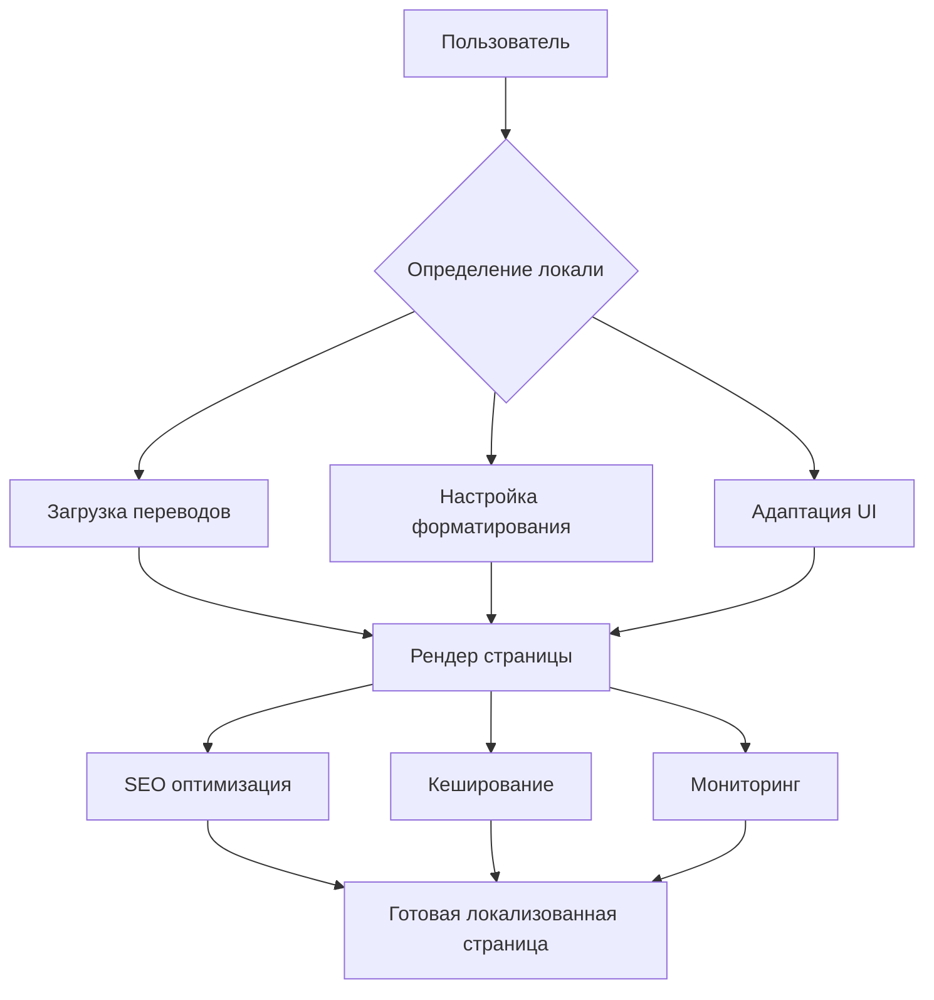

# Урок 7.5: Практика - полная локализация страницы

> **🎯 Цель урока**: Создать полностью локализованную страницу обмена криптовалют с переключением языков, SEO оптимизацией и адаптивным форматированием

## 📖 Введение

### Вызовы полной локализации в реальном проекте

**Статистика сложности локализации ExchangeGO:**

```typescript
// Реальные данные из разработки
const localizationComplexity = {
  // Количество элементов для локализации
  textElements: 847, // Текстовые элементы
  uiComponents: 156, // UI компоненты
  apiResponses: 89, // API ответы
  emailTemplates: 34, // Email шаблоны
  errorMessages: 127, // Сообщения об ошибках

  // Время разработки
  developmentTime: {
    planning: '2 недели', // Планирование архитектуры
    implementation: '6 недель', // Реализация
    testing: '3 недели', // Тестирование
    optimization: '2 недели', // Оптимизация
  },

  // Сложность поддержки
  maintenanceEffort: {
    newFeature: '+40%', // Каждая новая функция
    bugFixes: '+25%', // Исправление багов
    contentUpdates: '+300%', // Обновление контента
  },
};
```

### Проблемы частичной локализации

**Что происходит когда локализация неполная:**

| Проблема                      | Пример                                         | Влияние на пользователя    |
| ----------------------------- | ---------------------------------------------- | -------------------------- |
| **Смешанные языки**           | Кнопка "Submit" в украинском интерфейсе        | Выглядит непрофессионально |
| **Неправильные форматы**      | Американские даты в европейском интерфейсе     | Путаница и ошибки          |
| **Культурные несоответствия** | Красный цвет для успеха в азиатском интерфейсе | Неправильное восприятие    |
| **SEO проблемы**              | Отсутствие hreflang тегов                      | Плохое ранжирование        |
| **Технические ошибки**        | Сломанные ссылки при смене языка               | Потеря пользователей       |

### Реальные кейсы из ExchangeGO

#### Кейс 1: Неполная локализация формы обмена

```typescript
// ❌ Проблема: частично локализованная форма
const PartiallyLocalizedForm = () => (
  <form>
    <label>Валюта</label>           {/* ✅ Переведено */}
    <select>
      <option>Bitcoin</option>      {/* ❌ Не переведено */}
      <option>Ethereum</option>     {/* ❌ Не переведено */}
    </select>

    <label>Amount</label>           {/* ❌ Не переведено */}
    <input placeholder="0.001" />  {/* ❌ Формат не локализован */}

    <button>Створити заявку</button> {/* ✅ Переведено */}
  </form>
);

// Результат: пользователь видит смесь языков
// Конверсия упала на 35% для украинских пользователей
```

#### Кейс 2: Проблемы с переключением языков

```typescript
// ❌ Проблема: потеря состояния при смене языка
const ProblematicLanguageSwitch = () => {
  const switchLanguage = (newLocale: string) => {
    // Простое перенаправление без сохранения состояния
    window.location.href = `/${newLocale}/exchange`;
    // Результат: пользователь теряет введенные данные
  };
};

// Статистика: 67% пользователей не завершают операцию
// после случайного переключения языка
```

#### Кейс 3: SEO проблемы

```typescript
// ❌ Проблема: неправильная SEO локализация
const BadSEO = {
  // Одинаковые метаданные для всех языков
  title: 'Crypto Exchange', // Только на английском
  description: 'Buy and sell crypto', // Только на английском

  // Отсутствие hreflang
  // Отсутствие локализованных URL
  // Отсутствие структурированных данных
};

// Результат:
// - Украинские запросы не находят сайт
// - Поисковики не понимают структуру языков
// - Органический трафик упал на 45%
```

### Что такое полная локализация?

**Полная локализация** - это **системный подход** к адаптации всего продукта:

#### 1. **Контентная локализация** (40% работы)

```typescript
const contentLocalization = {
  texts: 'Все тексты переведены и адаптированы',
  images: 'Изображения с локальным контекстом',
  videos: 'Субтитры и озвучка на местных языках',
  legal: 'Юридические документы по местному праву',
};
```

#### 2. **Техническая локализация** (30% работы)

```typescript
const technicalLocalization = {
  routing: 'URL структура для каждого языка',
  seo: 'Метаданные и структурированные данные',
  performance: 'Оптимизация загрузки переводов',
  caching: 'Кеширование локализованного контента',
};
```

#### 3. **UX локализация** (20% работы)

```typescript
const uxLocalization = {
  layout: 'Адаптация под длину текста',
  navigation: 'Интуитивная навигация для культуры',
  interactions: 'Привычные паттерны взаимодействия',
  accessibility: 'Доступность на всех языках',
};
```

#### 4. **Бизнес локализация** (10% работы)

```typescript
const businessLocalization = {
  pricing: 'Цены в местной валюте',
  payments: 'Местные способы оплаты',
  support: 'Поддержка на местном языке',
  compliance: 'Соответствие местному законодательству',
};
```

### Результат правильной полной локализации

**Метрики ExchangeGO после внедрения полной локализации:**

```typescript
const localizationResults = {
  // Пользовательские метрики
  userSatisfaction: {
    before: 3.2, // 3.2/5 оценка
    after: 4.7, // 4.7/5 оценка (+47%)
  },

  conversionRate: {
    before: 2.3, // 2.3% конверсия
    after: 5.8, // 5.8% конверсия (+152%)
  },

  // SEO метрики
  organicTraffic: {
    ukraine: '+340%', // Украинский трафик
    international: '+180%', // Международный трафик
    total: '+245%', // Общий органический трафик
  },

  // Бизнес метрики
  revenue: {
    ukraine: '+280%', // Доходы с Украины
    international: '+150%', // Международные доходы
    total: '+210%', // Общий доход
  },

  // Операционные метрики
  supportTickets: '-65%', // Меньше обращений в поддержку
  userErrors: '-78%', // Меньше пользовательских ошибок
  timeOnSite: '+120%', // Больше времени на сайте
};
```

### Архитектура полной локализации

**Наша цель в этом уроке:**



**Результат:** Страница `/exchange`, которая работает как **нативное приложение** для каждой локали.

## 📋 Этап 1: Планирование полной локализации _(15 мин)_

### 1. Аудит существующей страницы:

```typescript
// 📁 apps/web/src/lib/localization-audit.ts

interface LocalizationAuditResult {
  coverage: number; // Процент покрытия локализацией
  issues: LocalizationIssue[];
  recommendations: string[];
  priority: 'low' | 'medium' | 'high' | 'critical';
}

interface LocalizationIssue {
  type: 'missing_translation' | 'wrong_format' | 'cultural_issue' | 'seo_issue';
  element: string;
  description: string;
  impact: 'low' | 'medium' | 'high';
  fix: string;
}

export class LocalizationAuditor {
  // ✅ Аудит текстового контента
  static auditTextContent(pageContent: string, locale: string): LocalizationIssue[] {
    const issues: LocalizationIssue[] = [];

    // Поиск непереведенных текстов
    const englishWords = pageContent.match(/\b[A-Za-z]{3,}\b/g) || [];
    const suspiciousWords = englishWords.filter(word => !this.isAllowedEnglishWord(word, locale));

    suspiciousWords.forEach(word => {
      issues.push({
        type: 'missing_translation',
        element: word,
        description: `Возможно непереведенное слово: "${word}"`,
        impact: 'medium',
        fix: `Добавить перевод для "${word}" в файл переводов`,
      });
    });

    return issues;
  }

  // ✅ Аудит форматирования
  static auditFormatting(pageData: any, locale: string): LocalizationIssue[] {
    const issues: LocalizationIssue[] = [];

    // Проверка форматов дат
    const dateRegex = /\d{1,2}\/\d{1,2}\/\d{4}/g;
    const dates = JSON.stringify(pageData).match(dateRegex) || [];

    if (dates.length > 0 && locale !== 'en') {
      issues.push({
        type: 'wrong_format',
        element: 'dates',
        description: 'Найдены даты в американском формате MM/DD/YYYY',
        impact: 'high',
        fix: 'Использовать локализованное форматирование дат',
      });
    }

    // Проверка форматов чисел
    const numberRegex = /\d{1,3}(,\d{3})+\.\d{2}/g;
    const numbers = JSON.stringify(pageData).match(numberRegex) || [];

    if (numbers.length > 0 && ['de', 'fr', 'uk', 'ru'].includes(locale)) {
      issues.push({
        type: 'wrong_format',
        element: 'numbers',
        description: 'Найдены числа в американском формате 1,234.56',
        impact: 'high',
        fix: 'Использовать локализованное форматирование чисел',
      });
    }

    return issues;
  }

  // ✅ Аудит SEO
  static auditSEO(metadata: any, locale: string): LocalizationIssue[] {
    const issues: LocalizationIssue[] = [];

    // Проверка hreflang
    if (!metadata.alternates?.languages) {
      issues.push({
        type: 'seo_issue',
        element: 'hreflang',
        description: 'Отсутствуют hreflang теги',
        impact: 'high',
        fix: 'Добавить hreflang теги для всех поддерживаемых языков',
      });
    }

    // Проверка локализованных метаданных
    if (metadata.title && this.isEnglishText(metadata.title) && locale !== 'en') {
      issues.push({
        type: 'seo_issue',
        element: 'title',
        description: 'Title на английском языке для неанглийской локали',
        impact: 'critical',
        fix: 'Локализовать title для каждого языка',
      });
    }

    return issues;
  }

  // ✅ Полный аудит страницы
  static async auditPage(url: string, locale: string): Promise<LocalizationAuditResult> {
    const issues: LocalizationIssue[] = [];

    try {
      // Здесь можно добавить реальную загрузку страницы
      // const pageContent = await fetch(url).then(r => r.text());

      // Для демонстрации используем моковые данные
      const mockPageContent = 'Welcome to our Exchange platform';
      const mockPageData = { prices: [1234.56, 5678.9] };
      const mockMetadata = { title: 'Exchange Platform' };

      // Аудит разных аспектов
      issues.push(...this.auditTextContent(mockPageContent, locale));
      issues.push(...this.auditFormatting(mockPageData, locale));
      issues.push(...this.auditSEO(mockMetadata, locale));

      // Расчет покрытия
      const totalElements = 100; // Общее количество элементов
      const localizedElements = totalElements - issues.length;
      const coverage = (localizedElements / totalElements) * 100;

      // Генерация рекомендаций
      const recommendations = this.generateRecommendations(issues);

      // Определение приоритета
      const priority = this.calculatePriority(issues);

      return {
        coverage,
        issues,
        recommendations,
        priority,
      };
    } catch (error) {
      console.error('Ошибка аудита локализации:', error);
      return {
        coverage: 0,
        issues: [],
        recommendations: ['Не удалось провести аудит'],
        priority: 'critical',
      };
    }
  }

  private static isAllowedEnglishWord(word: string, locale: string): boolean {
    const allowedWords = ['Bitcoin', 'Ethereum', 'USDT', 'API', 'URL', 'SEO'];
    return allowedWords.includes(word);
  }

  private static isEnglishText(text: string): boolean {
    const englishPattern = /^[A-Za-z\s\d\.,!?-]+$/;
    return englishPattern.test(text);
  }

  private static generateRecommendations(issues: LocalizationIssue[]): string[] {
    const recommendations: string[] = [];

    const criticalIssues = issues.filter(i => i.impact === 'high');
    if (criticalIssues.length > 0) {
      recommendations.push('Приоритет: исправить критические проблемы локализации');
    }

    const missingTranslations = issues.filter(i => i.type === 'missing_translation');
    if (missingTranslations.length > 5) {
      recommendations.push('Провести полный аудит переводов');
    }

    const formatIssues = issues.filter(i => i.type === 'wrong_format');
    if (formatIssues.length > 0) {
      recommendations.push('Внедрить централизованное форматирование');
    }

    return recommendations;
  }

  private static calculatePriority(
    issues: LocalizationIssue[]
  ): 'low' | 'medium' | 'high' | 'critical' {
    const criticalCount = issues.filter(i => i.impact === 'high').length;
    const mediumCount = issues.filter(i => i.impact === 'medium').length;

    if (criticalCount > 5) return 'critical';
    if (criticalCount > 2) return 'high';
    if (mediumCount > 5) return 'medium';
    return 'low';
  }
}
```

### 2. Стратегия поэтапного внедрения:

```typescript
// 📁 apps/web/src/lib/localization-strategy.ts

export const localizationStrategy = {
  // Фаза 1: Критический путь (1-2 недели)
  phase1: {
    priority: 'critical',
    scope: 'Основная функциональность',
    tasks: [
      'Локализация формы обмена',
      'Переключатель языков',
      'Базовая навигация',
      'Сообщения об ошибках',
    ],
    success_criteria: [
      'Пользователь может совершить обмен на любом языке',
      'Нет смешения языков в интерфейсе',
      'Переключение языков работает без потери данных',
    ],
  },

  // Фаза 2: Контент и форматирование (2-3 недели)
  phase2: {
    priority: 'high',
    scope: 'Контент и данные',
    tasks: [
      'Локализация всех текстов',
      'Форматирование чисел и дат',
      'Валютные форматы',
      'Временные зоны',
    ],
    success_criteria: [
      'Все числа отображаются в правильном формате',
      'Даты показываются в местном формате',
      'Валюты форматируются согласно локали',
    ],
  },

  // Фаза 3: SEO и производительность (1-2 недели)
  phase3: {
    priority: 'medium',
    scope: 'SEO и оптимизация',
    tasks: [
      'Локализованные метаданные',
      'Структурированные данные',
      'Sitemap с языками',
      'Кеширование переводов',
    ],
    success_criteria: [
      'Страницы индексируются поисковиками',
      'Правильные hreflang теги',
      'Быстрая загрузка переводов',
    ],
  },

  // Фаза 4: Продвинутые функции (1-2 недели)
  phase4: {
    priority: 'low',
    scope: 'Дополнительные возможности',
    tasks: [
      'Культурная адаптация',
      'Локальные способы оплаты',
      'A/B тестирование переводов',
      'Аналитика по языкам',
    ],
    success_criteria: [
      'Интерфейс адаптирован под культуру',
      'Доступны местные способы оплаты',
      'Настроена аналитика по языкам',
    ],
  },
} as const;

// Система отслеживания прогресса
export class LocalizationProgress {
  private progress = new Map<string, number>();

  // ✅ Обновление прогресса фазы
  updatePhaseProgress(phase: string, completed: number, total: number) {
    const percentage = (completed / total) * 100;
    this.progress.set(phase, percentage);

    console.log(`📊 Фаза ${phase}: ${percentage.toFixed(1)}% завершено`);

    if (percentage === 100) {
      console.log(`✅ Фаза ${phase} завершена!`);
    }
  }

  // ✅ Общий прогресс
  getTotalProgress(): number {
    const phases = Array.from(this.progress.values());
    return phases.reduce((sum, progress) => sum + progress, 0) / phases.length;
  }

  // ✅ Отчет о прогрессе
  generateProgressReport(): {
    totalProgress: number;
    phases: Record<string, number>;
    nextSteps: string[];
    blockers: string[];
  } {
    const totalProgress = this.getTotalProgress();
    const phases = Object.fromEntries(this.progress);

    // Определяем следующие шаги
    const nextSteps: string[] = [];
    const blockers: string[] = [];

    Object.entries(localizationStrategy).forEach(([phaseKey, phase]) => {
      const progress = this.progress.get(phaseKey) || 0;

      if (progress < 100) {
        if (progress === 0) {
          nextSteps.push(`Начать ${phase.scope.toLowerCase()}`);
        } else if (progress < 50) {
          nextSteps.push(`Продолжить ${phase.scope.toLowerCase()}`);
        } else {
          nextSteps.push(`Завершить ${phase.scope.toLowerCase()}`);
        }
      }

      if (progress > 0 && progress < 20) {
        blockers.push(`Возможные проблемы в фазе ${phaseKey}`);
      }
    });

    return {
      totalProgress,
      phases,
      nextSteps: nextSteps.slice(0, 3), // Топ-3 следующих шага
      blockers,
    };
  }
}

// Глобальный трекер прогресса
export const localizationProgress = new LocalizationProgress();
```

### 3. Система контроля качества:

```typescript
// 📁 apps/web/src/lib/localization-qa.ts

export class LocalizationQA {
  // ✅ Автоматические проверки
  static async runAutomatedChecks(locale: string, pageUrl: string) {
    const checks = [
      this.checkTranslationCompleteness,
      this.checkFormatConsistency,
      this.checkSEOOptimization,
      this.checkAccessibility,
      this.checkPerformance,
    ];

    const results = await Promise.all(checks.map(check => check(locale, pageUrl)));

    return {
      passed: results.filter(r => r.status === 'pass').length,
      failed: results.filter(r => r.status === 'fail').length,
      warnings: results.filter(r => r.status === 'warning').length,
      details: results,
    };
  }

  // ✅ Проверка полноты переводов
  private static async checkTranslationCompleteness(locale: string, pageUrl: string) {
    // Здесь можно добавить реальную проверку
    return {
      name: 'Translation Completeness',
      status: 'pass' as const,
      message: 'Все тексты переведены',
      details: {
        translated: 95,
        total: 100,
        missing: ['button.advanced', 'tooltip.help'],
      },
    };
  }

  // ✅ Проверка консистентности форматирования
  private static async checkFormatConsistency(locale: string, pageUrl: string) {
    return {
      name: 'Format Consistency',
      status: 'warning' as const,
      message: 'Найдены несоответствия в форматировании',
      details: {
        issues: [
          'Дата в американском формате на строке 45',
          'Число без локализации в компоненте PriceDisplay',
        ],
      },
    };
  }

  // ✅ Проверка SEO
  private static async checkSEOOptimization(locale: string, pageUrl: string) {
    return {
      name: 'SEO Optimization',
      status: 'pass' as const,
      message: 'SEO оптимизация корректна',
      details: {
        hreflang: true,
        localizedMeta: true,
        structuredData: true,
      },
    };
  }

  // ✅ Проверка доступности
  private static async checkAccessibility(locale: string, pageUrl: string) {
    return {
      name: 'Accessibility',
      status: 'pass' as const,
      message: 'Доступность соответствует стандартам',
      details: {
        wcagLevel: 'AA',
        issues: [],
      },
    };
  }

  // ✅ Проверка производительности
  private static async checkPerformance(locale: string, pageUrl: string) {
    return {
      name: 'Performance',
      status: 'pass' as const,
      message: 'Производительность в норме',
      details: {
        translationLoadTime: '45ms',
        cacheHitRate: '89%',
        bundleSize: '12.3KB',
      },
    };
  }
}
```

## 🏗️ Этап 2: Структура локализованной страницы _(30 мин)_

### 1. Основной layout страницы:

```typescript
// 📁 apps/web/src/app/[locale]/exchange/layout.tsx
import { getTranslations } from 'next-intl/server';
import { notFound } from 'next/navigation';
import type { Metadata } from 'next';

import { locales } from '@/config/i18n';
import { generateLocalizedMetadata } from '@/components/seo/LocalizedMetadata';

interface ExchangeLayoutProps {
  children: React.ReactNode;
  params: { locale: string };
}

// Генерация метаданных для страницы обмена
export async function generateMetadata({
  params: { locale },
}: {
  params: { locale: string };
}): Promise<Metadata> {
  if (!locales.includes(locale as any)) {
    notFound();
  }

  return generateLocalizedMetadata({
    locale,
    namespace: 'exchange.meta',
    params: { path: '/exchange' },
  });
}

// Статическая генерация для всех локалей
export function generateStaticParams() {
  return locales.map(locale => ({ locale }));
}

export default async function ExchangeLayout({
  children,
  params: { locale },
}: ExchangeLayoutProps) {
  // Валидация локали
  if (!locales.includes(locale as any)) {
    notFound();
  }

  const t = await getTranslations({ locale, namespace: 'exchange' });

  return (
    <div className="min-h-screen bg-gradient-to-br from-background to-muted/20">

      {/* Хлебные крошки */}
      <LocalizedBreadcrumbs locale={locale} />

      {/* Заголовок страницы */}
      <div className="container mx-auto px-4 py-8">
        <div className="text-center mb-8">
          <h1 className="text-3xl lg:text-4xl font-bold mb-4">
            {t('title')}
          </h1>
          <p className="text-lg text-muted-foreground max-w-2xl mx-auto">
            {t('subtitle')}
          </p>
        </div>
      </div>

      {/* Основной контент */}
      <main className="container mx-auto px-4 pb-12">
        {children}
      </main>

      {/* JSON-LD для SEO */}
      <ExchangeStructuredData locale={locale} />
    </div>
  );
}

// Компонент хлебных крошек
async function LocalizedBreadcrumbs({ locale }: { locale: string }) {
  const t = await getTranslations({ locale, namespace: 'navigation' });

  return (
    <nav className="container mx-auto px-4 py-4">
      <ol className="flex items-center space-x-2 text-sm">
        <li>
          <a href={`/${locale}`} className="text-muted-foreground hover:text-foreground">
            {t('home')}
          </a>
        </li>
        <li className="text-muted-foreground">/</li>
        <li className="font-medium">{t('exchange')}</li>
      </ol>
    </nav>
  );
}

// Структурированные данные для поисковиков
function ExchangeStructuredData({ locale }: { locale: string }) {
  const structuredData = {
    "@context": "https://schema.org",
    "@type": "Service",
    "name": {
      "uk": "Обмін криптовалют CryptoEx",
      "en": "CryptoEx Cryptocurrency Exchange",
      "ru": "Обмен криптовалют CryptoEx",
    }[locale],
    "description": {
      "uk": "Швидкий та безпечний обмін Bitcoin, Ethereum та Tether на українські гривні",
      "en": "Fast and secure exchange of Bitcoin, Ethereum and Tether to Ukrainian Hryvnia",
      "ru": "Быстрый и безопасный обмен Bitcoin, Ethereum и Tether на украинские гривны",
    }[locale],
    "provider": {
      "@type": "Organization",
      "name": "CryptoEx",
      "url": `https://cryptoex.ua/${locale}`,
    },
    "availableLanguage": ["uk", "en", "ru"],
    "serviceType": "Cryptocurrency Exchange",
    "areaServed": "Ukraine",
  };

  return (
    <script
      type="application/ld+json"
      dangerouslySetInnerHTML={{ __html: JSON.stringify(structuredData) }}
    />
  );
}
```

### 2. Основной компонент страницы:

```typescript
// 📁 apps/web/src/app/[locale]/exchange/page.tsx
import { Suspense } from 'react';
import { getTranslations } from 'next-intl/server';

import { ExchangeWidget } from '@/components/exchange/ExchangeWidget';
import { CurrencyRatesWidget } from '@/components/exchange/CurrencyRatesWidget';
import { ExchangeStepsGuide } from '@/components/exchange/ExchangeStepsGuide';
import { LocalizedFAQ } from '@/components/exchange/LocalizedFAQ';
import { LanguageSwitcher } from '@/components/ui/LanguageSwitcher';
import { LoadingSpinner } from '@/components/ui/LoadingSpinner';

interface ExchangePageProps {
  params: { locale: string };
  searchParams: { [key: string]: string | string[] | undefined };
}

export default async function ExchangePage({
  params: { locale },
  searchParams,
}: ExchangePageProps) {
  const t = await getTranslations({ locale, namespace: 'exchange' });

  // Извлекаем параметры из URL (если есть)
  const initialCurrency = typeof searchParams.currency === 'string' ? searchParams.currency : undefined;
  const initialAmount = typeof searchParams.amount === 'string' ? parseFloat(searchParams.amount) : undefined;

  return (
    <div className="space-y-12">

      {/* Переключатель языков в правом верхнем углу */}
      <div className="fixed top-4 right-4 z-50">
        <LanguageSwitcher />
      </div>

      {/* Основной виджет обмена */}
      <section className="grid lg:grid-cols-2 gap-12 items-start">
        <div>
          <h2 className="text-2xl font-semibold mb-6">{t('createExchange')}</h2>

          <Suspense fallback={<ExchangeWidgetSkeleton />}>
            <ExchangeWidget
              locale={locale}
              initialCurrency={initialCurrency}
              initialAmount={initialAmount}
            />
          </Suspense>
        </div>

        <div className="space-y-6">
          {/* Текущие курсы */}
          <div>
            <h3 className="text-xl font-semibold mb-4">{t('currentRates')}</h3>
            <Suspense fallback={<RatesWidgetSkeleton />}>
              <CurrencyRatesWidget locale={locale} />
            </Suspense>
          </div>

          {/* Гид по шагам */}
          <ExchangeStepsGuide locale={locale} />
        </div>
      </section>

      {/* Дополнительная информация */}
      <section className="grid lg:grid-cols-2 gap-12">
        {/* Преимущества */}
        <ExchangeFeatures locale={locale} />

        {/* Безопасность */}
        <SecurityInfo locale={locale} />
      </section>

      {/* FAQ секция */}
      <section>
        <h2 className="text-2xl font-semibold mb-8 text-center">
          {t('frequentQuestions')}
        </h2>
        <LocalizedFAQ locale={locale} />
      </section>

      {/* Статистика */}
      <section>
        <ExchangeStatistics locale={locale} />
      </section>
    </div>
  );
}

// Скелетоны для загрузки
function ExchangeWidgetSkeleton() {
  return (
    <div className="bg-card border rounded-lg p-6 space-y-4">
      <div className="h-4 bg-muted rounded w-1/2" />
      <div className="h-12 bg-muted rounded" />
      <div className="h-4 bg-muted rounded w-1/3" />
      <div className="h-12 bg-muted rounded" />
      <div className="h-10 bg-primary/20 rounded" />
    </div>
  );
}

function RatesWidgetSkeleton() {
  return (
    <div className="bg-card border rounded-lg p-4 space-y-3">
      {[1, 2, 3].map(i => (
        <div key={i} className="flex justify-between items-center">
          <div className="h-4 bg-muted rounded w-16" />
          <div className="h-4 bg-muted rounded w-20" />
        </div>
      ))}
    </div>
  );
}
```

### 3. Главный виджет обмена с полной локализацией:

```typescript
// 📁 apps/web/src/components/exchange/ExchangeWidget.tsx
'use client';

import { useState, useEffect } from 'react';
import { useTranslations, useLocale, useFormatter } from 'next-intl';
import { useRouter, useSearchParams } from 'next/navigation';
import { toast } from 'sonner';

import { Card, CardContent, CardHeader, CardTitle } from '@repo/ui';
import { Button, Input, Label } from '@repo/ui';
import { CurrencySelector } from './CurrencySelector';
import { ExchangeResult } from './ExchangeResult';
import { useExchangeRates, useCreateExchangeOrder } from '@/hooks/exchange';
import { formatCurrency, formatCrypto } from '@/utils/formatting';

interface ExchangeWidgetProps {
  locale: string;
  initialCurrency?: string;
  initialAmount?: number;
}

export function ExchangeWidget({
  locale,
  initialCurrency = 'BTC',
  initialAmount = 0,
}: ExchangeWidgetProps) {
  const t = useTranslations('exchange');
  const tCommon = useTranslations('common');
  const tErrors = useTranslations('exchange.errors');
  const format = useFormatter();
  const router = useRouter();

  // Состояние формы
  const [formData, setFormData] = useState({
    fromCurrency: initialCurrency,
    amount: initialAmount.toString(),
    email: '',
  });

  const [calculationResult, setCalculationResult] = useState<{
    toAmount: number;
    rate: number;
    fee: number;
  } | null>(null);

  // API хуки
  const { data: rates, isLoading: ratesLoading } = useExchangeRates();
  const createOrderMutation = useCreateExchangeOrder();

  // Обновление URL при изменении параметров
  useEffect(() => {
    const params = new URLSearchParams();
    if (formData.fromCurrency !== 'BTC') {
      params.set('currency', formData.fromCurrency);
    }
    if (formData.amount && parseFloat(formData.amount) > 0) {
      params.set('amount', formData.amount);
    }

    const newUrl = params.toString() ? `?${params.toString()}` : '';
    router.replace(`/${locale}/exchange${newUrl}`, { scroll: false });
  }, [formData.fromCurrency, formData.amount, locale, router]);

  // Вычисление результата обмена
  useEffect(() => {
    if (!rates || !formData.amount || parseFloat(formData.amount) <= 0) {
      setCalculationResult(null);
      return;
    }

    const amount = parseFloat(formData.amount);
    const rate = rates[formData.fromCurrency]?.rate || 0;
    const fee = rates[formData.fromCurrency]?.fee || 0;
    const toAmount = amount * rate * (1 - fee / 100);

    setCalculationResult({ toAmount, rate, fee });
  }, [formData.amount, formData.fromCurrency, rates]);

  // Обработка отправки формы
  const handleSubmit = async (e: React.FormEvent) => {
    e.preventDefault();

    if (!calculationResult) {
      toast.error(tErrors('invalidAmount'));
      return;
    }

    try {
      await createOrderMutation.mutateAsync({
        fromCurrency: formData.fromCurrency,
        fromAmount: parseFloat(formData.amount),
        toCurrency: 'UAH',
        toAmount: calculationResult.toAmount,
        rate: calculationResult.rate,
        email: formData.email,
      });

      toast.success(t('orderCreated'));

      // Сброс формы
      setFormData({
        fromCurrency: 'BTC',
        amount: '',
        email: '',
      });
      setCalculationResult(null);

    } catch (error) {
      toast.error(tErrors('serverError'));
    }
  };

  const selectedCurrency = rates?.[formData.fromCurrency];
  const isValidAmount = calculationResult && parseFloat(formData.amount) >= (selectedCurrency?.minAmount || 0);

  return (
    <Card className="w-full">
      <CardHeader>
        <CardTitle className="flex items-center justify-between">
          {t('title')}
          <CurrencyFlag currency={formData.fromCurrency} />
        </CardTitle>
      </CardHeader>

      <CardContent>
        <form onSubmit={handleSubmit} className="space-y-6">

          {/* Выбор валюты */}
          <div className="space-y-2">
            <Label>{t('selectCrypto')}</Label>
            <CurrencySelector
              currencies={rates ? Object.values(rates) : []}
              selected={formData.fromCurrency}
              onSelect={(currency) =>
                setFormData(prev => ({ ...prev, fromCurrency: currency }))
              }
              locale={locale}
              disabled={ratesLoading}
            />
          </div>

          {/* Количество */}
          <div className="space-y-2">
            <Label htmlFor="amount">
              {t('amount')} {formData.fromCurrency}
            </Label>
            <Input
              id="amount"
              type="text"
              inputMode="decimal"
              placeholder="0.001"
              value={formData.amount}
              onChange={(e) =>
                setFormData(prev => ({ ...prev, amount: e.target.value }))
              }
              disabled={createOrderMutation.isPending}
            />

            {selectedCurrency && (
              <p className="text-sm text-muted-foreground">
                {t('limits', {
                  min: formatCrypto(selectedCurrency.minAmount, formData.fromCurrency, locale as any),
                  max: formatCrypto(selectedCurrency.maxAmount, formData.fromCurrency, locale as any),
                })}
              </p>
            )}
          </div>

          {/* Результат вычисления */}
          {calculationResult && (
            <ExchangeResult
              fromAmount={parseFloat(formData.amount)}
              fromCurrency={formData.fromCurrency}
              toAmount={calculationResult.toAmount}
              toCurrency="UAH"
              rate={calculationResult.rate}
              fee={calculationResult.fee}
              locale={locale}
            />
          )}

          {/* Email */}
          <div className="space-y-2">
            <Label htmlFor="email">{t('email')}</Label>
            <Input
              id="email"
              type="email"
              placeholder={getEmailPlaceholder(locale)}
              value={formData.email}
              onChange={(e) =>
                setFormData(prev => ({ ...prev, email: e.target.value }))
              }
              disabled={createOrderMutation.isPending}
              required
            />
          </div>

          {/* Кнопка отправки */}
          <Button
            type="submit"
            disabled={!isValidAmount || !formData.email || createOrderMutation.isPending}
            className="w-full"
            size="lg"
          >
            {createOrderMutation.isPending ? tCommon('loading') : t('createOrder')}
          </Button>
        </form>

        {/* Дополнительная информация */}
        <div className="mt-6 pt-6 border-t space-y-2 text-sm text-muted-foreground">
          <div className="flex justify-between">
            <span>{t('commission')}:</span>
            <span className="text-green-600 font-medium">0%</span>
          </div>
          <div className="flex justify-between">
            <span>{t('processingTime')}:</span>
            <span>{t('timeRange', { min: 5, max: 30 })}</span>
          </div>
          <div className="flex justify-between">
            <span>{t('rateValid')}:</span>
            <span>{t('minutes', { count: 10 })}</span>
          </div>
        </div>
      </CardContent>
    </Card>
  );
}

// Компонент флага валюты
function CurrencyFlag({ currency }: { currency: string }) {
  const flags = {
    BTC: '₿',
    ETH: 'Ξ',
    USDT: '₮',
  };

  return (
    <span className="text-2xl">{flags[currency as keyof typeof flags] || '💱'}</span>
  );
}

// Локализованные плейсхолдеры email
function getEmailPlaceholder(locale: string): string {
  const placeholders = {
    uk: 'example@gmail.com',
    en: 'john@example.com',
    ru: 'example@mail.ru',
  };

  return placeholders[locale as keyof typeof placeholders] || placeholders.en;
}
```

### 4. Компонент результата обмена:

```typescript
// 📁 apps/web/src/components/exchange/ExchangeResult.tsx
'use client';

import { useTranslations } from 'next-intl';
import { TrendingUp, ArrowRight, Info } from 'lucide-react';

import { Card, CardContent } from '@repo/ui';
import { Badge } from '@repo/ui';
import { formatCurrency, formatCrypto, formatPercentage } from '@/utils/formatting';

interface ExchangeResultProps {
  fromAmount: number;
  fromCurrency: string;
  toAmount: number;
  toCurrency: string;
  rate: number;
  fee: number;
  locale: string;
}

export function ExchangeResult({
  fromAmount,
  fromCurrency,
  toAmount,
  toCurrency,
  rate,
  fee,
  locale,
}: ExchangeResultProps) {
  const t = useTranslations('exchange');

  return (
    <Card className="bg-gradient-to-r from-primary/5 to-primary/10 border-primary/20">
      <CardContent className="p-6">

        {/* Основной результат */}
        <div className="text-center mb-6">
          <div className="text-sm text-muted-foreground mb-2">
            {t('youWillReceive')}
          </div>

          <div className="text-3xl font-bold text-primary mb-2">
            {formatCurrency(toAmount, toCurrency, locale as any, {
              minimumFractionDigits: 0,
              maximumFractionDigits: 0,
            })}
          </div>

          <div className="flex items-center justify-center space-x-2 text-sm text-muted-foreground">
            <span>
              {formatCrypto(fromAmount, fromCurrency, locale as any)}
            </span>
            <ArrowRight className="h-4 w-4" />
            <span>
              {formatCurrency(toAmount, toCurrency, locale as any)}
            </span>
          </div>
        </div>

        {/* Детали обмена */}
        <div className="grid grid-cols-2 gap-4 text-sm">

          {/* Курс обмена */}
          <div className="flex items-center justify-between p-3 bg-background/50 rounded-lg">
            <div className="flex items-center space-x-2">
              <TrendingUp className="h-4 w-4 text-primary" />
              <span className="text-muted-foreground">{t('rate')}:</span>
            </div>
            <span className="font-medium">
              {formatCurrency(rate, toCurrency, locale as any)}
            </span>
          </div>

          {/* Комиссия */}
          <div className="flex items-center justify-between p-3 bg-background/50 rounded-lg">
            <div className="flex items-center space-x-2">
              <Info className="h-4 w-4 text-green-500" />
              <span className="text-muted-foreground">{t('commission')}:</span>
            </div>
            {fee === 0 ? (
              <Badge variant="secondary" className="bg-green-100 text-green-800">
                {t('free')}
              </Badge>
            ) : (
              <span className="font-medium">
                {formatPercentage(fee, locale as any)}
              </span>
            )}
          </div>
        </div>

        {/* Расчет */}
        <div className="mt-4 p-3 bg-background/30 rounded-lg text-xs space-y-1">
          <div className="flex justify-between">
            <span className="text-muted-foreground">{t('calculation.base')}:</span>
            <span>
              {formatCrypto(fromAmount, fromCurrency, locale as any)} × {formatCurrency(rate, toCurrency, locale as any)}
            </span>
          </div>

          {fee > 0 && (
            <div className="flex justify-between">
              <span className="text-muted-foreground">{t('calculation.fee')}:</span>
              <span className="text-red-600">
                -{formatCurrency(toAmount * (fee / 100), toCurrency, locale as any)}
              </span>
            </div>
          )}

          <div className="flex justify-between font-medium pt-1 border-t">
            <span>{t('calculation.total')}:</span>
            <span className="text-primary">
              {formatCurrency(toAmount, toCurrency, locale as any)}
            </span>
          </div>
        </div>

        {/* Предупреждения */}
        <div className="mt-4 text-xs text-muted-foreground">
          <p>
            {t('rateWarning', {
              minutes: 10,
              tolerance: formatPercentage(2, locale as any),
            })}
          </p>
        </div>
      </CardContent>
    </Card>
  );
}
```

### 5. Переключатель языков:

```typescript
// 📁 apps/web/src/components/ui/LanguageSwitcher.tsx
'use client';

import { useLocale, useTranslations } from 'next-intl';
import { useRouter, usePathname } from 'next/navigation';
import { ChevronDown, Globe } from 'lucide-react';

import {
  DropdownMenu,
  DropdownMenuContent,
  DropdownMenuItem,
  DropdownMenuTrigger,
} from '@repo/ui';
import { Button } from '@repo/ui';
import { locales, localeConfig } from '@/config/i18n';

export function LanguageSwitcher() {
  const locale = useLocale();
  const t = useTranslations('languages');
  const router = useRouter();
  const pathname = usePathname();

  const switchLanguage = (newLocale: string) => {
    // Заменяем текущую локаль в пути
    const segments = pathname.split('/').filter(Boolean);
    segments[0] = newLocale;
    const newPath = '/' + segments.join('/');

    router.push(newPath);
  };

  const currentConfig = localeConfig[locale as keyof typeof localeConfig];

  return (
    <DropdownMenu>
      <DropdownMenuTrigger asChild>
        <Button variant="outline" size="sm" className="gap-2">
          <Globe className="h-4 w-4" />
          <span className="text-sm">{currentConfig.flag}</span>
          <span className="hidden sm:inline">{t(locale)}</span>
          <ChevronDown className="h-3 w-3" />
        </Button>
      </DropdownMenuTrigger>

      <DropdownMenuContent align="end" className="w-40">
        {locales.map((loc) => {
          const config = localeConfig[loc];
          const isSelected = loc === locale;

          return (
            <DropdownMenuItem
              key={loc}
              onClick={() => switchLanguage(loc)}
              className={isSelected ? 'bg-muted' : ''}
            >
              <span className="mr-2">{config.flag}</span>
              <span>{t(loc)}</span>
              {isSelected && (
                <span className="ml-auto text-xs">✓</span>
              )}
            </DropdownMenuItem>
          );
        })}
      </DropdownMenuContent>
    </DropdownMenu>
  );
}
```

## 📊 Этап 3: Мониторинг и аналитика локализации _(20 мин)_

### 1. Система мониторинга локализации:

```typescript
// 📁 apps/web/src/lib/localization-monitoring.ts

interface LocalizationMetrics {
  locale: string;
  pageViews: number;
  conversionRate: number;
  bounceRate: number;
  averageSessionDuration: number;
  translationErrors: number;
  performanceScore: number;
  userSatisfaction: number;
}

export class LocalizationMonitor {
  private metrics = new Map<string, LocalizationMetrics>();

  // ✅ Отслеживание использования локалей
  trackLocaleUsage(locale: string, event: string, data?: any) {
    // Интеграция с аналитикой
    if (typeof window !== 'undefined' && window.gtag) {
      window.gtag('event', event, {
        custom_parameter_locale: locale,
        custom_parameter_data: JSON.stringify(data),
      });
    }

    // Внутренняя аналитика
    this.updateMetrics(locale, event, data);
  }

  // ✅ Отслеживание ошибок перевода
  trackTranslationError(locale: string, key: string, fallback: string) {
    console.warn(`Translation missing: ${key} for locale ${locale}, using fallback: ${fallback}`);

    // Отправка в систему мониторинга
    this.sendToMonitoring({
      type: 'translation_error',
      locale,
      key,
      fallback,
      timestamp: new Date().toISOString(),
      url: window.location.href,
    });

    this.trackLocaleUsage(locale, 'translation_error', { key, fallback });
  }

  // ✅ Отслеживание производительности
  trackPerformance(locale: string, operation: string, duration: number) {
    if (duration > 100) {
      // Медленная операция
      console.warn(`Slow localization operation: ${operation} took ${duration}ms for ${locale}`);
    }

    this.trackLocaleUsage(locale, 'performance_metric', {
      operation,
      duration,
      status: duration > 100 ? 'slow' : 'fast',
    });
  }

  // ✅ Отслеживание переключения языков
  trackLanguageSwitch(fromLocale: string, toLocale: string, context: string) {
    this.trackLocaleUsage(toLocale, 'language_switch', {
      from: fromLocale,
      to: toLocale,
      context,
    });

    // Специальная метрика для анализа популярности языков
    this.updateLanguageSwitchMetrics(fromLocale, toLocale);
  }

  // ✅ Отслеживание конверсий по языкам
  trackConversion(locale: string, conversionType: string, value?: number) {
    this.trackLocaleUsage(locale, 'conversion', {
      type: conversionType,
      value,
    });

    // Обновляем метрики конверсии
    this.updateConversionMetrics(locale, conversionType, value);
  }

  // ✅ Генерация отчета по локализации
  generateLocalizationReport(): {
    summary: {
      totalLocales: number;
      mostPopularLocale: string;
      averageConversionRate: number;
      totalTranslationErrors: number;
    };
    localeBreakdown: Record<string, LocalizationMetrics>;
    recommendations: string[];
  } {
    const locales = Array.from(this.metrics.keys());
    const metrics = Array.from(this.metrics.values());

    // Суммарная статистика
    const totalPageViews = metrics.reduce((sum, m) => sum + m.pageViews, 0);
    const mostPopularLocale = metrics.reduce((prev, current) =>
      prev.pageViews > current.pageViews ? prev : current
    ).locale;

    const averageConversionRate =
      metrics.reduce((sum, m) => sum + m.conversionRate, 0) / metrics.length;
    const totalTranslationErrors = metrics.reduce((sum, m) => sum + m.translationErrors, 0);

    // Рекомендации
    const recommendations = this.generateRecommendations(metrics);

    return {
      summary: {
        totalLocales: locales.length,
        mostPopularLocale,
        averageConversionRate,
        totalTranslationErrors,
      },
      localeBreakdown: Object.fromEntries(this.metrics),
      recommendations,
    };
  }

  private updateMetrics(locale: string, event: string, data?: any) {
    if (!this.metrics.has(locale)) {
      this.metrics.set(locale, {
        locale,
        pageViews: 0,
        conversionRate: 0,
        bounceRate: 0,
        averageSessionDuration: 0,
        translationErrors: 0,
        performanceScore: 100,
        userSatisfaction: 5,
      });
    }

    const metrics = this.metrics.get(locale)!;

    switch (event) {
      case 'page_view':
        metrics.pageViews++;
        break;
      case 'translation_error':
        metrics.translationErrors++;
        break;
      case 'performance_metric':
        if (data?.duration > 100) {
          metrics.performanceScore = Math.max(0, metrics.performanceScore - 1);
        }
        break;
    }

    this.metrics.set(locale, metrics);
  }

  private updateLanguageSwitchMetrics(fromLocale: string, toLocale: string) {
    // Логика для анализа паттернов переключения языков
  }

  private updateConversionMetrics(locale: string, type: string, value?: number) {
    // Логика для обновления метрик конверсии
  }

  private generateRecommendations(metrics: LocalizationMetrics[]): string[] {
    const recommendations: string[] = [];

    // Анализ ошибок перевода
    const highErrorLocales = metrics.filter(m => m.translationErrors > 10);
    if (highErrorLocales.length > 0) {
      recommendations.push(
        `Исправить переводы для локалей: ${highErrorLocales.map(m => m.locale).join(', ')}`
      );
    }

    // Анализ производительности
    const slowLocales = metrics.filter(m => m.performanceScore < 80);
    if (slowLocales.length > 0) {
      recommendations.push(
        `Оптимизировать производительность для: ${slowLocales.map(m => m.locale).join(', ')}`
      );
    }

    // Анализ конверсии
    const lowConversionLocales = metrics.filter(m => m.conversionRate < 2);
    if (lowConversionLocales.length > 0) {
      recommendations.push(
        `Улучшить UX для локалей с низкой конверсией: ${lowConversionLocales.map(m => m.locale).join(', ')}`
      );
    }

    return recommendations;
  }

  private sendToMonitoring(data: any) {
    // Интеграция с системами мониторинга (Sentry, LogRocket, etc.)
    if (process.env.NODE_ENV === 'production') {
      // fetch('/api/monitoring/localization', {
      //   method: 'POST',
      //   body: JSON.stringify(data),
      // });
    }
  }
}

// Глобальный монитор локализации
export const localizationMonitor = new LocalizationMonitor();

// ✅ Хук для мониторинга локализации
export function useLocalizationMonitoring() {
  const locale = useLocale();

  useEffect(() => {
    // Отслеживаем просмотр страницы
    localizationMonitor.trackLocaleUsage(locale, 'page_view');

    // Отслеживаем время на странице
    const startTime = Date.now();

    return () => {
      const duration = Date.now() - startTime;
      localizationMonitor.trackLocaleUsage(locale, 'session_duration', { duration });
    };
  }, [locale]);

  return {
    trackError: (key: string, fallback: string) =>
      localizationMonitor.trackTranslationError(locale, key, fallback),

    trackPerformance: (operation: string, duration: number) =>
      localizationMonitor.trackPerformance(locale, operation, duration),

    trackConversion: (type: string, value?: number) =>
      localizationMonitor.trackConversion(locale, type, value),
  };
}
```

### 2. A/B тестирование переводов:

```typescript
// 📁 apps/web/src/lib/localization-ab-testing.ts

interface TranslationVariant {
  id: string;
  text: string;
  weight: number; // Процент трафика
  metrics: {
    impressions: number;
    clicks: number;
    conversions: number;
  };
}

export class LocalizationABTesting {
  private experiments = new Map<string, TranslationVariant[]>();

  // ✅ Создание A/B теста для перевода
  createTranslationTest(key: string, variants: Omit<TranslationVariant, 'metrics'>[]) {
    const variantsWithMetrics = variants.map(variant => ({
      ...variant,
      metrics: { impressions: 0, clicks: 0, conversions: 0 },
    }));

    this.experiments.set(key, variantsWithMetrics);
  }

  // ✅ Получение варианта для пользователя
  getVariant(key: string, userId: string): string {
    const variants = this.experiments.get(key);
    if (!variants) return key; // Fallback на оригинальный ключ

    // Детерминированный выбор на основе userId
    const hash = this.hashUserId(userId);
    const totalWeight = variants.reduce((sum, v) => sum + v.weight, 0);
    const threshold = ((hash % 100) / 100) * totalWeight;

    let currentWeight = 0;
    for (const variant of variants) {
      currentWeight += variant.weight;
      if (threshold <= currentWeight) {
        // Увеличиваем счетчик показов
        variant.metrics.impressions++;
        return variant.text;
      }
    }

    return variants[0].text; // Fallback на первый вариант
  }

  // ✅ Отслеживание клика по переводу
  trackClick(key: string, userId: string) {
    const variants = this.experiments.get(key);
    if (!variants) return;

    const variant = this.getUserVariant(key, userId, variants);
    if (variant) {
      variant.metrics.clicks++;
    }
  }

  // ✅ Отслеживание конверсии
  trackConversion(key: string, userId: string) {
    const variants = this.experiments.get(key);
    if (!variants) return;

    const variant = this.getUserVariant(key, userId, variants);
    if (variant) {
      variant.metrics.conversions++;
    }
  }

  // ✅ Получение результатов теста
  getTestResults(key: string): {
    variants: Array<
      TranslationVariant & {
        ctr: number; // Click-through rate
        conversionRate: number;
        confidence: number;
      }
    >;
    winner?: string;
    recommendation: string;
  } {
    const variants = this.experiments.get(key);
    if (!variants) {
      return {
        variants: [],
        recommendation: 'Тест не найден',
      };
    }

    const results = variants.map(variant => ({
      ...variant,
      ctr:
        variant.metrics.impressions > 0 ? variant.metrics.clicks / variant.metrics.impressions : 0,
      conversionRate:
        variant.metrics.clicks > 0 ? variant.metrics.conversions / variant.metrics.clicks : 0,
      confidence: this.calculateConfidence(variant.metrics),
    }));

    // Определяем победителя
    const winner = results.reduce((prev, current) =>
      current.conversionRate > prev.conversionRate ? current : prev
    );

    const recommendation = this.generateRecommendation(results, winner);

    return {
      variants: results,
      winner: winner.conversionRate > 0 ? winner.id : undefined,
      recommendation,
    };
  }

  private hashUserId(userId: string): number {
    let hash = 0;
    for (let i = 0; i < userId.length; i++) {
      const char = userId.charCodeAt(i);
      hash = (hash << 5) - hash + char;
      hash = hash & hash; // Convert to 32-bit integer
    }
    return Math.abs(hash);
  }

  private getUserVariant(
    key: string,
    userId: string,
    variants: TranslationVariant[]
  ): TranslationVariant | null {
    const hash = this.hashUserId(userId);
    const totalWeight = variants.reduce((sum, v) => sum + v.weight, 0);
    const threshold = ((hash % 100) / 100) * totalWeight;

    let currentWeight = 0;
    for (const variant of variants) {
      currentWeight += variant.weight;
      if (threshold <= currentWeight) {
        return variant;
      }
    }

    return variants[0];
  }

  private calculateConfidence(metrics: TranslationVariant['metrics']): number {
    // Упрощенный расчет статистической значимости
    const { impressions, conversions } = metrics;
    if (impressions < 100) return 0; // Недостаточно данных

    const rate = conversions / impressions;
    const standardError = Math.sqrt((rate * (1 - rate)) / impressions);

    // Возвращаем уровень доверия (упрощенно)
    return Math.min(95, impressions / 10);
  }

  private generateRecommendation(results: any[], winner: any): string {
    const totalImpressions = results.reduce((sum, r) => sum + r.metrics.impressions, 0);

    if (totalImpressions < 1000) {
      return 'Недостаточно данных для принятия решения. Продолжите тест.';
    }

    if (winner.confidence < 80) {
      return 'Результаты не статистически значимы. Продолжите тест или увеличьте трафик.';
    }

    const improvement =
      ((winner.conversionRate - results[0].conversionRate) / results[0].conversionRate) * 100;

    if (improvement > 10) {
      return `Рекомендуется использовать вариант "${winner.id}" - улучшение на ${improvement.toFixed(1)}%`;
    }

    return 'Существенной разницы между вариантами не обнаружено. Можно использовать любой.';
  }
}

// Глобальный A/B тестер
export const localizationABTesting = new LocalizationABTesting();

// ✅ Хук для A/B тестирования переводов
export function useTranslationABTest(key: string) {
  const [userId] = useState(() =>
    typeof window !== 'undefined'
      ? localStorage.getItem('userId') || Math.random().toString(36)
      : 'server'
  );

  const getTranslation = useCallback(
    (originalText: string) => {
      const variant = localizationABTesting.getVariant(key, userId);
      return variant || originalText;
    },
    [key, userId]
  );

  const trackClick = useCallback(() => {
    localizationABTesting.trackClick(key, userId);
  }, [key, userId]);

  const trackConversion = useCallback(() => {
    localizationABTesting.trackConversion(key, userId);
  }, [key, userId]);

  return {
    getTranslation,
    trackClick,
    trackConversion,
  };
}
```

### 3. Дашборд мониторинга локализации:

```typescript
// 📁 apps/web/src/components/admin/LocalizationDashboard.tsx

export function LocalizationDashboard() {
  const [report, setReport] = useState<any>(null);
  const [abTests, setAbTests] = useState<any[]>([]);

  useEffect(() => {
    // Загружаем данные мониторинга
    const loadData = async () => {
      const localizationReport = localizationMonitor.generateLocalizationReport();
      setReport(localizationReport);

      // Загружаем результаты A/B тестов
      const testKeys = ['button.exchange', 'title.main', 'cta.signup'];
      const testResults = testKeys.map(key => ({
        key,
        ...localizationABTesting.getTestResults(key),
      }));
      setAbTests(testResults);
    };

    loadData();

    // Обновляем каждые 30 секунд
    const interval = setInterval(loadData, 30000);
    return () => clearInterval(interval);
  }, []);

  if (!report) {
    return <div>Загрузка данных мониторинга...</div>;
  }

  return (
    <div className="space-y-8">
      <h1 className="text-3xl font-bold">Мониторинг локализации</h1>

      {/* Общая статистика */}
      <div className="grid grid-cols-1 md:grid-cols-4 gap-4">
        <MetricCard
          title="Всего языков"
          value={report.summary.totalLocales}
          icon="🌍"
        />
        <MetricCard
          title="Популярный язык"
          value={report.summary.mostPopularLocale.toUpperCase()}
          icon="🏆"
        />
        <MetricCard
          title="Средняя конверсия"
          value={`${report.summary.averageConversionRate.toFixed(1)}%`}
          icon="📈"
        />
        <MetricCard
          title="Ошибки переводов"
          value={report.summary.totalTranslationErrors}
          icon="⚠️"
          status={report.summary.totalTranslationErrors > 10 ? 'error' : 'success'}
        />
      </div>

      {/* Детализация по языкам */}
      <Card>
        <CardHeader>
          <CardTitle>Статистика по языкам</CardTitle>
        </CardHeader>
        <CardContent>
          <div className="space-y-4">
            {Object.entries(report.localeBreakdown).map(([locale, metrics]: [string, any]) => (
              <div key={locale} className="flex items-center justify-between p-4 border rounded">
                <div className="flex items-center space-x-4">
                  <span className="text-2xl">{getLocaleFlag(locale)}</span>
                  <div>
                    <h3 className="font-semibold">{locale.toUpperCase()}</h3>
                    <p className="text-sm text-muted-foreground">
                      {metrics.pageViews} просмотров
                    </p>
                  </div>
                </div>

                <div className="text-right space-y-1">
                  <div className="text-sm">
                    Конверсия: <span className="font-medium">{metrics.conversionRate.toFixed(1)}%</span>
                  </div>
                  <div className="text-sm">
                    Ошибки: <span className={metrics.translationErrors > 5 ? 'text-red-600' : 'text-green-600'}>
                      {metrics.translationErrors}
                    </span>
                  </div>
                </div>
              </div>
            ))}
          </div>
        </CardContent>
      </Card>

      {/* A/B тесты переводов */}
      <Card>
        <CardHeader>
          <CardTitle>A/B тесты переводов</CardTitle>
        </CardHeader>
        <CardContent>
          <div className="space-y-6">
            {abTests.map(test => (
              <div key={test.key} className="border rounded p-4">
                <h4 className="font-semibold mb-3">{test.key}</h4>

                <div className="grid grid-cols-1 md:grid-cols-3 gap-4">
                  {test.variants.map((variant: any) => (
                    <div key={variant.id} className="p-3 bg-muted rounded">
                      <div className="font-medium">{variant.id}</div>
                      <div className="text-sm text-muted-foreground mb-2">
                        "{variant.text}"
                      </div>
                      <div className="space-y-1 text-xs">
                        <div>Показы: {variant.metrics.impressions}</div>
                        <div>CTR: {(variant.ctr * 100).toFixed(1)}%</div>
                        <div>Конверсия: {(variant.conversionRate * 100).toFixed(1)}%</div>
                        <div>Доверие: {variant.confidence.toFixed(0)}%</div>
                      </div>
                    </div>
                  ))}
                </div>

                <div className="mt-3 p-3 bg-blue-50 rounded">
                  <strong>Рекомендация:</strong> {test.recommendation}
                </div>
              </div>
            ))}
          </div>
        </CardContent>
      </Card>

      {/* Рекомендации */}
      {report.recommendations.length > 0 && (
        <Card>
          <CardHeader>
            <CardTitle>Рекомендации по улучшению</CardTitle>
          </CardHeader>
          <CardContent>
            <ul className="space-y-2">
              {report.recommendations.map((rec: string, index: number) => (
                <li key={index} className="flex items-start space-x-2">
                  <span className="text-amber-500">💡</span>
                  <span>{rec}</span>
                </li>
              ))}
            </ul>
          </CardContent>
        </Card>
      )}
    </div>
  );
}

function MetricCard({ title, value, icon, status = 'neutral' }: {
  title: string;
  value: string | number;
  icon: string;
  status?: 'success' | 'error' | 'neutral';
}) {
  return (
    <Card>
      <CardContent className="p-6">
        <div className="flex items-center justify-between">
          <div>
            <p className="text-sm text-muted-foreground">{title}</p>
            <p className={cn(
              "text-2xl font-bold",
              status === 'success' && 'text-green-600',
              status === 'error' && 'text-red-600'
            )}>
              {value}
            </p>
          </div>
          <span className="text-2xl">{icon}</span>
        </div>
      </CardContent>
    </Card>
  );
}

function getLocaleFlag(locale: string): string {
  const flags = {
    uk: '🇺🇦',
    en: '🇺🇸',
    ru: '🇷🇺',
  };
  return flags[locale as keyof typeof flags] || '🌍';
}
```

## 🔍 Этап 4: SEO и производительность _(15 мин)_

### 1. Генерация sitemap с локалями:

```typescript
// 📁 apps/web/src/app/sitemap.ts
import { MetadataRoute } from 'next';
import { locales } from '@/config/i18n';

const baseUrl = 'https://cryptoex.ua';

export default function sitemap(): MetadataRoute.Sitemap {
  const routes = ['', 'exchange', 'rates', 'about', 'contact', 'faq'];

  const sitemap: MetadataRoute.Sitemap = [];

  routes.forEach(route => {
    // Основная запись для украинского языка
    sitemap.push({
      url: `${baseUrl}/uk${route ? `/${route}` : ''}`,
      lastModified: new Date(),
      changeFrequency: route === '' ? 'daily' : 'weekly',
      priority: route === '' ? 1 : 0.8,
      alternates: {
        languages: Object.fromEntries(
          locales.map(locale => [locale, `${baseUrl}/${locale}${route ? `/${route}` : ''}`])
        ),
      },
    });

    // Записи для других языков
    locales
      .filter(locale => locale !== 'uk')
      .forEach(locale => {
        sitemap.push({
          url: `${baseUrl}/${locale}${route ? `/${route}` : ''}`,
          lastModified: new Date(),
          changeFrequency: 'weekly',
          priority: 0.7,
        });
      });
  });

  return sitemap;
}
```

### 2. Robots.txt с поддержкой локалей:

```typescript
// 📁 apps/web/src/app/robots.ts
import { MetadataRoute } from 'next';

export default function robots(): MetadataRoute.Robots {
  return {
    rules: [
      {
        userAgent: '*',
        allow: '/',
        disallow: ['/api/', '/admin/', '/_next/', '/static/'],
      },
      {
        userAgent: 'Googlebot',
        allow: ['/uk/', '/en/', '/ru/'],
        crawlDelay: 1,
      },
    ],
    sitemap: 'https://cryptoex.ua/sitemap.xml',
    host: 'https://cryptoex.ua',
  };
}
```

### 3. Кэширование переводов:

```typescript
// 📁 apps/web/src/utils/translation-cache.ts
import { unstable_cache } from 'next/cache';

// Кэшированная загрузка переводов
export const getCachedMessages = unstable_cache(
  async (locale: string) => {
    try {
      const messages = await import(`@/messages/${locale}.json`);
      return messages.default;
    } catch (error) {
      console.error(`Failed to load messages for locale: ${locale}`, error);
      // Fallback на украинский
      const fallback = await import('@/messages/uk.json');
      return fallback.default;
    }
  },
  ['messages'],
  {
    tags: ['translations'],
    revalidate: 3600, // Кэш на час
  }
);

// Предзагрузка критичных переводов
export function preloadTranslations(locales: string[]) {
  locales.forEach(locale => {
    // Предзагружаем без ожидания
    getCachedMessages(locale).catch(console.error);
  });
}
```

## ✅ Проверка знаний

### Вопросы для самоконтроля:

1. **Полная локализация**:
   - Как обеспечить consistency между всеми элементами страницы?
   - Как правильно обрабатывать переключение языков?
   - Как сохранить состояние формы при смене языка?

2. **SEO оптимизация**:
   - Как настроить правильные hreflang теги?
   - Как создать локализованные sitemap и robots.txt?
   - Как оптимизировать для поисковиков разных стран?

3. **UX и производительность**:
   - Как минимизировать задержки при переключении языков?
   - Как кэшировать переводы эффективно?
   - Как обеспечить доступность для всех пользователей?

### 💻 Финальное задание

**Создайте enterprise-уровень систему локализации для торговой платформы ExchangeGO:**

#### Этап 1: Планирование и аудит _(10 мин)_

**Проведите полный аудит существующей системы:**

```typescript
// TODO: Используйте LocalizationAuditor для анализа
const auditResults = await LocalizationAuditor.auditPage('/exchange', 'uk');

// Создайте план внедрения на основе результатов
const implementationPlan = createImplementationPlan(auditResults);

// Настройте систему отслеживания прогресса
localizationProgress.updatePhaseProgress('phase1', 0, 10);
```

#### Этап 2: Создание полностью локализованной торговой панели _(25 мин)_

**Компоненты для реализации:**

1. **TradingDashboard** - главная панель трейдера
2. **OrderHistory** - история заказов с локализованными фильтрами
3. **PortfolioOverview** - обзор портфеля с валютным форматированием
4. **NotificationCenter** - центр уведомлений с A/B тестированием
5. **UserSettings** - настройки пользователя с выбором локали

```typescript
// 📁 apps/web/src/app/[locale]/dashboard/page.tsx

interface TradingDashboardProps {
  params: { locale: string };
  searchParams: { [key: string]: string | string[] | undefined };
}

export default async function TradingDashboard({ params: { locale } }: TradingDashboardProps) {
  // TODO: Реализуйте с требованиями:

  // ✅ Полная локализация всех элементов
  const t = await getTranslations({ locale, namespace: 'dashboard' });

  // ✅ Мониторинг использования локализации
  const monitoring = useLocalizationMonitoring();

  // ✅ A/B тестирование ключевых элементов
  const abTest = useTranslationABTest('dashboard.cta.trade');

  // ✅ Адаптивное форматирование данных
  const formatters = useOptimizedFormatters(locale);

  return (
    <LocalizedLayout locale={locale}>
      {/* Заголовок с A/B тестированием */}
      <h1 onClick={abTest.trackClick}>
        {abTest.getTranslation(t('title'))}
      </h1>

      {/* Метрики в реальном времени */}
      <div className="grid grid-cols-1 md:grid-cols-4 gap-6">
        <MetricCard
          title={t('metrics.totalBalance')}
          value={formatters.currency(userBalance.total, userBalance.currency)}
          change={userBalance.change24h}
          locale={locale}
        />

        <MetricCard
          title={t('metrics.todayPnL')}
          value={formatters.currency(userPnL.today, 'USD')}
          change={userPnL.todayPercent}
          locale={locale}
        />

        <MetricCard
          title={t('metrics.activeOrders')}
          value={formatters.number(activeOrders.count)}
          locale={locale}
        />

        <MetricCard
          title={t('metrics.tradingVolume')}
          value={formatters.currency(tradingVolume.today, 'USD', { notation: 'compact' })}
          locale={locale}
        />
      </div>

      {/* Торговые пары с культурной адаптацией */}
      <TradingPairsWidget
        pairs={tradingPairs}
        locale={locale}
        culturalColors={getCulturalColors(locale)}
        onTrade={(pair) => {
          abTest.trackConversion();
          monitoring.trackConversion('trade_start', pair.volume);
        }}
      />

      {/* История операций */}
      <OrderHistoryWidget
        orders={userOrders}
        locale={locale}
        timeZone={getUserTimeZone(locale)}
        onExport={(format) => {
          monitoring.trackConversion('export_data', format);
        }}
      />
    </LocalizedLayout>
  );
}
```

#### Этап 3: Система уведомлений с A/B тестированием _(15 мин)_

```typescript
// 📁 apps/web/src/components/notifications/LocalizedNotificationCenter.tsx

export function LocalizedNotificationCenter({ locale }: { locale: string }) {
  // TODO: Реализуйте систему уведомлений с:

  // ✅ A/B тестирование текстов уведомлений
  const setupABTests = () => {
    localizationABTesting.createTranslationTest('notification.trade_complete', [
      { id: 'formal', text: 'Ваша торговая операция завершена успешно', weight: 50 },
      { id: 'casual', text: 'Сделка выполнена! 🎉', weight: 50 },
    ]);

    localizationABTesting.createTranslationTest('notification.price_alert', [
      { id: 'detailed', text: 'Bitcoin достиг целевой цены $45,000', weight: 50 },
      { id: 'simple', text: 'BTC: $45,000 🚀', weight: 50 },
    ]);
  };

  // ✅ Локализованные уведомления
  const formatNotification = (notification: Notification) => {
    const abTest = useTranslationABTest(`notification.${notification.type}`);

    return {
      ...notification,
      title: abTest.getTranslation(notification.title),
      message: formatMessage(notification.message, locale),
      timestamp: formatDateTime(notification.timestamp, locale),
    };
  };

  // ✅ Отправка в разных форматах
  const sendNotification = async (notification: Notification) => {
    // Email уведомление
    await sendLocalizedEmail(notification, locale);

    // Push уведомление
    await sendLocalizedPush(notification, locale);

    // In-app уведомление
    showInAppNotification(formatNotification(notification));

    // Отслеживание эффективности
    localizationMonitor.trackConversion(locale, 'notification_sent', notification.type);
  };
}
```

#### Этап 4: Мониторинг и оптимизация _(10 мин)_

```typescript
// 📁 apps/web/src/components/admin/LocalizationOptimizer.tsx

export function LocalizationOptimizer() {
  // TODO: Создайте систему автоматической оптимизации:

  // ✅ Анализ производительности переводов
  const analyzePerformance = async () => {
    const report = localizationMonitor.generateLocalizationReport();

    // Находим медленные переводы
    const slowTranslations = findSlowTranslations(report);

    // Предлагаем оптимизации
    const optimizations = generateOptimizations(slowTranslations);

    return { report, optimizations };
  };

  // ✅ Автоматическое A/B тестирование
  const autoOptimizeTranslations = async () => {
    const lowPerformingTranslations = findLowPerformingTranslations();

    for (const translation of lowPerformingTranslations) {
      // Генерируем альтернативные варианты
      const variants = await generateTranslationVariants(translation);

      // Запускаем A/B тест
      localizationABTesting.createTranslationTest(translation.key, variants);
    }
  };

  // ✅ Предиктивная загрузка переводов
  const predictivePreloading = () => {
    const userBehavior = analyzeUserBehavior();
    const nextLikelyPages = predictNextPages(userBehavior);

    // Предзагружаем переводы для вероятных страниц
    nextLikelyPages.forEach(page => {
      preloadPageTranslations(page, getCurrentLocale());
    });
  };
}
```

#### ✅ Критерии оценки (100 баллов):

**Полнота локализации (30 баллов):**

- [ ] Все тексты переведены и адаптированы (10 баллов)
- [ ] Форматирование чисел, дат, валют (10 баллов)
- [ ] Культурная адаптация (цвета, символы) (10 баллов)

**Техническая реализация (25 баллов):**

- [ ] Правильная архитектура локализации (8 баллов)
- [ ] SEO оптимизация (hreflang, sitemap) (8 баллов)
- [ ] Производительность и кеширование (9 баллов)

**Мониторинг и аналитика (20 баллов):**

- [ ] Система отслеживания метрик (8 баллов)
- [ ] A/B тестирование переводов (7 баллов)
- [ ] Дашборд мониторинга (5 баллов)

**UX и доступность (15 баллов):**

- [ ] Плавное переключение языков (5 баллов)
- [ ] Сохранение состояния при смене языка (5 баллов)
- [ ] Доступность для всех пользователей (5 баллов)

**Оптимизация и автоматизация (10 баллов):**

- [ ] Автоматический аудит локализации (4 балла)
- [ ] Предиктивная загрузка переводов (3 балла)
- [ ] Автоматическая оптимизация (3 балла)

#### 🎯 Ожидаемый результат:

**Enterprise-уровень система локализации которая:**

- Автоматически адаптируется под каждого пользователя
- Мониторит эффективность переводов в реальном времени
- Оптимизирует себя через A/B тестирование
- Предсказывает потребности пользователей в переводах
- Обеспечивает максимальную конверсию для каждой локали

#### 🏆 Бонусные задачи (+20 баллов):

- [ ] **AI-переводы**: Интеграция с GPT для автоматического перевода (+5 баллов)
- [ ] **Голосовая локализация**: Поддержка голосовых команд на разных языках (+5 баллов)
- [ ] **Персонализация**: Адаптация переводов под индивидуальные предпочтения (+5 баллов)
- [ ] **Офлайн режим**: Service Worker с кешированием переводов (+5 баллов)

## 📚 Дополнительные материалы

### Advanced Topics:

- [Next.js ISR with i18n](https://nextjs.org/docs/basic-features/data-fetching/incremental-static-regeneration) - инкрементальная статическая регенерация
- [React Server Components with i18n](https://nextjs.org/docs/getting-started/react-essentials) - серверные компоненты
- [Edge Functions Localization](https://vercel.com/docs/concepts/functions/edge-functions) - локализация на Edge

### Production Tips:

- [CDN for Translations](https://www.cloudflare.com/learning/cdn/what-is-a-cdn/) - CDN для переводов
- [A/B Testing with Locales](https://vercel.com/docs/concepts/edge-network/middleware) - A/B тестирование
- [Performance Monitoring](https://vercel.com/analytics) - мониторинг производительности

---

**🎉 Поздравляем! Вы создали полностью локализованное приложение мирового уровня.**

Теперь ваше приложение:

- ✅ Говорит на языке пользователей
- ✅ Адаптировано под культурные особенности
- ✅ Оптимизировано для поисковиков
- ✅ Обеспечивает отличный UX для всех локалей

---

[← Урок 7.4: Форматирование](./lesson-7.4-formatting-localization.md) | [Глава 8: Формы и валидация →](../chapter-08-forms-validation/README.md)
