# CodeViz Research Context

> **Note**: This file contains research context from CodeViz. Most recent contexts are at the bottom.

---

## Research Query

exchanger-front проект

_Session: 59195c2f39b68bfbb565f8c9e45b61f8 | Generated: 7/3/2025, 1:55:06 PM_

### Analysis Summary

# Exchanger-Front Project Overview

The `exchanger-front` project is a monorepo containing several applications and shared packages, indicating a modular and scalable frontend architecture. It leverages `Turborepo` for efficient build management, as suggested by the `turbo.json` and `turborepo` related files.

## High-Level Architecture

The project is structured into three main top-level directories: `apps`, `docs`, and `packages`.

- **`apps`**: This directory contains the main applications within the monorepo.
  - **`admin-panel`**: A Next.js application likely serving as an administrative interface for managing the exchange platform. It includes standard Next.js app structure with routing, error handling, and styling.
  - **`docs`**: Another Next.js application, probably for documentation purposes, possibly serving as a static site for project documentation.
  - **`web`**: The primary Next.js frontend application for the exchange platform, featuring a dashboard, internationalization (i18n), and integration with `tRPC` for API communication. It also includes a modal and sidebar structure, suggesting a rich user interface.

- **`docs` (top-level)**: This directory contains various markdown documents related to project tasks, architecture, API documentation, and development guides. This suggests a strong emphasis on documentation and structured development processes.

- **`packages`**: This directory houses shared libraries and components used across the different applications, promoting code reusability and consistency.
  - **`exchange-core`**: Contains the core business logic and domain-specific functionality.
  - **`constants`**: Defines shared constants for API endpoints, business logic, exchange rates, UI elements, and validation rules.
  - **`design-tokens`**: Likely holds design system tokens such as colors, spacing, and typography, ensuring a consistent visual language across applications.
  - **`eslint-config`**: Provides custom ESLint configurations for consistent code style and quality across the monorepo.
  - **`exchange-core`**: Contains core business logic related to currency exchange, including data management, types (currency, order, user), and utility functions for calculations, crypto operations, and validation.
  - **`hooks`**: Houses custom React hooks for managing application state (trading, UI) and other UI-related functionalities.
  - **`providers`**: Contains React context providers, such as a `ThemeProvider`, for managing global application state or themes.
  - **`typescript-config`**: Shared TypeScript configurations to ensure consistent type checking across the monorepo.
  - **`ui`**: A shared UI component library, including common components like `Button`, `Card`, `DataTable`, `Input`, `Select`, and `TreeView`. It also includes testing utilities and Storybook stories for component development.
  - **`utils`**: General utility functions, potentially including environment variable handling.

## Key Technologies and Practices

- **Next.js**: The primary framework for building the web applications, supporting server-side rendering, routing, and API routes.
- **tRPC**: Used for building type-safe APIs, simplifying communication between the frontend and backend.
- **Turborepo**: A build system for monorepos, enabling fast and efficient builds.
- **Tailwind CSS**: Likely used for styling, providing a utility-first CSS framework.
- **Internationalization (i18n)**: Supported through message files (`en.json`, `ru.json`) in the `web` application.
- **ESLint**: Enforces code quality and consistency.
- **Jest/Playwright**: Used for testing, with Jest for unit/integration tests and Playwright for end-to-end tests.
- **Monorepo Structure**: Promotes code sharing and modularity.

## Detailed Component Breakdown

### `apps/web`

This is the main user-facing application.

- **Routing**: Uses Next.js file-system based routing, including dynamic routes like `[locale]` for internationalization and `(dashboard)` for a dashboard layout.
- **API Communication**: Integrates with `tRPC` via `lib/trpc-provider.tsx` and `pages/api/trpc/[trpc].ts`. The actual `tRPC` server-side routers are defined in `src/server/trpc/routers`.
- **State Management**: Custom hooks in `packages/hooks` are likely used for managing application-specific state.
- **UI Components**: Utilizes the shared `packages/ui` library for its user interface.
- **Internationalization**: Managed by `i18n.ts` and message files in `messages/`.

#### `apps/web/src/server/trpc/routers`

This directory defines the backend API endpoints exposed via `tRPC`.

- **`admin.ts`**: Likely contains API procedures for administrative tasks.
- **`auth.ts`**: Handles user authentication and authorization.
- **`exchange.ts`**: Contains API procedures related to currency exchange operations.
- **`index.ts`**: The main entry point for combining all `tRPC` routers.
- **`user.ts`**: Provides API procedures for user-related operations.

### `packages/exchange-core`

This package encapsulates the core business logic of the exchange platform.

- **`data`**:
  - `manager.ts`: Likely manages data related to exchange operations.
- **`types`**: Defines TypeScript types for various entities.
  - `currency.ts`: Types for currency data.
  - `order.ts`: Types for exchange orders.
  - `user.ts`: Types for user data.
- **`utils`**: Provides utility functions.
  - `calculations.ts`: Functions for performing calculations related to exchange rates or amounts.
  - `crypto.ts`: Utility functions for cryptographic operations, possibly related to secure transactions.
  - `validation.ts`: Functions for validating input data.

### `packages/ui`

This package serves as a shared UI component library.

- **`components/ui`**: Contains reusable UI components built with React.
  - `button.tsx`: A generic button component.
  - `card.tsx`: A card component for displaying content.
  - `data-table.tsx`: A component for displaying tabular data.
  - `input.tsx`: An input field component.
  - `select.tsx`: A dropdown select component.
  - `table.tsx`: A basic table component.
  - `theme-toggle.tsx`: A component for switching themes (e.g., light/dark mode).
  - `tree-view.tsx`: A component for displaying hierarchical data.
- **`lib/utils.ts`**: Utility functions specific to the UI library.
- **`stories`**: Contains Storybook stories for showcasing and testing UI components in isolation.

## Development and Documentation

The presence of extensive documentation in the top-level `docs` directory, including `ARCHITECTURE.md`, `API_DOCS.md`, `DEVELOPER_GUIDE.md`, and various `TASKS` markdown files, indicates a well-documented project with clear guidelines for development, architecture, and task management. The `scripts` directory also contains various utility scripts for project maintenance, such as `analyze-project-structure.ps1` and `cleanup-unused.js`.

This project appears to be a robust and well-organized frontend system for a currency exchange platform, built with modern web technologies and a strong emphasis on modularity, reusability, and maintainability.

### Implementation Steps

1. **Understanding the High-Level Architecture**
   The `exchanger-front` project is a monorepo designed for a scalable frontend architecture, utilizing `Turborepo` for efficient build management. It is organized into three main top-level directories: `apps` for individual applications, `docs` for project documentation, and `packages` for shared libraries and components.

2. **Exploring the Applications (`apps`)**
   The `apps` directory houses the main applications. This includes `admin-panel`, a Next.js application for administrative tasks; `docs`, another Next.js application likely for project documentation; and `web`, the primary Next.js frontend application for the exchange platform, featuring a dashboard, internationalization, and `tRPC` integration.

3. **Understanding the Documentation (`docs`)**
   The top-level `docs` directory contains various markdown documents, emphasizing a strong focus on documentation and structured development processes. These documents cover project tasks, architecture, API documentation, and development guides.

4. **Delving into Shared Packages (`packages`)**
   The `packages` directory is crucial for code reusability, containing shared libraries and components. Key packages include `exchange-core` for core business logic, `constants` for shared definitions, `design-tokens` for consistent styling, `eslint-config` for code quality, `hooks` for custom React hooks, `providers` for global state management, `typescript-config` for consistent type checking, `ui` for a shared component library, and `utils` for general utility functions.

5. **Focusing on the Main Web Application (`apps/web`)**
   The `web` application is the main user-facing interface. It uses Next.js for routing, integrates with `tRPC` for API communication, leverages custom hooks from `packages/hooks` for state management, utilizes the shared `packages/ui` library for its user interface, and supports internationalization through dedicated message files.

6. **Understanding `tRPC` Routers in `apps/web`**
   Within the `web` application, the `tRPC` routers define the backend API endpoints. These include `admin.ts` for administrative procedures, `auth.ts` for authentication, `exchange.ts` for currency exchange operations, `index.ts` as the main entry point, and `user.ts` for user-related operations.

7. **Examining the Core Exchange Logic (`packages/exchange-core`)**
   The `exchange-core` package encapsulates the core business logic. It includes `data` management (e.g., `manager.ts`), `types` for various entities like `currency`, `order`, and `user`, and `utils` for functions such as `calculations`, `crypto` operations, and `validation`.

8. **Exploring the Shared UI Component Library (`packages/ui`)**
   The `ui` package serves as a shared component library, promoting consistency across applications. It contains reusable React components like `Button`, `Card`, `DataTable`, `Input`, `Select`, `Table`, `ThemeToggle`, and `TreeView`. It also includes utility functions and Storybook stories for component development and testing.

---

## Research Query

А ты можешь детально визуализировать только приложение web

_Session: 59195c2f39b68bfbb565f8c9e45b61f8 | Generated: 7/3/2025, 1:57:27 PM_

### Analysis Summary

# Web Application Architecture (apps/web)

The `apps/web` application is the primary user-facing interface for the Exchanger platform. It's built with Next.js, leveraging its app router for structured routing, and integrates heavily with `tRPC` for type-safe API communication. The application also supports internationalization and features a modular UI built from shared components.

## High-Level Structure

The `apps/web` directory is organized as follows:

- **`app`**: Contains the Next.js App Router structure, defining routes, layouts, and pages.
  - **`(dashboard)`**: A route group for authenticated dashboard pages, including a modal and sidebar.
  - **`[locale]`**: A dynamic route segment for internationalization, allowing different language versions of pages.
- **`lib`**: Client-side utility functions and providers, notably `trpc-provider.tsx` for `tRPC` integration.
- **`messages`**: JSON files for internationalization (e.g., `en.json`, `ru.json`).
- **`pages/api/trpc`**: Next.js API route for `tRPC` server.
- **`public`**: Static assets.
- **`server`**: Server-side logic, primarily `tRPC` routers and middleware.
- **`i18n.ts`**: Configuration for internationalization.
- **`middleware.ts`**: Next.js middleware for request handling.

## Core Components and Flows

### 1. Routing and Layouts

The application uses Next.js's App Router, which allows for nested layouts and route groups.

- **`app/layout.tsx`**: The root layout for the entire application. It defines the basic HTML structure, metadata, and includes the `RootLayout` component.
- **`app/(dashboard)/layout.tsx`**: This layout wraps all pages within the `(dashboard)` route group. It defines a `DashboardLayout` component that takes `children`, `modal`, and `sidebar` as props, indicating a layout with dynamic slots for a modal and a sidebar.
- **`app/[locale]/layout.tsx`**: This layout handles internationalization. The `LocaleLayout` component receives `children` and `params` (which includes the `locale`) and likely sets up the i18n context for the nested pages.
- **`app/page.tsx`**: The main landing page of the application.
- **`app/[locale]/page.tsx`**: The localized version of the main landing page.
- **`app/[locale]/dashboard/page.tsx`**: The localized dashboard page, which is likely the main content area for authenticated users. It includes components like `StatsGrid`, `FeatureShowcase`, `RoadmapStatus`, and `QuickActions`.

### 2. Internationalization (i18n)

- **`i18n.ts`**: This file configures the internationalization setup, defining supported locales and how messages are loaded. It likely uses a library like `next-intl` or a similar solution.
- **`messages/en.json` and `messages/ru.json`**: These files contain the translated strings for different locales.
- **`app/[locale]/layout.tsx` and `app/[locale]/providers.tsx`**: These files play a crucial role in providing the internationalization context to the client-side components. The `LocaleLayout` and `ClientProviders` components receive the `locale` and `messages` to ensure that text is displayed in the correct language.

### 3. API Communication with tRPC

The application uses `tRPC` for type-safe end-to-end communication between the frontend and backend.

- **`lib/trpc-provider.tsx`**: This file sets up the `tRPC` client on the frontend. The `TRPCProvider` component wraps the application, making the `tRPC` client available to all components. It also defines `getBaseUrl` to determine the API endpoint.
- **`pages/api/trpc/[trpc].ts`**: This is a Next.js API route that acts as the entry point for all `tRPC` requests from the frontend. It forwards requests to the `tRPC` server-side routers.
- **`src/server/trpc/init.ts`**: This file initializes the `tRPC` server.
  - **`createTRPCContext`**: Creates the context for each `tRPC` request, including information like the user's IP address, session ID, and authenticated user data.
  - **`createTRPCRouter`**: The main function for creating `tRPC` routers.
  - **`publicProcedure`**: Defines a `tRPC` procedure that can be called without authentication.
  - **`loggedProcedure`**: A procedure that includes a `loggingMiddleware` to log request details.
- **`src/server/trpc/routers/index.ts`**: This file combines all individual `tRPC` routers into a single `AppRouter`.
- **`src/server/trpc/routers/*.ts`**: These files define specific `tRPC` routers for different domains:
  - **`admin.ts`**: API procedures for administrative tasks.
  - **`auth.ts`**: API procedures for user authentication (e.g., login, registration).
  - **`exchange.ts`**: API procedures for currency exchange operations.
  - **`user.ts`**: API procedures for user-related data.
- **`src/server/trpc/middleware/auth.ts`**: Defines `tRPC` middleware for authentication and authorization.
  - **`authMiddleware`**: Checks if a user is authenticated.
  - **`adminMiddleware`**: Checks if an authenticated user has administrative privileges.
  - **`protectedProcedure`**: A `tRPC` procedure that requires authentication.
  - **`adminProcedure`**: A `tRPC` procedure that requires administrative privileges.
- **`src/server/trpc/middleware/rateLimit.ts`**: Implements rate limiting for `tRPC` procedures to prevent abuse.
  - **`createRateLimiter`**: A function to create a rate limiter for specific actions.
  - **`rateLimitMiddleware`**: Applies rate limiting to `tRPC` procedures like `createOrder`, `login`, `register`, and `resetPassword`.
- **`src/server/trpc/context.ts`**: Defines the `Context` type and the `createContext` function, which is responsible for creating the context object available to all `tRPC` procedures. This context typically includes information about the incoming request, such as the user's IP and session.

### 4. Middleware

- **`middleware.ts`**: This Next.js middleware runs before a request is completed. It's used for tasks like redirecting based on locale or authentication status. The `config.matcher` defines which paths this middleware applies to.

## Visualizations

```mermaid
graph TD
    A[apps/web] --> B[app/]
    A --> C[lib/]
    A --> D[messages/]
    A --> E[pages/api/trpc/]
    A --> F[public/]
    A --> G[server/]
    A --> H[i18n.ts]
    A --> I[middleware.ts]

    B --> B1[app/layout.tsx]
    B --> B2[app/page.tsx]
    B --> B3[app/(dashboard)/]
    B --> B4[app/[locale]/]

    B3 --> B3_1[app/(dashboard)/layout.tsx]
    B3 --> B3_2[app/(dashboard)/page.tsx]
    B3 --> B3_3[app/(dashboard)/@modal/]
    B3 --> B3_4[app/(dashboard)/@sidebar/]

    B3_3 --> B3_3_1[app/(dashboard)/@modal/settings/page.tsx]
    B3_3 --> B3_3_2[app/(dashboard)/@modal/default.tsx]

    B4 --> B4_1[app/[locale]/layout.tsx]
    B4 --> B4_2[app/[locale]/page.tsx]
    B4 --> B4_3[app/[locale]/dashboard/page.tsx]
    B4 --> B4_4[app/[locale]/providers.tsx]

    C --> C1[lib/trpc-provider.tsx]

    E --> E1[pages/api/trpc/[trpc].ts]

    G --> G1[server/trpc/]

    G1 --> G1_1[server/trpc/init.ts]
    G1 --> G1_2[server/trpc/routers/]
    G1 --> G1_3[server/trpc/middleware/]
    G1 --> G1_4[server/trpc/context.ts]

    G1_2 --> G1_2_1[server/trpc/routers/index.ts]
    G1_2 --> G1_2_2[server/trpc/routers/admin.ts]
    G1_2 --> G1_2_3[server/trpc/routers/auth.ts]
    G1_2 --> G1_2_4[server/trpc/routers/exchange.ts]
    G1_2 --> G1_2_5[server/trpc/routers/user.ts]

    G1_3 --> G1_3_1[server/trpc/middleware/auth.ts]
    G1_3 --> G1_3_2[server/trpc/middleware/rateLimit.ts]

    B1 -- Defines --> RootLayout
    B2 -- Renders --> HomePage
    B3_1 -- Defines --> DashboardLayout
    B3_2 -- Renders --> DashboardPage
    B3_3_1 -- Renders --> SettingsModal
    B3_3_2 -- Renders --> DefaultModal
    B3_4 -- Renders --> Sidebar
    B4_1 -- Defines --> LocaleLayout
    B4_2 -- Renders --> HomePage (Localized)
    B4_3 -- Renders --> DashboardPage (Localized)
    B4_4 -- Provides --> ClientProviders

    C1 -- Provides --> TRPCProvider
    C1 -- Uses --> getBaseUrl

    E1 -- Handles --> tRPC API requests

    G1_1 -- Initializes --> tRPC Server
    G1_1 -- Defines --> createTRPCContext
    G1_1 -- Defines --> publicProcedure
    G1_1 -- Defines --> loggedProcedure

    G1_2_1 -- Combines --> AppRouter
    G1_2_1 -- Includes --> adminRouter
    G1_2_1 -- Includes --> authRouter
    G1_2_1 -- Includes --> exchangeRouter
    G1_2_1 -- Includes --> userRouter

    G1_3_1 -- Defines --> authMiddleware
    G1_3_1 -- Defines --> adminMiddleware
    G1_3_1 -- Defines --> protectedProcedure
    G1_3_1 -- Defines --> adminProcedure

    G1_3_2 -- Defines --> createRateLimiter
    G1_3_2 -- Defines --> rateLimitMiddleware

    G1_4 -- Defines --> Context
    G1_4 -- Defines --> createContext

    H -- Configures --> i18n
    I -- Handles --> Request Middleware

    TRPCProvider -- Uses --> tRPC Client
    TRPCProvider -- Calls --> getBaseUrl

    DashboardLayout -- Contains --> children
    DashboardLayout -- Contains --> modal
    DashboardLayout -- Contains --> sidebar

    DashboardPage -- Uses --> StatsGrid
    DashboardPage -- Uses --> FeatureShowcase
    DashboardPage -- Uses --> RoadmapStatus
    DashboardPage -- Uses --> QuickActions

    LocaleLayout -- Provides --> children
    LocaleLayout -- Uses --> locale
    LocaleLayout -- Uses --> messages

    ClientProviders -- Provides --> children
    ClientProviders -- Uses --> locale
    ClientProviders -- Uses --> messages

    createTRPCContext -- Creates --> Context
    Context -- Contains --> ip
    Context -- Contains --> sessionId
    Context -- Contains --> user

    publicProcedure -- Uses --> tRPC Server
    loggedProcedure -- Uses --> publicProcedure
    loggedProcedure -- Uses --> loggingMiddleware

    authMiddleware -- Checks --> Authentication
    adminMiddleware -- Checks --> Admin Privileges
    protectedProcedure -- Requires --> authMiddleware
    adminProcedure -- Requires --> adminMiddleware

    rateLimitMiddleware -- Applies --> Rate Limiting
    rateLimitMiddleware -- Uses --> createRateLimiter

    style B1 fill:#f9f,stroke:#333,stroke-width:2px
    style B2 fill:#f9f,stroke:#333,stroke-width:2px
    style B3_1 fill:#f9f,stroke:#333,stroke-width:2px
    style B3_2 fill:#f9f,stroke:#333,stroke-width:2px
    style B3_3_1 fill:#f9f,stroke:#333,stroke-width:2px
    style B3_3_2 fill:#f9f,stroke:#333,stroke-width:2px
    style B3_4 fill:#f9f,stroke:#333,stroke-width:2px
    style B4_1 fill:#f9f,stroke:#333,stroke-width:2px
    style B4_2 fill:#f9f,stroke:#333,stroke-width:2px
    style B4_3 fill:#f9f,stroke:#333,stroke-width:2px
    style B4_4 fill:#f9f,stroke:#333,stroke-width:2px
    style C1 fill:#9cf,stroke:#333,stroke-width:2px
    style E1 fill:#9cf,stroke:#333,stroke-width:2px
    style G1_1 fill:#9cf,stroke:#333,stroke-width:2px
    style G1_2_1 fill:#9cf,stroke:#333,stroke-width:2px
    style G1_2_2 fill:#9cf,stroke:#333,stroke-width:2px
    style G1_2_3 fill:#9cf,stroke:#333,stroke-width:2px
    style G1_2_4 fill:#9cf,stroke:#333,stroke-width:2px
    style G1_2_5 fill:#9cf,stroke:#333,stroke-width:2px
    style G1_3_1 fill:#9cf,stroke:#333,stroke-width:2px
    style G1_3_2 fill:#9cf,stroke:#333,stroke-width:2px
    style G1_4 fill:#9cf,stroke:#333,stroke-width:2px
    style H fill:#f9f,stroke:#333,stroke-width:2px
    style I fill:#f9f,stroke:#333,stroke-width:2px
```

### `apps/web/app/layout.tsx`

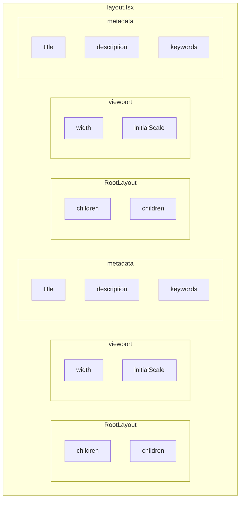

### `apps/web/app/(dashboard)/layout.tsx`

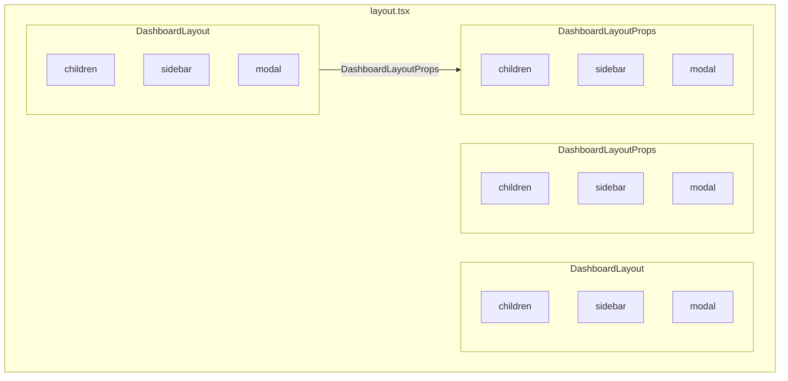

### `apps/web/app/(dashboard)/page.tsx`

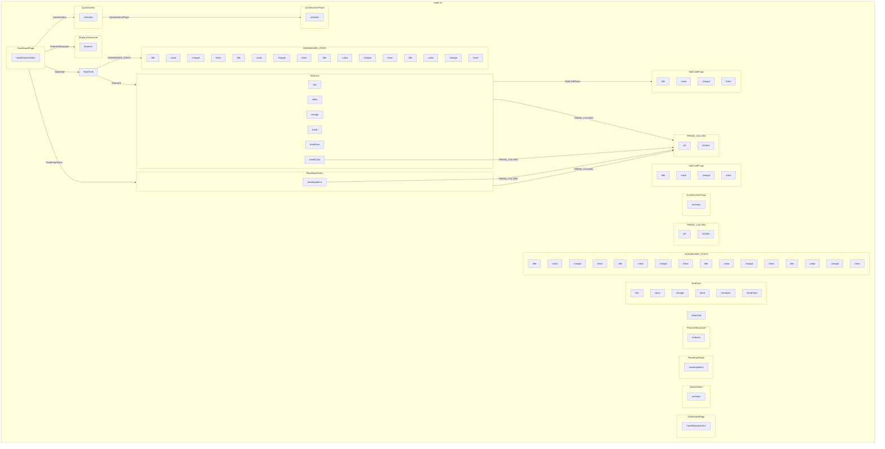

### `apps/web/app/(dashboard)/@modal/settings/page.tsx`

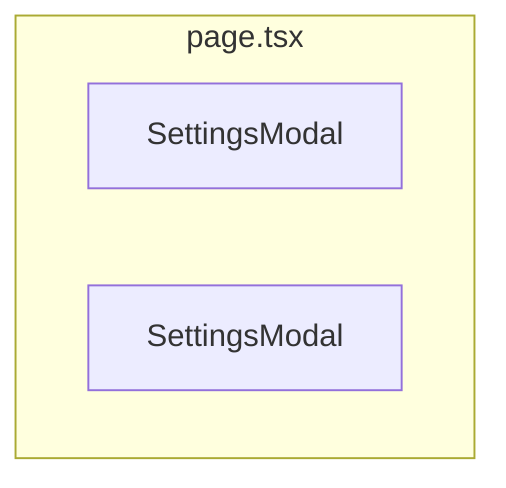

### `apps/web/app/(dashboard)/@modal/default.tsx`

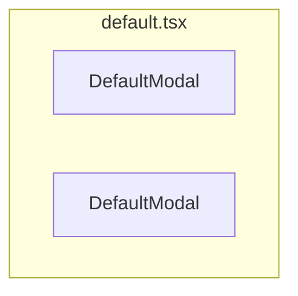

### `apps/web/app/(dashboard)/@sidebar/page.tsx`

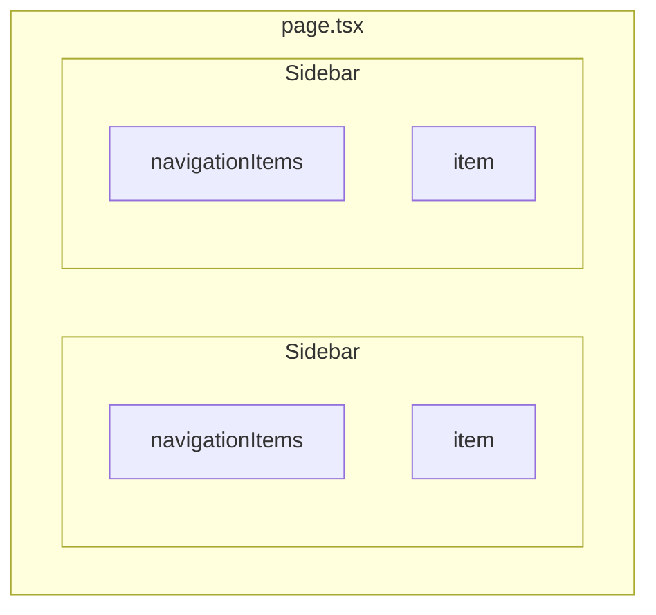

### `apps/web/app/[locale]/layout.tsx`

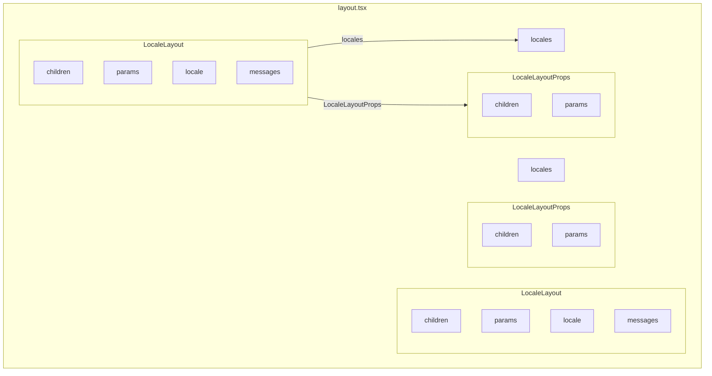

### `apps/web/app/[locale]/page.tsx`

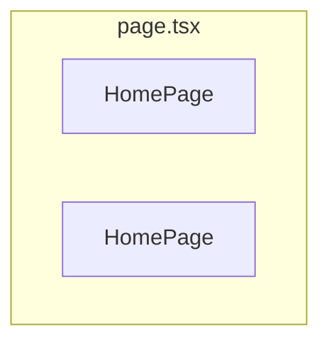

### `apps/web/app/[locale]/dashboard/page.tsx`

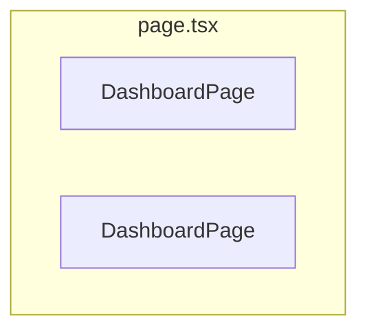

### `apps/web/app/[locale]/providers.tsx`

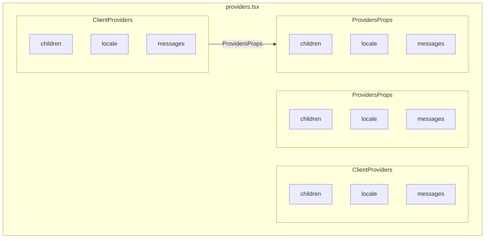

### `apps/web/lib/trpc-provider.tsx`

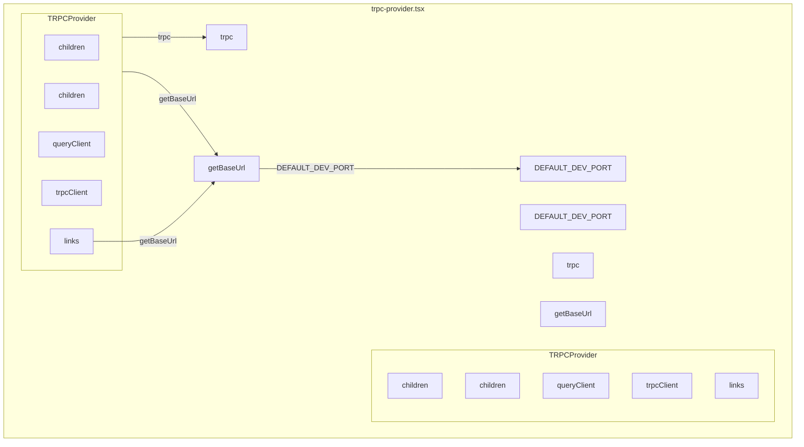

### `apps/web/src/server/trpc/routers/index.ts`

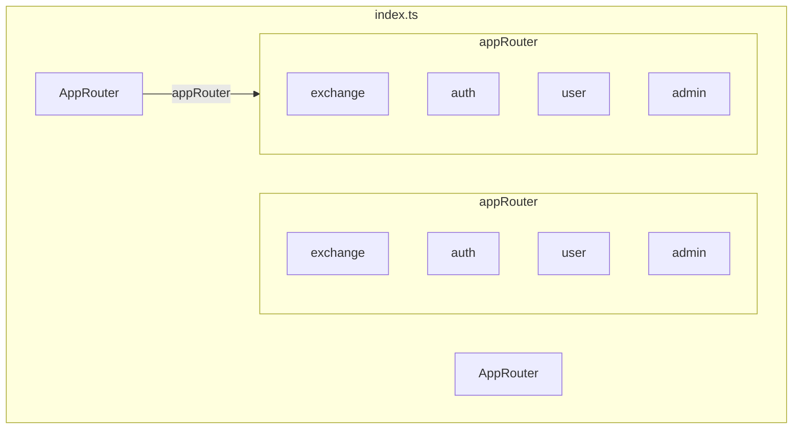

### `apps/web/src/server/trpc/routers/admin.ts`

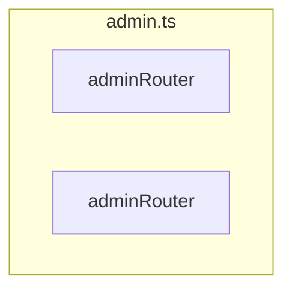

### `apps/web/src/server/trpc/routers/auth.ts`

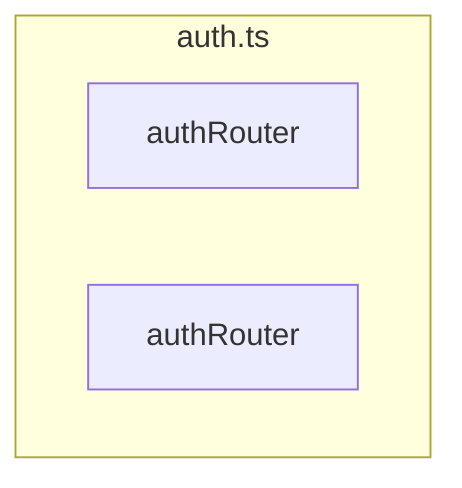

### `apps/web/src/server/trpc/routers/exchange.ts`

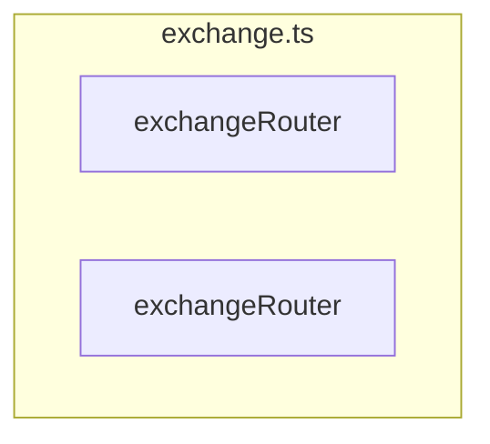

### `apps/web/src/server/trpc/routers/user.ts`


### `apps/web/src/server/trpc/middleware/auth.ts`

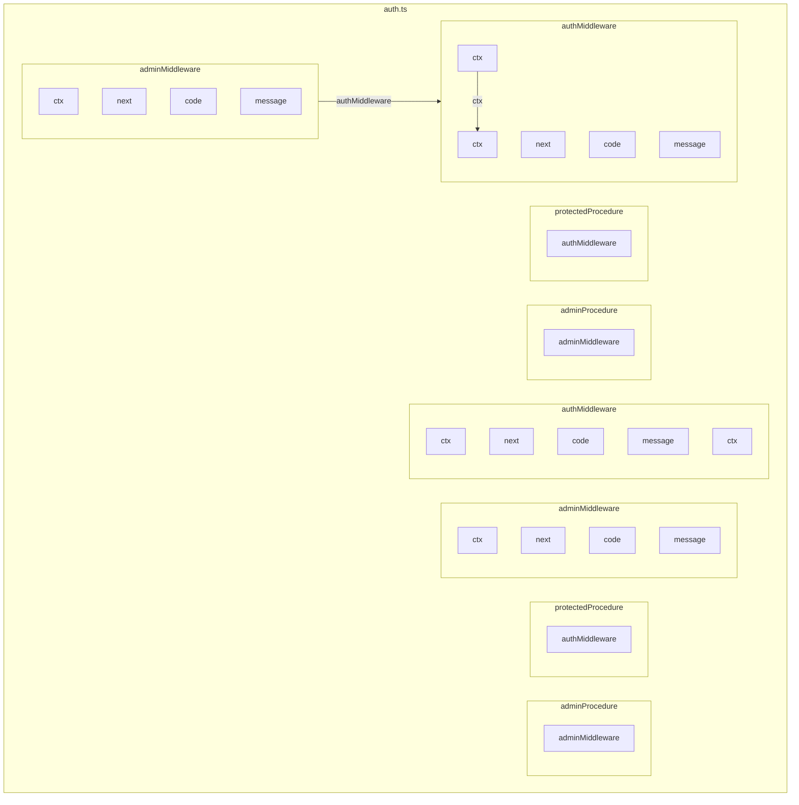

### `apps/web/src/server/trpc/middleware/rateLimit.ts`

````mermaid
%% Summary diagram for e:/project/exchanger-front/apps/web/src/server/trpc/middleware/rateLimit.ts
graph TD

    subgraph 6255["rateLimit.ts"]
        6257["MILLISECONDS_IN_SECOND"]
        6338["MILLISECONDS_IN_SECOND"]
        subgraph 6258["createRateLimiter"]
            6262["action"]
            6270["code"]
            6263["config"]
            6268["count"]
            6267["current"]
            6264["ip"]
            6265["key"]
            6271["message"]
            6266["now"]
            6269["resetTime"]
            %% Edges at this level (grouped by source)
            6263["config"] -->|action| 6262["action"]
            6265["key"] -->|action| 6262["action"]
            6265["key"] -->|ip| 6264["ip"]
            6271["message"] -->|action| 6262["action"]
            6269["resetTime"] -->|config| 6263["config"]
            6

### Implementation Steps

1. **Understanding the Web Application Architecture**
   The `apps/web` application serves as the primary user interface for the platform. It is built using Next.js, leveraging its App Router for navigation, and integrates with `tRPC` for type-safe API communication. It also supports internationalization and features a modular UI constructed from shared components.

2. **Exploring Routing and Layouts**
   The application's routing and layout are managed by the Next.js App Router, which enables nested layouts and route groups. The root layout, defined in `app/layout.tsx`, establishes the basic HTML structure. Specific layouts like `app/(dashboard)/layout.tsx` provide structure for authenticated dashboard pages, including slots for a modal and sidebar. Internationalization is handled by `app/[locale]/layout.tsx`, which sets up the language context. Key pages include the main landing page (`app/page.tsx` and `app/[locale]/page.tsx`) and the localized dashboard page (`app/[locale]/dashboard/page.tsx`), which displays various components like `StatsGrid`, `FeatureShowcase`, `RoadmapStatus`, and `QuickActions`.

3. **Understanding Internationalization (i18n)**
   Internationalization (i18n) is a core feature, configured by `i18n.ts` to define supported locales and message loading. Translated strings are stored in JSON files within the `messages` directory (e.g., `en.json`, `ru.json`). The `app/[locale]/layout.tsx` and `app/[locale]/providers.tsx` files are crucial for providing the internationalization context to client-side components, ensuring text is displayed in the correct language.

4. **Deep Dive into API Communication with tRPC**
   API communication is handled using `tRPC` for type-safe, end-to-end interactions. The `TRPCProvider` in `lib/trpc-provider.tsx` sets up the `tRPC` client on the frontend, making it available throughout the application. All `tRPC` requests from the frontend are routed through the Next.js API route at `pages/api/trpc/[trpc].ts`. On the server side, `src/server/trpc/init.ts` initializes the `tRPC` server, defining how contexts are created for each request (including user data) and establishing procedures like `publicProcedure` and `loggedProcedure`. All individual `tRPC` routers, such as those for `admin`, `auth`, `exchange`, and `user` operations, are combined into a single `AppRouter` in `src/server/trpc/routers/index.ts`. Middleware, defined in `src/server/trpc/middleware/auth.ts` and `src/server/trpc/middleware/rateLimit.ts`, enforces authentication, authorization (e.g., `protectedProcedure`, `adminProcedure`), and rate limiting for API calls.

5. **Examining Next.js Middleware**
   The `middleware.ts` file contains Next.js middleware that executes before a request is fully processed. This is used for critical tasks such as redirecting users based on their locale or authentication status, ensuring proper request handling across the application.

---

## Research Query

А другие шаги?

*Session: 59195c2f39b68bfbb565f8c9e45b61f8 | Generated: 7/3/2025, 2:29:23 PM*

### Analysis Summary

# Web Application Architecture (apps/web)

The `apps/web` application is the primary user-facing interface for the Exchanger platform. It's built with Next.js, leveraging its app router for structured routing, and integrates heavily with `tRPC` for type-safe API communication. The application also supports internationalization and features a modular UI built from shared components.

## High-Level Structure

The `apps/web` directory is organized as follows:

*   **`app`**: Contains the Next.js App Router structure, defining routes, layouts, and pages.
    *   **`(dashboard)`**: A route group for authenticated dashboard pages, including a modal and sidebar.
    *   **`[locale]`**: A dynamic route segment for internationalization, allowing different language versions of pages.
*   **`lib`**: Client-side utility functions and providers, notably `trpc-provider.tsx` for `tRPC` integration.
*   **`messages`**: JSON files for internationalization (e.g., `en.json`, `ru.json`).
*   **`pages/api/trpc`**: Next.js API route for `tRPC` server.
*   **`public`**: Static assets.
*   **`server`**: Server-side logic, primarily `tRPC` routers and middleware.
*   **`i18n.ts`**: Configuration for internationalization.
*   **`middleware.ts`**: Next.js middleware for request handling.

## Core Components and Flows

### 1. Routing and Layouts

The application uses Next.js's App Router, which allows for nested layouts and route groups.

*   **`app/layout.tsx`**: The root layout for the entire application. It defines the basic HTML structure, metadata, and includes the `RootLayout` component.
*   **`app/(dashboard)/layout.tsx`**: This layout wraps all pages within the `(dashboard)` route group. It defines a `DashboardLayout` component that takes `children`, `modal`, and `sidebar` as props, indicating a layout with dynamic slots for a modal and a sidebar.
*   **`app/[locale]/layout.tsx`**: This layout handles internationalization. The `LocaleLayout` component receives `children` and `params` (which includes the `locale`) and likely sets up the i18n context for the nested pages.
*   **`app/page.tsx`**: The main landing page of the application.
*   **`app/[locale]/page.tsx`**: The localized version of the main landing page.
*   **`app/[locale]/dashboard/page.tsx`**: The localized dashboard page, which is likely the main content area for authenticated users. It includes components like `StatsGrid`, `FeatureShowcase`, `RoadmapStatus`, and `QuickActions`.

### 2. Internationalization (i18n)

*   **`i18n.ts`**: This file configures the internationalization setup, defining supported locales and how messages are loaded. It likely uses a library like `next-intl` or a similar solution.
*   **`messages/en.json` and `messages/ru.json`**: These files contain the translated strings for different locales.
*   **`app/[locale]/layout.tsx` and `app/[locale]/providers.tsx`**: These files play a crucial role in providing the internationalization context to the client-side components. The `LocaleLayout` and `ClientProviders` components receive the `locale` and `messages` to ensure that text is displayed in the correct language.

### 3. API Communication with tRPC

The application uses `tRPC` for type-safe end-to-end communication between the frontend and backend.

*   **`lib/trpc-provider.tsx`**: This file sets up the `tRPC` client on the frontend. The `TRPCProvider` component wraps the application, making the `tRPC` client available to all components. It also defines `getBaseUrl` to determine the API endpoint.
*   **`pages/api/trpc/[trpc].ts`**: This is a Next.js API route that acts as the entry point for all `tRPC` requests from the frontend. It forwards requests to the `tRPC` server-side routers.
*   **`src/server/trpc/init.ts`**: This file initializes the `tRPC` server.
    *   **`createTRPCContext`**: Creates the context for each `tRPC` request, including information like the user's IP address, session ID, and authenticated user data.
    *   **`createTRPCRouter`**: The main function for creating `tRPC` routers.
    *   **`publicProcedure`**: Defines a `tRPC` procedure that can be called without authentication.
    *   **`loggedProcedure`**: A procedure that includes a `loggingMiddleware` to log request details.
*   **`src/server/trpc/routers/index.ts`**: This file combines all individual `tRPC` routers into a single `AppRouter`.
*   **`src/server/trpc/routers/*.ts`**: These files define specific `tRPC` routers for different domains:
    *   **`admin.ts`**: API procedures for administrative tasks.
    *   **`auth.ts`**: API procedures for user authentication (e.g., login, registration).
    *   **`exchange.ts`**: API procedures for currency exchange operations.
    *   **`user.ts`**: API procedures for user-related data.
*   **`src/server/trpc/middleware/auth.ts`**: Defines `tRPC` middleware for authentication and authorization.
    *   **`authMiddleware`**: Checks if a user is authenticated.
    *   **`adminMiddleware`**: Checks if an authenticated user has administrative privileges.
    *   **`protectedProcedure`**: A `tRPC` procedure that requires authentication.
    *   **`adminProcedure`**: A `tRPC` procedure that requires administrative privileges.
*   **`src/server/trpc/middleware/rateLimit.ts`**: Implements rate limiting for `tRPC` procedures to prevent abuse.
    *   **`createRateLimiter`**: A function to create a rate limiter for specific actions.
    *   **`rateLimitMiddleware`**: Applies rate limiting to `tRPC` procedures like `createOrder`, `login`, `register`, and `resetPassword`.
*   **`src/server/trpc/context.ts`**: Defines the `Context` type and the `createContext` function, which is responsible for creating the context object available to all `tRPC` procedures. This context typically includes information about the incoming request, such as the user's IP and session.

### 4. Middleware

*   **`middleware.ts`**: This Next.js middleware runs before a request is completed. It's used for tasks like redirecting based on locale or authentication status. The `config.matcher` defines which paths this middleware applies to.

## Visualizations

```mermaid
graph TD
    A[apps/web] --> B[app/]
    A --> C[lib/]
    A --> D[messages/]
    A --> E[pages/api/trpc/]
    A --> F[public/]
    A --> G[server/]
    A --> H[i18n.ts]
    A --> I[middleware.ts]

    B --> B1[app/layout.tsx]
    B --> B2[app/page.tsx]
    B --> B3[app/(dashboard)/]
    B --> B4[app/[locale]/]

    B3 --> B3_1[app/(dashboard)/layout.tsx]
    B3 --> B3_2[app/(dashboard)/page.tsx]
    B3 --> B3_3[app/(dashboard)/@modal/]
    B3 --> B3_4[app/(dashboard)/@sidebar/]

    B3_3 --> B3_3_1[app/(dashboard)/@modal/settings/page.tsx]
    B3_3 --> B3_3_2[app/(dashboard)/@modal/default.tsx]

    B4 --> B4_1[app/[locale]/layout.tsx]
    B4 --> B4_2[app/[locale]/page.tsx]
    B4 --> B4_3[app/[locale]/dashboard/page.tsx]
    B4 --> B4_4[app/[locale]/providers.tsx]

    C --> C1[lib/trpc-provider.tsx]

    E --> E1[pages/api/trpc/[trpc].ts]

    G --> G1[server/trpc/]

    G1 --> G1_1[server/trpc/init.ts]
    G1 --> G1_2[server/trpc/routers/]
    G1 --> G1_3[server/trpc/middleware/]
    G1 --> G1_4[server/trpc/context.ts]

    G1_2 --> G1_2_1[server/trpc/routers/index.ts]
    G1_2 --> G1_2_2[server/trpc/routers/admin.ts]
    G1_2 --> G1_2_3[server/trpc/routers/auth.ts]
    G1_2 --> G1_2_4[server/trpc/routers/exchange.ts]
    G1_2 --> G1_2_5[server/trpc/routers/user.ts]

    G1_3 --> G1_3_1[server/trpc/middleware/auth.ts]
    G1_3 --> G1_3_2[server/trpc/middleware/rateLimit.ts]

    B1 -- Defines --> RootLayout
    B2 -- Renders --> HomePage
    B3_1 -- Defines --> DashboardLayout
    B3_2 -- Renders --> DashboardPage
    B3_3_1 -- Renders --> SettingsModal
    B3_3_2 -- Renders --> DefaultModal
    B3_4 -- Renders --> Sidebar
    B4_1 -- Defines --> LocaleLayout
    B4_2 -- Renders --> HomePage (Localized)
    B4_3 -- Renders --> DashboardPage (Localized)
    B4_4 -- Provides --> ClientProviders

    C1 -- Provides --> TRPCProvider
    C1 -- Uses --> getBaseUrl

    E1 -- Handles --> tRPC API requests

    G1_1 -- Initializes --> tRPC Server
    G1_1 -- Defines --> createTRPCContext
    G1_1 -- Defines --> publicProcedure
    G1_1 -- Defines --> loggedProcedure

    G1_2_1 -- Combines --> AppRouter
    G1_2_1 -- Includes --> adminRouter
    G1_2_1 -- Includes --> authRouter
    G1_2_1 -- Includes --> exchangeRouter
    G1_2_1 -- Includes --> userRouter

    G1_3_1 -- Defines --> authMiddleware
    G1_3_1 -- Defines --> adminMiddleware
    G1_3_1 -- Defines --> protectedProcedure
    G1_3_1 -- Defines --> adminProcedure

    G1_3_2 -- Defines --> createRateLimiter
    G1_3_2 -- Defines --> rateLimitMiddleware

    G1_4 -- Defines --> Context
    G1_4 -- Defines --> createContext

    H -- Configures --> i18n
    I -- Handles --> Request Middleware

    TRPCProvider -- Uses --> tRPC Client
    TRPCProvider -- Calls --> getBaseUrl

    DashboardLayout -- Contains --> children
    DashboardLayout -- Contains --> modal
    DashboardLayout -- Contains --> sidebar

    DashboardPage -- Uses --> StatsGrid
    DashboardPage -- Uses --> FeatureShowcase
    DashboardPage -- Uses --> RoadmapStatus
    DashboardPage -- Uses --> QuickActions

    LocaleLayout -- Provides --> children
    LocaleLayout -- Uses --> locale
    LocaleLayout -- Uses --> messages

    ClientProviders -- Provides --> children
    ClientProviders -- Uses --> locale
    ClientProviders -- Uses --> messages

    createTRPCContext -- Creates --> Context
    Context -- Contains --> ip
    Context -- Contains --> sessionId
    Context -- Contains --> user

    publicProcedure -- Uses --> tRPC Server
    loggedProcedure -- Uses --> publicProcedure
    loggedProcedure -- Uses --> loggingMiddleware

    authMiddleware -- Checks --> Authentication
    adminMiddleware -- Checks --> Admin Privileges
    protectedProcedure -- Requires --> authMiddleware
    adminProcedure -- Requires --> adminMiddleware

    rateLimitMiddleware -- Applies --> Rate Limiting
    rateLimitMiddleware -- Uses --> createRateLimiter

    style B1 fill:#f9f,stroke:#333,stroke-width:2px
    style B2 fill:#f9f,stroke:#333,stroke-width:2px
    style B3_1 fill:#f9f,stroke:#333,stroke-width:2px
    style B3_2 fill:#f9f,stroke:#333,stroke-width:2px
    style B3_3_1 fill:#f9f,stroke:#333,stroke-width:2px
    style B3_3_2 fill:#f9f,stroke:#333,stroke-width:2px
    style B3_4 fill:#f9f,stroke:#333,stroke-width:2px
    style B4_1 fill:#f9f,stroke:#333,stroke-width:2px
    style B4_2 fill:#f9f,stroke:#333,stroke-width:2px
    style B4_3 fill:#f9f,stroke:#333,stroke-width:2px
    style B4_4 fill:#f9f,stroke:#333,stroke-width:2px
    style C1 fill:#9cf,stroke:#333,stroke-width:2px
    style E1 fill:#9cf,stroke:#333,stroke-width:2px
    style G1_1 fill:#9cf,stroke:#333,stroke-width:2px
    style G1_2_1 fill:#9cf,stroke:#333,stroke-width:2px
    style G1_2_2 fill:#9cf,stroke:#333,stroke-width:2px
    style G1_2_3 fill:#9cf,stroke:#333,stroke-width:2px
    style G1_2_4 fill:#9cf,stroke:#333,stroke-width:2px
    style G1_2_5 fill:#9cf,stroke:#333,stroke-width:2px
    style G1_3_1 fill:#9cf,stroke:#333,stroke-width:2px
    style G1_3_2 fill:#9cf,stroke:#333,stroke-width:2px
    style G1_4 fill:#9cf,stroke:#333,stroke-width:2px
    style H fill:#f9f,stroke:#333,stroke-width:2px
    style I fill:#f9f,stroke:#333,stroke-width:2px
````

### `apps/web/src/server/trpc/context.ts`

```mermaid
%% Summary diagram for e:/project/exchanger-front/apps/web/src/server/trpc/context.ts
graph TD

    subgraph 6382["context.ts"]
        6384["Context"]
        6551["Context"]
        subgraph 6383["createContext"]
            6389["forwarded"]
            6393["foundUser"]
            6390["ip"]
            6396["ip"]
            6385["opts"]
            6388["opts"]
            6386["req"]
            6394["req"]
            6387["res"]
            6395["res"]
            6392["sessionId"]
            6398["sessionId"]
            6391["user"]
            6397["user"]
            %% Edges at this level (grouped by source)
            6389["forwarded"] -->|req| 6386["req"]
            6390["ip"] -->|req| 6386["req"]
            6390["ip"] -->|forwarded| 6389["forwarded"]
            6392["sessionId"] -->|req| 6386["req"]
            6392["sessionId"] -->|sessionId| 6398["sessionId"]
            6393["foundUser"] -->|sessionId| 6392["sessionId"]
        end
        subgraph 6550["createContext"]
            6556["forwarded"]
            6560["foundUser"]
            6557["ip"]
            6563["ip"]
            6552["opts"]
            6555["opts"]
            6553["req"]
            6561["req"]
            6554["res"]
            6562["res"]
            6559["sessionId"]
            6565["sessionId"]
            6558["user"]
            6564["user"]
        end
        %% Edges at this level (grouped by source)
        6384["Context"] -->|createContext| 6383["createContext"]
    end

```

### `apps/web/src/server/trpc/init.ts`

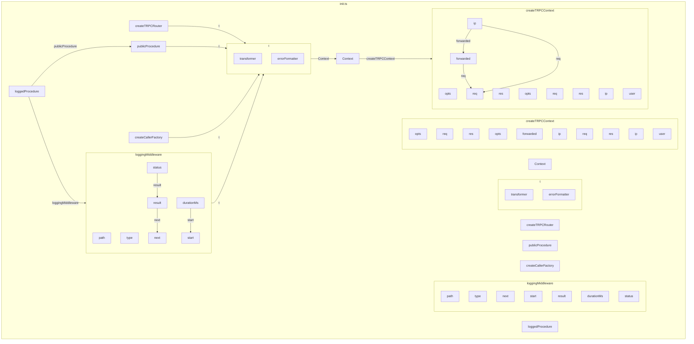

### `apps/web/middleware.ts`

```mermaid
%% Summary diagram for e:/project/exchanger-front/apps/web/middleware.ts
graph TD

    subgraph 6678["middleware.ts"]
        subgraph 6680["config"]
            6683["matcher"]
        end
        subgraph 6709["config"]
            6712["matcher"]
        end
        subgraph 6679["middleware"]
            6682["pathname"]
            6681["request"]
            %% Edges at this level (grouped by source)
            6682["pathname"] -->|request| 6681["request"]
        end
        subgraph 6708["middleware"]
            6711["pathname"]
            6710["request"]
        end
    end

```

### `apps/web/i18n.ts`

```mermaid
%% Summary diagram for e:/project/exchanger-front/apps/web/i18n.ts
graph TD

    subgraph 6715["i18n.ts"]
        6717["locale"]
        6718["locale"]
        6746["locale"]
        6747["locale"]
        6716["locales"]
        6745["locales"]
        6719["messages"]
        6748["messages"]
        %% Edges at this level (grouped by source)
        6718["locale"] -->|locale| 6717["locale"]
        6719["messages"] -->|locale| 6718["locale"]
    end

```

### Implementation Steps

1. **Understanding the Web Application Architecture**
   The `apps/web` application serves as the primary user-facing interface for the platform. It is built with Next.js, utilizing its App Router for structured navigation, and integrates with `tRPC` for type-safe API communication. It also supports internationalization and features a modular user interface constructed from shared components.

2. **Exploring the High-Level Structure of `apps/web`**
   The `apps/web` directory is organized into several key areas. The `app` directory contains the Next.js App Router structure, defining routes, layouts, and pages. The `lib` directory holds client-side utility functions and providers, such as the `tRPC` integration. Internationalization messages are stored in the `messages` directory. API routes for `tRPC` are defined under `pages/api/trpc`. Static assets are in `public`. Server-side logic, including `tRPC` routers and middleware, resides in the `server` directory. Configuration for internationalization is handled by `i18n.ts`, and request handling is managed by `middleware.ts`.

3. **Understanding Routing and Layouts**
   The application leverages Next.js's App Router for managing navigation and layouts. The `app/layout.tsx` defines the root layout for the entire application, providing the basic HTML structure. The `app/(dashboard)/layout.tsx` wraps authenticated dashboard pages, offering dynamic slots for a modal and a sidebar. Internationalization is supported by `app/[locale]/layout.tsx`, which sets up the language context. Key pages include the main landing page (`app/page.tsx` and `app/[locale]/page.tsx`) and the localized dashboard page (`app/[locale]/dashboard/page.tsx`), which incorporates various components like `StatsGrid`, `FeatureShowcase`, `RoadmapStatus`, and `QuickActions`.

4. **Implementing Internationalization (i18n)**
   Internationalization (i18n) is a core feature, configured by `i18n.ts` to define supported locales and how messages are loaded. Translated strings are stored in JSON files within the `messages` directory, such as `en.json` and `ru.json`. The `app/[locale]/layout.tsx` and `app/[locale]/providers.tsx` files are crucial for providing the internationalization context to client-side components, ensuring that text is displayed in the correct language.

5. **Deep Dive into API Communication with `tRPC`**
   API communication is handled using `tRPC` for type-safe, end-to-end interactions between the frontend and backend. The `TRPCProvider` in `lib/trpc-provider.tsx` sets up the `tRPC` client on the frontend, making it available throughout the application and determining the API endpoint. All `tRPC` requests from the frontend are routed through the Next.js API route at `pages/api/trpc/[trpc].ts`. On the server side, `src/server/trpc/init.ts` initializes the `tRPC` server, defining how contexts are created for each request (including user data) and establishing procedures like `publicProcedure` and `loggedProcedure`. All individual `tRPC` routers, such as those for `admin`, `auth`, `exchange`, and `user` operations, are combined into a single `AppRouter` in `src/server/trpc/routers/index.ts`. Middleware, defined in `src/server/trpc/middleware/auth.ts` and `src/server/trpc/middleware/rateLimit.ts`, enforces authentication, authorization (e.g., `protectedProcedure`, `adminProcedure`), and rate limiting for API calls. The `Context` type and `createContext` function in `src/server/trpc/context.ts` are responsible for creating the context object available to all `tRPC` procedures, including information about the incoming request.

6. **Examining Next.js Middleware**
   The `middleware.ts` file contains Next.js middleware that executes before a request is fully processed. This is used for critical tasks such as redirecting users based on their locale or authentication status, ensuring proper request handling across the application. The `config.matcher` defines which paths this middleware applies to.
