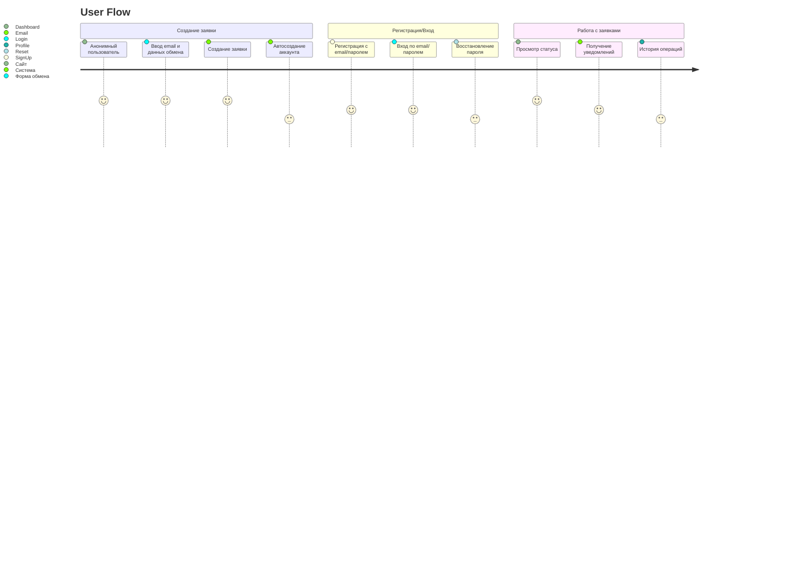
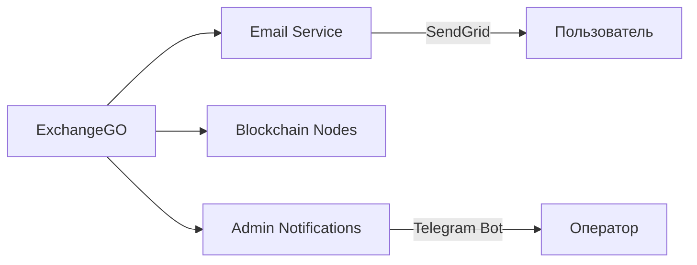
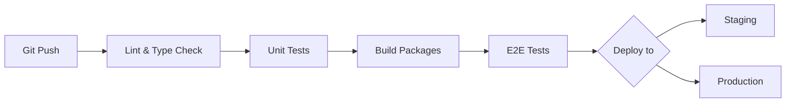

# RPD.md: ExchangeGO - Обменник криптовалют на гривны (UAH)

## 1. Введение

**Проект:** ExchangeGO - сервис для обмена криптовалют на украинские гривны (UAH)  
**Цель:** Создать безопасную и простую платформу для однонаправленных обменов криптовалюты на фиат (UAH) с минимальным барьером входа для пользователей.

## 2. Основные требования

- **Однонаправленные обмены:** Только криптовалюта → UAH
- **Минимальная верификация:** Работа с email без полной регистрации
- **Простая аутентификация:** Базовый login/signup
- **Защита от спама:** Rate limiting по IP
- **Интеграция с мерчантами:** Ручная обработка заявок операторами

## 3. Функциональные требования

### 3.1. Пользовательские сценарии



### 3.2. Модули системы

1. **Модуль обмена (Exchange)**
   - Поддержка криптовалют: BTC, ETH, USDT (ERC-20), LTC
   - Расчет курса с учетом комиссии
   - Получение свободного крипто-адреса для депозита
   - Ограничение мин/макс сумм

2. **Аутентификация (Auth)**
   - Регистрация: email + пароль
   - Вход: email + пароль
   - Восстановление пароля
   - Сессионные аккаунты (по session_id)

3. **Заявки (Orders)**
   - Создание заявки с минимальными данными (email, сумма, криптовалюта)
   - Статусы: Ожидание оплаты, В обработке, Выполнено, Отменено
   - Уведомления по email при смене статуса

4. **Администрирование (Admin)**
   - Просмотр/фильтрация заявок
   - Ручное изменение статусов
   - Просмотр пользовательских аккаунтов
   - Управление курсами и лимитами

### 3.3. Защита от злоупотреблений

- **Rate limiting:**
  - Макс 3 заявки/час с одного IP
  - Макс 5 регистраций/сутки с одного IP
- **Валидация данных:**
  - Проверка email через regex
  - Лимиты сумм (мин: $10, макс: $5000)
  - Блокировка подозрительных паттернов

## 4. Технические требования

### 4.1. Архитектура (с учетом существующей)

```diff
exchanger-front/
├── apps/
│   ├── web/               # Основное приложение (ExchangeGO)
│   ├── admin-panel/       # Админка для мерчантов
│   └── docs/              # Техническая документация
├── packages/
│   ├── ui/                # Компоненты ExchangeGO
│   ├── api-client/        # tRPC клиент
+   ├── exchange-core/     # НОВЫЙ: Логика обменов, расчеты
│   ├── providers/         # Провайдеры приложения
│   ├── hooks/             # Хуки + Zustand stores
+   │   ├── use-auth.ts    # НОВЫЙ: Логика аутентификации
+   │   ├── use-exchange.ts # НОВЫЙ: Логика обменов
│   ├── design-tokens/     # Дизайн-токены ExchangeGO
│   └── utils/             # Утилиты
└── tests/
    ├── e2e/               # Playwright тесты
    └── unit/              # Jest тесты
```

### 4.2. Ключевые зависимости

```json
{
  "core": "Next.js 15 (App Router), TypeScript",
  "state": "Zustand, React Query",
  "api": "tRPC",
  "styling": "Tailwind CSS + shadcn/ui",
  "auth": "next-auth + JWT",
  "security": "rate-limiter-flexible, validator.js"
}
```

### 4.3. Конфигурация (@repo/constants)

```ts
// packages/constants/src/exchange.ts
export const CRYPTOCURRENCIES = ['BTC', 'ETH', 'USDT', 'LTC'] as const;

export const MIN_AMOUNT = 10; // USD эквивалент
export const MAX_AMOUNT = 5000;

export const ORDER_STATUSES = {
  PENDING: 'pending',
  PAID: 'paid',
  PROCESSING: 'processing',
  COMPLETED: 'completed',
  CANCELLED: 'cancelled',
} as const;

// packages/constants/src/rate-limits.ts
export const RATE_LIMITS = {
  CREATE_ORDER: { points: 3, duration: 3600 }, // 3 заявки/час
  REGISTER: { points: 5, duration: 86400 }, // 5 регистраций/день
};
```

## 5. Дизайн и UX

### 5.1. Основные страницы

1. **Главная страница**
   - Калькулятор обмена
   - Форма создания заявки
   - Инструкция по оплате

2. **Панель пользователя**
   - Текущие заявки
   - История операций
   - Настройки профиля

3. **Админ-панель**
   - Таблица заявок с фильтрами
   - Детали заявки
   - Управление курсами

### 5.2. Принципы дизайна

- Минималистичный интерфейс
- Фокус на конверсии (форма обмена)
- Адаптивность под мобильные устройства
- Четкая визуализация шагов процесса

## 6. Интеграции

### 6.1. Внешние сервисы



### 6.2. API Endpoints (tRPC)

```ts
// apps/web/server/trpc/exchange.ts
export const exchangeRouter = router({
  createOrder: publicProcedure
    .input(z.object({
      email: z.string().email(),
      amount: z.number().min(MIN_AMOUNT).max(MAX_AMOUNT),
      currency: z.enum(CRYPTOCURRENCIES),
    }))
    .mutation(async ({ input, ctx }) => {
      // Проверка rate limit по IP
      await checkRateLimit(ctx.ip, 'CREATE_ORDER');

      // Создание заявки в DB
      return createOrderInDB(input);
    }),

  getOrderStatus: publicProcedure
    .input(z.object({ orderId: z.string() }))
    .query(({ input }) => {
      return getOrderStatus(input.orderId);
    }),
});

// apps/web/server/middlewares/rateLimit.ts
export const checkRateLimit = async (ip: string, action: keyof typeof RATE_LIMITS) => {
  const { points, duration } = RATE_LIMITS[action];
  const rateLimiter = new RateLimiterRedis({ ... });

  try {
    await rateLimiter.consume(ip);
  } catch {
    throw new TRPCError({ code: 'TOO_MANY_REQUESTS' });
  }
};
```

## 7. Безопасность

### 7.1. Меры защиты

1. **Rate Limiting:** Ограничение частоты запросов
2. **Валидация данных:**
   - Проверка email и сумм
   - Санитизация входных данных
3. **Сессионные токены:** HttpOnly куки
4. **Аудит действий:** Логирование критичных операций
5. **CORS:** Строгая настройка доменов

### 7.2. Уязвимости и защита

| Угроза                  | Меры защиты                 |
| ----------------------- | --------------------------- |
| Спам-заявки             | Rate limit по IP + email    |
| Брутфорс аутентификация | Ограничение попыток входа   |
| XSS                     | Санитизация + CSP заголовки |
| CSRF                    | CSRF-токены + SameSite куки |

## 8. Тестирование

### 8.1. Стратегия тестирования


### 8.2. Ключевые тест-кейсы

1. **Создание заявки:**
   - Успешное создание
   - Превышение лимитов
   - Невалидный email
   - Сумма вне диапазона

2. **Аутентификация:**
   - Регистрация нового пользователя
   - Вход с валидными данными
   - Восстановление пароля
   - Попытка входа с неверными данными

3. **Rate limiting:**
   - Множественные запросы с одного IP
   - Обход ограничений

## 9. Развертывание и инфраструктура

### 9.1. Окружения

- **Development:** Локальные машины (Docker)
- **Staging:** Предпродакшн с тестовыми данными
- **Production:** Cloud-инфраструктура (Vercel + DBaaS)

### 9.2. CI/CD Pipeline



## 10. Дополнительные соображения

### 10.1. Комплаенс

- **KYC Lite:** Базовая верификация по email
- **Логирование операций:** Для аудита
- **Политика конфиденциальности:** Четкое информирование пользователей

### 10.2. Мониторинг

- Sentry для отслеживания ошибок
- Логирование ключевых событий
- Мониторинг скорости ответа API

### 10.3. Расширение функционала

1. Реферальная программа
2. Push-уведомления
3. Мультиязычность
4. Расширение списка криптовалют

---

**Следующие шаги:**

1. Детализация API в Swagger
2. Создание дизайн-макетов в Figma
3. Проектирование базы данных
4. Настройка CI/CD pipeline
5. Разработка core-модулей (обмен, аутентификация)
