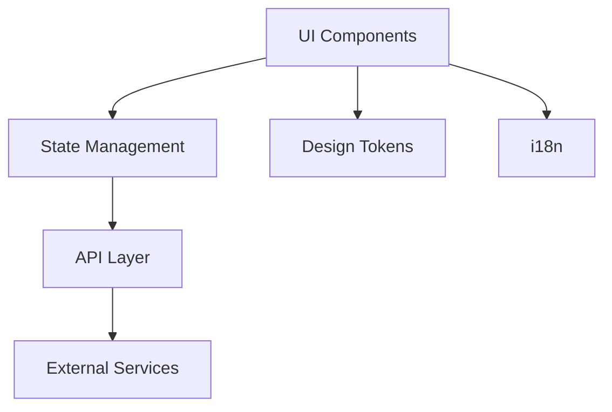

# Task Implementation Guide

Универсальный путеводитель для реализации любой задачи в монорепозитории Exchanger.

## 📋 Содержание

1. [Анализ задачи](#анализ-задачи)
2. [Определение технологий](#определение-технологий)
3. [Планирование архитектуры](#планирование-архитектуры)
4. [Пошаговая реализация](#пошаговая-реализация)
5. [Тестирование и документация](#тестирование-и-документация)
6. [Финальная проверка](#финальная-проверка)

---

## 🔍 Анализ задачи

### Шаг 1: Детализация требований

#### 📝 Вопросы для уточнения:

**Функциональные требования:**

- [ ] Что именно должно делать решение?
- [ ] Кто будет использовать эту функцию?
- [ ] Какие данные нужно отображать/обрабатывать?
- [ ] Какие действия пользователь может совершать?
- [ ] Есть ли особые бизнес-правила или ограничения?

**UI/UX требования:**

- [ ] Нужны ли новые компоненты интерфейса?
- [ ] Есть ли макеты или референсы дизайна?
- [ ] Какие состояния интерфейса нужны (loading, error, empty)?
- [ ] Нужна ли адаптивность?
- [ ] Требуется ли темизация (light/dark)?

**Технические требования:**

- [ ] Нужно ли хранить данные локально?
- [ ] Требуется ли real-time обновление?
- [ ] Есть ли требования к производительности?
- [ ] Нужна ли интернационализация?
- [ ] Какие браузеры должны поддерживаться?

**Интеграционные требования:**

- [ ] Нужны ли новые API endpoints?
- [ ] Требуется ли интеграция с внешними сервисами?
- [ ] Есть ли зависимости от других компонентов?
- [ ] Нужны ли права доступа или авторизация?

### Шаг 2: Определение сложности

#### 🎯 Классификация задачи:

**🟢 Простая (1-2 дня)**

- Новый UI компонент без бизнес-логики
- Добавление переводов
- Стилистические изменения
- Простые CRUD операции

**🟡 Средняя (3-5 дней)**

- Компонент с состоянием и API интеграцией
- Новая страница с несколькими компонентами
- Форма с валидацией
- Модификация существующего store

**🔴 Сложная (1-2 недели)**

- Новый модуль с множественными компонентами
- Сложная бизнес-логика с состоянием
- Real-time функциональность
- Интеграция с внешними API

**🟣 Критическая (2+ недели)**

- Новое приложение
- Архитектурные изменения
- Миграция технологий
- Комплексные системы

---

## 🛠️ Определение технологий

### Матрица принятия решений

Для каждого аспекта задачи определите необходимые технологии:

#### 🎨 **UI компоненты**

| Требование         | Технология                        | Когда использовать          |
| ------------------ | --------------------------------- | --------------------------- |
| Базовые элементы   | **shadcn/ui**                     | Кнопки, инпуты, модалы      |
| Сложные компоненты | **Составные компоненты**          | DataTable, формы, навигация |
| Кастомные элементы | **Новые компоненты**              | Уникальная функциональность |
| Стилизация         | **Tailwind CSS**                  | Всегда                      |
| Темизация          | **CSS Variables + ThemeProvider** | Если нужна смена тем        |

**📋 Чек-лист UI:**

- [ ] Нужны ли новые базовые компоненты? → `npx shadcn add [component]`
- [ ] Нужны ли составные компоненты? → Создать в `packages/ui/src/components/`
- [ ] Нужны ли новые design tokens? → Добавить в `packages/design-tokens/`
- [ ] Нужна ли темизация? → Использовать `useUIStore` + CSS Variables

#### 🏪 **Управление состоянием**

| Тип состояния       | Технология                | Расположение                                 |
| ------------------- | ------------------------- | -------------------------------------------- |
| UI состояние        | **Zustand (UI Store)**    | `packages/hooks/src/state/ui-store.ts`       |
| Бизнес логика       | **Zustand (новый Store)** | `packages/hooks/src/state/[domain]-store.ts` |
| Серверное состояние | **React Query + tRPC**    | Автоматически                                |
| Локальное состояние | **useState/useReducer**   | В компонентах                                |
| Формы               | **React Hook Form**       | В компонентах форм                           |

**📋 Чек-лист State:**

- [ ] Нужно ли глобальное состояние? → Создать новый Zustand store
- [ ] Нужно ли серверное состояние? → Использовать tRPC queries
- [ ] Нужна ли персистенция? → Добавить persist в Zustand
- [ ] Нужно ли состояние форм? → Использовать React Hook Form

#### 🔌 **API и данные**

| Тип данных       | Технология             | Подход                |
| ---------------- | ---------------------- | --------------------- |
| CRUD операции    | **tRPC**               | Query + Mutation      |
| Real-time данные | **tRPC Subscriptions** | WebSocket             |
| Внешние API      | **React Query**        | Прямые fetch запросы  |
| Валидация        | **Zod**                | Input схемы           |
| Типизация        | **TypeScript**         | Автоматически из tRPC |

**📋 Чек-лист API:**

- [ ] Нужны ли новые endpoints? → Добавить tRPC процедуры
- [ ] Нужна ли валидация? → Создать Zod схемы
- [ ] Нужен ли real-time? → Использовать tRPC subscriptions
- [ ] Нужны ли внешние API? → Использовать React Query

#### 🌍 **Интернационализация**

| Элемент      | Действие           | Файлы                                   |
| ------------ | ------------------ | --------------------------------------- |
| Новые тексты | Добавить переводы  | `apps/[app]/messages/[locale].json`     |
| Плюрализация | Использовать ICU   | `{count, plural, =0 {...} other {...}}` |
| Интерполяция | Передать параметры | `t('key', { name: 'John' })`            |

**📋 Чек-лист i18n:**

- [ ] Есть ли пользовательские тексты? → Добавить в messages
- [ ] Нужна ли плюрализация? → Использовать ICU syntax
- [ ] Нужны ли параметры? → Добавить интерполяцию

**🚨 ВАЖНО:** Используйте [DEVELOPER_GUIDE.md](DEVELOPER_GUIDE.md) и [I18N_TROUBLESHOOTING.md](I18N_TROUBLESHOOTING.md) для правильной настройки i18n!

#### 🧪 **Тестирование**

| Тип тестов     | Технология                 | Что тестировать    |
| -------------- | -------------------------- | ------------------ |
| Unit тесты     | **Jest + Testing Library** | Логику компонентов |
| Интеграционные | **Jest + MSW**             | API интеграции     |
| E2E тесты      | **Playwright**             | User flows         |
| Визуальные     | **Storybook**              | UI компоненты      |

**📋 Чек-лист тестирования:**

- [ ] Нужны ли unit тесты? → Создать в `__tests__/`
- [ ] Нужны ли E2E тесты? → Создать в `tests/`
- [ ] Нужна ли Storybook история? → Создать в `stories/`

---

## 📐 Планирование архитектуры

### Шаг 1: Определение структуры

#### 🗂️ Куда помещать код:

```
📦 Новый компонент UI
└── packages/ui/src/components/[component-name].tsx

📦 Новый store
└── packages/hooks/src/state/[domain]-store.ts

📦 Новые API процедуры
└── apps/web/src/server/trpc/routers/[domain].ts

📦 Новая страница
└── apps/[app]/app/[route]/page.tsx

📦 Новые переводы
└── apps/[app]/messages/[locale].json

📦 Новые типы
└── packages/utils/src/types/[domain].ts
```

### Шаг 2: Планирование зависимостей

#### 🔗 Схема зависимостей:



#### 📋 Вопросы для планирования:

- [ ] Какие компоненты будут взаимодействовать?
- [ ] Какие данные нужно передавать между компонентами?
- [ ] Какие API endpoints нужно создать?
- [ ] Какие типы данных нужно определить?
- [ ] Какие переводы нужно добавить?

---

## 🚀 Пошаговая реализация

### Этап 1: Настройка окружения (5-10 мин)

```bash
# 1. Убедиться что все работает
npm run lint         # Централизованная ESLint архитектура
npm run check-types
npm run test

# 2. Создать ветку для задачи
git checkout -b feature/task-name

# 3. Установить зависимости (если нужны)
npm install [package-name]

# 4. Проверить ESLint производительность (опционально)
npm run lint:benchmark
```

### Этап 2: Создание типов и схем (15-30 мин)

#### ✅ Действия:

1. **Определить типы данных**
2. **Создать Zod схемы для валидации**
3. **Добавить в соответствующие файлы**

```typescript
// packages/utils/src/types/task-domain.ts
export interface TaskData {
  id: string;
  title: string;
  description: string;
  status: 'pending' | 'completed';
  createdAt: Date;
}

// packages/exchange-core/src/schemas.ts
import { z } from 'zod';

export const CreateTaskSchema = z.object({
  title: z.string().min(1, 'Title is required'),
  description: z.string().optional(),
});

export type CreateTaskInput = z.infer<typeof CreateTaskSchema>;
```

### Этап 3: API слой (30-60 мин)

#### ✅ Действия:

1. **Создать tRPC процедуры**
2. **Добавить валидацию**
3. **Протестировать в браузере**

```typescript
// apps/web/src/server/trpc/routers/[domain].ts
import { CreateTaskSchema } from './schemas';

export const appRouter = t.router({
  // ...existing procedures

  // Query для получения данных
  getTasks: t.procedure
    .input(
      z.object({
        status: z.enum(['pending', 'completed']).optional(),
        limit: z.number().default(10),
      })
    )
    .query(async ({ input }) => {
      // Логика получения задач
      return { tasks: [], total: 0 };
    }),

  // Mutation для изменения данных
  createTask: t.procedure.input(CreateTaskSchema).mutation(async ({ input }) => {
    // Логика создания задачи
    return { task: newTask, success: true };
  }),
});
```

### Этап 4: State Management (30-45 мин)

#### ✅ Действия:

1. **Создать store (если нужен)**
2. **Определить состояние и действия**
3. **Добавить персистенцию (если нужна)**

```typescript
// packages/hooks/src/state/task-store.ts
interface TaskState {
  selectedTask: TaskData | null;
  filter: 'all' | 'pending' | 'completed';
  isCreating: boolean;

  // Actions
  setSelectedTask: (task: TaskData | null) => void;
  setFilter: (filter: 'all' | 'pending' | 'completed') => void;
  setIsCreating: (isCreating: boolean) => void;
}

export const useTaskStore = create<TaskState>(set => ({
  selectedTask: null,
  filter: 'all',
  isCreating: false,

  setSelectedTask: task => set({ selectedTask: task }),
  setFilter: filter => set({ filter }),
  setIsCreating: isCreating => set({ isCreating }),
}));
```

### Этап 5: UI компоненты (60-120 мин)

#### ✅ Действия:

1. **Создать базовые компоненты (если нужны)**
2. **Создать составные компоненты**
3. **Интегрировать с API и состоянием**

```typescript
// packages/ui/src/components/task-list.tsx
interface TaskListProps {
  tasks: TaskData[]
  onTaskClick?: (task: TaskData) => void
  loading?: boolean
}

export function TaskList({ tasks, onTaskClick, loading }: TaskListProps) {
  if (loading) return <Skeleton />
  if (tasks.length === 0) return <EmptyState />

  return (
    <div className="space-y-2">
      {tasks.map((task) => (
        <TaskCard
          key={task.id}
          task={task}
          onClick={() => onTaskClick?.(task)}
        />
      ))}
    </div>
  )
}
```

### Этап 6: Интеграция в приложение (30-60 мин)

#### ✅ Действия:

1. **Создать страницу или интегрировать в существующую**
2. **Подключить API и состояние**
3. **Добавить обработку ошибок и загрузки**

```typescript
// apps/web/app/tasks/page.tsx
'use client'
import { TaskList, CreateTaskForm } from '@repo/ui'
import { useTaskStore } from '@repo/hooks'
import { trpc } from '../utils/trpc'

export default function TasksPage() {
  const { filter, setSelectedTask } = useTaskStore()
  const { data: tasks, isLoading } = trpc.getTasks.useQuery({
    status: filter === 'all' ? undefined : filter
  })

  return (
    <div>
      <h1>Tasks</h1>
      <CreateTaskForm />
      <TaskList
        tasks={tasks?.tasks || []}
        loading={isLoading}
        onTaskClick={setSelectedTask}
      />
    </div>
  )
}
```

### Этап 7: Интернационализация (15-30 мин)

#### ✅ Действия:

1. **Добавить переводы во все locale файлы**
2. **Использовать в компонентах**

```json
// apps/web/messages/en.json
{
  "tasks": {
    "title": "Tasks",
    "create": "Create Task",
    "empty": "No tasks found",
    "status": {
      "pending": "Pending",
      "completed": "Completed"
    }
  }
}
```

```typescript
// В компоненте
const t = useTranslations('tasks')

return <h1>{t('title')}</h1>
```

---

## 🧪 Тестирование и документация

### Шаг 1: Unit тесты (30-60 мин)

#### ✅ Действия:

1. **Тесты для компонентов**
2. **Тесты для store логики**
3. **Тесты для утилитарных функций**

```typescript
// packages/ui/src/__tests__/TaskList.test.tsx
describe('TaskList', () => {
  it('should render tasks correctly', () => {
    const tasks = [mockTask1, mockTask2]
    render(<TaskList tasks={tasks} />)

    expect(screen.getByText(mockTask1.title)).toBeInTheDocument()
    expect(screen.getByText(mockTask2.title)).toBeInTheDocument()
  })

  it('should handle empty state', () => {
    render(<TaskList tasks={[]} />)
    expect(screen.getByText(/no tasks/i)).toBeInTheDocument()
  })
})
```

### Шаг 2: Storybook истории (15-30 мин)

#### ✅ Действия:

1. **Создать истории для новых компонентов**
2. **Показать различные состояния**

```typescript
// packages/ui/src/stories/TaskList.stories.tsx
export const Default: Story = {
  args: {
    tasks: mockTasks,
  },
};

export const Loading: Story = {
  args: {
    tasks: [],
    loading: true,
  },
};

export const Empty: Story = {
  args: {
    tasks: [],
  },
};
```

### Шаг 3: E2E тесты (30-45 мин)

#### ✅ Действия:

1. **Тесты для основных user flow**
2. **Проверка интеграции**

```typescript
// tests/tasks.spec.ts
test('should create and manage tasks', async ({ page }) => {
  await page.goto('/tasks');

  // Создать задачу
  await page.fill('[data-testid="task-title"]', 'New Task');
  await page.click('[data-testid="create-button"]');

  // Проверить что задача появилась
  await expect(page.getByText('New Task')).toBeVisible();
});
```

---

## ✅ Финальная проверка

### Чек-лист перед push

#### 🔍 Качество кода:

```bash
# Линтинг (централизованная архитектура с lazy loading)
npm run lint

# Типы
npm run check-types

# Тесты
npm run test

# Сборка
npm run build

# Дополнительные проверки производительности
npm run lint:benchmark  # Проверка времени загрузки ESLint конфига
```

#### 📋 Функциональность:

- [ ] Все требования реализованы
- [ ] UI работает во всех состояниях (loading, error, empty)
- [ ] API корректно обрабатывает данные
- [ ] Состояние корректно обновляется
- [ ] Переводы добавлены для всех текстов
- [ ] Компоненты адаптивны
- [ ] Темизация работает (если нужна)

#### 📚 Документация:

- [ ] Storybook истории созданы
- [ ] JSDoc комментарии добавлены
- [ ] README обновлен (если нужно)
- [ ] Типы экспортированы

#### 🧪 Тестирование:

- [ ] Unit тесты написаны и проходят
- [ ] E2E тесты написаны и проходят
- [ ] Ручное тестирование выполнено
- [ ] Кросс-браузерное тестирование (если критично)

### Правильный формат коммита

#### 📝 Структура commit message:

```
<type>(<scope>): <subject>

<body>

<footer>
```

#### 🏷️ Типы коммитов:

| Тип        | Описание                                   | Пример                                  |
| ---------- | ------------------------------------------ | --------------------------------------- |
| `feat`     | Новая функциональность                     | `feat: add user authentication`         |
| `fix`      | Исправление багов                          | `fix: resolve validation error in form` |
| `docs`     | Только документация                        | `docs: update installation guide`       |
| `style`    | Форматирование, отступы                    | `style: fix code formatting`            |
| `refactor` | Рефакторинг без изменения функциональности | `refactor: extract validation logic`    |
| `test`     | Добавление или изменение тестов            | `test: add unit tests for user service` |
| `chore`    | Обновление зависимостей, конфигурации      | `chore: update dependencies`            |

#### 🎯 Правила для subject:

- ✅ **Используйте строчные буквы**: `feat: add new feature`
- ✅ **Не более 50 символов**
- ✅ **Глагол в повелительном наклонении**: `add`, `fix`, `update`
- ✅ **Без точки в конце**
- ❌ **НЕ используйте заглавные**: `feat: Add New Feature`

#### 📋 Scope (область изменений):

- `ui` - изменения в UI компонентах
- `api` - изменения в API слое
- `store` - изменения в состоянии
- `i18n` - изменения в переводах
- `types` - изменения в типизации
- `tests` - изменения в тестах

#### 🛠️ Примеры правильных коммитов:

**Новая функциональность:**

```
feat(ui): add task management components

- Create TaskList and TaskCard components
- Add filtering and sorting capabilities
- Implement responsive design
- Add loading and empty states

Closes #123
```

**Исправление бага:**

```
fix(api): resolve validation error in user creation

- Fix email validation regex
- Add proper error handling
- Update error messages

Fixes #456
```

**Рефакторинг:**

```
refactor(store): simplify task store structure

- Extract common state patterns
- Remove duplicate code
- Improve type safety
```

**Документация:**

```
docs: update task implementation guide

- Add commit message format rules
- Include examples and best practices
- Fix typos and formatting
```

#### ⚠️ Частые ошибки:

```bash
# ❌ НЕПРАВИЛЬНО - PascalCase
git commit -m "feat: AddNewFeature"

# ❌ НЕПРАВИЛЬНО - UPPER_CASE
git commit -m "feat: ADD_NEW_FEATURE"

# ✅ ПРАВИЛЬНО - обычный текст
git commit -m "feat: add new feature"

# ✅ ПРАВИЛЬНО - предложение с заглавной
git commit -m "feat: Add new feature for users"

# ❌ НЕПРАВИЛЬНО - слишком длинно
git commit -m "feat: add super awesome new feature that does amazing things"

# ✅ ПРАВИЛЬНО - лаконично
git commit -m "feat: add user dashboard"

# ❌ НЕПРАВИЛЬНО - неясно что изменено
git commit -m "fix: fix stuff"

# ✅ ПРАВИЛЬНО - конкретно
git commit -m "fix: resolve form validation error"
```

---

## 📋 Шаблоны для быстрого старта

### Новый компонент

```typescript
// packages/ui/src/components/my-component.tsx
import React from 'react'
import { cn } from '../lib/utils'

export interface MyComponentProps {
  className?: string
  children?: React.ReactNode
}

export const MyComponent = React.forwardRef<
  HTMLDivElement,
  MyComponentProps
>(({ className, children, ...props }, ref) => {
  return (
    <div
      ref={ref}
      className={cn("base-styles", className)}
      {...props}
    >
      {children}
    </div>
  )
})

MyComponent.displayName = "MyComponent"
```

### Новый store

```typescript
// packages/hooks/src/state/my-store.ts
import { create } from 'zustand';

interface MyState {
  // State properties
  data: any[];
  loading: boolean;

  // Actions
  setData: (data: any[]) => void;
  setLoading: (loading: boolean) => void;
}

export const useMyStore = create<MyState>(set => ({
  data: [],
  loading: false,

  setData: data => set({ data }),
  setLoading: loading => set({ loading }),
}));
```

### Новая tRPC процедура

```typescript
// В apps/web/src/server/trpc/routers/[domain].ts
myProcedure: t.procedure
  .input(z.object({
    id: z.string(),
    // other fields
  }))
  .query(async ({ input }) => {
    // Logic here
    return { result: 'success' }
  }),
```

### Новая страница

```typescript
// apps/web/app/my-page/page.tsx
import { MyComponent } from '@repo/ui'
import { useMyStore } from '@repo/hooks'

export default function MyPage() {
  const { data } = useMyStore()

  return (
    <div>
      <h1>My Page</h1>
      <MyComponent />
    </div>
  )
}
```

---

## 🎯 Заключение

Этот путеводитель поможет вам:

- ✅ **Правильно анализировать** любую задачу
- ✅ **Выбирать оптимальные технологии** из доступного стека
- ✅ **Следовать архитектурным принципам** проекта
- ✅ **Реализовывать решения поэтапно** и систематично
- ✅ **Поддерживать высокое качество** кода и тестирования

**💡 Помните**: лучше потратить время на планирование, чем переписывать код потом!

Для детальной информации по каждой технологии обращайтесь к [Developer Guide](DEVELOPER_GUIDE.md).

---

**🚀 Удачной разработки!**
