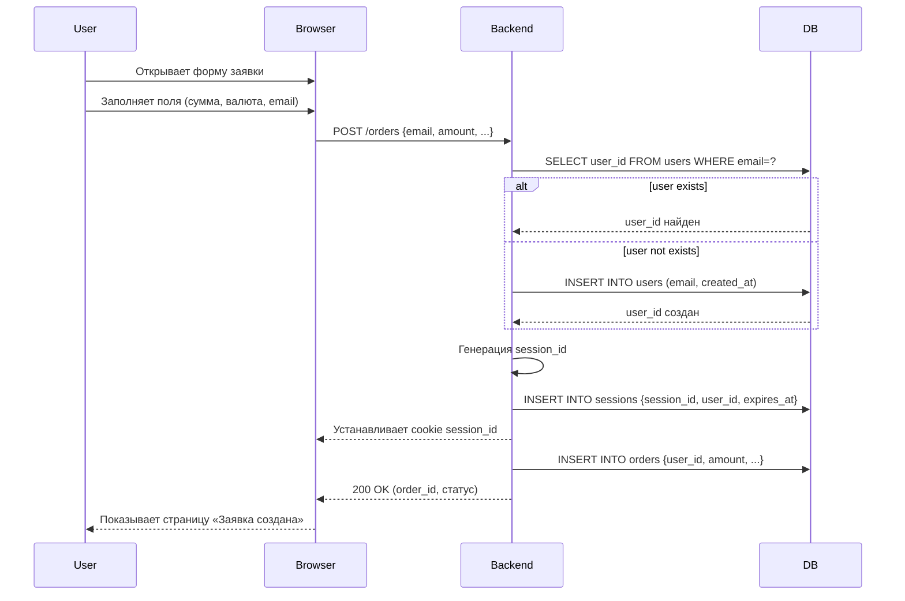
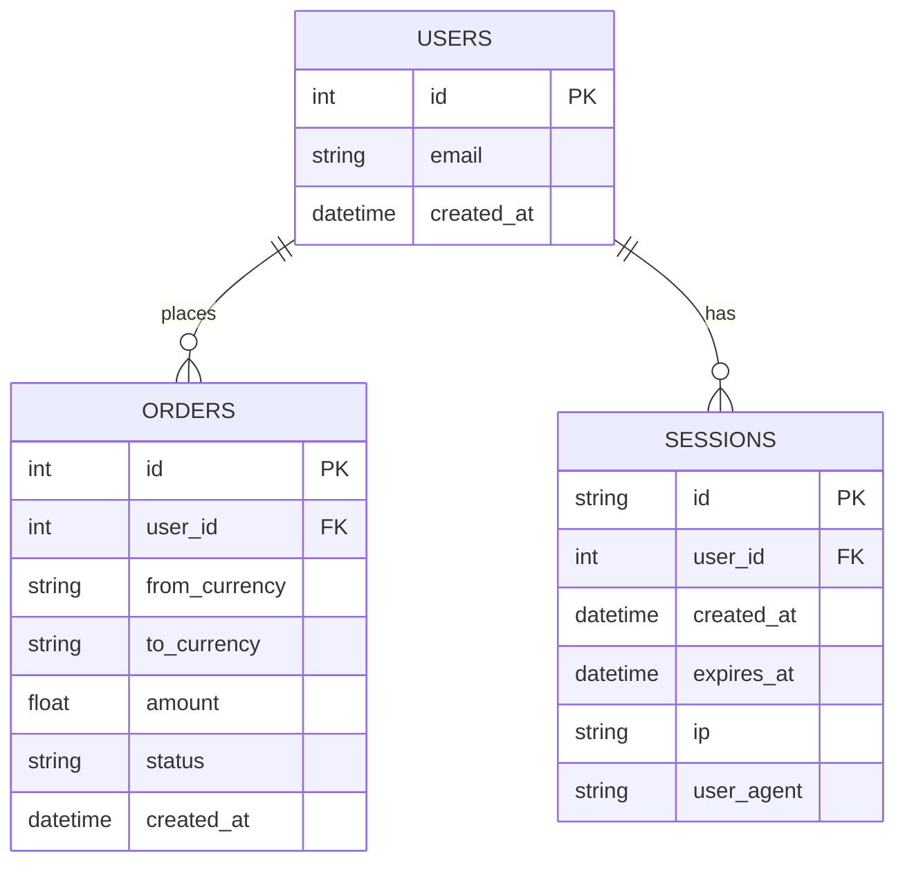

Теперь понял: у тебя **exchange-сервис**, где пользователь заполняет форму заявки (например, обмен USDT → UAH), вводит e-mail, и **на этом же шаге ты либо создаёшь новый профиль, либо подтягиваешь существующий**. При этом нет жёсткой авторизации и нет «ограниченного профиля» — сессия нужна больше как:

- связывание пользователя с его заявкой,
- минимальная защита от спама (один e-mail = один «юзер»),
- удобство (юзер не тратит время на логин/регистрацию).

Тогда давай я дам **2 вещи**:

1. **Диаграмму последовательности (sequence)** — шаги, как работает этот flow.
2. **ERD (сущности users/sessions/orders)** — упрощённую, под твой кейс.

---

## 1. Sequence diagram (flow «создание заявки с авто-профилем и сессией»)

---

## 2. ERD (users, sessions, orders)

---

## Ключевые особенности твоего сценария

- **Регистрация без фрикции**: email = «ключ». Если пользователь впервые оставил email → создаётся user, сессия, и сразу можно создать заявку.
- **Сессия нужна не для security**, а для:
  - связывания пользователя с несколькими заявками,
  - авто-подтягивания email в форме при повторном визите,
  - минимальной защиты от спама (роботам придётся генерировать уникальные почты).

- **Без ограничений**: пользователь сразу получает полный доступ к функционалу (создание заявки). Нет отдельного шага подтверждения.
- **Минимальные защиты**: капча/Rate-limit на POST /orders + уникальность e-mail для уменьшения спама.

---
