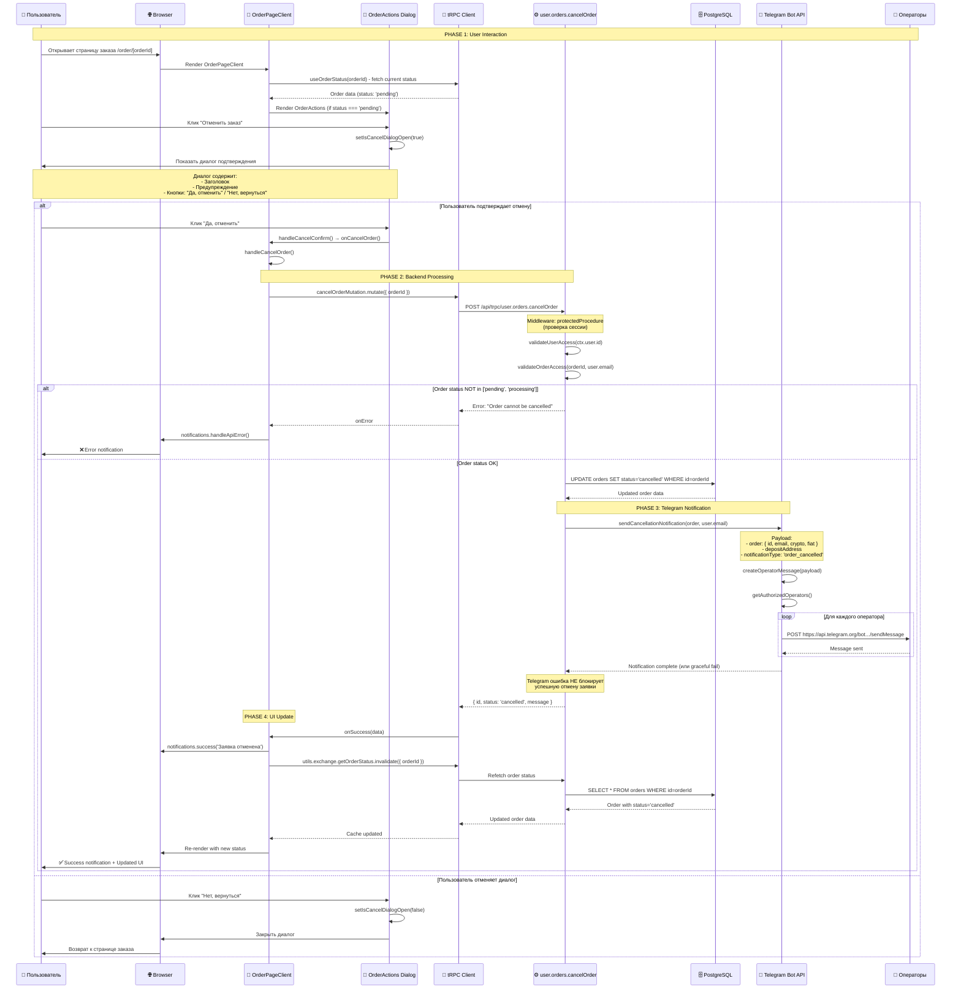
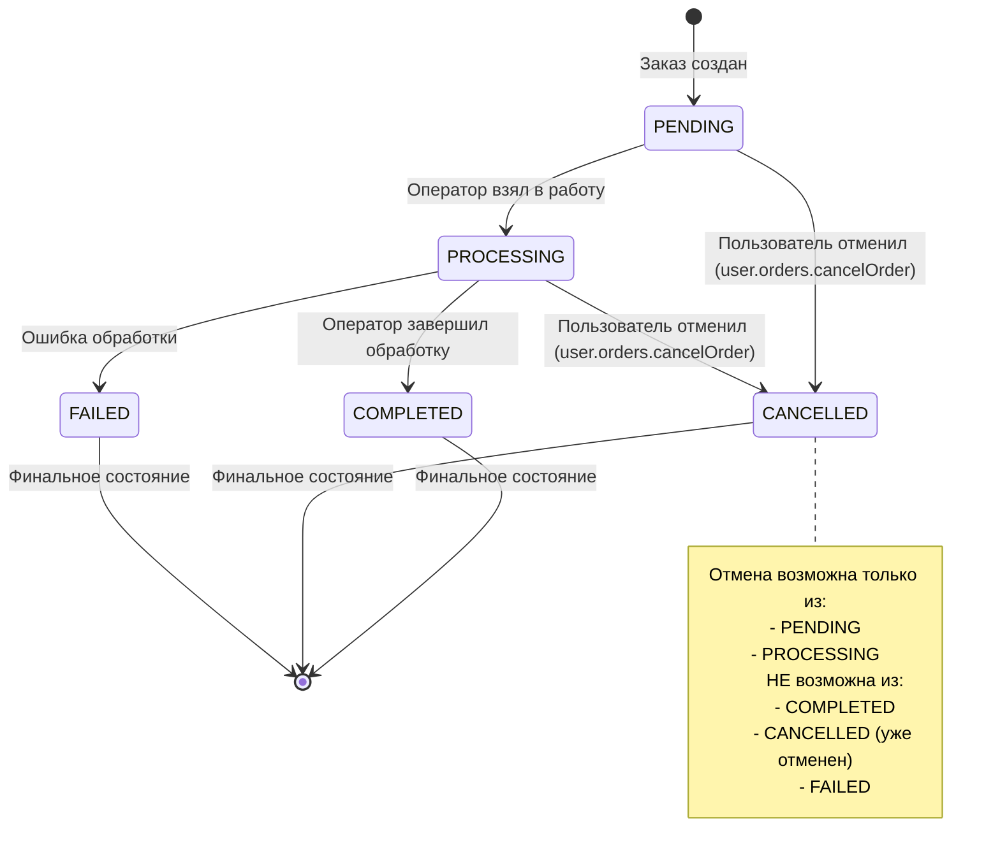
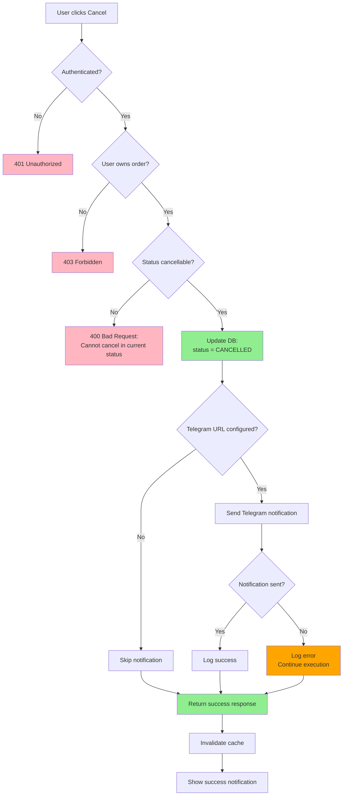
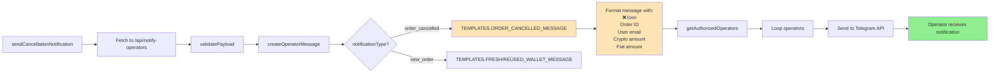
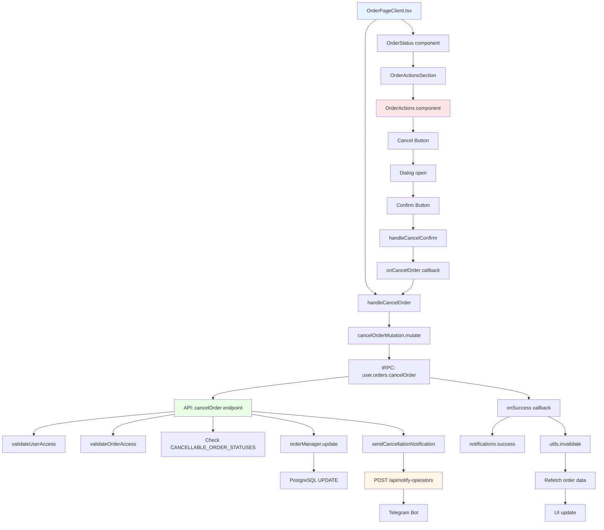
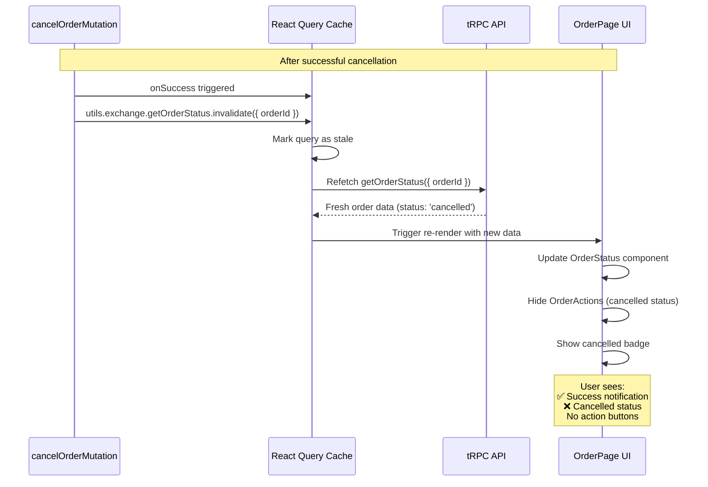
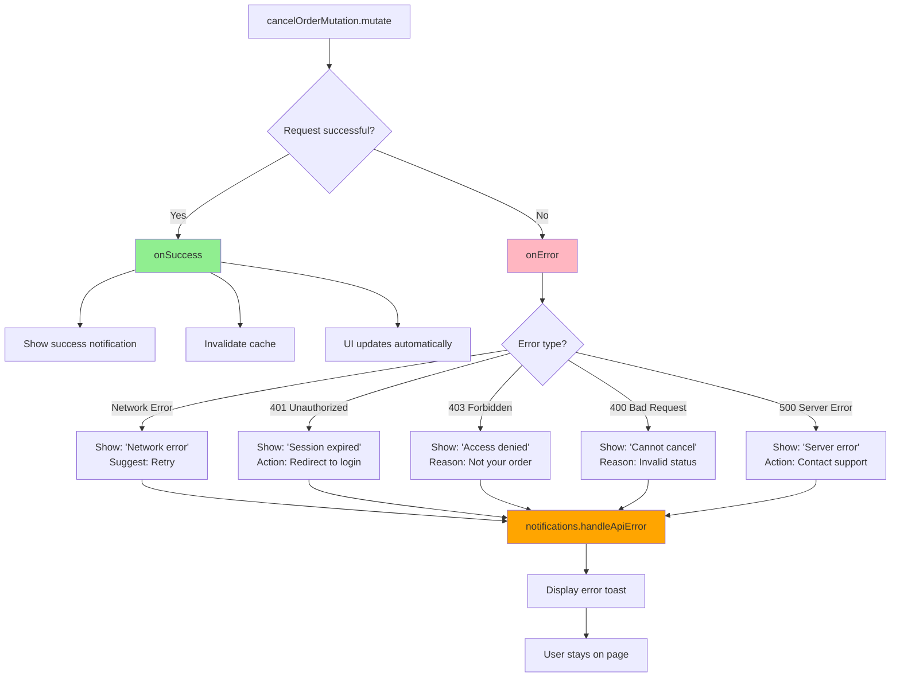

# Диаграмма последовательности: Отмена заявки пользователем

## 🔄 Полный цикл отмены заявки



---

## 📊 Диаграмма состояний заказа



---

## 🔒 Security Flow



---

## 📱 Telegram Message Flow



---

## 🎯 Component Interaction



---

## 🔄 Cache Invalidation Flow



---

## 📝 Error Handling Flow



---

## 💾 Database Transaction

```sql
-- Транзакция отмены заказа
BEGIN;

-- 1. Проверка существования заказа
SELECT id, status, user_email
FROM orders
WHERE id = $orderId
  AND user_email = $userEmail
FOR UPDATE; -- Блокировка строки

-- 2. Проверка статуса (в коде TypeScript)
-- CANCELLABLE_ORDER_STATUSES = ['pending', 'processing']

-- 3. Обновление статуса (если проверки прошли)
UPDATE orders
SET
    status = 'cancelled',
    updated_at = NOW()
WHERE id = $orderId
RETURNING *;

COMMIT;

-- В случае ошибки:
-- ROLLBACK;
```

---

## 🔌 API Contract

### Request:

```typescript
POST /api/trpc/user.orders.cancelOrder

Headers:
  Content-Type: application/json
  Cookie: sessionId=...

Body:
{
  "orderId": "cm41g6tjb0006kl8o56j1dytv"
}
```

### Success Response (200):

```typescript
{
  "result": {
    "data": {
      "id": "cm41g6tjb0006kl8o56j1dytv",
      "status": "cancelled",
      "message": "Order cancelled successfully"
    }
  }
}
```

### Error Responses:

```typescript
// 401 Unauthorized
{
  "error": {
    "code": "UNAUTHORIZED",
    "message": "Not authenticated"
  }
}

// 403 Forbidden
{
  "error": {
    "code": "FORBIDDEN",
    "message": "Access denied to this order"
  }
}

// 400 Bad Request
{
  "error": {
    "code": "BAD_REQUEST",
    "message": "Order cannot be cancelled in current status"
  }
}
```

---

## 📊 Метрики и мониторинг

### Ключевые метрики:

1. **Cancellation Rate:**
   - % отмененных заказов от общего числа
   - Разбивка по статусам (pending vs processing)

2. **Cancellation Time:**
   - Среднее время от создания до отмены
   - Распределение по временным интервалам

3. **Notification Success Rate:**
   - % успешных Telegram уведомлений
   - Время доставки уведомления

4. **Error Rate:**
   - Частота ошибок при отмене
   - Типы ошибок (auth, validation, db)

### Логирование:

```typescript
// Frontend
console.log('User cancelled order:', orderId);

// Backend
logger.info('ORDER_CANCELLED_BY_USER', {
  orderId,
  userId: user.id,
  userEmail: user.email,
  previousStatus: order.status,
  timestamp: new Date().toISOString(),
});

// Telegram
logger.info('CANCELLATION_NOTIFICATION_SENT', {
  orderId,
  operatorsNotified: 5,
  success: true,
});
```

---

**Диаграммы готовы для использования в документации и презентациях.**
