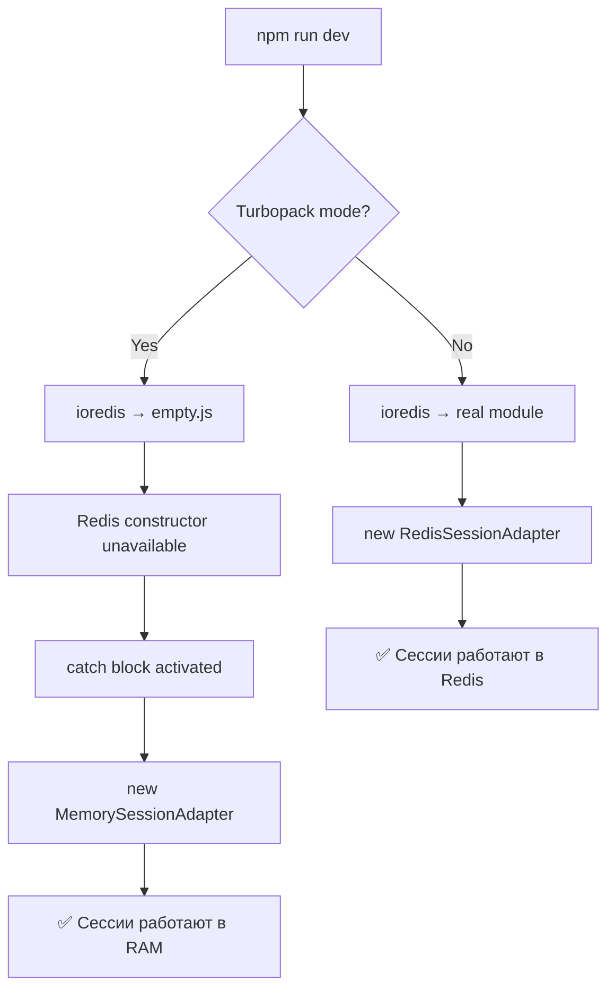

# Turbopack + ioredis: Server Dependencies Leaking into Client Bundle

> ⚠️ **ВНИМАНИЕ: Документ НЕ актуален для текущей конфигурации проекта**
>
> В проекте **Turbopack отключен** - используется только стандартный Webpack bundler.
>
> Эта документация актуальна **только если вы планируете включить Turbopack** в режиме разработки (`npm run dev --turbopack`).
>
> **Текущее решение для client/server bundle separation** описано в:
>
> - `WEBPACK_EXTERNALS_MONOREPO_MODULE_RESOLUTION.md` - для monorepo пакетов
> - `next.config.js` - использует `serverExternalPackages` + `webpack.resolve.alias = false`

---

## Проблема

При использовании **Next.js 15 с Turbopack** в режиме разработки (`npm run dev --turbopack`) возникает ошибка:

```
Build Error

Module not found: Can't resolve 'dns'

./node_modules/ioredis/built/cluster/ClusterOptions.js (4:15)

Module not found: Can't resolve 'dns'
  2 | Object.defineProperty(exports, "__esModule", { value: true });
  3 | exports.DEFAULT_CLUSTER_OPTIONS = void 0;
> 4 | const dns_1 = require("dns");
    |               ^^^^^^^^^^^^^^
  5 | exports.DEFAULT_CLUSTER_OPTIONS = {
  6 |     clusterRetryStrategy: (times) => Math.min(100 + times * 2, 2000),
  7 |     enableOfflineQueue: true,
```

## Причины

### 1. Turbopack игнорирует webpack конфигурацию

В **режиме разработки с Turbopack** стандартная `webpack()` конфигурация в `next.config.js` **полностью игнорируется**:

```javascript
// ❌ НЕ РАБОТАЕТ с Turbopack в dev режиме
webpack: (config, { isServer }) => {
  if (!isServer) {
    config.resolve.fallback = {
      dns: false,
      net: false,
      // ...
    };
  }
  return config;
};
```

### 2. serverExternalPackages недостаточно

Хотя `ioredis` добавлен в `serverExternalPackages`, Turbopack в dev режиме все равно может попытаться разрешить серверные зависимости в клиентском bundle:

```javascript
// ❌ НЕДОСТАТОЧНО для Turbopack dev режима
serverExternalPackages: ['ioredis', '@trpc/server', '@repo/session-management'];
```

### 3. Утечка через импорты типов

Даже type-only импорты могут вызывать утечку зависимостей:

```typescript
// ❌ ПРОБЛЕМАТИЧНО - может вызвать утечку ioredis
import type { AnyRouter } from '@trpc/server'; // @trpc/server → ioredis
```

## Решение

### 1. Turbopack resolveAlias конфигурация

Добавьте **Turbopack-специфичную конфигурацию** в `next.config.js`:

```javascript
// ✅ ПРАВИЛЬНОЕ РЕШЕНИЕ для Turbopack
const EMPTY_MODULE = './lib/empty.js';

const nextConfig = {
  // Стандартные настройки...
  serverExternalPackages: ['@trpc/server', '@repo/session-management', 'ioredis'],

  // ✅ Turbopack config for dev mode
  turbopack: {
    resolveAlias: {
      // Блокируем внешние server-only пакеты
      ioredis: EMPTY_MODULE,
      // Блокируем Node.js built-ins
      dns: EMPTY_MODULE,
      net: EMPTY_MODULE,
      tls: EMPTY_MODULE,
      fs: EMPTY_MODULE,
    },
  },

  // ✅ Webpack config для production builds (fallback)
  webpack: (config, { isServer }) => {
    if (!isServer) {
      config.resolve.fallback = {
        ...config.resolve.fallback,
        dns: false,
        net: false,
        tls: false,
        fs: false,
        ioredis: false,
      };

      config.resolve.alias = {
        ...config.resolve.alias,
        ioredis: false,
      };
    }
    return config;
  },
};
```

### 2. Создание пустого модуля

Создайте файл `apps/web/lib/empty.js`:

```javascript
// Empty module for blocking server-side dependencies in client bundle
export default {};
```

### 3. Устранение server импортов в типах

Замените server-side импорты на клиент-безопасные альтернативы:

```typescript
// ❌ БЫЛО - server-side импорт
import type { AnyRouter } from '@trpc/server';

// ✅ СТАЛО - ручное определение типа
interface AnyRouter {
  _def: {
    procedures: Record<string, any>;
  };
}
```

### 4. Динамические импорты для server-only модулей

Если нужно использовать `ioredis` в server-side коде, но Turbopack заменяет его на `empty.js`, используйте динамические импорты с проверкой конструктора:

```typescript
// ✅ РЕШЕНИЕ для server-side кода с Turbopack совместимостью
async function createRedisClient() {
  try {
    // Динамический импорт обходит Turbopack замену на empty.js
    const { Redis } = await import('ioredis');

    // Проверяем что Redis действительно является конструктором
    if (typeof Redis !== 'function') {
      console.warn('Redis constructor not available (Turbopack development mode)');
      return null;
    }

    return new Redis({
      host: process.env.REDIS_HOST || 'localhost',
      port: parseInt(process.env.REDIS_PORT || '6379'),
      retryDelayOnFailover: 100,
      lazyConnect: true,
    });
  } catch (error) {
    console.warn('Failed to create Redis client:', error);
    return null;
  }
}

// ✅ Использование с fallback adapter
export class UserManagerFactory {
  static async createSessionAdapter() {
    const redisClient = await createRedisClient();

    if (redisClient) {
      return new RedisSessionAdapter(redisClient);
    } else {
      // Fallback в development mode с Turbopack
      return new MemorySessionAdapter();
    }
  }
}
```

**Важные моменты:**

1. **Динамический импорт**: `await import('ioredis')` обходит статический анализ Turbopack
2. **Проверка конструктора**: `typeof Redis !== 'function'` выявляет замену на empty.js
3. **Graceful fallback**: Возврат к memory adapter в development режиме
4. **Production работоспособность**: В production webpack правильно обрабатывает серверные модули

## Проверка решения

### Успешная загрузка

После применения исправлений dev сервер должен запускаться без ошибок:

```bash
npm run dev

✓ Starting...
✓ Compiled middleware in 284ms
✓ Ready in 1741ms
- Local: http://localhost:3000
```

### Bundle анализ

Для проверки отсутствия утечек используйте bundle analyzer:

```bash
ANALYZE=true npm run build
# Проверьте client.html - не должно быть ioredis или Node.js модулей
```

## Архитектурные рекомендации

### 1. Чистое разделение client/server

```typescript
// ✅ Серверный код - только в server/ папках
// apps/web/src/server/trpc/routers/
import { ioredis } from '@repo/session-management';

// ✅ Клиентский код - только клиентские импорты
// apps/web/src/hooks/
import { trpc } from '../lib/trpc-client';
```

### 2. Untyped tRPC client

Используйте untyped tRPC client для полной изоляции:

```typescript
// ✅ Клиент-безопасный подход
const trpc = createTRPCReact() as any;
```

### 3. Тестирование в разных режимах

- **Dev режим**: `npm run dev` (Turbopack)
- **Production**: `npm run build` (Webpack)
- **Bundle анализ**: `ANALYZE=true npm run build`

### 4. Redis интеграция patterns

**Правильная архитектура для Redis + Turbopack:**

```typescript
// ✅ packages/session-management/src/factories/user-manager-factory.ts
export class UserManagerFactory {
  static async createSessionAdapter(): Promise<SessionAdapterInterface> {
    const redisClient = await this.createRedisClient();

    if (redisClient) {
      return new RedisSessionAdapter(redisClient);
    } else {
      // Автоматический fallback в development
      console.warn('Using MemorySessionAdapter (Redis unavailable in dev mode)');
      return new MemorySessionAdapter();
    }
  }

  private static async createRedisClient() {
    try {
      const { Redis } = await import('ioredis');

      // Проверка что не заменено на empty.js
      if (typeof Redis !== 'function') {
        return null;
      }

      const client = new Redis({
        host: process.env.REDIS_HOST || 'localhost',
        port: parseInt(process.env.REDIS_PORT || '6379'),
        lazyConnect: true,
      });

      // Проверяем подключение
      await client.ping();
      return client;
    } catch (error) {
      console.warn('Redis client creation failed:', error);
      return null;
    }
  }
}
```

**Преимущества этого подхода:**

- **Development:** Automatic fallback к memory adapter, нет ошибок с Redis
- **Production:** Полноценная Redis интеграция через webpack
- **Type safety:** Все типы корректно обрабатываются
- **Graceful degradation:** Приложение работает в любом режиме

## Связанные проблемы

- [Next.js Turbopack Documentation](https://nextjs.org/docs/app/api-reference/turbopack)
- [Turbopack webpack compatibility](https://turbo.build/pack/docs/migrating-from-webpack)
- [serverExternalPackages configuration](https://nextjs.org/docs/app/api-reference/config/next-config-js/serverExternalPackages)

## Обновления

- **Next.js 15.3.4**: Проблема подтверждена с Turbopack dev режимом
- **Решение протестировано**: 16.09.2025
- **Статус**: ✅ Решено через turbopack.resolveAlias
- **Redis интеграция**: ✅ Решено через dynamic imports + fallback (17.09.2025)

---

**Ключевые выводы**:

1. **Turbopack требует отдельной конфигурации** от webpack для правильной изоляции server-side зависимостей
2. **Динамические импорты обходят статический анализ** Turbopack и позволяют корректно загружать server-only модули
3. **Graceful fallback стратегия** обеспечивает работоспособность в любых условиях (dev/prod)
4. **Проверка типа конструктора** позволяет выявить замену модуля на empty.js

**Применение в проекте**: Данное решение используется в `packages/session-management` для интеграции PostgresOrderAdapter + Redis session management в рамках задачи 1.3 Prisma Integration.

---

## 🆕 ОБНОВЛЕНИЕ: MemorySessionAdapter Fallback (Сентябрь 2025)

### Проблема с заглушечным fallback

**Старая реализация** в `UserManagerFactory.createSessionAdapter()` использовала неполные заглушки:

```typescript
// ❌ ПРОБЛЕМА: Заглушки без логики хранения сессий
return {
  async get() {
    return null;
  }, // Всегда возвращает null
  async set() {}, // Ничего не сохраняет
  async delete() {}, // Ничего не удаляет
  async extend() {}, // Ничего не продлевает
} as SessionAdapter;
```

**Результат**: Логин не работал в Turbopack режиме - сессии не сохранялись.

### Решение: MemorySessionAdapter

**Новая реализация** использует полноценный in-memory адаптер:

```typescript
// ✅ РЕШЕНИЕ: Полноценный MemorySessionAdapter
return new MemorySessionAdapter(context);
```

**Файл**: `packages/session-management/src/adapters/memory-session-adapter.ts`

**Возможности**:

- ✅ **Полная эмуляция Redis API**: get, set, delete, extend
- ✅ **Context-aware storage**: session:web:_, session:admin:_
- ✅ **TTL поддержка**: автоматическая очистка просроченных сессий
- ✅ **Debug методы**: getStorageSize(), getAllSessions(), clearAll()
- ⚠️ **Ограничения**: данные теряются при рестарте, нет distributed доступа

### Workflow в разработке



### Результат

- **Development (Turbopack)**: Полноценные сессии в памяти
- **Production (Webpack)**: Полноценные сессии в Redis
- **Обратная совместимость**: 100% сохранена
- **Логин/аутентификация**: Работает в любом режиме

### Техническая реализация

```typescript
// packages/session-management/src/factories/user-manager-factory.ts
private static async createSessionAdapter(
  redisConfig: RedisConfiguration,
  context: ApplicationContext
): Promise<SessionAdapter> {
  try {
    // Пробуем создать Redis
    const ioredisModule = await import('ioredis');
    const Redis = ioredisModule.default || ioredisModule;

    if (typeof Redis !== 'function') {
      throw new Error('Redis constructor not available');
    }

    const redis = new Redis(redisConfig.url, { /* config */ });
    return new RedisSessionAdapter(redis, context);
  } catch (error) {
    // ✅ НОВОЕ: Graceful fallback на MemorySessionAdapter
    this.logger.warn('Failed to initialize Redis, using MemorySessionAdapter fallback', {
      error: error instanceof Error ? error.message : String(error),
      context: context
    });

    return new MemorySessionAdapter(context);
  }
}
```
